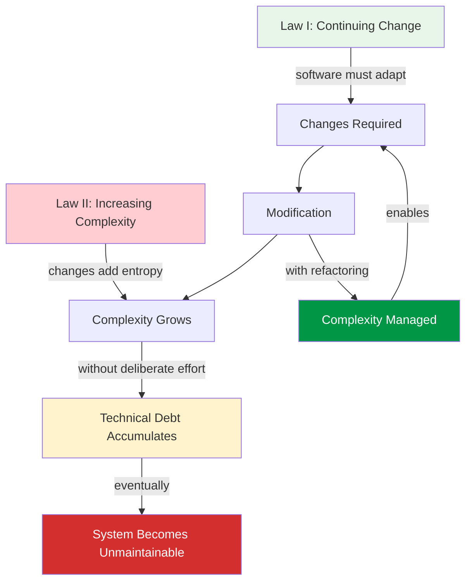
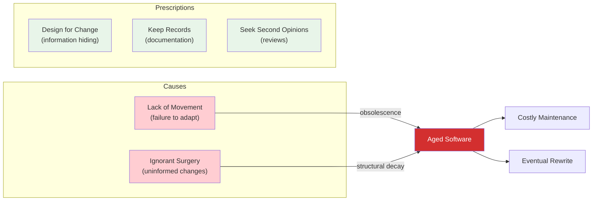
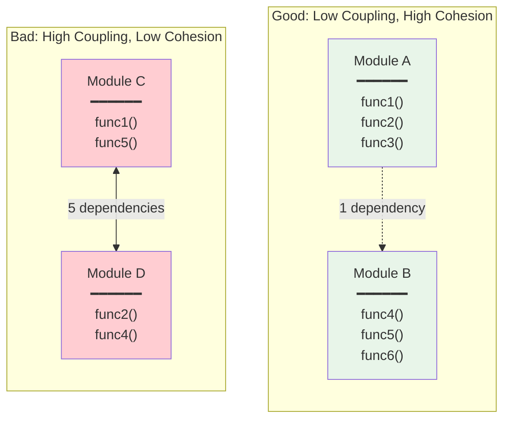
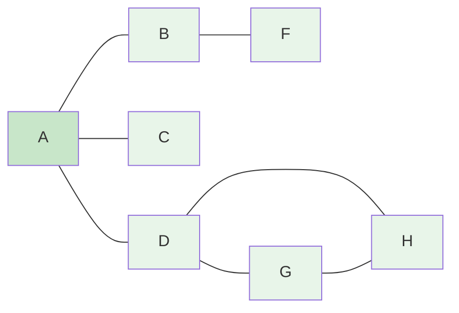

# Study Notes: Software Maintainability and Design Structure Matrix

## Purpose

These study notes explain software maintainability concepts, measurement approaches, and the Design Structure Matrix (DSM) technique for analyzing and improving system modularity. Organized by concept (not slide-by-slide), with concrete examples, visual diagrams, and practice questions.

**Primary Sources:**
- ISO/IEC 25010:2011 
- Building Maintainable Software 
- Managing and Leading Software Projects 

**Key Research Papers:**
- Lehman 1980, Laws of Software Evolution 
- Parnas 1994, Software Aging 
- MacCormack et al. 2006, Mozilla/Linux DSM study 
- Geipel & Schweitzer 2009, Software Change Dynamics 
- Campbell 2018, Cognitive Complexity 

---

## Part 1: Economics of Software Maintenance

### 1.1 Maintenance Dominates Lifecycle Cost

**What is it?**
Software maintenance consumes 60-80% of total lifecycle cost . This includes corrective (bug fixes ~20%), adaptive (environment changes ~18%), perfective (enhancements ~25%), and preventive (refactoring ~7%) maintenance.

**Key Points:**

| Maintenance Type | Purpose | Share |
|-----------------|---------|-------|
| Corrective | Fix bugs and defects | ~20% |
| Adaptive | Adapt to new environments (OS, hardware, APIs) | ~18% |
| Perfective | Add features, improve performance | ~25% |
| Preventive | Refactor, improve structure | ~7% |

Most effort goes to perfective changes (enhancements), not bug fixing. Systems with above-average maintainability resolve issues twice as fast .

```vega-lite
{
  "$schema": "https://vega.github.io/schema/vega-lite/v5.json",
  "width": 400,
  "height": 280,
  "title": {
    "text": "Software Lifecycle Cost Distribution",
    "subtitle": "Source: Fairley 2009, Visser et al. 2016"
  },
  "data": {
    "values": [
      {"phase": "Development", "type": "Development", "value": 30},
      {"phase": "Maintenance", "type": "Corrective", "value": 20},
      {"phase": "Maintenance", "type": "Adaptive", "value": 18},
      {"phase": "Maintenance", "type": "Perfective", "value": 25},
      {"phase": "Maintenance", "type": "Preventive", "value": 7}
    ]
  },
  "mark": {"type": "bar", "cornerRadiusTopLeft": 4, "cornerRadiusTopRight": 4},
  "encoding": {
    "x": {"field": "phase", "type": "nominal", "axis": {"title": null, "labelFontSize": 16}},
    "y": {"field": "value", "type": "quantitative", "stack": "zero", "title": "% of Total Cost"},
    "color": {
      "field": "type",
      "type": "nominal",
      "scale": {
        "domain": ["Development", "Corrective", "Adaptive", "Perfective", "Preventive"],
        "range": ["#019546", "#d32f2f", "#ffc107", "#2D6E2A", "#81c784"]
      },
      "legend": {"title": null}
    }
  }
}
```

### 1.2 Lehman's Laws of Software Evolution

**What are they?**
Lehman  formulated laws governing how real-world software evolves over time. The two most fundamental are:

**Law I — Continuing Change (1974):**
> A program that is used in a real-world environment must be continually adapted, or it becomes progressively less satisfactory

**Law II — Increasing Complexity (1974):**
> As a program evolves, its complexity increases unless work is done to maintain or reduce it

These laws create an inescapable tension: you *must* change the software (Law I), but changing it makes it worse (Law II). Technical debt is not a modern invention — it is a fundamental property of software evolution.

The 1996 revision  extended the set to eight laws, adding Law VII (Declining Quality — perceived quality declines unless rigorously maintained) and Law VIII (Feedback System — evolution is a multi-loop feedback process).



### 1.3 Parnas's Software Aging

**What is it?**
Parnas  identified two mechanisms by which software degrades:

1. **Lack of Movement** — failure to adapt to changing environment leads to obsolescence (the system falls behind its context)
2. **Ignorant Surgery** — changes by developers who do not understand the original design degrade internal structure



**Parnas's prescriptions:**
- **Design for change:** Use information hiding so implementation details are isolated behind stable interfaces
- **Keep records:** Maintain documentation that captures design rationale, not just code comments
- **Seek second opinions:** Code reviews and architectural reviews catch "ignorant surgery" before it damages the system

**Concrete Example:**
Consider a payment processing system. Lack of Movement: not updating to support PSD2/SCA regulations makes the system non-compliant in the EU. Ignorant Surgery: a developer unfamiliar with the authorization flow adds a shortcut that bypasses the fraud check — the system works but is now structurally compromised.

{: .exam-tip }
> **Exam Tip:** Parnas's two causes map directly to Lehman's Laws: Lack of Movement = Law I (system becomes less satisfactory without adaptation); Ignorant Surgery = Law II (complexity increases through uninformed changes). Use both frameworks together in exam answers.

---

## Part 2: ISO 25010 Maintainability Model

### 2.1 Five Sub-Characteristics

**What is it?**
ISO 25010  decomposes maintainability into five sub-characteristics:

| Sub-characteristic | Definition | Practical Example |
|-------------------|------------|-------------------|
| **Modularity** | Change to one component has minimal impact on others | Microservice independence |
| **Reusability** | Asset can be used in more than one system | Shared authentication library |
| **Analyzability** | Impact assessment and fault diagnosis are effective | Structured logging with trace IDs |
| **Modifiability** | Modification without introducing defects or degradation | API versioning allowing backward compatibility |
| **Testability** | Test criteria can be established and tests performed | Dependency injection enabling mock substitution |

**How they relate:**
Modularity is the foundation — it enables the other four. A modular system is easier to analyze (each module can be understood independently), easier to modify (changes are localized), easier to test (modules can be tested in isolation), and more reusable (well-bounded modules can be extracted).

**Concrete Example — E-commerce Platform:**
- *Modularity:* Payment, inventory, and shipping are separate services
- *Analyzability:* Each service has its own logs and metrics dashboard
- *Modifiability:* Switching payment providers requires changes only in the payment service
- *Testability:* Payment service can be tested with mock inventory and shipping
- *Reusability:* Authentication service is shared across web, mobile, and API channels

{: .exam-tip }
> **Exam Tip:** Remember the acronym **MRAMT** (Modularity, Reusability, Analyzability, Modifiability, Testability). In exam questions, connect each sub-characteristic to concrete engineering practices.

---

## Part 3: Measuring Maintainability

### 3.1 SIG Model: 8 Code Properties

**What is it?**
The Software Improvement Group (SIG) model   measures maintainability through eight code properties, benchmarked against hundreds of industry systems:

| Property | What It Measures | Threshold |
|----------|-----------------|-----------|
| Volume | Overall source code size | <66 kLOC per component |
| Duplication | Identical code fragments | <5% duplicated |
| Unit complexity | Cyclomatic complexity per method | CC < 15 |
| Unit size | Lines per method/function | <60 LOC |
| Unit interfacing | Number of parameters | <5 parameters |
| Module coupling | Incoming dependencies | Fan-in thresholds |
| Component balance | Size distribution | Gini coefficient |
| Component independence | Code without external deps | >80% independent |

**How SIG maps to ISO 25010:**
Each property affects one or more ISO sub-characteristics. For example, Module Coupling affects both Analyzability and Modifiability, while Component Independence primarily affects Modularity.

**Star rating calibration:**
SIG benchmarks systems on a 1-5 star scale using a 5%/30%/30%/30%/5% distribution. A 5-star system is in the top 5% of the benchmark — this is deliberately exclusive.

```vega-lite
{
  "$schema": "https://vega.github.io/schema/vega-lite/v5.json",
  "width": 400,
  "height": 250,
  "title": {
    "text": "SIG Star Rating Calibration",
    "subtitle": "Source: Baggen et al. 2012, Industry benchmark"
  },
  "data": {
    "values": [
      {"stars": "1 star", "pct": 5, "label": "Bottom 5%"},
      {"stars": "2 stars", "pct": 30, "label": "Below avg"},
      {"stars": "3 stars", "pct": 30, "label": "Average"},
      {"stars": "4 stars", "pct": 30, "label": "Above avg"},
      {"stars": "5 stars", "pct": 5, "label": "Top 5%"}
    ]
  },
  "mark": {"type": "bar", "cornerRadiusTopLeft": 4, "cornerRadiusTopRight": 4},
  "encoding": {
    "x": {"field": "stars", "type": "ordinal", "sort": null, "axis": {"title": null, "labelFontSize": 14}},
    "y": {"field": "pct", "type": "quantitative", "title": "% of Systems"},
    "color": {
      "field": "stars",
      "type": "ordinal",
      "sort": null,
      "scale": {
        "domain": ["1 star", "2 stars", "3 stars", "4 stars", "5 stars"],
        "range": ["#d32f2f", "#ffc107", "#81c784", "#2D6E2A", "#019546"]
      },
      "legend": null
    }
  }
}
```

**Key advantage over Maintainability Index:** SIG uses quality profiles (risk category distributions) rather than averages, so a system with 95% clean methods and 5% catastrophic ones is rated differently from a system with uniform mediocrity.

### 3.2 Maintainability Index: Problems with a Single Number

**What is it?**
The Maintainability Index (MI) is a composite metric:

$$MI = 171 - 5.2 \cdot \ln(V) - 0.23 \cdot G - 16.2 \cdot \ln(LOC)$$

Where $V$ = Halstead Volume, $G$ = Cyclomatic Complexity, $LOC$ = Lines of Code.

**Why it fails:**

| Problem | Explanation |
|---------|-------------|
| Averaging hides skewness | 1 terrible module + 99 good ones = "good" MI |
| Structure invisible | Module boundaries and dependencies are not captured |
| Same MI, different designs | Compact spaghetti code can score the same as well-structured code |
| Outdated components | Halstead Volume is rarely used in modern practice |

**Concrete Example:**
System A: 100 methods, all with CC=10 → MI = 72 ("moderate")
System B: 95 methods with CC=3, 5 methods with CC=133 → same average, same MI = 72
System B is far worse — those 5 methods are unmaintainable hotspots — but MI cannot distinguish the two.

### 3.3 Cognitive Complexity

**What is it?**
Cognitive Complexity  measures how hard code is for a human to understand, designed to match developer intuition better than Cyclomatic Complexity.

**Three rules:**
1. **Ignore readable shorthand** — `switch` statements, null-coalescing operators
2. **Increment for breaks in linear flow** — `if`, `for`, `while`, `catch`, `goto`
3. **Extra increment per nesting level** — nested structures are harder to understand

**Key differences from Cyclomatic Complexity:**

| Code Pattern | CC | CogC | Why |
|-------------|:--:|:----:|-----|
| `switch` with 10 cases | +10 | +1 | Switch is readable shorthand |
| Nested `if` inside loop | +1 | +2 | Nesting increases cognitive load |
| `if-else` chain | +N | +1 | Linear if-else is easy to scan |

**Validation:** 77% developer acceptance rate across 22 open-source projects on SonarCloud — developers agreed with CogC assessments more often than CC assessments.

### 3.4 Structure vs. Code Metrics

**Why code metrics are not enough:**

| Code Metrics Show | Structural Analysis Shows |
|-------------------|--------------------------|
| This method is complex (CC=47) | This change affects 17% of the system |
| This file is too large (800 LOC) | These 12 modules form a hidden cluster |
| This pattern is duplicated (23%) | This layering constraint is violated |
| *Symptoms of local problems* | *Root causes of systemic problems* |

Code metrics and structural metrics are **complementary**, not competing. You need both for a complete maintainability assessment. The tool for structural analysis is the **Design Structure Matrix (DSM)**.

{: .exam-tip }
> **Exam Tip:** When comparing measurement approaches, use this framework: SIG measures *code-level* maintainability, DSM measures *structural* maintainability, and Propagation Cost quantifies *change impact*. No single metric captures everything.

---

## Part 4: Modularity Fundamentals

### 4.1 Why Modularity Matters

**What is it?**
Modularity is the degree to which a system is composed of discrete, well-bounded components. A modular system allows changes, testing, and understanding of individual parts without needing to comprehend the whole.

**Quality attributes enabled by modularity:**

| Attribute | How Modularity Helps |
|-----------|---------------------|
| Testability | Test modules in isolation with mocks |
| Scalability | Replace or replicate bottleneck modules |
| Comprehensibility | Understand one module at a time |
| Changeability | Modify without ripple effects |
| Concurrent Development | Teams work on separate modules |
| Reusability | Extract and share well-bounded modules |

### 4.2 Net Option Value (NOV) Theory

**What is it?**
Sullivan et al.  applied financial options theory to software design. Each module in a modular system represents a *real option* — the right (but not obligation) to replace it independently.

- **Non-modular system:** 1 option — accept or reject the entire design
- **Modular system:** N options — each module can be independently replaced

**KWIC case study (Parnas):**
The Key Word In Context (KWIC) system was decomposed two ways:
- *Processing-step decomposition:* modules correspond to processing stages → coupled design (changing one stage affects all downstream stages)
- *Information-hiding decomposition:* modules hide design decisions → modular design (changing one decision affects only one module)

The information-hiding decomposition has higher NOV because it preserves more options for future change. The more uncertain future requirements are, the more valuable modularity becomes.

### 4.3 Coupling and Cohesion

**What are they?**

**Coupling** (between modules) — the degree of interdependence between modules.
- Goal: **Minimize** coupling
- Measured by: fan-in, fan-out, dependency density $= \frac{\text{deps}}{N(N-1)}$
- Low coupling = modules can be changed independently

**Cohesion** (within modules) — the degree to which elements within a module belong together.
- Goal: **Maximize** cohesion
- Measured by: LCOM (Lack of Cohesion of Methods), conceptual cohesion
- High cohesion = module has a single, focused purpose



**The ideal:** Highly cohesive modules with minimal coupling between them. DSM makes this visible — clusters on the diagonal represent high cohesion, while off-diagonal marks represent coupling.

{: .exam-tip }
> **Exam Tip:** Coupling and cohesion are inversely related in practice: splitting a module reduces its internal cohesion but increases coupling (more inter-module interfaces). The art of modular design is finding the right balance.

---

## Part 5: Design Structure Matrix (DSM)

### 5.1 What Is a DSM?

**Definition:** A Design Structure Matrix (DSM)  is a square matrix showing relationships between elements in a system. Also known as Dependency Structure Matrix.

**How to read it:**
- Each row and column represents a system element (file, module, class)
- An X in row $i$, column $j$ means element $i$ depends on element $j$
- The diagonal represents self-relationships (always present)
- Reading across a row: what this element depends on
- Reading down a column: what depends on this element

### 5.2 From Graph to Matrix

**Example transformation:**

Given the dependency graph:
```
A ← B, C, D    (B, C, D depend on A)
B ← F           (F depends on B)
D ← G, H        (G, H depend on D)
G ← H           (H depends on G)
```

The DSM has X marks at positions (B,A), (C,A), (D,A), (F,B), (G,D), (H,D), (H,G) — each X indicates a dependency.



**DSM representation** (· = diagonal, X = dependency):

|   | A | B | C | D | F | G | H |
|---|:-:|:-:|:-:|:-:|:-:|:-:|:-:|
| **A** | · |   |   |   |   |   |   |
| **B** | X | · |   |   |   |   |   |
| **C** | X |   | · |   |   |   |   |
| **D** | X |   |   | · |   |   |   |
| **F** |   | X |   |   | · |   |   |
| **G** |   |   |   | X |   | · |   |
| **H** |   |   |   | X |   | X | · |

Reading row B: B depends on A. Reading column D: G and H depend on D.

**Key insight:** The matrix representation enables algorithmic operations (partitioning, clustering) that are difficult on graphs.

### 5.3 Three Fundamental Dependency Patterns

| Pattern | DSM Signature | Meaning | Software Example |
|---------|--------------|---------|-----------------|
| **Independent** | No marks between A and B | No relationship, can work in parallel | Unrelated services |
| **Dependent** | Mark below diagonal only | Sequential, layered — B depends on A | UI layer depends on API layer |
| **Coupled** | Marks both directions | Mutual dependency, cyclic | Circular imports between modules |

**DSM examples** (· = diagonal):

**Independent** — no marks between A and B:

|   | A | B |
|---|:-:|:-:|
| **A** | · |   |
| **B** |   | · |

**Dependent** — B depends on A (mark below diagonal):

|   | A | B |
|---|:-:|:-:|
| **A** | · |   |
| **B** | X | · |

**Coupled** — mutual dependency (marks in both directions):

|   | A | B |
|---|:-:|:-:|
| **A** | · | ↑X |
| **B** | X | · |

(↑X = above-diagonal mark, indicating a feedback/violation)

**Design goal:** Maximize independent and dependent patterns. Minimize coupled patterns (cycles create ripple effects).

### 5.4 DSM Operations

| Operation | Purpose | Result |
|-----------|---------|--------|
| **Partitioning** | Reorder rows/columns for lower-triangular form | Reveals natural layering |
| **Clustering** | Group mutually dependent elements | Identifies module boundaries |
| **Tearing** | Remove feedback marks to break cycles | Suggests refactoring targets |
| **Banding** | Highlight independent activities | Shows parallelization opportunities |

**Partitioning algorithm:**
1. Find elements with no predecessors → place them first
2. Remove placed elements from the matrix
3. Repeat until all elements are placed
4. Result: topological sort of the dependency graph

**Concrete Example — Partitioning:**

**Before (original order A–G)** — 6 above-diagonal marks (↑X = violations):

|   | A | B | C | D | E | F | G |
|---|:-:|:-:|:-:|:-:|:-:|:-:|:-:|
| **A** | · |   | ↑X |   |   |   |   |
| **B** |   | · |   |   |   | ↑X |   |
| **C** |   |   | · | ↑X |   |   | ↑X |
| **D** |   | X |   | · |   | ↑X |   |
| **E** | X |   | X | X | · |   | ↑X |
| **F** |   |   |   |   |   | · |   |
| **G** |   | X |   |   |   |   | · |

**After (F→B→D→G→C→A→E)** — all marks below diagonal ✓:

|   | F | B | D | G | C | A | E |
|---|:-:|:-:|:-:|:-:|:-:|:-:|:-:|
| **F** | · |   |   |   |   |   |   |
| **B** | X | · |   |   |   |   |   |
| **D** | X | X | · |   |   |   |   |
| **G** |   | X |   | · |   |   |   |
| **C** |   |   | X | X | · |   |   |
| **A** |   |   |   |   | X | · |   |
| **E** |   |   | X | X | X | X | · |

The algorithm discovers: F has no dependencies (goes first), E provides nothing (goes last), and the rest form a dependency chain F→{B,D}→G→C→A→E.

**Concrete Example — Clustering:**

**Before (original order 1–7)** — dependencies scattered:

|   | 1 | 2 | 3 | 4 | 5 | 6 | 7 |
|---|:-:|:-:|:-:|:-:|:-:|:-:|:-:|
| **1** | · |   |   |   |   | ↑X |   |
| **2** |   | · | ↑X | ↑X |   |   |   |
| **3** |   | X | · | ↑X |   |   |   |
| **4** |   |   |   | · | ↑X |   |   |
| **5** | X |   |   |   | · | ↑X |   |
| **6** | X |   |   |   | X | · |   |
| **7** |   | X | X | X |   |   | · |

**After ({1,6,5} \| {4} \| {2,3} \| 7)** — block-diagonal clusters visible ([X] = within-cluster):

|   | 1 | 6 | 5 | 4 | 2 | 3 | 7 |
|---|:-:|:-:|:-:|:-:|:-:|:-:|:-:|
| **1** | · | [X] |   |   |   |   |   |
| **6** | [X] | · | [X] |   |   |   |   |
| **5** | [X] | [X] | · |   |   |   |   |
| **4** |   |   | X | · |   |   |   |
| **2** |   |   |   | X | · | [X] |   |
| **3** |   |   |   | X | [X] | · |   |
| **7** |   |   |   | X | X | X | · |

Cluster {1,6,5} — mutually dependent (tightly coupled subsystem). Cluster {2,3} — mutually dependent. Cross-cluster marks (plain X) reveal the minimal coupling between subsystems.

### 5.5 Layering and Violations

**Rule:** After partitioning, a well-architected system has most marks below the diagonal. Marks above the diagonal = layering violations.

- **Below diagonal (green):** Valid dependency — higher layer depends on lower layer
- **Above diagonal (red):** Violation — lower layer depends on higher layer (upward dependency)

**Concrete Example — Clean layered system** (8 elements, all marks below diagonal):

|   | A | E | B | C | D | F | G | H |
|---|:-:|:-:|:-:|:-:|:-:|:-:|:-:|:-:|
| **A** | · |   |   |   |   |   |   |   |
| **E** |   | · |   |   |   |   |   |   |
| **B** | X |   | · |   |   |   |   |   |
| **C** | X |   |   | · |   |   |   |   |
| **D** | X |   |   |   | · |   |   |   |
| **F** |   |   | X |   |   | · |   |   |
| **G** |   |   |   |   | X |   | · |   |
| **H** |   |   |   |   | X |   | X | · |

**With violation — E depends on G** (upward dependency ↑X):

|   | A | E | B | C | D | F | G | H |
|---|:-:|:-:|:-:|:-:|:-:|:-:|:-:|:-:|
| **A** | · |   |   |   |   |   |   |   |
| **E** |   | · |   |   |   |   | ↑X |   |
| **B** | X |   | · |   |   |   |   |   |
| **C** | X |   |   | · |   |   |   |   |
| **D** | X |   |   |   | · |   |   |   |
| **F** |   |   | X |   |   | · |   |   |
| **G** |   |   |   |   | X |   | · |   |
| **H** |   |   |   |   | X |   | X | · |

E→G is above the diagonal — a higher layer depends on a lower layer, violating the layering constraint. Changes to G can now break E, which defeats the purpose of layering.

### 5.6 Bus Patterns

**Vertical Bus (Library):**
- Column with many marks (many modules depend on it)
- No outgoing dependencies
- Examples: logging framework, utility library, error handling

**Horizontal Bus (Controller):**
- Row with many marks (depends on many modules)
- Few incoming dependencies
- Examples: main controller, orchestration service, entry point

**DSM examples** (· = diagonal, **★** = bus element):

**Vertical Bus** — column E has many marks (A, B, C, F all depend on E):

|   | A | B | C | D | **★E** | F |
|---|:-:|:-:|:-:|:-:|:-:|:-:|
| **A** | · |   |   |   | X |   |
| **B** |   | · |   |   | X |   |
| **C** |   |   | · |   | X |   |
| **D** |   |   |   | · |   |   |
| **★E** |   |   |   |   | · |   |
| **F** |   |   |   |   | X | · |

**Horizontal Bus** — row E has many marks (E depends on A, B, C, F):

|   | A | B | C | D | E | F |
|---|:-:|:-:|:-:|:-:|:-:|:-:|
| **A** | · |   |   |   |   |   |
| **B** |   | · |   |   |   |   |
| **C** |   |   | · |   |   |   |
| **D** |   |   |   | · |   |   |
| **★E** | X | X | X |   | · | X |
| **F** |   |   |   |   |   | · |

**Why bus patterns matter:** They are architecturally intentional (libraries *should* be widely used; controllers *should* orchestrate many services), but they inflate propagation cost because they create many transitive paths through the system.

---

## Part 6: Propagation Cost and Architecture

### 6.1 Propagation Cost Formula

**What is it?**
Propagation Cost (PC)  measures how far a change to one element ripples through the system.

**Step 1:** Build the visibility matrix by summing powers of the DSM:

$$V = \sum_{n=0}^{k} M^n = M^0 + M^1 + M^2 + \cdots$$

- $M^0$ = Identity (element sees itself)
- $M^1$ = DSM (direct dependencies, 1 hop)
- $M^n$ = indirect dependencies ($n$ hops)

**Step 2:** Binarize: $v_{ij} = 1$ if $V_{ij} > 0$ (element $j$ is reachable from $i$)

**Step 3:** Calculate PC:

$$PC = \frac{\sum_{j=1}^{N}\sum_{i=1}^{N} v_{ij}}{N^2}$$

**Interpretation:** PC = 17% means a random change to one element affects approximately 17% of all elements on average. Lower PC = better modularity.

### 6.2 Mozilla vs. Linux Case Study

**The central case study** :

| Metric | Mozilla v1 | Linux | Mozilla v2 |
|--------|-----------|-------|------------|
| Source Files | 1,684 | 1,678 | 1,508 |
| Dependencies | 6,717 | 9,110 | 3,037 |
| **Propagation Cost** | **17.35%** | **5.82%** | **2.78%** |

```vega-lite
{
  "$schema": "https://vega.github.io/schema/vega-lite/v5.json",
  "width": 400,
  "height": 280,
  "title": {
    "text": "Propagation Cost: Mozilla vs Linux",
    "subtitle": "Source: MacCormack et al. 2006"
  },
  "data": {
    "values": [
      {"system": "Mozilla v1 (1998)", "value": 17.35},
      {"system": "Linux v2.1.105", "value": 5.82},
      {"system": "Mozilla redesign (1998)", "value": 2.78}
    ]
  },
  "mark": {"type": "bar", "cornerRadiusTopLeft": 4, "cornerRadiusTopRight": 4},
  "encoding": {
    "y": {"field": "system", "type": "nominal", "sort": null, "axis": {"title": null, "labelFontSize": 13}},
    "x": {"field": "value", "type": "quantitative", "title": "Propagation Cost (%)"},
    "color": {
      "field": "system",
      "type": "nominal",
      "scale": {
        "domain": ["Mozilla v1 (1998)", "Linux v2.1.105", "Mozilla redesign (1998)"],
        "range": ["#d32f2f", "#019546", "#81c784"]
      },
      "legend": null
    }
  }
}
```

**Key findings:**
1. Linux has *more* dependencies than Mozilla v1 (9,110 vs 6,717) but dramatically lower PC (5.82% vs 17.35%). **Number of dependencies alone does not determine modularity** — structure matters.
2. Mozilla's purposeful redesign achieved PC = 2.78% — lower than Linux. **Architecture is a deliberate choice**, not an inevitable consequence of system size.
3. The redesign reduced dependencies from 6,717 to 3,037 and files from 1,684 to 1,508 — both dependency elimination and module consolidation.

### 6.3 Dependency Concentration

**What is it?**
Geipel and Schweitzer  studied 35 Java projects and found:

- **>50% of dependencies** are "change neutral" — they never transmit a single change in the entire development history
- **Top 10%** of dependencies cause **>70%** of all change propagation (measured in Eclipse)
- Static DSM **overestimates** change risk because it treats all dependencies equally

```vega-lite
{
  "$schema": "https://vega.github.io/schema/vega-lite/v5.json",
  "width": 400,
  "height": 300,
  "title": {
    "text": "Dependency Change Concentration (Lorenz Curve)",
    "subtitle": "Source: Geipel & Schweitzer 2009, 35 Java projects"
  },
  "layer": [
    {
      "data": {
        "values": [
          {"pct_deps": 0, "pct_changes": 0, "series": "Equal Distribution"},
          {"pct_deps": 100, "pct_changes": 100, "series": "Equal Distribution"}
        ]
      },
      "mark": {"type": "line", "strokeDash": [8, 4], "strokeWidth": 2},
      "encoding": {
        "x": {"field": "pct_deps", "type": "quantitative", "title": "% of Dependencies (sorted)"},
        "y": {"field": "pct_changes", "type": "quantitative", "title": "% of Change Propagation"},
        "color": {"field": "series", "type": "nominal", "scale": {"range": ["#999"]}, "legend": {"title": null}}
      }
    },
    {
      "data": {
        "values": [
          {"pct_deps": 0, "pct_changes": 0, "series": "Typical OSS Project"},
          {"pct_deps": 10, "pct_changes": 2, "series": "Typical OSS Project"},
          {"pct_deps": 30, "pct_changes": 5, "series": "Typical OSS Project"},
          {"pct_deps": 50, "pct_changes": 10, "series": "Typical OSS Project"},
          {"pct_deps": 70, "pct_changes": 20, "series": "Typical OSS Project"},
          {"pct_deps": 80, "pct_changes": 30, "series": "Typical OSS Project"},
          {"pct_deps": 90, "pct_changes": 50, "series": "Typical OSS Project"},
          {"pct_deps": 95, "pct_changes": 70, "series": "Typical OSS Project"},
          {"pct_deps": 100, "pct_changes": 100, "series": "Typical OSS Project"}
        ]
      },
      "mark": {"type": "line", "point": true, "strokeWidth": 3},
      "encoding": {
        "x": {"field": "pct_deps", "type": "quantitative"},
        "y": {"field": "pct_changes", "type": "quantitative"},
        "color": {"field": "series", "type": "nominal", "scale": {"range": ["#019546"]}}
      }
    },
    {
      "data": {
        "values": [
          {"pct_deps": 90, "pct_changes": 50, "label": "Top 10% → >50% of changes"}
        ]
      },
      "mark": {"type": "text", "fontSize": 13, "fontWeight": "bold", "align": "right", "dx": -10, "dy": -15},
      "encoding": {
        "x": {"field": "pct_deps", "type": "quantitative"},
        "y": {"field": "pct_changes", "type": "quantitative"},
        "text": {"field": "label"},
        "color": {"value": "#d32f2f"}
      }
    }
  ]
}
```

**Practical implication:** Target the vital few dependencies, not all of them. Refactoring effort should focus on the 10% of dependencies that actually transmit changes.

### 6.4 Enhanced Propagation Cost

**What is it?**
Nord et al.  extended PC with dependency weights to address the limitation that original PC treats all dependencies equally.

**The problem:** Original PC yields the same value (33%) before and after applying a strictly layered pattern — it cannot detect the modifiability improvement.

**The solution:** Assign dependency strength $w_{ij} \in [0, 1]$:
- $w_{ij} = 0.1$ → strong encapsulation tactics prevent ripple (e.g., interface segregation)
- $w_{ij} = 1.0$ → no tactics, full propagation (e.g., direct field access)

**Three aggregation variants:**

| Variant | What It Measures | Use Case |
|---------|-----------------|----------|
| SUM | Total exposure (cumulative) | Worst-case planning |
| AVG | Expected propagation (mean) | Average-case estimation |
| MAX | Worst-case single path | Risk analysis |

**Result:** Enhanced PC detects improvement from encapsulation tactics (24% → 13%) that original PC misses entirely.

### 6.5 Propagation Cost Limitations

| Limitation | Why It Matters |
|-----------|---------------|
| Ignores dependency nature | Strong and weak dependencies treated equally |
| No module cohesion | High cohesion within modules is invisible |
| Vertical buses penalized | Libraries used by many modules inflate PC unfairly |
| Cluster choice affects results | Different algorithms give different answers |
| Binary dependencies only | Cannot distinguish API call from deep internal coupling |

**Remember:** DSM is a tool for insight, not a definitive measure. Combine with code metrics (SIG) and change history (Geipel) for a complete picture.

{: .exam-tip }
> **Exam Tip:** When discussing PC limitations, always mention Geipel's concentration finding and Nord's weighted enhancement as partial solutions. This shows depth of understanding.

---

## Part 7: Industry Evidence — Refactoring Pays Off

### 7.1 Case Studies

| Case | Metric | Before | After | Source |
|------|--------|--------|-------|--------|
| Microsoft Windows 7 | Inter-module deps (top 5%) | 1.10x growth | 0.85x reduction |  |
| ABB DID (30kLOC) | New component effort | 6-8 weeks | 1-2 weeks (-75%) |  |
| ABB DID | Code duplication | 5,647 lines | 338 lines (-82%) |  |
| 4 companies (3 MLOC) | Automatic refactoring | — | 55% improved, 10% degraded |  |
| Mozilla | Propagation Cost | 17.35% | 2.78% (-84%) |  |

**Key lessons:**
1. **Targeted refactoring works:** Microsoft focused on the top 5% most-coupled modules and achieved 0.85x dependency reduction while non-refactored modules grew 1.10x 
2. **Modest investment, large returns:** ABB used ~3 hours/week of SE expert consultation for 3 months and achieved 75-83% effort reduction 
3. **Automatic refactoring has limits:** In 55% of cases it improved maintainability, but 10% showed degradation  — human oversight remains essential
4. **Regression is the primary risk:** 76% of Microsoft developers identified regression bugs as the top concern when refactoring 

**Concrete Example — ABB DID:**
ABB's Drives Interface Device (DID) had 30,000 lines of C++ code for controlling industrial drives. Adding a new cooling method required modifying 59 different files — 8-12 weeks of work. After modular refactoring guided by an SE expert, the same type of change took only 1-2 weeks. Code duplication dropped from 5,647 lines to 338 lines (-82%).

{: .exam-tip }
> **Exam Tip:** Remember three numbers from the case studies: **0.85x** (Microsoft dependency reduction), **-82%** (ABB duplication reduction), **75%** (ABB effort reduction). These quantify the ROI of refactoring.

---

### Practice Questions

**Section 1: Economics and Evolution**

1. A legacy banking system has not been updated for 5 years. Using Parnas's framework, which aging mechanism is at work, and what are the likely consequences?
<details><summary>Answer</summary>
This is "Lack of Movement" . Consequences include: regulatory non-compliance (banking regulations change frequently), security vulnerabilities from unpatched dependencies, incompatibility with modern APIs and platforms, and eventual forced migration at much higher cost than incremental updates.
</details>

2. A team rapidly adds features without code reviews or documentation. Using both Lehman's Laws and Parnas's framework, explain what will happen.
<details><summary>Answer</summary>
This is "Ignorant Surgery"  — changes by developers who may not understand the original design. Lehman's Law II  predicts increasing complexity. Combined: the system's internal structure degrades with each change, making future changes progressively harder and riskier. Eventually, the cost of change will exceed the cost of rewrite.
</details>

**Section 2: Measurement**

3. A system has MI = 85 ("good"). Should you trust this assessment? Why or why not?
<details><summary>Answer</summary>
No. MI uses averaging, which hides skewness — the system could have 95% clean methods and 5% catastrophic hotspots with CC > 100. MI also ignores module structure: a well-structured system and a spaghetti system with the same method-level metrics score identically. Use SIG quality profiles  to reveal the distribution shape.
</details>

4. A method has Cyclomatic Complexity (CC) = 4 but Cognitive Complexity (CogC) = 12. What does this tell you about the code structure?
<details><summary>Answer</summary>
High CogC relative to CC indicates deep nesting . CC counts paths (decision points) equally, while CogC adds penalties for each nesting level. A method with CC=4 but CogC=12 likely has deeply nested conditionals or loops — structurally complex even though it has few paths.
</details>

**Section 3: DSM and Propagation Cost**

5. In a DSM, element X has marks in every cell of its column but no marks in its row. What pattern is this, and give a real-world example.
<details><summary>Answer</summary>
This is a vertical bus (library) pattern. Every other element depends on X, but X depends on nothing. Real-world examples: logging framework, string utility library, database connection pool. These are architecturally intentional — they are designed to be widely used.
</details>

6. System A has 5,000 dependencies and PC = 8%. System B has 3,000 dependencies and PC = 15%. Which has better modularity?
<details><summary>Answer</summary>
System A has better modularity despite having more dependencies. PC measures how dependencies are structured, not how many there are . System A's dependencies are concentrated within modules (block-diagonal pattern), while System B's dependencies are scattered across the system. This mirrors the Mozilla/Linux comparison where Linux had more dependencies but lower PC.
</details>

---

### References



---

{: .highlight }
**Disclaimer:** AI is used for text summarization, polishing and explaining. Authors have verified all facts and claims. In case of an error, feel free to file an issue.
