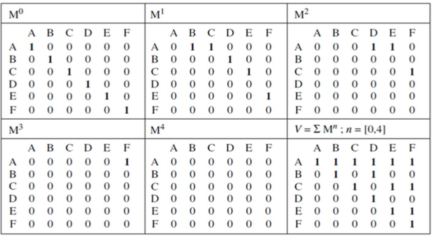
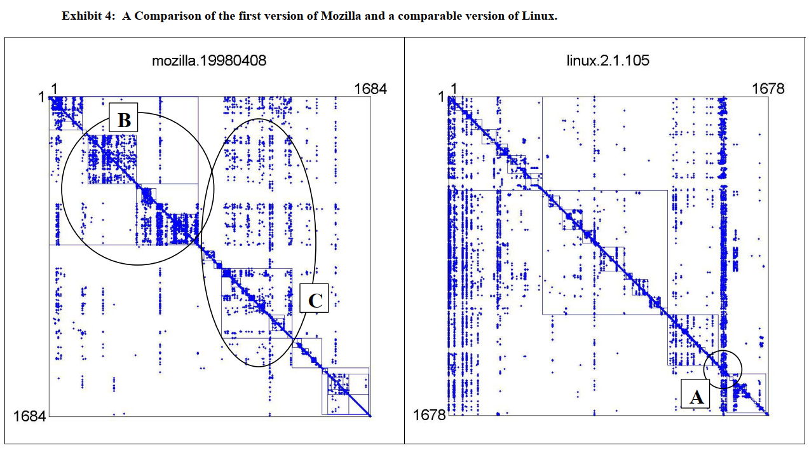
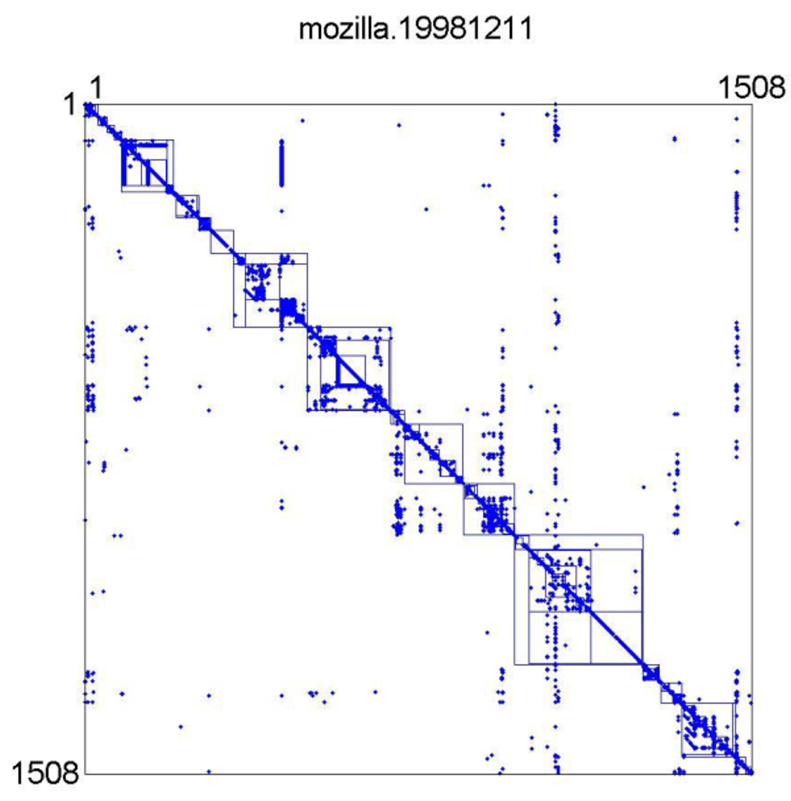
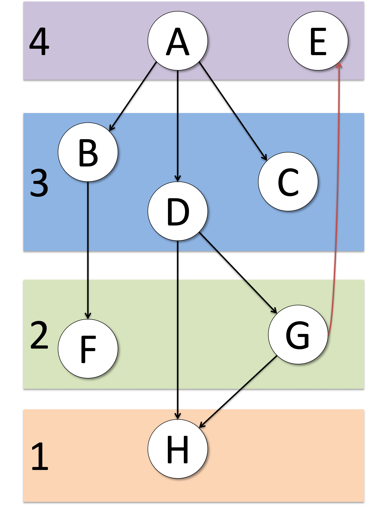

# Design Structure Matrix & Modularity

A **Design Structure Matrix** (DSM) is a square adjacency matrix where rows and columns represent system elements (files, classes, modules) and off-diagonal entries indicate dependencies between them . Unlike traditional dependency graphs that become unreadable at scale, DSMs remain compact and analyzable even for systems with thousands of elements.

```
       A  B  C  D  E
  A  [ .  1  .  .  . ]
  B  [ .  .  1  .  . ]
  C  [ .  .  .  1  . ]
  D  [ 1  .  .  .  1 ]
  E  [ .  .  1  .  . ]
```

{: .note }
> A **1** in row *i*, column *j* means element *i* depends on element *j*. Marks above the diagonal represent feedback (cyclic) dependencies; marks below represent feed-forward (hierarchical) dependencies.

---

## DSM Operations

DSMs are not just a representation -- they come with a systematic set of algorithms for restructuring designs .

### Partitioning

Reorder rows and columns to achieve **lower triangular form**, pushing as many marks as possible below the diagonal. This minimizes feedback marks (above the diagonal) and reveals the natural build order of the system .

### Clustering

Group elements into **modules** that maximize intra-group dependencies and minimize inter-group dependencies. The goal is to find subsets of DSM elements that are "mutually exclusive or minimally interacting" . A well-clustered DSM shows a **block-diagonal** pattern: dense blocks along the diagonal (cohesive modules) with sparse entries elsewhere (loose coupling) .

### Banding

Identify independent or parallel activities that can be executed simultaneously. Elements in the same band have no dependencies on each other and can proceed concurrently .

### Tearing

When partitioning cannot eliminate all feedback marks, **tearing** selects specific feedback dependencies to "break" by treating them as assumptions that will be iterated upon. This converts cycles into manageable sequential steps .

---

## Propagation Cost

**Propagation Cost** (PC) measures the proportion of system elements that could be affected, on average, when a change is made to one element -- accounting for both direct and indirect dependencies .

### Measurement Process

1. **Direct Dependency Matrix** ($M$): a binary matrix where entry $m_{ij} = 1$ if element $i$ depends on element $j$
2. **Visibility Matrix** ($V$): computed as the sum of powers of $M$:

$$V = \sum_{n=0}^{k} M^n$$

where $k$ is the diameter of the dependency graph. Entry $v_{ij} > 0$ means a change to $j$ can eventually reach $i$ through direct or indirect dependency chains.

3. **Propagation Cost**: the fraction of reachable pairs in $V$:

$$PC = \frac{\sum_{i=1}^{N}\sum_{j=1}^{N} \hat{v}_{ij}}{N^2} \quad \text{where } \hat{v}_{ij} = \begin{cases} 1 & \text{if } V_{ij} > 0 \\ 0 & \text{otherwise} \end{cases}$$



A low PC indicates a modular system where changes are contained locally. A high PC signals a tightly coupled system where changes ripple widely.

### The Mozilla vs. Linux Case Study

MacCormack et al. compared two large open-source systems to demonstrate that architecture is a **deliberate managerial choice**, not merely a byproduct of functional requirements :

| Metric | Linux 2.1.105 | Mozilla (1998) | Mozilla (post-redesign) |
|--------|:---:|:---:|:---:|
| **Propagation Cost** | 5.82% | 17.35% | 2.78% |
| **Vertical buses** | 14 | 2 | improved |
| **Dependency density** (per 1000 pairs) | 3.4 | 2.4 | lower |

Despite having *fewer* raw dependencies per element pair, Mozilla's 1998 architecture was far more coupled than Linux because its dependencies formed long indirect chains. After a purposeful re-design, Mozilla's propagation cost dropped from 17.35% to 2.78% -- a change to a file now impacted **80% fewer files** on average.





{: .important }
> Architecture is not wholly determined by function. The Mozilla re-design proves that architects can significantly adapt a design's structure through purposeful effort .

---

## Net Option Value (NOV)

Sullivan et al. applied Baldwin and Clark's theory of modularity to software, showing that modular designs create **real options** -- the ability to make independent changes has quantifiable economic value .

| Concept | Definition |
|---------|-----------|
| **Net Option Value** | Expected payoff of modularity, balancing Technical Potential against Redesign and Visibility Cost |
| **Environment DSM (EDSM)** | Extends the standard DSM by adding exogenous environment parameters that model how external forces drive design changes |
| **Information hiding** | Decouples design decisions likely to change, enabling independent module modification |

### KWIC Case Study

Sullivan et al. tested the theory on Parnas's classic Key Words in Context (KWIC) system, comparing two decompositions :

- **Processing-step decomposition**: modules aligned with computational steps -- highly coupled
- **Information-hiding decomposition**: modules aligned with design decisions likely to change -- modular

The options-based analysis confirmed Parnas's original conclusion: the information-hiding decomposition has **higher Net Option Value** because each module can be independently redesigned without affecting others. This provides an **economic justification** for Parnas's design principles beyond the usual engineering arguments.



---

## Limitations of Static DSM Analysis

### The Concentration Phenomenon

Geipel and Schweitzer studied 35 large open-source Java projects and found that static dependency structure alone is a **poor predictor** of actual change dynamics :

| Finding | Value |
|---------|-------|
| Projects where >50% of dependencies were "change neutral" | 32 out of 35 |
| Share of propagation caused by the top 10% of dependencies | >50% (>70% in Eclipse) |
| Co-change probability for elements *with* a dependency | 15--60% |
| Co-change probability for elements *without* a dependency | <5% |

Standard DSM analysis assumes **homogeneity** -- every dependency is equally likely to transmit a change. In reality, most dependencies never transmit a single change during the entire development history, and a small fraction is responsible for the majority of change propagation. This makes static-only propagation estimates "highly inaccurate" .

{: .warning }
> The higher the concentration of change propagation in a small fraction of dependencies, the better refactoring effort can be **targeted** -- focus on the 10% of "active" dependencies rather than minimizing all dependencies globally .

### Enhanced Propagation Cost

Nord et al. demonstrated that the original binary PC metric fails to detect modifiability improvements from architectural transformations. For example, converting a tightly coupled system to a strictly layered pattern yields the **same PC value** (33%) before and after -- a false negative .

Their enhanced variants introduce **dependency weights** (0 to 1) reflecting the strength of architectural shielding:

| Weight | Meaning | Example |
|:------:|---------|---------|
| **0.1** (small) | Strong tactics prevent ripple effect | Encapsulated interface |
| **0.5** (medium) | Some tactics but insufficient shielding | Partial abstraction |
| **1.0** (large) | No tactics, full ripple propagation | Direct dependency |

Three aggregation formulas for parallel paths:

| Formula | Semantics | Use Case |
|---------|-----------|----------|
| **SUM** | Cumulative exposure across all paths | Total risk assessment |
| **AVG** | Expected propagation assuming equal probability | Typical-case analysis |
| **MAX** | Worst-case propagation along least-protected path | Conservative estimation |

Applying the "Encapsulate" and "Use an Intermediary" tactics reduced enhanced PC from 24%/18%/23% (SUM/AVG/MAX) down to 13%/13%/13%, correctly detecting the modifiability improvement that binary PC missed .

---

## Modifiability Tactics and DSM

Bogner et al. identify **15 modifiability tactics** organized in three categories :

| Category | Tactics | Count |
|----------|---------|:-----:|
| **Increase Cohesion** | Split Module, Increase Semantic Coherence, ... | 5 |
| **Reduce Coupling** | Encapsulate, Use an Intermediary, Restrict Dependencies, ... | 4 |
| **Defer Binding Time** | Runtime Registration, Configuration Files, ... | 6 |



These tactics map directly to observable DSM patterns:

| Tactic | DSM Effect |
|--------|-----------|
| **Reduce Coupling** | Fewer off-diagonal entries -- dependencies between modules decrease |
| **Increase Cohesion** | Denser diagonal blocks -- dependencies within modules increase |
| **Split Module** | Smaller, more focused clusters with clearer boundaries |
| **Use an Intermediary** | Replaces direct dependencies with indirect paths through a controlled interface |

Nord et al. formalized this connection: DSM clustering operationalizes the "Increase Cohesion" / "Reduce Coupling" pair, while partitioning and tearing break cyclical dependencies that are sometimes called "code cancer" .



### Modularity Beyond OO: Aspect-Oriented Analysis

Ribeiro and Sousa extended DSM analysis to aspect-oriented systems, revealing that while aspects successfully modularize crosscutting concerns, they can **reduce class modularity** because classes can no longer be understood in isolation . Introducing explicit **design rules** as visible modules restored both class and crosscutting modularity -- reinforcing that information hiding interfaces must be rigorously obeyed regardless of the programming paradigm.

---

## Summary

| Concept | Key Metric | Source |
|---------|-----------|--------|
| DSM operations | Partitioning, Clustering, Banding, Tearing |  |
| Propagation Cost | % elements affected by average change |  |
| Net Option Value | Economic value of modular independence |  |
| Concentration phenomenon | 10% of deps cause >50% of propagation |  |
| Enhanced PC | Weighted dependencies (0.1 / 0.5 / 1.0) |  |
| Modifiability tactics | 15 tactics in 3 categories |  |

---

### References



---

{: .highlight }
**Disclaimer:** AI is used for text summarization, polishing and explaining. Authors have verified all facts and claims. In case of an error, feel free to file an issue.
