# Software Evolution and Aging

Software systems that interact with the real world are subject to relentless evolutionary pressure. Lehman's classification of programs, his eight laws of evolution, and Parnas's analysis of software aging together form the theoretical foundation for understanding why maintenance dominates the software lifecycle.

---

## Lehman's Program Classification

Lehman  classified programs into three types based on their relationship to the environment in which they execute:

| Type | Name | Definition | Example |
|------|------|------------|---------|
| **S-type** | Specification-defined | Correctness is determined solely by the specification; the program can be proven correct against it | A mathematical function, a compiler for a formally defined language |
| **P-type** | Problem-approximate | Solves a real-world problem where the specification is an approximation; acceptability depends on the quality of the solution in practice | A chess program, a weather simulation |
| **E-type** | Embedded in real world | The program is part of the world it models; its operation changes the environment, which in turn changes the requirements | An operating system, a stock trading platform, an airline reservation system |

E-type programs are the most common in industry and the most subject to evolutionary pressure. Because they are embedded in the real world, they must change as that world changes -- or become progressively less satisfactory .

---

## The Eight Laws of Software Evolution

Lehman formulated the first five laws based on quantitative studies of OS/360 evolution . Three further laws were added in the 1996 revisitation :

| # | Law | Statement | Year |
|---|-----|-----------|------|
| I | **Continuing Change** | An E-type system must be continually adapted, or it becomes progressively less satisfactory in use | 1974 |
| II | **Increasing Complexity** | As an E-type system evolves, its complexity increases unless work is done to maintain or reduce it | 1974 |
| III | **Self-Regulation** | The evolution process of E-type systems is self-regulating, with close to normal distribution of measures of process and product attributes | 1974 |
| IV | **Conservation of Organizational Stability** | The average effective global activity rate in an evolving E-type system is invariant over the product's lifetime (i.e., the work rate is approximately constant regardless of resources committed) | 1980 |
| V | **Conservation of Familiarity** | As an E-type system evolves, all associated with it -- developers, users, managers -- must maintain mastery of its content and behavior; excessive growth in release content reduces that familiarity | 1980 |
| VI | **Continuing Growth** | The functional content of an E-type system must be continually increased to maintain user satisfaction over its lifetime | 1991 |
| VII | **Declining Quality** | The quality of an E-type system will appear to be declining unless it is rigorously maintained and adapted to its changing operational environment | 1996 |
| VIII | **Feedback System** | E-type evolution processes constitute multi-loop, multi-level feedback systems; failure to recognize this leads to invalid planning and unreliable outcomes | 1996 |

Laws I and II are the most cited: together they explain why maintenance effort grows over time -- the system must keep changing (Law I), and each change makes it harder to change further (Law II) unless deliberate effort is invested in structural improvement.

---

## Software Aging (Parnas 1994)

Parnas  argued that software, like people, gets old. Unlike hardware wear-out, software aging is caused by human and organizational factors.

### Two Causes of Aging

1. **Lack of Movement** -- failure to modify the software to meet changing needs. The environment moves on while the software stands still, leading to obsolescence. Users find workarounds, switch to competitors, or demand urgent (and poorly planned) changes.

2. **Ignorant Surgery** -- changes made by people who do not fully understand the original design. Each such change erodes the conceptual integrity of the system. Documentation becomes inaccurate, structure degrades, and the software becomes increasingly difficult to understand and modify.

### The "One-Two Punch"

When both forces combine, software value declines rapidly. Lack of Movement creates pressure for urgent changes, which are then carried out as Ignorant Surgery because the urgency leaves no time for proper understanding. The result is accelerating decay -- a vicious cycle that can render a system unmaintainable.

### Software Geriatrics (Prescriptions)

Parnas  proposed two categories of intervention:

**Preventive measures** (slow the aging process):
- **Design for Change** -- use information hiding and separation of concerns to isolate likely changes behind stable interfaces
- **Keep Records** -- maintain accurate, up-to-date documentation of design decisions and their rationale
- **Second Opinions** -- use design reviews to catch aging-accelerating decisions before they are implemented

**Remedial measures** (treat existing aging):
- **Retroactive documentation** -- reconstruct the design rationale for undocumented systems
- **Retroactive modularization** -- restructure the code to restore information hiding boundaries
- **Amputation** -- remove unsalvageable components and replace them with clean implementations
- **Major surgery** -- large-scale restructuring when the overall architecture has degraded beyond local repair

> "Programs, like people, get old. We can't prevent aging, but we can understand its causes, take steps to limits its effects, temporarily reverse some of the damage it has caused, and prepare for the day when the software is no longer viable." 

---

## The Feedback System Perspective

Lehman's 1996 revisitation  introduced a crucial insight: E-type evolution processes are **multi-loop, multi-level feedback systems**. This has several important consequences:

- **Local improvements are attenuated or inverted** -- productivity improvements in one part of the process may be cancelled out by organizational feedback loops (e.g., faster coding leads to more features requested, which leads to more complexity, which slows coding again)
- **Self-stabilization through negative feedback** -- Laws III, IV, and V describe how organizational and cognitive constraints act as governors that keep the evolution rate approximately constant regardless of management intervention
- **Instability from excessive positive feedback** -- when feedback loops reinforce rather than dampen change (e.g., accumulating technical debt that accelerates further debt), the system can enter a state of declining quality (Law VII)

This perspective explains why simplistic process improvements (adding developers, adopting new tools) often fail to produce lasting gains: they address only the forward path of the feedback system while ignoring the return paths that regulate overall system behavior .

---

## Evolvability vs. Maintainability

Breivold et al.  conducted a systematic review distinguishing **evolvability** from **maintainability**:

| Dimension | Maintainability | Evolvability |
|-----------|----------------|--------------|
| **Granularity** | Fine-grained (code-level) | Coarse-grained (architectural) |
| **Time horizon** | Short-term (next release) | Long-term (5--30 years) |
| **Change type** | Corrective, adaptive, perfective | Radical enhancements, platform migration |
| **Focus** | Preserve existing functionality | Enable new capabilities |

A key finding is that standard quality models (ISO 25010, McCall) lack an explicit **Architectural Integrity** sub-characteristic . Systems can score well on code-level maintainability metrics while suffering from architectural erosion that makes large-scale evolution prohibitively expensive. This gap suggests that maintainability measurement must be complemented by architectural-level analysis -- such as Design Structure Matrices and Propagation Cost -- to capture the full picture of a system's long-term health.

---

### References



---

{: .highlight }
**Disclaimer:** AI is used for text summarization, polishing and explaining. Authors have verified all facts and claims. In case of an error, feel free to file an issue.
