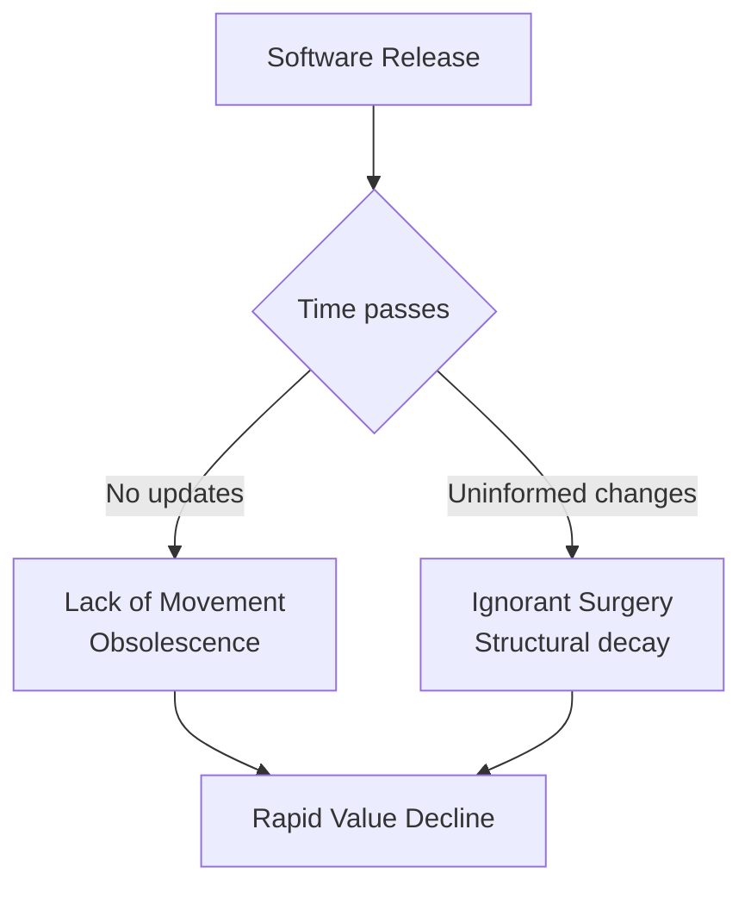

# Software Maintainability

Maintainability is the degree of effectiveness and efficiency with which a product can be modified by intended maintainers . Unlike a binary pass/fail criterion, maintainability is a **matter of degree** — measured by the unit cost of change. A system where a one-line feature takes one hour is more maintainable than one where the same feature takes one week, even if both eventually produce correct results.

This section covers the arc from why software degrades (Lehman's Laws, Parnas's aging), through the ISO 25010 sub-characteristics, to measurement models and industrial case studies that demonstrate how structural interventions restore maintainability.

---

## The Maintenance Iceberg

Most software cost is invisible at release time. The development phase — requirements through initial deployment — accounts for only a fraction of total lifecycle expenditure. The rest is maintenance: corrective, adaptive, perfective, and preventive.

| Statistic | Source |
|-----------|--------|
| ~70% of lifecycle effort goes to maintenance, ~30% to initial development |  |
| 70--80% of total lifecycle cost is in operations and support (O&S) |  |
| 80--85% of life-cycle cost is committed during requirements and design |  |
| ROI of "Design for Maintainability" can reach 1000% vs doing nothing |  |

The implication is stark: **the cheapest time to invest in maintainability is before code is written**, because design decisions lock in 80--85% of future maintenance cost.

---

## ISO 25010: Maintainability

The ISO/IEC 25010 quality model decomposes maintainability into five sub-characteristics :

| Sub-characteristic | Definition |
|--------------------|-----------|
| **Modularity** | Degree to which a system is composed of discrete components such that a change to one has minimal impact on others |
| **Reusability** | Degree to which an asset can be used in more than one system or in building other assets |
| **Analyzability** | Degree of effectiveness and efficiency with which it is possible to assess the impact of an intended change, diagnose deficiencies, or identify parts to be modified |
| **Modifiability** | Degree to which a product can be effectively and efficiently modified without introducing defects or degrading quality |
| **Testability** | Degree of effectiveness and efficiency with which test criteria can be established and tests can be performed to determine whether those criteria have been met |

These five sub-characteristics are not independent. Modularity enables analyzability (isolated modules are easier to reason about), which in turn supports modifiability (well-understood code is safer to change). Testability acts as a feedback mechanism: without it, changes cannot be verified, and modifiability degrades over time .

---

## Why Maintainability Degrades

Software does not wear out like hardware, yet it decays. Two complementary theories explain why.

### Parnas's Two Causes of Aging

Parnas identifies two forces that cause software to age :

1. **Lack of Movement** — failure to update the software to keep pace with a changing environment. The software becomes obsolete, even though nothing in it has changed.
2. **Ignorant Surgery** — changes made by people who do not understand the original design. Each such change degrades the structure, making the next change harder and more error-prone.

> "Programs, like people, get old. We can't prevent aging, but we can understand its causes, take steps to limit its effects, temporarily reverse some of the damage it has caused, and prepare for the day when the software is no longer viable."
> — D.L. Parnas (1994) 

### Lehman's Laws of Software Evolution

Lehman's empirical Laws I and II formalize the same pressures at the system level :

| Law | Name | Statement |
|-----|------|-----------|
| I | Continuing Change | A system must be continually adapted, or it becomes progressively less satisfactory |
| II | Increasing Complexity | As a system evolves, its complexity increases unless work is done to maintain or reduce it |

Law I corresponds to Parnas's "Lack of Movement": stop adapting and the system loses value. Law II corresponds to "Ignorant Surgery": every modification that does not actively reduce complexity adds to it.

---

## Software Aging: The "One-Two Punch"

Parnas describes the combined effect of both aging forces as a "one-two punch" that accelerates value decline :

The two forces reinforce each other. Lack of Movement creates pressure for urgent changes ("we must catch up"), and urgent changes are precisely the ones most likely to be Ignorant Surgery. The only defense is deliberate investment in **design for change**: information hiding, separation of concerns, and continuous architectural stewardship .

---

## Famous Maintainability Stories

| Case | Year | Problem | Impact | Source |
|------|------|---------|--------|--------|
| **Mozilla re-design** | 1998--2004 | Monolithic Netscape codebase; propagation cost 17.35% | After open-source restructuring, propagation cost dropped to 2.78% |  |
| **Microsoft Windows 7** | 2009--2012 | Top 5% most coupled modules caused disproportionate churn | Targeted refactoring achieved 0.85x dependency reduction in critical modules |  |
| **ABB DID platform** | 2014--2016 | 82% code duplication across product variants | Refactoring reduced duplication by 82%; time per new component dropped from 6--8 weeks to 1--2 weeks |  |
| **Automatic refactoring** | 2011--2014 | Manual refactoring too slow for industrial codebases | 4,000 automatic refactorings at 4 companies; 55% improved maintainability, only 10% decreased |  |

These cases share a common pattern: maintainability problems are **structural**, not local. Fixing them requires understanding the dependency architecture — which modules are coupled, where propagation cost is concentrated, and where duplication has accumulated.

---

## Section Overview

| Page | Content |
|------|---------|
| [Evolution](evolution.md) | Lehman's 8 Laws of Software Evolution, Parnas's aging theory, complexity growth patterns |
| [Measurement](measurement.md) | Maintainability Index (MI), SIG model, SQALE method, Cognitive Complexity |
| [DSM & Modularity](dsm.md) | Design Structure Matrix operations, propagation cost metric, Mozilla vs Linux comparison |
| [Case Studies](cases.md) | Microsoft refactoring study, ABB DID platform, Mozilla restructuring — detailed analysis |

---

### References



---

{: .highlight }
**Disclaimer:** AI is used for text summarization, polishing and explaining. Authors have verified all facts and claims. In case of an error, feel free to file an issue.
