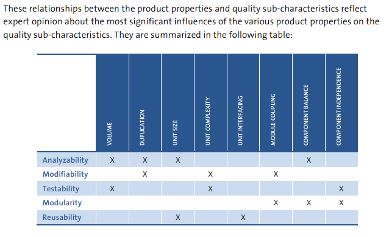
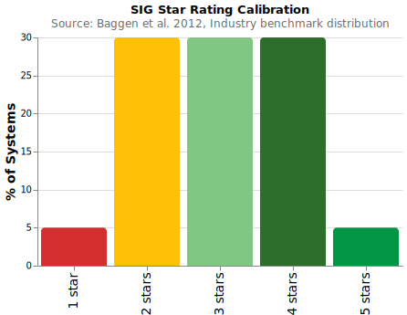

# Measuring Maintainability

The measurement landscape for software maintainability is highly fragmented. A systematic literature review by Ardito et al. identified 174 distinct metrics across 43 primary studies, yet over 75% of those metrics were mentioned by only a single paper . This lack of consensus has produced a range of competing approaches, from simple index formulas to benchmarked quality models and technical-debt frameworks.

---

## The Maintainability Index (MI)

The Maintainability Index is one of the earliest composite metrics, combining Halstead volume, cyclomatic complexity, and lines of code into a single number :

$$MI = 171 - 5.2 \cdot \ln(\text{aveV}) - 0.23 \cdot \text{aveG} - 16.2 \cdot \ln(\text{aveSTAT})$$

where $\text{aveV}$ = average Halstead Volume per module, $\text{aveG}$ = average Cyclomatic Complexity per module, and $\text{aveSTAT}$ = average lines of code per module.

| MI Range | Interpretation |
|----------|---------------|
| > 85 | Easily maintainable |
| 65 -- 85 | Moderately maintainable |
| < 65 | Difficult to maintain |

**Limitations.** The MI uses averages across all modules, which masks local hotspots: a few highly complex modules can be hidden by many simple ones. It was designed for procedural code and does not account for object-oriented features such as inheritance and coupling. Empirical evidence shows that MI is significantly influenced by software size (a confounding effect), and it correlates only moderately with technical debt at the class level (Spearman rho approximately -0.6) .

---

## The SIG Model

The Software Improvement Group (SIG) model takes a fundamentally different approach: instead of a single formula, it evaluates eight source code properties against an industry benchmark of hundreds of real-world systems  .

### Eight Source Code Properties

| Property | What It Measures |
|----------|-----------------|
| **Volume** | Overall size of source code (LOC, normalized by language productivity) |
| **Duplication** | Identical code fragments occurring in multiple places |
| **Unit Complexity** | Cyclomatic complexity of methods and functions |
| **Unit Size** | Lines of code per unit (method or function) |
| **Unit Interfacing** | Number of interface parameter declarations per unit |
| **Module Coupling** | Incoming dependencies between modules |
| **Component Balance** | Number and size distribution of top-level components |
| **Component Independence** | Percentage of code in modules with no incoming cross-component dependencies |

### Mapping to ISO 25010 Sub-characteristics

Each sub-characteristic of maintainability is derived from a specific subset of code properties :

| Sub-characteristic | Contributing Properties |
|-------------------|------------------------|
| **Analyzability** | Volume, Duplication, Unit Size, Component Balance |
| **Modifiability** | Duplication, Unit Complexity, Module Coupling |
| **Testability** | Volume, Unit Complexity, Component Independence |
| **Modularity** | Module Coupling, Component Balance, Component Independence |
| **Reusability** | Unit Size, Unit Interfacing |

### Star Rating Calibration

Properties are rated on a 1-to-5 star scale, calibrated against SIG's benchmark repository so that the distribution reflects the full range of quality achieved by real-world systems :

| Stars | Benchmark Percentile |
|-------|---------------------|
| 5 | Top 5% of systems |
| 4 | Next 30% |
| 3 | Next 30% |
| 2 | Next 30% |
| 1 | Bottom 5% |

**Certification threshold:** overall maintainability rating of at least 3 stars, with each sub-characteristic scoring at least 2 stars .

### Validation

Empirical analysis of maintenance performance shows that higher-rated systems allow significantly faster issue resolution. Systems rated 4 stars resolve issues approximately twice as fast as systems rated 2 stars , with some analyses reporting up to a 3x difference . This provides direct evidence that code-level quality ratings predict real maintenance outcomes.

---

## SQALE: A Technical Debt Approach

The SQALE (Software Quality Assessment based on Lifecycle Expectations) method reframes maintainability as a financial question: how much would it cost to bring the code up to its expected quality standard? 

Rather than scoring code on a relative benchmark, SQALE normalizes static-analysis findings into remediation costs. The central metric is the **Technical Debt Ratio (TDR)**:

$$TDR = \frac{\text{remediation cost}}{\text{estimated development cost}}$$

| Rating | TDR Threshold |
|--------|--------------|
| **A** | < 1% of development cost |
| **B** | 1% -- 2% |
| **C** | 2% -- 5% |
| **D** | 5% -- 8% |
| **E** | > 8% |

**Strengths.** Unlike the MI, SQALE is not sensitive to software size because it aggregates individual violation costs rather than averaging metric values . The financial metaphor (remediation cost in developer-hours) makes quality discussions accessible to non-technical stakeholders. Visualization tools such as the SQALE Pyramid and Debt Map help teams locate and prioritize debt hotspots .

---

## Cognitive Complexity

Cyclomatic Complexity (CC) counts the number of linearly independent paths through a method -- useful for estimating test effort, but widely regarded as unsatisfactory for measuring how difficult code is to *understand*. A switch statement with 10 cases receives the same CC score as deeply nested control flow, despite the vast difference in cognitive burden .

**Cognitive Complexity** addresses this gap with three intuitive rules:

1. **Ignore** readable shorthand structures (e.g., null-coalescing operators).
2. **Increment** for every break in linear flow (if, for, catch, goto, etc.).
3. **Add a nesting penalty** for control flow nested inside other control flow.

| Aspect | Cyclomatic Complexity | Cognitive Complexity |
|--------|----------------------|---------------------|
| **Counts** | Independent execution paths | Breaks in linear flow + nesting depth |
| **Switch** | +1 per case | +1 for the entire switch |
| **Nested if inside loop** | +1 | +2 (flow break + nesting) |
| **Design goal** | Testability (minimum test cases) | Human comprehension difficulty |

A developer acceptance survey across 22 open-source projects on SonarCloud showed a 77% acceptance rate, with developers actively fixing high Cognitive Complexity code .

---

## Comparison of Approaches

| Approach | Level | Strengths | Limitations |
|----------|-------|-----------|-------------|
| **MI** | Method / class | Simple formula; single number | Sensitive to size; averages mask hotspots; procedural-era design |
| **SIG** | System | ISO 25010-aligned; benchmarked against industry | Requires specialized tooling and benchmark access |
| **SQALE** | System | Financial metaphor; size-independent | Tool-dependent; rating thresholds need calibration |
| **Cognitive Complexity** | Method | Matches developer intuition; built into SonarQube | No standard system-level aggregation |
| **ColumbusQM** | System | Probabilistic; ISO 25010-aligned | Proprietary model |

---

## Most Widely Used Metrics

Despite 174 cataloged metrics, tool support concentrates on a small set :

| Metric | Tool Support | Primary Studies |
|--------|-------------|-----------------|
| **LOC** (Lines of Code) | 14 of 19 tools | 15 studies |
| **Cyclomatic Complexity** | 13 of 19 tools | 14 studies |
| **CBO** (Coupling Between Objects) | -- | 18 studies (most popular OO metric) |
| **RFC** (Response for Class) | -- | 17 studies |

The concentration of tool support around LOC and Cyclomatic Complexity reflects their simplicity and language-independence, while CBO's dominance among OO metrics underscores the importance of coupling as a maintainability driver.

---

### References



---

{: .highlight }
**Disclaimer:** AI is used for text summarization, polishing and explaining. Authors have verified all facts and claims. In case of an error, feel free to file an issue.
