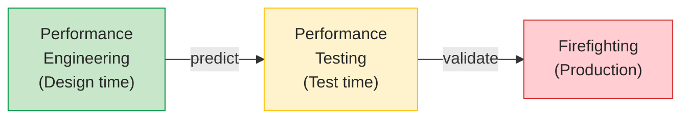
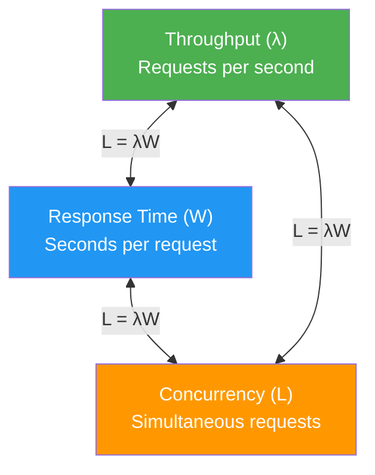
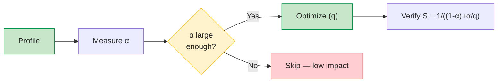
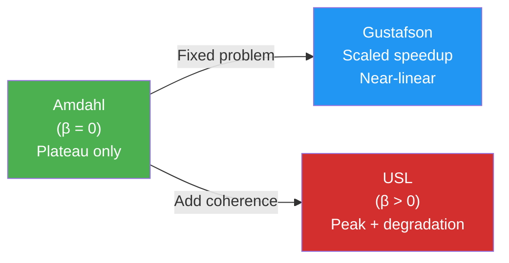
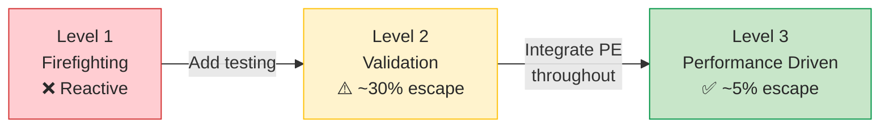
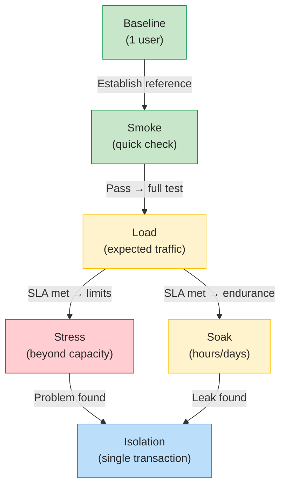
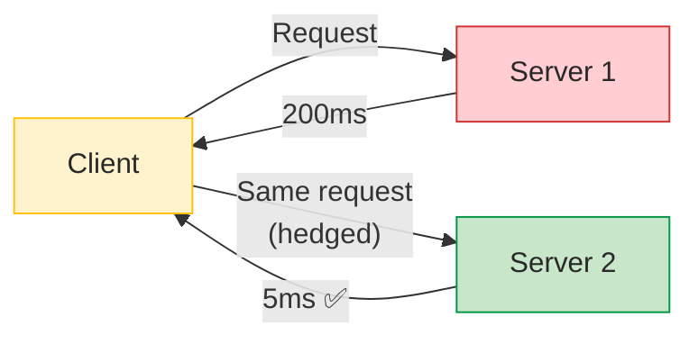
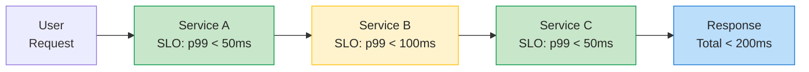
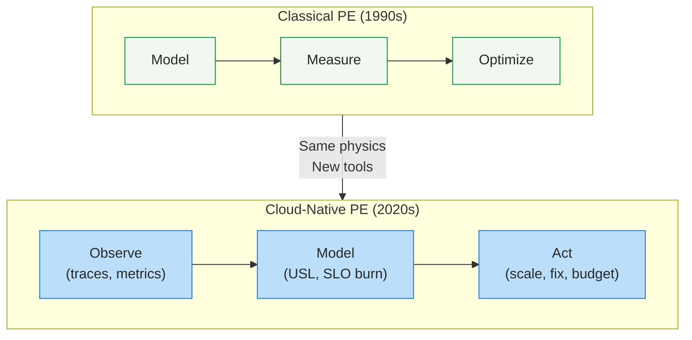

# Study Notes: Performance Analysis (L09)

## Purpose
These study notes cover performance analysis for software systems: the performance triangle (Little's Law), scalability modeling (Amdahl, Gustafson, USL), performance anti-patterns, testing methodology, and cloud-era challenges (tail latency, DevOps integration).

**Primary Sources:**
- Jain 1991, The Art of Computer Systems Performance Analysis 
- Molyneaux 2014, The Art of Application Performance Testing 
- Gunther 2007, Guerrilla Capacity Planning 

**Key Research Papers:**
- Little 1961, A Proof for L = λW 
- Amdahl 1967, Validity of the Single Processor Approach 
- Dean & Barroso 2013, The Tail at Scale 
- Jin et al. 2012, Understanding Real-World Performance Bugs 

---

## Table of Contents

1. [Part 1: Performance Fundamentals](#part-1-performance-fundamentals)
2. [Part 2: Performance Metrics](#part-2-performance-metrics)
3. [Part 3: Scalability Laws](#part-3-scalability-laws)
4. [Part 4: Risk, Anti-Patterns, and Performance Bugs](#part-4-risk-anti-patterns-and-performance-bugs)
5. [Part 5: Performance Testing](#part-5-performance-testing)
6. [Part 6: Cloud-Era Performance](#part-6-cloud-era-performance)

---

## Part 1: Performance Fundamentals

### 1.1 Why Performance Matters

Performance is not just a technical metric — it directly impacts business outcomes. Every millisecond of delay translates to measurable losses :

| Event | Impact |
|-------|--------|
| Fortune 500 average | 1.6 hours downtime per week |
| Amazon | 100ms latency increase = **1% sales loss** |
| Google | 500ms delay = **20% fewer searches** |
| Performance bugs | **62% never assigned** to a developer |

> "The ability to calculate is the ability to predict the performance of a design before it is built and tested." — Henry Petroski 

**Why this matters for software engineers:** Unlike functional bugs that produce wrong answers, performance bugs produce **late answers** — and late answers lose business just as surely as wrong ones.

### 1.2 Performance as a Quality Attribute (ISO 25010)

ISO 25010 decomposes **performance efficiency** into three sub-characteristics:

| Sub-characteristic | Definition | Key Metric |
|--------------------|-----------|------------|
| **Time Behaviour** | Response and processing times | Response time, latency percentiles |
| **Resource Utilization** | Amounts and types of resources used | CPU, memory, I/O utilization |
| **Capacity** | Maximum limits of a product parameter | Throughput, concurrent users |

These three sub-characteristics map directly to the **performance triangle** — throughput, response time, and concurrency — connected by Little's Law.

### 1.3 Performance Engineering vs Performance Testing

A critical distinction: performance testing is **reactive** (find problems after they exist), while performance engineering is **proactive** (prevent problems before they exist) :

| Approach | When | Goal | Cost |
|----------|------|------|------|
| **Performance Engineering** | Requirements → Design | Predict and prevent | Low |
| **Performance Testing** | Integration → Release | Detect and fix | Medium–High |
| **Performance Firefighting** | Production | React and repair | Very High |



**Key insight:** Moving from reactive firefighting to proactive engineering reduces production defect escape from **30% to 5%** — a 6× improvement .

### Practice Questions

1. A startup's web app has mean response time of 1.5 seconds. Their competitor responds in 0.8 seconds. Using the Amazon "100ms = 1% sales" rule of thumb, estimate the potential business impact of this difference.
2. Why is performance engineering (design-time) more cost-effective than performance testing (test-time)?
3. Which ISO 25010 sub-characteristic is most relevant for a video streaming service? For a batch payroll system?

---

## Part 2: Performance Metrics

### 2.1 The Performance Triangle: L = λW

Three fundamental metrics define system performance, connected by **Little's Law**  :



| Symbol | Name | Definition | Unit |
|--------|------|-----------|------|
| **L** | Concurrency | Average number of items in the system | count |
| **λ** | Throughput | Rate items pass through the system | items/second |
| **W** | Response time | Average time an item spends in the system | seconds |

> "The results are remarkably free of specific assumptions about arrival and service distributions, independence of interarrival times, number of channels, queue discipline, etc." — Little (1961) 

**Why this is powerful:** Little's Law works for **any stable system** — web servers, checkout queues, hospital wards, wine cellars. No assumptions about distributions or architecture. Know any two of the three → derive the third.

### 2.2 Little's Law: Cloud Service Example

**Scenario:** Your cloud load balancer dashboard shows **100 active connections** and average response time is **200 milliseconds**. What is your throughput?

**Solution:**

$$\lambda = \frac{L}{W} = \frac{100}{0.2\text{s}} = 500 \text{ requests per second}$$

**Reverse scenarios:**

| Known | Unknown | Calculation | Result |
|-------|---------|-------------|--------|
| λ = 500 rps, W = 0.2s | L | L = 500 × 0.2 | **100 concurrent** |
| L = 100, λ = 500 rps | W | W = 100 / 500 | **0.2s response** |
| L = 100, W = 0.2s | λ | λ = 100 / 0.2 | **500 rps** |

**More examples of Little's Law in action:**

| System | Known Values | Derived |
|--------|-------------|---------|
| Wine cellar | L=160 bottles, λ=96 bought/year | W = 160/96 = **1.67 years** aging |
| Hospital ward | λ=5 births/day, W=2.5 days stay | L = 5×2.5 = **12.5 beds needed** |
| Semiconductor fab | λ=1000 wafers/day, L=45000 WIP | W = 45000/1000 = **45 day cycle time** |

{: .highlight }
> **Exam Tip:** Little's Law is the single most important equation in performance analysis. Be ready to apply it in any direction (given any two, derive the third) and in any domain (not just computer systems).

### 2.3 Percentiles vs Averages: Why Mean Lies

Performance data is **fundamentally non-normal** — it has long right tails :

**Two systems with identical mean response time of 1 second:**

| Scenario | Distribution | User Experience |
|----------|-------------|-----------------|
| **Good** | All requests between 0.8s and 1.2s | Consistent, predictable |
| **Terrible** | 90% at 0.5s, 10% at 5.5s | Most fast, some furious |

Both have mean = 1s, but user experience is completely different. This is why **percentiles** beat averages :

| Percentile | What It Measures | Use Case |
|-----------|------------------|----------|
| **p50 (median)** | Typical user | General health check |
| **p90** | "What most users perceive" | Primary reporting metric |
| **p99** | Tail latency | SLA targets |
| **p99.9** | Extreme tail | Large-scale systems (Google, Amazon) |

**Wilson's recommendation:** Report the **90th percentile** as the primary metric, not the mean .

**The Rule of 8:** Human productivity drops dramatically when system response times exceed **8 seconds** — users lose their train of thought, context-switch, or abandon entirely.

**Practical thresholds for bottleneck detection:**

| Resource | Warning Threshold |
|----------|-------------------|
| CPU utilization | >70% average or run queue >2/processor |
| Disk utilization | >20% |
| Response change | <10% may be noise, not real improvement |

### 2.4 The Hockey Stick Curve: Three Zones Under Load

When load increases, a system passes through three distinct zones :

```vega-lite
{
  "$schema": "https://vega.github.io/schema/vega-lite/v5.json",
  "title": {
    "text": "System Behavior Under Load",
    "subtitle": "Source: Haines 2006, Pro Java EE5 Performance Management",
    "subtitleFontSize": 11,
    "subtitleColor": "#666"
  },
  "width": 450,
  "height": 250,
  "layer": [
    {
      "data": {
        "values": [
          {"N": 0, "R": 2}, {"N": 10, "R": 2}, {"N": 20, "R": 2.5},
          {"N": 30, "R": 3}, {"N": 40, "R": 3.5}, {"N": 50, "R": 4},
          {"N": 60, "R": 5}, {"N": 70, "R": 7},
          {"N": 75, "R": 10}, {"N": 80, "R": 18},
          {"N": 85, "R": 35}, {"N": 88, "R": 55},
          {"N": 91, "R": 75}, {"N": 93, "R": 90}, {"N": 95, "R": 100}, {"N": 96, "R": 105}
        ]
      },
      "mark": {"type": "line", "strokeWidth": 3, "interpolate": "monotone", "color": "#d32f2f", "strokeDash": [10, 5]},
      "encoding": {
        "x": {"field": "N", "type": "quantitative", "title": "Number of Concurrent Users", "scale": {"domain": [0, 105]}, "axis": {"labels": false, "ticks": false}},
        "y": {"field": "R", "type": "quantitative", "scale": {"domain": [0, 105]}, "axis": {"labels": false, "ticks": false, "title": null}}
      }
    },
    {
      "data": {
        "values": [
          {"N": 0, "U": 0}, {"N": 5, "U": 20}, {"N": 10, "U": 45},
          {"N": 15, "U": 65}, {"N": 20, "U": 80}, {"N": 25, "U": 88},
          {"N": 30, "U": 93}, {"N": 35, "U": 95},
          {"N": 40, "U": 96}, {"N": 50, "U": 96},
          {"N": 60, "U": 96}, {"N": 70, "U": 96}, {"N": 80, "U": 96},
          {"N": 90, "U": 96}, {"N": 100, "U": 96}
        ]
      },
      "mark": {"type": "line", "strokeWidth": 2.5, "interpolate": "monotone", "color": "#1565C0"},
      "encoding": {
        "x": {"field": "N", "type": "quantitative"},
        "y": {"field": "U", "type": "quantitative"}
      }
    },
    {
      "data": {
        "values": [
          {"N": 0, "X": 0}, {"N": 10, "X": 15}, {"N": 20, "X": 35},
          {"N": 30, "X": 55}, {"N": 35, "X": 68}, {"N": 40, "X": 75},
          {"N": 50, "X": 78}, {"N": 60, "X": 78}, {"N": 70, "X": 78},
          {"N": 75, "X": 76}, {"N": 80, "X": 72},
          {"N": 85, "X": 65}, {"N": 90, "X": 55}, {"N": 95, "X": 45}, {"N": 100, "X": 35}
        ]
      },
      "mark": {"type": "line", "strokeWidth": 2.5, "interpolate": "monotone", "color": "#2D6E2A"},
      "encoding": {
        "x": {"field": "N", "type": "quantitative"},
        "y": {"field": "X", "type": "quantitative"}
      }
    },
    {
      "data": {"values": [{"N": 33}]},
      "mark": {"type": "rule", "strokeDash": [8, 6], "color": "#333", "strokeWidth": 1.5},
      "encoding": {"x": {"field": "N", "type": "quantitative"}}
    },
    {
      "data": {"values": [{"N": 75}]},
      "mark": {"type": "rule", "strokeDash": [8, 6], "color": "#333", "strokeWidth": 1.5},
      "encoding": {"x": {"field": "N", "type": "quantitative"}}
    },
    {
      "data": {"values": [
        {"N": 12, "y": 103, "label": "Light Load"},
        {"N": 48, "y": 103, "label": "Heavy Load"},
        {"N": 86, "y": 103, "label": "Buckle Zone"}
      ]},
      "mark": {"type": "text", "fontSize": 12, "fontWeight": "bold", "color": "#333"},
      "encoding": {
        "x": {"field": "N", "type": "quantitative"},
        "y": {"field": "y", "type": "quantitative"},
        "text": {"field": "label"}
      }
    },
    {
      "data": {"values": [
        {"N": 2, "y": 90, "label": "U (Utilization)"},
        {"N": 2, "y": 82, "label": "X (Throughput)"},
        {"N": 2, "y": 74, "label": "R (Response Time)"}
      ]},
      "mark": {"type": "text", "fontSize": 10, "align": "left", "fontWeight": "bold"},
      "encoding": {
        "x": {"field": "N", "type": "quantitative"},
        "y": {"field": "y", "type": "quantitative"},
        "text": {"field": "label"},
        "color": {
          "field": "label", "type": "nominal",
          "scale": {
            "domain": ["U (Utilization)", "X (Throughput)", "R (Response Time)"],
            "range": ["#1565C0", "#2D6E2A", "#d32f2f"]
          },
          "legend": null
        }
      }
    }
  ],
  "config": {"font": "Tahoma, sans-serif", "view": {"stroke": null}}
}
```

**The three zones explained:**

| Zone | Utilization (U) | Throughput (X) | Response Time (R) |
|------|-----------------|----------------|-------------------|
| **Light Load** | Rising linearly | Rising linearly | Flat, near-minimal |
| **Heavy Load** | Saturated (~100%) | Plateau (max throughput) | Starting to climb |
| **Buckle Zone** | Stays at 100% | **Falling** (resource thrashing) | **Explodes** exponentially |

**What shifts the zone boundaries?**

| Change | Effect on Buckle Zone |
|--------|----------------------|
| Faster CPU | Moves right (can handle more) |
| More CPUs | Moves right (parallel capacity) |
| More arrivals | Moves along the curve (no shift) |

{: .highlight }
> **Exam Tip:** Be able to sketch the 3-zone hockey stick curve from memory and label all three metrics (U, X, R). Know that in the Buckle Zone, throughput *decreases* while response time *explodes*. The mathematical derivation (M/M/1 queuing model, R = S/(1−ρ)) is covered in **A10 Queuing Theory**.

### 2.5 Service vs Efficiency KPIs

Performance metrics fall into two categories:

| Category | Metric | Who Cares |
|----------|--------|-----------|
| **Service** | Availability (99.9% uptime) | End users |
| **Service** | Response time (p95 < 3s) | End users |
| **Efficiency** | Throughput (500 rps) | Operations |
| **Efficiency** | Utilization (CPU < 70%) | Operations |

**Monitoring layers:**

| Layer | Examples | Granularity |
|-------|---------|-------------|
| **System** | CPU, memory, disk I/O | Infrastructure |
| **Middleware** | Web server, app server, DB metrics | Technology |
| **Application** | Component, method-level timing | Code-level |

### Practice Questions

1. A microservice shows L=200 concurrent requests and λ=1000 rps. What is the average response time? If the team wants to reduce response time to 100ms, how many concurrent requests will the system handle at the same throughput?
2. System A has mean response time 2s with p99 at 2.5s. System B has mean response time 2s with p99 at 15s. Which system would you prefer for an e-commerce checkout? Why?
3. A system currently operates in the Heavy Load zone. What will happen if traffic increases by 50%? What actions could prevent entering the Buckle Zone?

---

## Part 3: Scalability Laws

### 3.1 Amdahl's Law: The Serial Fraction Ceiling (1967)

**The fundamental question:** If you speed up part of a system, how much does the *whole* system improve?

**Amdahl's Law** :

$$S = \frac{1}{(1 - \alpha) + \frac{\alpha}{q}}$$

| Symbol | Meaning | Example |
|--------|---------|---------|
| **S** | Overall speedup | How much faster the whole system gets |
| **α** | Fraction affected | Percentage of execution that benefits |
| **q** | Speedup of improved part | How much faster that part becomes |

**Ceiling:** When q → ∞ (infinite speedup of the improved part):

$$S_{max} = \frac{1}{1 - \alpha} = \frac{1}{f}$$

where f is the **serial fraction** (the part that cannot be parallelized).

**Implications:**

| Serial Fraction (f) | Max Speedup | Even with ∞ processors |
|---------------------|-------------|------------------------|
| 50% | 2× | Can never exceed 2× |
| 10% | 10× | Can never exceed 10× |
| 5% | 20× | Can never exceed 20× |
| 1% | 100× | Can never exceed 100× |

### 3.2 Amdahl's Law: Worked Example

**Problem:** You optimize a sorting algorithm that accounts for 60% of your application's critical path. The optimization makes the sort 35% faster (q = 1.35). What is the overall speedup?

**Solution:**
- α = 0.6 (fraction affected)
- q = 1.35 (speedup of improved part)
- (1 − α) = 0.4 (unaffected fraction)

$$S = \frac{1}{0.4 + \frac{0.6}{1.35}} = \frac{1}{0.4 + 0.444} = \frac{1}{0.844} = \mathbf{1.185}$$

**Result:** A 35% improvement in 60% of the code yields only **18.5% overall improvement**.

**Practical implications:**

1. **Profile first** — find actual hotspots (where α is large)
2. **Measure α** — what fraction of time does this code represent?
3. **Calculate max gain** — is the optimization effort worthwhile?
4. **Optimize the common case** — not cold code



{: .highlight }
> **Anti-pattern:** Micro-optimizing code that runs 1% of the time. Even a 10× improvement in that code gives only 0.9% overall speedup.

### 3.3 Gustafson's Law: Scale the Problem, Not the Time (1988)

Amdahl assumes a **fixed problem size** — but real users often **scale the problem** with more processors :

| | Amdahl | Gustafson |
|-|--------|-----------|
| **Assumption** | Fixed problem size | Fixed execution time |
| **Serial work** | Stays constant | Stays constant |
| **Parallel work** | Stays constant | **Grows with N** |
| **Outlook** | Pessimistic (ceiling) | Optimistic (near-linear) |
| **Use when** | Latency-bound (single request) | Throughput-bound (batch processing) |

**Gustafson's key result:** On **1024 processors**, he measured **1016–1021× speedup** — near-linear scaling! 

**Example: Weather Simulation**

| Processors | Problem Size | Serial Work | Parallel Work | Time |
|-----------|-------------|-------------|---------------|------|
| 1 | Small grid | 5 min | 55 min | 60 min |
| 100 | **Large grid** | 5 min | 55 min | **60 min** |

With 100 processors, you don't compute the same grid 100× faster — you compute a **100× finer grid** in the same time. The serial work (initialization, I/O) stays fixed, but the parallel work (computation) scales with processor count.

{: .highlight }
> **Exam Tip:** Know when to apply each law. Amdahl: "How much faster can this single task run?" (latency). Gustafson: "How much more work can we do in the same time?" (throughput).

### 3.4 Universal Scalability Law (USL): Why Adding Servers Can Make Things Worse (2002)

The USL extends Amdahl's Law by adding **coherence costs** — the overhead of keeping data consistent across processors :

$$S(N) = \frac{N}{1 + \alpha(N-1) + \beta N(N-1)}$$

| Parameter | Physical Meaning | Growth | Example |
|-----------|-----------------|--------|---------|
| **α** (contention) | Waiting for shared resources | Linear with N | Database locks, message queues |
| **β** (coherence) | Maintaining global consistency | **Quadratic** with N | Cache invalidation, distributed consensus |

**Three scalability regimes:**



**When β = 0:** USL reduces to Amdahl's Law (plateau only).
**When β > 0:** The system **degrades beyond a peak** — adding more servers actually makes performance *worse*. This is called **retrograde throughput**.

**Why retrograde throughput happens:** When you add the 101st server to a distributed cache, the cache invalidation traffic (which grows as N²) can overwhelm the benefit of the extra compute capacity. At some point, the coherence overhead exceeds the marginal throughput gain.

### 3.5 Practical USL Application

Gunther demonstrates that as few as **4 load test data points** suffice to determine α and β via regression :

1. Run load tests at 1, 2, 4, 8 servers
2. Measure throughput at each level
3. Fit the USL equation to find α and β
4. Predict the entire scalability curve — including the peak

**Cloud manifestation of USL:**

| USL Parameter | Cloud Equivalent |
|---------------|-----------------|
| **α** (contention) | Shared DBs, message queues, API gateways |
| **β** (coherence) | Distributed cache invalidation, consensus protocols |

**Capacity doubling time:** T_double = ln(2)/λ. For hypergrowth web services: ~6 months.

> "Bottlenecks are more likely to arise in the application software than in the hardware. So throwing more hardware at a performance problem might not necessarily help." — Gunther 

### 3.6 Choosing the Right Scalability Model

| Law | Predicts | Limitation | Use When |
|-----|----------|------------|----------|
| **Amdahl** | Plateau (ceiling 1/f) | Ignores coherence costs | Single-system optimization |
| **Gustafson** | Near-linear scaling | Ignores contention | HPC workloads (batch) |
| **USL** | Peak + **degradation** | Needs measured α, β | Distributed/cloud systems |

### Practice Questions

1. A web application spends 20% of its time in database queries and 80% in application logic. If you optimize the database queries to be 5× faster, what is the overall speedup? What is the maximum possible speedup even with infinitely fast queries?
2. A data analytics pipeline runs on 1 server in 10 hours. The serial portion (loading/saving) takes 30 minutes. Under Gustafson's assumption, what can you accomplish with 100 servers in 10 hours?
3. A microservice cluster shows throughput increasing linearly from 1 to 4 instances, then flattening at 8, and *decreasing* at 16 instances. What USL parameter is likely dominant? What would you investigate?

---

## Part 4: Risk, Anti-Patterns, and Performance Bugs

### 4.1 Performance Budget

A performance budget allocates response time per component — just like a financial budget allocates money :

| Phase | Activity |
|-------|----------|
| **Design** | Model: predict bottlenecks, allocate response time |
| **Build** | Track: actual vs budget per component |
| **Test** | Validate: measure and compare |
| **Tune** | Optimize: remove identified bottlenecks |
| **Release** | Verify: establish production baseline |

**Investment:** 1–5% of total project cost for dedicated performance engineering prevents 6× more defects escaping to production .

**What you can affect to improve performance:**

| Lever | Technique | Example |
|-------|-----------|---------|
| **Process speed** | Optimize algorithm | Replace O(n²) sort with O(n log n) |
| **Process sequence** | Reorder operations | Prefetch data before processing |
| **Process concurrency** | Parallelize work | Process independent items simultaneously |
| **Process design** | Change architecture | Move from sync to async, add caching |

### 4.2 Performance Anti-Patterns

Smith and Williams identified design-level anti-patterns that **cannot be fixed by tuning** — they require architectural redesign :

| Anti-Pattern | What Goes Wrong | Measured Impact |
|-------------|-----------------|-----------------|
| **God Class** → *God Service* | One controller does all work | **2× message traffic** vs refactored design |
| **Circuitous Treasure Hunt** → *Chatty N+1* | Long chains of calls to find data | **4,000 unnecessary DB calls** |
| **One-Lane Bridge** → *Unsharded DB* | Serial bottleneck where high bandwidth is needed | All requests serialize |
| **Excessive Dynamic Allocation** → *Cold starts* | Frequent create/destroy cycles | GC overhead, latency spikes |

**The cloud-native evolution:** Each classical anti-pattern has a modern equivalent. God Class becomes God Service (one microservice does everything). Circuitous Treasure Hunt becomes the chatty N+1 query pattern. The underlying principle is the same: poor decomposition causes excessive communication.

{: .highlight }
> **Key insight:** These are **design-level** problems, not code-level bugs. Profiling and tuning won't help — you must **redesign**. This is why performance engineering must start at the architecture phase.

### 4.3 Empirical Evidence: Performance Bugs

Research reveals consistent patterns about how performance bugs are found and (not) fixed:

**Root causes (Jin et al., 2012)** :

A study of 109 performance bugs from Apache, Chrome, GCC, Mozilla, and MySQL:

| Finding | Value |
|---------|-------|
| Wrong understanding of workload or API | **67%** of bugs |
| Bugs in input-dependent loops | **>75%** |
| Median patch size | **8 lines of code** |
| Patches with reusable detection rules | **46%** |

**How developers discover performance bugs (Nistor et al., 2013)** :

| Discovery Method | Performance Bugs | Non-Performance Bugs |
|-----------------|-----------------|---------------------|
| **Code reasoning** (reading + thinking) | **33–57%** | 5–16% |
| Observing slowness | 30–49% | 85–95% |
| **Profiling** | **5–10%** | — |
| Regression tests | 2–9% | — |

**The neglect gap (Zaman et al., 2011)** :

Comparing security vs performance bugs in Firefox:
- Security bugs triaged **3.64× faster**
- Security bugs fixed **2.8× faster**
- Performance bugs touch **2.6× more files** per fix
- **62% of performance bugs never assigned** a developer

{: .highlight }
> **Exam Tip:** The surprise finding: **profiling discovers only 5–10%** of performance bugs. **Code reasoning** (reading and thinking about code) discovers 33–57%. This means code review for performance patterns is more effective than runtime measurement alone.

### 4.4 Utility Curves: Not All Response Times Have Equal Business Value

Different applications have different tolerance curves for response time:

| Application | Curve Shape | Explanation |
|-------------|------------|-------------|
| **Real-time trading** | Cliff — instant drop-off | Milliseconds matter, all or nothing |
| **Streaming video** | Cliff at buffering threshold | Fine until buffer empties, then terrible |
| **Web page** | Gradual decline | Progressively worse experience |
| **Batch reporting** | Flat — tolerance is high | Overnight is fine |

**Performance budget helps prioritize:** Optimize the component whose utility curve has the steepest cliff first.

### Practice Questions

1. A microservice architecture has Service A (50ms), Service B (120ms), and Service C (30ms) in a call chain. Total response time is 200ms. The target is 150ms. Which service should you optimize first and why?
2. Your profiler shows 70% of CPU time in a sort function. A colleague suggests micro-optimizing the sort comparisons. Using Amdahl's Law reasoning, is this the best approach? What would you check first?
3. A development team discovers a performance bug where a database query runs 10,000 times per page load instead of once (N+1 problem). The fix is 3 lines of code. What anti-pattern is this? Why wasn't it found earlier?
4. An e-commerce site and a medical records system both have 2-second response time. Which has worse business impact? Use utility curve reasoning.

---

## Part 5: Performance Testing

### 5.1 Testing Maturity Model

Molyneaux defines three maturity levels for performance testing :

| Level | Name | Approach | Defect Escape Rate |
|-------|------|----------|-------------------|
| 1 | **Firefighting** | React to production incidents | High (unknown) |
| 2 | **Performance Validation** | Test before release | **~30%** |
| 3 | **Performance Driven** | Engineer throughout lifecycle | **~5%** |



**Current industry reality:**
- Only **33%** of organizations evaluate performance regularly
- **50%** of practitioners spend <5% of time on performance
- **88%** of DevOps teams don't model performance (though 70% want to) 

### 5.2 Six Types of Performance Tests

Each test type answers different questions :

| Test Type | Purpose | Load Level | When to Use |
|-----------|---------|------------|-------------|
| **Baseline** | Establish best-case response | Minimal (1 user) | Before any load testing |
| **Load** | Verify SLA under expected traffic | Expected peak | Every release |
| **Stress** | Find the breaking point | Beyond capacity | Capacity planning |
| **Soak / Stability** | Reveal memory leaks, slow degradation | Sustained normal | Before production |
| **Smoke** | Quick sanity check of changes | Changed code only | After each build |
| **Isolation** | Diagnose specific transactions | Repeated single | Debugging known issues |



### 5.3 Liu's 8-Step Performance Testing Process

Liu defines a systematic process for performance testing :

| Step | Activity | Key Decision |
|------|----------|-------------|
| 1 | **Workload design** | From customer requirements/SLAs |
| 2 | **Script development** | Automated test drivers |
| 3 | **Hardware selection** | 2–4× QA system capacity |
| 4 | **Environment setup** | Realistic data volumes |
| 5 | **Procedure definition** | Reproducible (restart, warm-up) |
| 6 | **Baseline establishment** | Optimal config as yardstick |
| 7 | **Bottleneck analysis** | Queuing theory + counters |
| 8 | **Optimization/tuning** | Remove identified bottlenecks |

**Key insight:** Steps 1–5 are **preparation** — most of the effort happens before you run a single test. The test itself is the easy part.

### 5.4 Test Environment and Execution

**Critical requirements for valid results:**

| Factor | Requirement | Why |
|--------|------------|-----|
| Hardware | Same as production | Different CPUs/memory = different bottlenecks |
| Network | Same latency profile | 10ms vs 100ms changes behavior |
| Data volumes | Realistic (not empty DB) | Query plans change with data size |
| External dependencies | Stubbed or matched | Third-party variability confounds results |
| Configuration | Same JVM, DB, OS settings | Tuning parameters dominate behavior |

**Each test run has 3 phases:**

1. **Ramp-up** to peak — reveals memory/thread allocation issues
2. **Measurement** at peak — steady-state timing (this is what you report)
3. **Ramp-down** — verify resource release (detect leaks)

**Warning:** Many systems fail during **ramp-up**, not at peak. Resource allocation (thread pool growth, connection pool expansion) is often more taxing than steady-state processing.

### 5.5 Workload Characterization

Getting the workload right is critical :

| Factor | What to Capture |
|--------|----------------|
| **Temporal** | Daily, weekly, seasonal patterns |
| **Statistics** | Mean, median, variance, peaks |
| **User behavior** | Think time, pacing, session length |
| **Transaction mix** | Types, rates, percentages |
| **Data volumes** | Input sizes, database size |
| **Concurrency** | Active users (not just registered) |

**Weyuker's findings:**
- Key transactions rarely exceed **20** per system
- **93% of performance issues** concentrated in the weakest 30% identified during architecture reviews
- Targeted testing beats uniform coverage
- Add **10% safety margin** above go-live target

### 5.6 Diagnostics: Reading the Charts

**4-phase diagnostic loop:**

1. **Initial diagnosis** — top-level tools (iostat, sar, uptime)
2. **Problem isolation** — categorize: CPU, I/O, Paging, or Network
3. **Deep probing** — profilers, filemon, svmon
4. **Remediation** — targeted fix, then re-test

**What the chart tells you:**

| Pattern | Likely Cause | Action |
|---------|--------------|--------|
| Response climbs then flattens | Normal saturation | Within capacity |
| Response climbs continuously | **Resource leak** (memory, connections) | Find the leak |
| Response becomes erratic | Contention (locks, GC) | Reduce contention |
| Context switches spike | CPU overload | Add capacity or optimize |

### 5.7 Automated Performance Regression Detection

Malik et al. developed **performance signatures** — a minimal set of counters that capture essential system behavior :

| Technique | Precision | Recall |
|-----------|-----------|--------|
| Random Sampling | Low | Low |
| K-Means Clustering | Medium | Medium |
| PCA | 81% | 84% |
| **WRAPPER (GA+LR)** | **95%** | **94%** |

**Result:** Up to **89% reduction** in counters needed — from thousands to **5–20 counters**.

**CI/CD integration:**
1. Run standardized load test per build
2. Extract performance signature (5–20 counters)
3. Compare against baseline signature
4. **Flag regressions automatically**

This enables what DevOps teams want: automated performance evaluation in delivery pipelines.

### Practice Questions

1. Your team is at Testing Maturity Level 1 (firefighting). What specific steps would you take to reach Level 2? What about Level 3?
2. An e-commerce site must handle 10,000 concurrent users during Black Friday (4× normal). Design a test strategy: which test types would you run, in what order, and why?
3. After a soak test, memory usage has increased from 2GB to 6GB over 12 hours while throughput remained stable. What type of problem does this indicate? What would you check?
4. Why is it important to add a 10% safety margin above the go-live target? Give a real-world scenario where this matters.

---

## Part 6: Cloud-Era Performance

### 6.1 Tail Latency: The Dominant Problem in Distributed Systems

Dean and Barroso (2013) demonstrated that in fan-out architectures, **tail latency dominates** user experience :

> "Just as fault-tolerant computing aims to create a reliable whole out of less-reliable parts, large online services need to create a predictably responsive whole out of less-predictable parts." — Dean & Barroso

### 6.2 The Amplification Problem

When a single user request fans out to N servers, the probability of hitting at least one slow server:

$$P(\text{any slow}) = 1 - (1 - p)^N$$

| Servers (N) | Individual p99 slow | P(any slow) |
|-------------|--------------------|-----------------------------|
| 1 | 1% | 1% |
| 10 | 1% | 10% |
| 100 | 1% | **63%** |
| 2000 | 0.01% | ~20% |

**The math is devastating:** With 100 servers each having a 1% chance of being slow, **63% of all user requests** experience tail latency.

```vega-lite
{
  "$schema": "https://vega.github.io/schema/vega-lite/v5.json",
  "title": {"text": "Tail Latency Amplification", "subtitle": "P(any slow) = 1 - (1-p)^N", "subtitleFontSize": 11, "subtitleColor": "#666"},
  "width": 400,
  "height": 220,
  "data": {
    "values": [
      {"N": 1, "P": 1, "p": "p = 1%"}, {"N": 10, "P": 9.6, "p": "p = 1%"},
      {"N": 25, "P": 22.2, "p": "p = 1%"}, {"N": 50, "P": 39.5, "p": "p = 1%"},
      {"N": 100, "P": 63.4, "p": "p = 1%"}, {"N": 200, "P": 86.6, "p": "p = 1%"},
      {"N": 1, "P": 0.1, "p": "p = 0.1%"}, {"N": 10, "P": 1.0, "p": "p = 0.1%"},
      {"N": 25, "P": 2.5, "p": "p = 0.1%"}, {"N": 50, "P": 4.9, "p": "p = 0.1%"},
      {"N": 100, "P": 9.5, "p": "p = 0.1%"}, {"N": 200, "P": 18.1, "p": "p = 0.1%"}
    ]
  },
  "mark": {"type": "line", "point": true, "strokeWidth": 2},
  "encoding": {
    "x": {"field": "N", "type": "quantitative", "title": "Number of Servers"},
    "y": {"field": "P", "type": "quantitative", "title": "P(any slow) %", "scale": {"domain": [0, 100]}},
    "color": {"field": "p", "type": "nominal", "scale": {"range": ["#d32f2f", "#1565C0"]}, "legend": {"title": "Individual Slow Rate"}}
  },
  "config": {"font": "Tahoma, sans-serif", "point": {"size": 40, "filled": true}, "view": {"stroke": null}}
}
```

### 6.3 Tail-Tolerant Techniques

Dean and Barroso propose solutions that **tolerate** tail latency rather than trying to eliminate it :

| Technique | How It Works | Result |
|-----------|-------------|--------|
| **Hedged requests** | Send to 2 servers, take first reply | p99.9: 1800ms → **74ms** (+2% traffic) |
| **Tied requests** | Send to 2 servers, cancel the slower one | Median −21%, p99 −38% |
| **"Good enough"** responses | Return partial results from fast servers | Graceful degradation |



**Why hedged requests are so effective:** You're not making the slow server faster — you're giving the request a second chance to hit a fast server. At +2% traffic cost, you reduce p99.9 latency by **96%**.

### 6.4 The DevOps Performance Gap

Bezemer et al. (2019) surveyed practitioners and found a significant gap :

- **88%** of DevOps teams don't model performance
- **70%** want to but lack accessible tools
- **50%** of practitioners spend <5% of time on performance

**Three needs for modern performance engineering:**
1. **Lightweight** — simple models that fit sprint cycles
2. **Low-complexity** — tools that don't require queuing theory expertise
3. **Integrated** — performance gates embedded in CI/CD pipelines

> "The complexity of performance engineering approaches and tools is a barrier for wide-spread adoption of performance analysis in DevOps." — Bezemer et al. (2019) 

### 6.5 Per-Service SLOs as Performance Budgets

The modern cloud-native approach maps classical performance engineering to per-service SLOs:

| Classical PE | Cloud Equivalent |
|-------------|-----------------|
| Budget per component | **SLO per service** (p99 < 200ms) |
| Budget tracking | **SLO burn-rate** monitoring |
| Risk acceptance | **Error budget**: tolerable violation |
| 1–5% project cost | **SRE team** allocation |

**Example — End-to-end latency decomposition:**
- Service A: SLO p99 < 50ms
- Service B: SLO p99 < 100ms
- Service C: SLO p99 < 50ms
- **Total budget: p99 < 200ms**

Each service owns its SLO. The call chain maps to a **wait chain** model from queuing theory.



### 6.6 The Convergence Vision

Modern observability platforms provide the **measurement** (distributed tracing, metrics, logs) while performance models provide the **structure** (USL regression, SLO burn-rate):



**The fundamental shift:** Performance engineering is moving from periodic, expert-driven analysis to **continuous, automated, integrated** practices — but the physics (Little's Law, queuing theory, Amdahl) hasn't changed.

### Practice Questions

1. A microservice request fans out to 50 backend services. Each service has a 2% chance of responding slowly (>500ms). What is the probability that the user experiences a slow response? What technique would you use to mitigate this?
2. Why are hedged requests so effective despite adding only 2% more traffic? Under what conditions would hedged requests NOT help?
3. A team wants to implement per-service SLOs. Their call chain is A → B → C, with total SLO of p99 < 300ms. How would you allocate the budget? What happens when Service B consistently uses 150ms?
4. Bezemer found 88% of DevOps teams don't model performance. What are the barriers? What practical steps could close this gap?

---

## Key Concepts Summary

| Concept | Formula / Rule | Practical Application |
|---------|---------------|----------------------|
| **Little's Law** | L = λW | Know any two → derive the third |
| **Hockey stick** | 3 zones: Light → Heavy → Buckle | Target <70% utilization |
| **Amdahl** | S = 1/((1−α) + α/q) | Profile first, measure α |
| **Gustafson** | Scale problem with processors | HPC, batch workloads |
| **USL** | S(N) = N/[1+α(N−1)+βN(N−1)] | Predicts degradation in distributed systems |
| **Percentiles** | Use p90/p99, not mean | Same mean, different experience |
| **Anti-patterns** | Redesign, don't tune | God Class, Chatty N+1 |
| **Testing maturity** | L1→L2→L3 | 30% → 5% defect escape |
| **Tail latency** | P = 1−(1−p)^N | 100 servers × 1% = 63% |
| **Hedged requests** | Send to 2, take first | p99.9: 1800ms → 74ms |
| **Per-service SLO** | Latency budget per service | Classical PE → cloud-native |

---

## Essential Reading

| Priority | Source | What It Covers |
|----------|--------|----------------|
| **Core** | Jain 1991  | Comprehensive performance analysis textbook |
| **Core** | Dean & Barroso 2013  | Tail latency and distributed systems |
| **Core** | Gunther 2007  | USL and capacity planning |
| Recommended | Molyneaux 2014  | Performance testing methodology |
| Recommended | Jin et al. 2012  | Empirical performance bug study |
| Deep dive | Little 1961  | Original L = λW proof |
| Deep dive | Amdahl 1967  | Parallel computing limits |

For queuing theory formulas and derivations, see **A10 Queuing Theory** lecture.

---

### References



---

{: .highlight }
**Disclaimer:** AI is used for text summarization, polishing and explaining. Authors have verified all facts and claims. In case of an error, feel free to file an issue.
