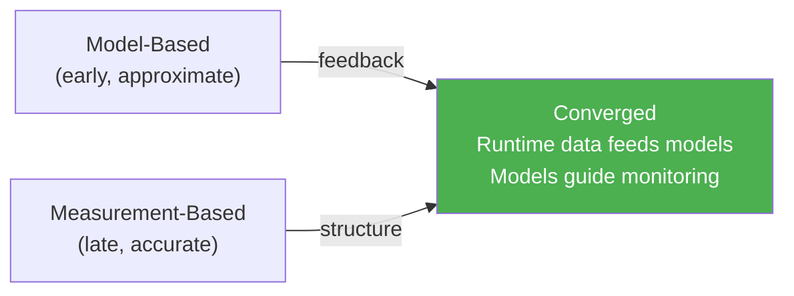

# Performance in the Cloud Era

The lecture (2014) predates the widespread adoption of microservices, CI/CD pipelines, and cloud-native architectures. This page bridges classical performance engineering to modern distributed system challenges, drawing on both the lecture foundations and recent empirical evidence.

---

## From Monoliths to Microservices: What Changes

Classical performance engineering assumes a relatively contained system — one application, one or a few servers, known workloads. Cloud-native architectures break these assumptions:

| Classical Assumption | Cloud Reality |
|---------------------|--------------|
| Known server count | Auto-scaling, elastic capacity |
| Single deployment | Hundreds of independently deployed services |
| Controlled workload | Unpredictable, bursty traffic |
| End-to-end profiling | Distributed traces across service boundaries |
| Performance budget per component | Per-service SLOs as performance budgets |

The fundamental physics hasn't changed — Little's Law, queuing theory, and the hockey stick curve still apply — but the **scale and distribution** create new challenges.

---

## Tail Latency: The Dominant Problem

Dean and Barroso (2013) demonstrate that in fan-out architectures, **tail latency dominates** :

> "Just as fault-tolerant computing aims to create a reliable whole out of less-reliable parts, large online services need to create a predictably responsive whole out of less-predictable parts." — Dean & Barroso 

### The Amplification Problem

When a single user request fans out to N servers, the probability of hitting at least one slow server grows exponentially:

**P(tail) = 1 &minus; (1 &minus; p)N**

| Servers | Individual p99 slow | Probability of hitting tail |
|---------|--------------------|-----------------------------|
| 1 | 1% | 1% |
| 10 | 1% | 10% |
| 100 | 1% | **63%** |
| 2000 | 0.01% | ~20% |

With 100 servers each having a 1% chance of being slow, **63% of all requests** experience tail latency .

### Tail-Tolerant Techniques

| Technique | How It Works | Result |
|-----------|-------------|--------|
| **Hedged requests** | Send to multiple replicas, use first response | p99.9: 1800ms &rarr; **74ms** (with only 2% extra traffic) |
| **Tied requests** | Replicas communicate to cancel duplicate work | Median: &minus;21%, p99: &minus;38%, <1% overhead |
| **Micro-partitioning** | 20 partitions per machine for granular balancing | Reduces load imbalance |
| **"Good enough" results** | Return partial results before all servers respond | Bounds worst-case latency |

---

## Amdahl's Law in the Cloud: The USL Connection

The Universal Scalability Law  explains why "just add more servers" doesn't always work:

**S(N) = N / [1 + &alpha;(N&minus;1) + &beta;N(N&minus;1)]**

In cloud architectures:

| USL Parameter | Cloud Manifestation |
|---------------|-------------------|
| **&alpha; (contention)** | Shared databases, message queues, API gateways |
| **&beta; (coherence)** | Distributed cache invalidation, consensus protocols, cross-service transactions |

The coherence term &beta;N(N&minus;1) grows **quadratically** — explaining why adding servers beyond a certain point causes **retrograde throughput**: the system gets slower, not faster .

> "Bottlenecks are more likely to arise in the application software than in the hardware. So throwing more hardware at a performance problem might not necessarily help." — Gunther 

### Capacity Growth

For hypergrowth web services, the capacity doubling period can be as short as **6 months** — roughly 10&times; faster than traditional data centers and 4&times; faster than Moore's Law .

---

## The DevOps Performance Gap

Bezemer et al. (2019) surveyed DevOps practitioners and found a stark gap between aspiration and practice :

| Finding | Value |
|---------|-------|
| Evaluate performance regularly | Only **33%** (19% continuous, 8% daily, 8% weekly) |
| Time spent on performance | 50% spend **<5%** of total time |
| Want to use performance models | **70%** |
| Actually use models | Only **12%** |
| Queuing theory knowledge | Only **19%** |
| CI tool dominance | Jenkins: 77% builds, 65% deployment |
| Monitoring level | System (50%) > Application (42%) > Operation (23%) |

> "The complexity of performance engineering approaches and tools is a barrier for wide-spread adoption of performance analysis in DevOps." — Bezemer et al. 

### Three Needs for Modern Performance Engineering

1. **Lightweight** — Simple models that fit into sprint cycles
2. **Low-complexity** — Tools that don't require queuing theory expertise
3. **Integrated** — Performance gates embedded in CI/CD pipelines

---

## Performance in CI/CD Pipelines

### Current State

Automatic performance evaluations are **usually not integrated** into delivery pipelines . Diagnosis still relies on "human intuition" rather than systematic automated analytics.

### Towards Automated Regression Detection

Malik et al. demonstrate that automated approaches can detect performance deviations with high accuracy :

- Reduce thousands of performance counters to **5–20 signatures**
- Supervised approach: **95% precision, 94% recall**
- Up to **89% reduction** in counters needed for analysis

This enables performance gates in CI/CD: compare each build's performance signature against a baseline, flag regressions automatically.

### The Convergence Vision

Woodside et al. (2007) predicted a convergence of measurement-based and model-based approaches :

In modern terms: **observability platforms** (distributed tracing, metrics, logs) provide the measurement, while **performance models** (USL regression, SLO burn-rate) provide the structure for interpretation.

---

## Per-Service SLOs as Performance Budgets

Jewell's performance budget concept  maps naturally to microservices:

| Classical PE | Cloud-Native Equivalent |
|-------------|------------------------|
| Performance budget per component | SLO per service (e.g., p99 < 200ms) |
| Budget tracking during development | SLO burn-rate monitoring in production |
| Risk containment vs acceptance | Error budget: how much SLO violation is tolerable |
| 1–5% project cost for PE | SRE team allocation |

Each service owns its SLO. The end-to-end latency budget is decomposed across the call chain — analogous to the "wait chain" model where N-tier architectures are queuing nodes .

For error budgets and SLO practices, see [From FIO to SLO](../reliability/slo-bridge.md).

---

## Performance Anti-Patterns in Distributed Systems

Classical anti-patterns  have cloud-native equivalents:

| Classical Anti-Pattern | Distributed Equivalent |
|-----------------------|----------------------|
| **God Class** | God Service — one service handling too many responsibilities |
| **One-Lane Bridge** | Single-threaded API gateway, unsharded database |
| **Circuitous Treasure Hunt** | Chatty inter-service calls (N+1 query patterns) |
| **Excessive Dynamic Allocation** | Container spin-up/teardown overhead, cold starts |

---

## Key Takeaways for Practitioners

1. **Measure percentiles, not averages** — p99 and p99.9 matter more than mean in distributed systems  
2. **Model before scaling** — USL with 4 data points predicts whether adding servers will help or hurt 
3. **Automate performance gates** — Integrate performance signature comparison into CI/CD 
4. **Budget latency per service** — Decompose end-to-end SLOs into per-service budgets 
5. **Design for tail tolerance** — Hedged requests and partial results beat chasing individual outliers 

---

### References



---

{: .highlight }
**Disclaimer:** AI is used for text summarization, polishing and explaining. Authors have verified all facts and claims. In case of an error, feel free to file an issue.
