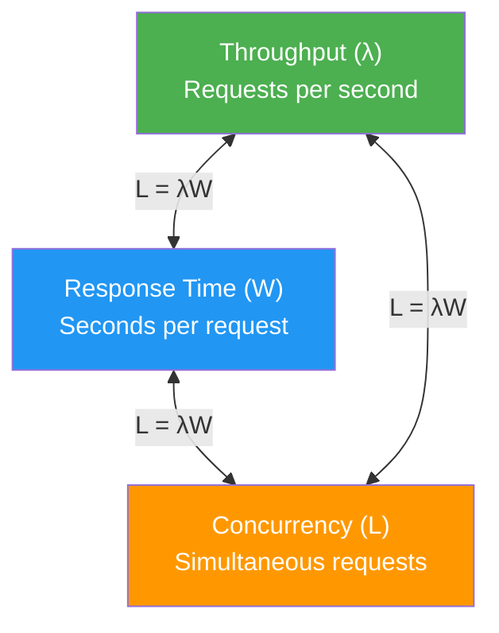

# Software Performance

Performance is the degree to which a system meets its objectives for timeliness . Unlike functional correctness — where software either works or doesn't — performance is a **matter of degree**: a response in 0.5 seconds and one in 5 seconds are both "correct," but their business impact differs dramatically .

This section covers the arc from classical performance metrics (Little's Law, queuing theory) through scalability modeling (Amdahl, USL) to modern performance testing and cloud-native challenges.

---

## ISO 25010: Performance Efficiency

The ISO 25010 quality model decomposes performance efficiency into three sub-characteristics:

| Sub-characteristic | Definition | Key Metric |
|--------------------|-----------|------------|
| **Time Behaviour** | Response and processing times | Response time, latency percentiles |
| **Resource Utilization** | Amounts and types of resources used | CPU, memory, I/O utilization |
| **Capacity** | Maximum limits of a product parameter | Throughput, concurrent users |

These three sub-characteristics correspond to the **performance triangle** — throughput, response time, and utilization — connected by Little's Law .

---

## The Performance Triangle

Three fundamental metrics define system performance. Little's Law connects them: **L = &lambda;W** — the average number of items in a system (L) equals the arrival rate (&lambda;) times the average time spent in the system (W) .

This relationship is **remarkably general** — it holds regardless of arrival distributions, number of servers, or queue discipline . If you know any two of the three, you can derive the third. See [Measurement](measurement.md) for the full derivation and operational laws.

---

## Why Performance Cannot Be Fixed Late

The cost of fixing performance problems escalates dramatically through the development lifecycle. Several lines of evidence converge on this conclusion:

### The Industry Reality

| Statistic | Source |
|-----------|--------|
| 50% of IT executives: performance problems in &ge;20% of deployed apps |  |
| 88% of DevOps teams don't model performance (though 70% want to) |  |
| 50% of practitioners spend <5% of time on performance |  |
| 62% of performance bugs are never assigned to a developer |  |
| Maturity: reactive testing lets 30% of defects escape to production |  |

### Performance Anti-Patterns Are Architectural

Performance problems are often not code-level bugs but **design-level anti-patterns** that require architectural refactoring :

| Anti-Pattern | Problem | Impact |
|-------------|---------|--------|
| **God Class** | One controller does all work | 2&times; message traffic vs refactored design |
| **Circuitous Treasure Hunt** | Long chains of object calls | 4,000 unnecessary DB calls |
| **One-Lane Bridge** | Low-bandwidth path where high-bandwidth needed | Serialized bottleneck |
| **Excessive Dynamic Allocation** | Frequent object create/destroy | GC overhead, latency spikes |

These anti-patterns cannot be fixed by "tuning" — they require redesign . This is why Smith and Williams advocate for **Software Performance Engineering (SPE)**: predictive modeling during the design phase, before code is written .

### The "Ugly Stepchild"

> "Software performance is the ugly stepchild of software functionality... correct answers delivered too late lose business opportunity just as surely as if the correct answers were never delivered at all."
> — Everett & McLeod (2007) 

### Proactive Performance Engineering

Jewell's Performance Engineering and Management Method (PEMM) integrates performance into every lifecycle phase :

- **Performance budget**: Allocate time/resources (not money) per component — track actual vs budget during development
- **Investment**: 1–5% of total project cost for dedicated PE activities
- **Risk balance**: Find cost-effective equilibrium between risk containment and risk acceptance

The payoff: moving from reactive "firefighting" to proactive "Performance Driven" mode reduces production defect escape from 30% to just 5% .

---

## Performance Bugs: Empirical Evidence

Empirical studies of real-world performance bugs reveal consistent patterns:

### Root Causes (Jin et al., 2012)

A study of 109 performance bugs from Apache, Chrome, GCC, Mozilla, and MySQL found :

| Finding | Value |
|---------|-------|
| Wrong understanding of workload or API | 67% of bugs |
| Bugs in input-dependent loops | >75% |
| Median patch size | 8 lines of code |
| Patches with reusable detection rules | 46% |

Most performance bugs are **small fixes with large impact** — the challenge is finding them, not fixing them.

### Discovery Methods (Nistor et al., 2013)

How do developers actually find performance bugs? 

| Method | Performance Bugs | Non-Perf Bugs |
|--------|-----------------|---------------|
| Code reasoning | 33–57% | 5–16% |
| Observing slowness | 30–49% | 85–95% |
| Profiling | **5–10%** | — |
| Regression tests | 2–9% | — |

The surprising finding: **profiling is a minor source** for discovering performance bugs. Most are found through code reasoning — reading and thinking about code — not through runtime tools.

### The Neglect Gap (Zaman et al., 2011)

Comparing security vs performance bugs in Firefox :

- Security bugs triaged **3.64&times; faster**
- Security bugs fixed **2.8&times; faster**
- Performance bugs touch **2.6&times; more files** per fix
- **62% of performance bugs never assigned** a developer

Performance gets systematically less attention than security, despite having broader architectural impact.

---

## Famous Performance Failures

| Case | Impact | Root Cause |
|------|--------|-----------|
| **Healthcare.gov** (2013) | Could not handle 250K simultaneous users | No load testing at scale before launch |
| **Knight Capital** (2012) | $440M loss in 45 minutes | Untested deployment caused runaway trading |
| **Amazon** (2006) | 100ms latency = 1% sales loss | Latency directly impacts revenue |
| **Google** (2009) | 500ms delay = 20% fewer searches | Users abandon slow experiences  |

---

## Section Overview

| Page | Content |
|------|---------|
| [Measurement](measurement.md) | Little's Law, operational laws, queuing theory, hockey stick curve, Amdahl's Law, USL, percentiles vs means |
| [Testing](testing.md) | 6 test types, 8-step process, workload characterization, KPI framework, tool architecture, automated analysis |
| [Cloud Bridge](cloud-bridge.md) | Tail latency, DevOps performance gap, distributed tracing, performance in CI/CD, hedged requests |

For reliability-related performance topics (SLOs, error budgets), see [Reliability](../reliability/index.md). For operational profile testing, see [Verification](../../verif/).

---

### References



---

{: .highlight }
**Disclaimer:** AI is used for text summarization, polishing and explaining. Authors have verified all facts and claims. In case of an error, feel free to file an issue.
