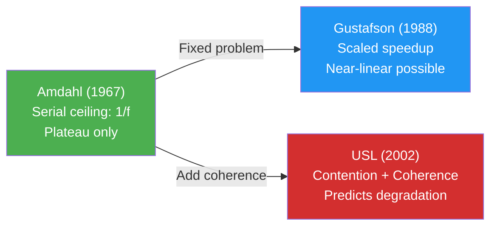

# Performance Measurement

Performance measurement connects three fundamental quantities — throughput, response time, and concurrency — through operational laws derived from observable parameters. This page covers the mathematical foundations that underpin all performance analysis, from Little's Law through queuing theory to scalability modeling.

---

## Operational Analysis

Operational analysis evaluates system performance using **measured parameters** and established mathematical relationships, without requiring assumptions about probability distributions .

### Observed vs Derived Parameters

| Type | Parameter | Symbol | Definition |
|------|-----------|--------|-----------|
| **Observed** | Arrivals | A | Total requests entering the system |
| **Observed** | Completions | C | Total requests leaving the system |
| **Observed** | Busy time | B | Time the resource is not idle |
| **Observed** | Observation period | T | Duration of measurement |
| **Derived** | Throughput | X = C/T | Completions per unit time |
| **Derived** | Utilization | U = B/T | Fraction of time busy |
| **Derived** | Service time | S = B/C | Average time per completion |
| **Derived** | Arrival rate | &lambda; = A/T | Arrivals per unit time |

The key assumption is **job flow balance**: A &asymp; C over the observation period .

### The Six Operational Laws

Hillston formalizes six laws relating these parameters :

| Law | Formula | Meaning |
|-----|---------|---------|
| **Little's Law** | L = X &middot; W | Avg items = throughput &times; avg time in system |
| **Utilization Law** | U<sub>i</sub> = X &middot; D<sub>i</sub> | Utilization = throughput &times; service demand |
| **Service Demand Law** | D<sub>i</sub> = S<sub>i</sub> &middot; V<sub>i</sub> | Demand = service time &times; visit count |
| **Forced Flow Law** | X<sub>i</sub> = X &middot; V<sub>i</sub> | Resource throughput = system throughput &times; visits |
| **Residence Time Law** | W = &Sigma; W<sub>i</sub> &middot; V<sub>i</sub> | Total time = sum of weighted resource times |
| **Interactive Response Time** | R = L/X &minus; Z | Response time = residence time minus think time |

---

## Little's Law: L = &lambda;W

Little's Law is the single most important equation in performance analysis  :

> "The results are remarkably free of specific assumptions about arrival and service distributions, independence of interarrival times, number of channels, queue discipline, etc." — Little (1961) 

### Proof Intuition (Sample Path)

The 2008 proof by Little and Graves uses a geometric argument :

1. Plot cumulative arrivals A(t) and departures D(t) over time
2. The area between the two curves can be computed two ways:
   - Integrating the number of items over time: L &times; T
   - Summing individual wait times: N &times; W
3. Since both describe the same area: L = (N/T) &times; W = &lambda;W

### Practical Examples

| System | Known Values | Derived |
|--------|-------------|---------|
| Wine cellar | L=160 bottles, &lambda;=96/yr | W = 160/96 = **1.67 years** |
| Semiconductor fab | &lambda;=1000 wafers/day, L=45000 WIP | W = 45000/1000 = **45 days** |
| Hospital ward | &lambda;=5 births/day, W=2.5 days | L = 5&times;2.5 = **12.5 beds** |

---

## Non-Normal Distributions: Why Percentiles Beat Averages

Performance data is **fundamentally non-normal** with long right tails  :

> "Operational analysis leverages statistical means, or averages. This provides both strength and weakness. The weakness comes in the form of loss of information and the fact that means are influenced by outliers." — Wilson (2008) 

### The Problem with Averages

A system with mean response time of 1 second could mean:
- **Good**: All requests between 0.8s and 1.2s (low variance)
- **Terrible**: 90% at 0.5s, 10% at 5.5s (high variance, same mean)

Jain warns: "An average response time of 1 second with a range of 0.5 to 1.5 is very different from an average of 1 second with a range of 0.1 to 10" .

### Percentile Guidelines

| Metric | Use Case |
|--------|---------|
| **p50 (median)** | Typical user experience |
| **p90** | "What most users actually perceive"  |
| **p99** | Tail latency — important for SLAs |
| **p99.9** | Critical for large-scale systems  |

Wilson recommends the **90th percentile** over the mean as the primary reporting metric, and identifies practical thresholds :

| Resource | Bottleneck Threshold |
|----------|---------------------|
| CPU utilization | >70% average or queue >2/processor |
| Disk utilization | >20% |
| Performance change | <10% may be noise, not real improvement |

### The Rule of 8

Human productivity drops dramatically when system response times exceed **8 seconds**  . Users lose their train of thought, context-switch to other tasks, or abandon the interaction entirely.

---

## Queuing Theory: The Hockey Stick Curve

When utilization increases, response time follows a characteristic **hockey stick** shape — flat at low load, then climbing exponentially :

```vega-lite
{
  "$schema": "https://vega.github.io/schema/vega-lite/v5.json",
  "title": {"text": "Response Time vs Utilization (M/M/1)", "fontSize": 14},
  "width": 450,
  "height": 280,
  "data": {
    "values": [
      {"u": 0.05, "rt": 1.05}, {"u": 0.10, "rt": 1.11}, {"u": 0.15, "rt": 1.18},
      {"u": 0.20, "rt": 1.25}, {"u": 0.25, "rt": 1.33}, {"u": 0.30, "rt": 1.43},
      {"u": 0.35, "rt": 1.54}, {"u": 0.40, "rt": 1.67}, {"u": 0.45, "rt": 1.82},
      {"u": 0.50, "rt": 2.00}, {"u": 0.55, "rt": 2.22}, {"u": 0.60, "rt": 2.50},
      {"u": 0.65, "rt": 2.86}, {"u": 0.70, "rt": 3.33}, {"u": 0.75, "rt": 4.00},
      {"u": 0.80, "rt": 5.00}, {"u": 0.85, "rt": 6.67}, {"u": 0.90, "rt": 10.0},
      {"u": 0.95, "rt": 20.0}
    ]
  },
  "layer": [
    {
      "mark": {"type": "line", "strokeWidth": 3, "interpolate": "monotone"},
      "encoding": {
        "x": {"field": "u", "type": "quantitative", "title": "Utilization (%)", "scale": {"domain": [0, 1]}, "axis": {"format": ".0%"}},
        "y": {"field": "rt", "type": "quantitative", "title": "Response Time (× service time)", "scale": {"domain": [0, 22]}},
        "color": {"value": "#d32f2f"}
      }
    },
    {
      "data": {"values": [{"u": 0.80, "rt": 5.0}]},
      "mark": {"type": "point", "size": 120, "filled": true},
      "encoding": {
        "x": {"field": "u", "type": "quantitative"},
        "y": {"field": "rt", "type": "quantitative"},
        "color": {"value": "#FF9800"}
      }
    },
    {
      "data": {"values": [{"u": 0.82, "rt": 7.0, "label": "← 80% \"elbow\""}]},
      "mark": {"type": "text", "fontSize": 12, "align": "left", "fontWeight": "bold"},
      "encoding": {
        "x": {"field": "u", "type": "quantitative"},
        "y": {"field": "rt", "type": "quantitative"},
        "text": {"field": "label"},
        "color": {"value": "#FF9800"}
      }
    }
  ],
  "config": {"font": "Tahoma, sans-serif", "view": {"stroke": null}}
}
```

The formula for M/M/1 response time: **R = S / (1 &minus; U)** where S is service time and U is utilization .

### The Three-Zone Conceptual Model

Haines (2006) presents a complementary conceptual view showing three metrics simultaneously :

| Zone | Utilization (U) | Throughput (X) | Response Time (R) |
|------|-----------------|----------------|-------------------|
| **Light Load** | Rising linearly | Rising linearly | Flat, near-minimal |
| **Heavy Load** | Saturated (~100%) | Plateau (max throughput) | Starting to climb |
| **Buckle Zone** | Stays at 100% | **Falling** (resource thrashing) | **Explodes** exponentially |

The boundaries shift right with faster/more CPUs. The mathematical M/M/1 chart above shows the R curve in isolation; the three-zone model shows how all three metrics interact under increasing load.

### Key Queuing Insights

| Concept | Implication |
|---------|------------|
| **The "elbow"** | ~80% utilization — response time degrades sharply  |
| **1&times;M/M/4 vs 4&times;M/M/1** | Single queue, multiple servers always outperforms multiple independent queues  |
| **Faster CPUs** | Shift curve down and to the right |
| **More CPUs** | Shift curve to the right only |
| **More arrivals** | Slide along the existing curve (no shift) |

### Kendall's Notation

Queuing systems are described as **A/B/m** where A = arrival distribution, B = service distribution, m = number of servers :

| Symbol | Meaning |
|--------|---------|
| M | Markovian (exponential, memoryless) |
| D | Deterministic (constant) |
| G | General (any distribution) |

Example: M/M/4 = Poisson arrivals, exponential service, 4 servers.

---

## Bottleneck Analysis

The **bottleneck resource** has the greatest service demand D<sub>max</sub> = max{D<sub>i</sub>} . It limits the entire system because it reaches 100% utilization first.

### Asymptotic Bounds

| Bound | Formula | Interpretation |
|-------|---------|---------------|
| Throughput upper bound | X &le; min{1/D<sub>max</sub>, N/(D+Z)} | Can't exceed bottleneck capacity |
| Response time lower bound | R &ge; max{D, N&middot;D<sub>max</sub> &minus; Z} | Can't be faster than total service demand |

The **balanced system** principle: maximum scalable performance is achieved when all resources have equal utilization . An unbalanced system wastes capacity on non-bottleneck resources.

---

## Scalability Laws

Three laws form a progression of realism for modeling how systems scale:

### Amdahl's Law (1967)

**S(N) = 1 / (f + (1&minus;f)/N)** 

Where f is the serial fraction of work. The ceiling is **1/f** — with 40% serial overhead (&alpha;&asymp;0.4), maximum speedup is only 2.5&times; regardless of how many processors you add .

### Gustafson's Law (1988)

**S = N + (1&minus;N) &times; s** 

Gustafson's key insight: real users **scale problem size** with processor count, not problem time. On 1024 processors, Gustafson measured 1016–1021&times; speedup — near-linear scaling because the parallel portion grew with capacity .

### Universal Scalability Law (2002)

**S(N) = N / [1 + &alpha;(N&minus;1) + &beta;N(N&minus;1)]** 

The USL extends Amdahl by adding **coherence** costs:

| Parameter | Physical Meaning | Example |
|-----------|-----------------|---------|
| **&alpha; (contention)** | Waiting for shared resources | Database locks, bus contention |
| **&beta; (coherence)** | Maintaining global consistency | Cache invalidation, distributed sync |

When &beta;=0, USL reduces to Amdahl's Law. When &beta;>0, the system **degrades beyond a peak** — retrograde throughput . This is critical for distributed systems where coherence costs grow quadratically.



### Practical USL Application

Gunther shows that as few as **4 load test data points** suffice to determine &alpha; and &beta; via regression and predict the full scalability curve . The capacity doubling time is T<sub>double</sub> = ln(2)/&lambda; .

---

## Model Validation

Jain provides acceptance criteria for analytical model accuracy :

| Prediction Target | Acceptable Error |
|-------------------|-----------------|
| Resource utilization | Within 10% |
| System throughput | Within 10% |
| Response time | Within 30% |

The higher tolerance for response time reflects the compounding of errors from multiple resource predictions. Wilson adds: changes of less than 10% may represent intrinsic fluctuation rather than real improvement .

---

### References



---

{: .highlight }
**Disclaimer:** AI is used for text summarization, polishing and explaining. Authors have verified all facts and claims. In case of an error, feel free to file an issue.
