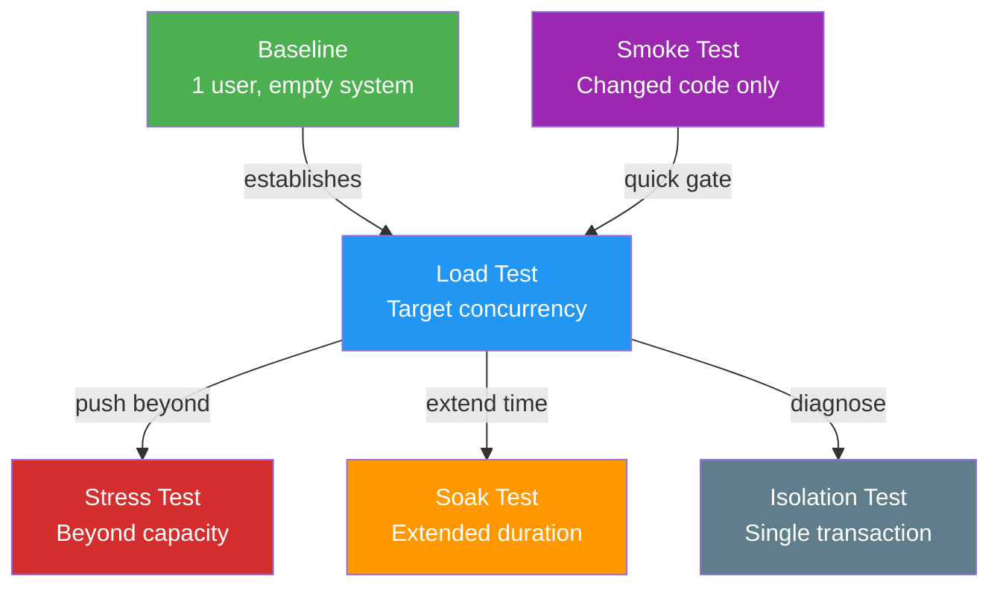

# Performance Testing

Performance testing validates that software meets its timeliness requirements under realistic workloads. Unlike functional testing — which checks correctness — performance testing checks whether "correct answers" arrive fast enough to be useful .

> "Testing for performance is not given the consideration that its importance deserves as part of the application's entire life cycle." — Molyneaux (2009) 

---

## Testing Maturity Model

Molyneaux defines three maturity levels :

| Level | Name | Approach | Defect Escape Rate |
|-------|------|----------|-------------------|
| 1 | **Firefighting** | React to production incidents | High (unknown) |
| 2 | **Performance Validation** | Test before release | ~30% |
| 3 | **Performance Driven** | Engineer throughout lifecycle | ~5% |

Moving from level 2 to level 3 — integrating performance awareness from requirements through deployment — reduces production defect escape by **6&times;**.

---

## Six Types of Performance Tests

Each test type serves a distinct purpose :

| Type | Purpose | When to Use |
|------|---------|-------------|
| **Baseline** | Single user, empty system — establish comparison point | Before any load testing |
| **Load** | Target concurrency to verify SLA compliance | Every release |
| **Stress** | Overwhelm resources to find the "buckle point" | Capacity planning |
| **Soak / Stability** | Extended duration to reveal memory leaks and slow degradation | Before production |
| **Smoke** | Quick check of changed code only | After each build |
| **Isolation** | Repeated execution of specific transactions | Diagnosing known issues |

### Test Types Mapped to Goals

---

## The Testing Process

Multiple frameworks converge on a structured multi-phase approach:

### Liu's 8-Step Process



1. **Workload design** — Define from customer requirements / SLAs
2. **Script/tool development** — Create automated drivers
3. **Hardware selection** — 2–4&times; QA system capacity
4. **Environment setup** — Realistic data volumes
5. **Procedure definition** — Repeatable (server restart protocols, warm-up)
6. **Baseline establishment** — Optimal configuration as yardstick
7. **Bottleneck analysis** — Queuing theory + performance counters
8. **Optimization/tuning** — Remove identified bottlenecks

### Jiang's 3-Phase Framework

A survey of 147 papers identifies three fundamental phases :

| Phase | Activities | Techniques |
|-------|-----------|------------|
| **Load Design** | Define workload: realistic vs fault-inducing | Markov chains, UML diagrams, genetic algorithms |
| **Execution** | Drive workload against system | HP LoadRunner, JMeter, WebLoad, emulation |
| **Analysis** | Evaluate recorded behavior | Threshold verification, pattern matching, anomaly detection |

### Execution Phases (Everett)

Each individual test run follows three phases :

1. **Ramp-up to peak** — Stagger user sessions; often reveals memory/thread allocation issues
2. **Measurement at peak** — Timing under full planned workload
3. **Ramp-down from peak** — Verify correct resource release

{: .warning }
> Many systems fail during **ramp-up**, not at peak. Resource allocation (memory, threads) is often more taxing than steady-state transaction processing .

---

## Workload Design

### Key Principles

- The number of key transactions rarely exceeds **20** 
- Focus on **workloads and frequencies**, not individual input values 
- Measure **active users** (open sessions), not concurrent users (simultaneous requests) 
- Add **10% safety margin** above go-live concurrency target 

### The 93% Concentration Rule

Weyuker found that 93% of performance-related project-affecting issues were concentrated in the **weakest 30%** of systems identified during architecture reviews . This suggests targeted testing guided by early risk assessment is more effective than uniform coverage.

### Workload Mixing

Running transactions in isolation can miss critical problems. Mixing transaction groups reveals resource interference — such as memory leaks from one module affecting another's execution space .

---

## KPI Framework

Molyneaux divides performance indicators into two categories :

| Category | Metrics | Focus |
|----------|---------|-------|
| **Service-oriented** | Availability, Response Time | What users experience |
| **Efficiency-oriented** | Throughput, Utilization | How resources are consumed |

### Monitoring Layers

| Layer | Examples | Granularity |
|-------|---------|-------------|
| **Generic** | CPU utilization, memory, disk I/O | System-level |
| **Technology-specific** | Web server, app server, DB metrics | Middleware |
| **Application internal** | Component, method-level timing | Code-level |

### Requirements Format

State requirements as **maximum response time**, not averages :

| Bad | Good |
|-----|------|
| "Average response time < 2s" | "95th percentile response time < 3s" |
| "System handles 1000 users" | "1000 active users with p99 < 5s" |

---

## Diagnostic Workflow

When performance issues are detected, Subraya prescribes a 4-phase diagnostic loop :

1. **Initial diagnosis** — Top-level tools (iostat, sar, uptime)
2. **Problem isolation** — Categorize: CPU, I/O, Paging, or Network
3. **Deep probing** — Specific tools (profilers, filemon, svmon)
4. **Remediation** — Targeted fix, then re-test

### Monitoring Intervals

| Test Duration | Sampling Interval |
|--------------|-------------------|
| Short tests | 20 seconds |
| Routine monitoring | 15 minutes |
| Tests > 8 hours | 300 seconds |

Balance detail against log file size and monitoring overhead .

---

## Automated Analysis

### Performance Signatures (Malik et al.)

Load tests of large-scale systems generate terabytes of data. Malik et al. introduce **performance signatures** — a minimal set of counters capturing essential system characteristics :

| Technique | Precision | Recall | Type |
|-----------|-----------|--------|------|
| Random Sampling | Low | Low | Unsupervised |
| K-Means Clustering | Medium | Medium | Unsupervised |
| PCA | 81% | 84% | Unsupervised |
| **WRAPPER (GA + Logistic Regression)** | **95%** | **94%** | Supervised |

The WRAPPER approach reduces thousands of counters to **5–20** (up to 89% reduction) while maintaining 95% precision in detecting deviations .

---

## Effort Guidelines

| Activity | Guideline |
|----------|-----------|
| Scripting | ~0.5 day per transaction  |
| Test execution minimum | 5 days  |
| PE investment | 1–5% of total project cost  |
| Key transactions | Rarely >20 per system  |

---

## Performance Bug Characteristics

Understanding how performance bugs behave helps design better tests:

| Characteristic | Value | Source |
|---------------|-------|--------|
| Root cause: wrong workload/API understanding | 67% |  |
| Bugs in input-dependent loops | >75% |  |
| Discovered by code reasoning (not profiling) | 33–57% |  |
| Reports without reproduction steps | 54–73% |  |
| Reports with measurements (CPU, I/O) | 34–36% |  |
| Performance regressions vs non-perf (Chrome) | 7&times; more frequent |  |

{: .note }
> Profiling finds only 5–10% of performance bugs . **Code reasoning** — reading and thinking about code — is the primary discovery method. Testing strategies should include code review focused on performance patterns, not just runtime measurement.

---

### References



---

{: .highlight }
**Disclaimer:** AI is used for text summarization, polishing and explaining. Authors have verified all facts and claims. In case of an error, feel free to file an issue.
