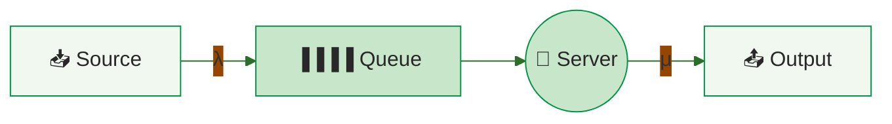
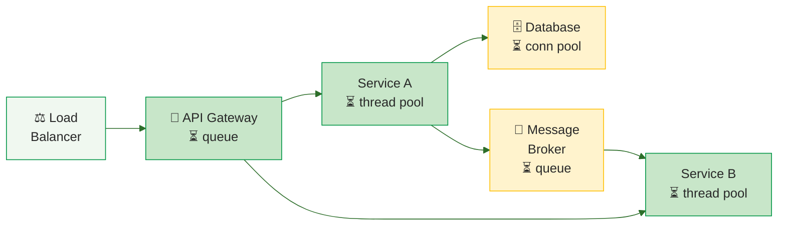
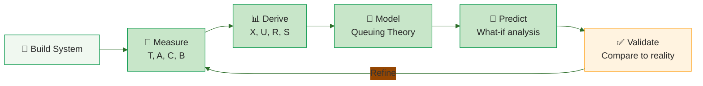

# Study Notes: Performance Analysis — Queuing Theory

## Purpose
These study notes cover **queuing theory as a performance engineering tool** — how to model systems as queues, measure their behavior, and predict performance using operational laws. Aimed at MS-level students who need to apply these techniques to diagnose bottlenecks, size systems, and reason about response time under load.

**Primary Sources:**
- Denning & Buzen 1978, "The Operational Analysis of Queueing Network Models" 
- Menascé et al. 2004, "Performance by Design" 

**Key Research Papers:**
- Little 1961  — proof of L = λW, the most fundamental queuing law
- Kendall 1953  — standard A/B/C/K/m/Z queue classification
- Dean & Barroso 2013  — tail latency amplification in distributed systems
- Gunther 2007  — practical capacity planning with operational laws

---

## Part 1: Why Queues Matter

### 1.1 Why Queues Form

Queues are **economically inevitable**: infinite capacity is infinitely expensive, and even "excess" capacity gets overwhelmed by variability. The key insight is that **variability, not average load**, causes queuing.

**Deterministic vs Stochastic:**

| System | Interarrival | Service | Queue? |
|--------|-------------|---------|--------|
| Deterministic | Fixed 1 min | Fixed 1 min | Never — always exactly 1 in system |
| Stochastic | {0.5, 1.5} min | {0.5, 1.5} min | Peaks at 3 despite same average rate |

Both systems have identical average rates (λ = μ), but the stochastic system queues because temporary bursts of arrivals outpace service.

```vega-lite
{
  "$schema": "https://vega.github.io/schema/vega-lite/v5.json",
  "width": 420, "height": 200,
  "title": {"text": "Deterministic Queue", "fontSize": 16},
  "layer": [
    {"data": {"values": [{"time": 0, "count": 0}, {"time": 1, "count": 1}, {"time": 8, "count": 1}]},
     "mark": {"type": "area", "interpolate": "step-after", "opacity": 0.2, "color": "#4caf50"}},
    {"data": {"values": [{"time": 0, "count": 0}, {"time": 1, "count": 1}, {"time": 8, "count": 1}]},
     "mark": {"type": "line", "interpolate": "step-after", "strokeWidth": 2.5, "color": "#2e7d32"}}
  ],
  "encoding": {
    "x": {"field": "time", "type": "quantitative", "scale": {"domain": [0, 8]}, "axis": {"title": "Time (min)", "grid": false}},
    "y": {"field": "count", "type": "quantitative", "scale": {"domain": [0, 4]}, "axis": {"title": "Customers in system", "tickMinStep": 1}}
  },
  "config": {"font": "Tahoma, sans-serif", "view": {"stroke": null}}
}
```

```vega-lite
{
  "$schema": "https://vega.github.io/schema/vega-lite/v5.json",
  "width": 420, "height": 200,
  "title": {"text": "Stochastic Queue", "fontSize": 16},
  "layer": [
    {"data": {"values": [
      {"time": 0, "count": 0}, {"time": 0.5, "count": 1}, {"time": 2.0, "count": 0},
      {"time": 2.5, "count": 1}, {"time": 3.0, "count": 2}, {"time": 3.5, "count": 3},
      {"time": 4.0, "count": 2}, {"time": 4.5, "count": 3}, {"time": 5.5, "count": 2},
      {"time": 6.0, "count": 1}, {"time": 7.0, "count": 2}, {"time": 7.5, "count": 1}, {"time": 8.0, "count": 0}
    ]}, "mark": {"type": "area", "interpolate": "step-after", "opacity": 0.2, "color": "#4caf50"}},
    {"data": {"values": [
      {"time": 0, "count": 0}, {"time": 0.5, "count": 1}, {"time": 2.0, "count": 0},
      {"time": 2.5, "count": 1}, {"time": 3.0, "count": 2}, {"time": 3.5, "count": 3},
      {"time": 4.0, "count": 2}, {"time": 4.5, "count": 3}, {"time": 5.5, "count": 2},
      {"time": 6.0, "count": 1}, {"time": 7.0, "count": 2}, {"time": 7.5, "count": 1}, {"time": 8.0, "count": 0}
    ]}, "mark": {"type": "line", "interpolate": "step-after", "strokeWidth": 2.5, "color": "#2e7d32"}}
  ],
  "encoding": {
    "x": {"field": "time", "type": "quantitative", "scale": {"domain": [0, 8]}, "axis": {"title": "Time (min)", "grid": false}},
    "y": {"field": "count", "type": "quantitative", "scale": {"domain": [0, 4]}, "axis": {"title": "Customers in system", "tickMinStep": 1}}
  },
  "config": {"font": "Tahoma, sans-serif", "view": {"stroke": null}}
}
```

### 1.2 What Queuing Theory Predicts

Queuing theory answers six practical questions **without running experiments**:

| Question | Application |
|----------|-------------|
| Average waiting time? | User experience |
| Where is the bottleneck? | Diagnose slowdowns |
| Server utilization? | Resource planning |
| Response time under load? | SLA compliance |
| When to add servers? | Capacity planning |
| Which design is better? | Compare alternatives |

---

## Part 2: Modeling Systems as Queues

### 2.1 Queue Parameters: λ, μ, ρ, c



Every queue has four fundamental parameters:

| Parameter | Symbol | Meaning | Example |
|-----------|--------|---------|---------|
| Arrival rate | λ (lambda) | Requests per time unit | 30 req/sec |
| Service rate | μ (mu) | Completions per time unit | 40 req/sec |
| Utilization | ρ (rho) | Fraction busy = λ/μ | 75% |
| Servers | c | Number of parallel servers | 4 threads |

**Stability condition:** ρ < 1 (or λ < cμ for multi-server). If ρ ≥ 1, the queue grows without bound.

**Rule of thumb:** Stay below 75% utilization for stable, predictable performance .

### 2.2 Queue Configurations

| Configuration | Description | Real-world Example |
|--------------|-------------|-------------------|
| Single queue, single server (1Q1S) | Basic M/M/1 | Single-threaded handler |
| Single queue, multiple servers (1QMS) | M/M/c | Thread pool serving from one queue |
| Multiple prioritized queues, single server (MQ1S) | Priority scheduling | CPU nice levels, HTTP priority classes |
| Multiple prioritized queues, multiple servers (MQMS) | Most general case | Load balancer with priority routing |

### 2.3 Open vs Closed Networks

| Property | Open Network | Closed Network |
|----------|-------------|---------------|
| Population | Unlimited external arrivals | Fixed N users recirculate |
| Arrival rate | External λ | Determined by N, R, and Z |
| Example | Public API | Moodle exam with 15 students |
| Key law | Little's Law | Interactive Response Time Law |

### 2.4 Kendall Notation: A/B/C/K/m/Z

Kendall notation  provides a compact way to describe any queue:

| Position | Symbol | Meaning | Common Values |
|----------|--------|---------|---------------|
| 1st | A | Interarrival distribution | M, D, G |
| 2nd | B | Service time distribution | M, D, G |
| 3rd | C | Number of servers | 1, 2, ... |
| 4th | K | System capacity | ∞ or finite |
| 5th | m | Population size | ∞ or finite |
| 6th | Z | Service discipline | FIFO, LIFO, Priority |

**M** = Exponential (Markov/memoryless), **D** = Deterministic, **G** = General

**Common types in software:**

| Notation | Software Example |
|----------|-----------------|
| M/M/1 | Single-threaded handler |
| M/M/c | Thread pool (c workers) |
| M/D/1 | Fixed-time batch processor |
| M/G/m/m+r | Cloud VM pool (m VMs, r buffer) |
| M/M/1/∞/N | Closed system with N users |

### 2.5 Choosing the Right Method

| Method | When to Use | Assumptions |
|--------|-------------|-------------|
| **Operational Analysis** | Have measurement data | Flow balance, homogeneity |
| **Mean Value Analysis** | Closed networks, known demands | Product-form network |
| **Simulation** | Complex routing, priorities, finite buffers | None (but slow) |

This lecture focuses on **operational analysis**  — deriving metrics from observable quantities with no distribution assumptions.

---

## Part 3: Measure, Don't Guess

### 3.1 Operational Analysis vs Traditional Queuing Theory

| Aspect | Traditional QT | Operational Analysis |
|--------|---------------|---------------------|
| Input | Assumed distributions (Poisson, exponential) | Measured event counts |
| Assumptions | Hard to verify | Testable: check A ≈ C |
| Math | Probability theory, Markov chains | Simple arithmetic |
| Output | Exact formulas | Observation-based metrics |

The foundational insight from Denning & Buzen : operational laws are **tautologies** — they hold for every observation period by definition, because they are counting identities, not probabilistic claims.

### 3.2 Five Counters: T, A, C, W, B

Every performance metric is derived from just **five observable counters**:

| Counter | What it measures | How to collect |
|---------|-----------------|----------------|
| **T** | Observation time | Clock |
| **A** | Arrivals (total) | HTTP logs, LB counters |
| **C** | Completions (total) | HTTP logs, LB counters |
| **W** | Time in system (sum) | APM traces (Jaeger, Datadog) |
| **B** | Busy time | Prometheus, `sar`, perfmon |

### 3.3 Six Derived Metrics

From the five counters, derive six performance metrics:

| Metric | Formula | Meaning |
|--------|---------|---------|
| **N** | W / T | Average number in system |
| **λ** | A / T | Arrival rate |
| **X** | C / T | Throughput (completion rate) |
| **S** | B / C | Service time per request |
| **R** | W / C | Response time per request |
| **U** | B / T | Utilization |

**Consistency check:** If A ≈ C over the observation period (flow balance), then λ ≈ X.

### 3.4 Three Testable Assumptions

Operational analysis requires three assumptions :

| Assumption | Meaning | How to Test | When It Breaks |
|------------|---------|-------------|----------------|
| **Flow balance** | A ≈ C over observation | Check A ≈ C | Server crashes: A=500, C=480 |
| **One-step behavior** | No simultaneous events | System design | Batch upload: 50 requests at same ms |
| **Homogeneity** | Rates independent of state | Statistical test | DB cache thrashing under load |

**Practical guidance:** Make the observation period 10–100× the average busy period to ensure flow balance holds.

---

## Part 4: The Five Laws

### 4.1 Little's Law: N = X × R

The most fundamental law in queuing theory :

**N = X × R**

- **N** = average number of requests in system
- **X** = throughput (completions per time unit)
- **R** = average response time

```vega-lite
{
  "$schema": "https://vega.github.io/schema/vega-lite/v5.json",
  "width": 450, "height": 300,
  "title": {"text": "Cumulative Arrivals a(t) and Completions d(t)", "subtitle": "Shaded area H = accumulated time in system. N = H/T, R = H/C, X = C/T → N = X × R", "subtitleFontSize": 11, "subtitleColor": "#666"},
  "layer": [
    {"data": {"values": [
      {"time": 0, "arrivals": 0, "completions": 0}, {"time": 0, "arrivals": 1, "completions": 0},
      {"time": 3, "arrivals": 2, "completions": 0}, {"time": 5, "arrivals": 3, "completions": 0},
      {"time": 8, "arrivals": 3, "completions": 1}, {"time": 11, "arrivals": 3, "completions": 2},
      {"time": 12, "arrivals": 3, "completions": 3}, {"time": 18, "arrivals": 4, "completions": 3},
      {"time": 19, "arrivals": 5, "completions": 3}, {"time": 23, "arrivals": 5, "completions": 4},
      {"time": 26, "arrivals": 5, "completions": 5}, {"time": 27, "arrivals": 6, "completions": 5},
      {"time": 30, "arrivals": 7, "completions": 6}, {"time": 33, "arrivals": 8, "completions": 6},
      {"time": 35, "arrivals": 9, "completions": 6}, {"time": 36, "arrivals": 9, "completions": 7},
      {"time": 38, "arrivals": 9, "completions": 8}, {"time": 40, "arrivals": 10, "completions": 8},
      {"time": 41, "arrivals": 10, "completions": 9}, {"time": 45, "arrivals": 10, "completions": 10},
      {"time": 50, "arrivals": 10, "completions": 10}
    ]}, "mark": {"type": "area", "interpolate": "step-after", "opacity": 0.3, "color": "#1976d2"},
     "encoding": {"x": {"field": "time", "type": "quantitative"}, "y": {"field": "arrivals", "type": "quantitative"}, "y2": {"field": "completions"}}},
    {"data": {"values": [
      {"time": 0, "value": 0}, {"time": 0, "value": 1}, {"time": 3, "value": 2}, {"time": 5, "value": 3},
      {"time": 18, "value": 4}, {"time": 19, "value": 5}, {"time": 27, "value": 6}, {"time": 30, "value": 7},
      {"time": 33, "value": 8}, {"time": 35, "value": 9}, {"time": 40, "value": 10}, {"time": 50, "value": 10}
    ]}, "mark": {"type": "line", "interpolate": "step-after", "strokeWidth": 2.5, "color": "#1565c0"}},
    {"data": {"values": [
      {"time": 0, "value": 0}, {"time": 8, "value": 1}, {"time": 11, "value": 2}, {"time": 12, "value": 3},
      {"time": 23, "value": 4}, {"time": 26, "value": 5}, {"time": 30, "value": 6}, {"time": 36, "value": 7},
      {"time": 38, "value": 8}, {"time": 41, "value": 9}, {"time": 45, "value": 10}, {"time": 50, "value": 10}
    ]}, "mark": {"type": "line", "interpolate": "step-after", "strokeWidth": 2.5, "color": "#c62828"}},
    {"data": {"values": [{"time": 48, "value": 10, "label": "a(t) = arrivals"}]},
     "mark": {"type": "text", "align": "left", "dx": 5, "fontSize": 13, "fontWeight": "bold", "color": "#1565c0"},
     "encoding": {"x": {"field": "time", "type": "quantitative"}, "y": {"field": "value", "type": "quantitative"}, "text": {"field": "label", "type": "nominal"}}},
    {"data": {"values": [{"time": 48, "value": 9.2, "label": "d(t) = completions"}]},
     "mark": {"type": "text", "align": "left", "dx": 5, "fontSize": 13, "fontWeight": "bold", "color": "#c62828"},
     "encoding": {"x": {"field": "time", "type": "quantitative"}, "y": {"field": "value", "type": "quantitative"}, "text": {"field": "label", "type": "nominal"}}}
  ],
  "encoding": {
    "x": {"field": "time", "type": "quantitative", "scale": {"domain": [0, 55]}, "axis": {"title": "time", "grid": false}},
    "y": {"field": "value", "type": "quantitative", "scale": {"domain": [0, 11]}, "axis": {"title": "units", "tickMinStep": 1}}
  },
  "config": {"font": "Tahoma, sans-serif", "view": {"stroke": null}}
}
```

N = X × R holds regardless of system type, number of servers, arrival or service distributions, or queue discipline. The only requirement is **flow balance**.

Little's Law is a **consistency check**: if N ≠ X × R from your measurements, the measurements are wrong — not the law.

### 4.2 Utilization Law: U = X × D

**U = X × D**

- **U** = utilization (fraction of time busy)
- **X** = throughput
- **D** = service demand (total time a transaction needs from this resource)

For **m parallel servers:** U = X × D / m

### 4.3 Service Demand Law: D = V × S

**D = V × S**

- **D** = service demand (total time per transaction at a resource)
- **V** = visit count (how many times a transaction visits this resource)
- **S** = service time per visit

Service demand D is the **single most important derived parameter** — it determines bottlenecks, drives capacity predictions, and connects measurements to models .

### 4.4 Bottleneck Analysis via D_max

The **bottleneck** is the resource with the highest service demand:

**X_max = 1 / D_max**

### 4.5 Forced Flow Law: Xₖ = Vₖ × X

**Xₖ = Vₖ × X**

- **Xₖ** = throughput at resource k
- **Vₖ** = visit ratio (visits to resource k per system transaction)
- **X** = system throughput

---

## Part 5: Response Time Under Load

### 5.1 Hockey Stick Curve: R = S/(1 − ρ)

For an M/M/1 queue, response time depends non-linearly on utilization:

**R = S / (1 − ρ)**

```vega-lite
{
  "$schema": "https://vega.github.io/schema/vega-lite/v5.json",
  "width": 500, "height": 280,
  "title": {"text": "The Hockey Stick Curve (M/M/1)", "subtitle": "R = S / (1 − ρ)", "subtitleFontSize": 12, "subtitleColor": "#666"},
  "data": {"sequence": {"start": 0.01, "stop": 0.99, "step": 0.01, "as": "u"}},
  "transform": [{"calculate": "1 / (1 - datum.u)", "as": "rt"}],
  "mark": {"type": "line", "strokeWidth": 3, "color": "#019546"},
  "encoding": {
    "x": {"field": "u", "type": "quantitative", "title": "Utilization (ρ)", "axis": {"format": "%"}},
    "y": {"field": "rt", "type": "quantitative", "title": "Response Time (× service time)", "scale": {"domain": [0, 25]}}
  },
  "config": {"font": "Tahoma, sans-serif", "view": {"stroke": null}}
}
```

| Utilization (ρ) | Response Time |
|-----------------|---------------|
| 50% | 2 × S |
| 75% | 4 × S |
| 90% | 10 × S |
| 99% | 100 × S |

Practical limit: keep utilization below 70–80%.

### 5.2 Tail Latency Amplification

In distributed systems, even rare slow responses become common :

**P(any slow) = 1 − (1 − p)^N**

| Servers (N) | P(any slow) if each has 1% chance |
|-------------|-----------------------------------|
| 1 | 1% |
| 10 | 10% |
| 100 | **63%** |

Report **p90/p99**, not averages. This is especially critical in microservice architectures where a single request fans out to many backends.

### 5.3 Interactive Response Time Law: R = M/X − Z

For **closed systems** with M users:

**R = M / X − Z**

Rearranged for capacity sizing: **M = X × (R + Z)**

### 5.4 Adding Servers: Diminishing Returns

Adding servers to an M/M/c queue shows diminishing returns :

| Servers (c) | Wait Time Reduction | Students Supported |
|-------------|--------------------|--------------------|
| 1 | baseline | ~15 |
| 2 | −60% | ~30 |
| 3 | −80% | ~45 |
| 4 | −90% | ~60 |

### 5.5 Architecture Patterns as Queues



| Architecture Pattern | Queue Model |
|---------------------|-------------|
| Thread pool | M/M/c |
| API gateway + backends | M/M/c with routing |
| K8s pod auto-scaling | M/G/m/m+r (dynamic m) |
| Message broker (Kafka) | M/G/1 with batch service |
| DB connection pool | M/M/c/c (finite, no buffer) |

Cloud auto-scaling is fundamentally adjusting m based on utilization .

---

## Part 6: From Theory to Practice

### 6.1 When to Simulate

Use simulation (e.g., Java Modelling Tools — JMT) when analytical models are insufficient:
- Complex routing logic
- Non-standard distributions
- Priority schemes
- Finite buffers

### 6.2 Performance Engineering Workflow



1. **Build** the system (or prototype)
2. **Measure** — collect counters: T, A, C, B
3. **Derive** — compute metrics: X, U, R, S
4. **Model** — apply queuing theory (Little's Law, Utilization Law)
5. **Predict** — what-if analysis (more users? faster DB?)
6. **Validate** — compare predictions to reality
7. **Refine** — go back to step 2 with improved instrumentation

---

### References



---

{: .highlight }
**Disclaimer:** AI is used for text summarization, polishing and explaining. Authors have verified all facts and claims. In case of an error, feel free to file an issue.
