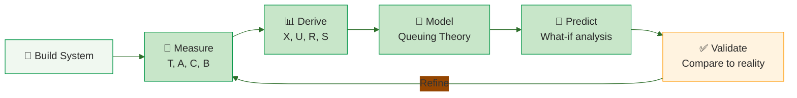
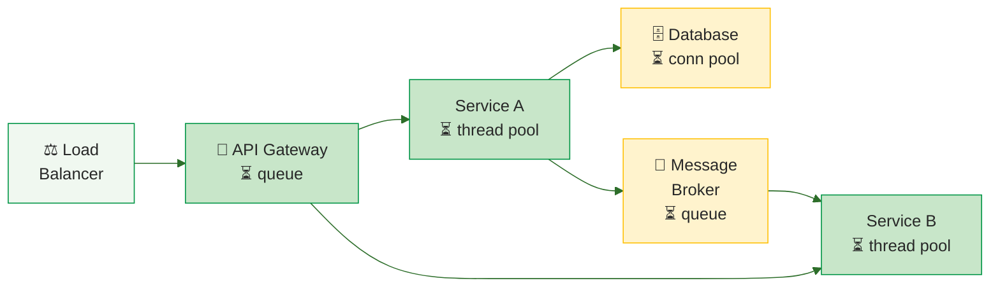

# Queuing Theory Applications

Queuing theory provides the analytical foundation for three critical software engineering practices: **capacity planning**, **cloud performance management**, and **tail latency mitigation**. This page covers how the models from [Queuing Models](models.md) are applied in practice.

---

## Capacity Planning

Capacity planning uses queuing models to answer: **when will the system fail under projected growth?** 

### The Capacity Planning Pipeline



1. **Measure** service demands at each resource (CPU, disk, network) using system counters
2. **Build** a queuing network model with measured service demands as input
3. **Solve** with MVA to find the bottleneck resource (largest D<sub>max</sub>) 
4. **Predict** scalability bounds using asymptotic analysis or USL 
5. **Compare** predicted capacity against projected demand growth

### Guerrilla Capacity Planning

Gunther advocates for lean, tactical methods rather than heavyweight simulation :

- **4 data points suffice** to fit the Universal Scalability Law (USL) and predict the entire scalability curve
- **Spreadsheet-based** analysis is often more practical than complex simulation tools
- **Capacity doubling** can be as short as 6 months in hypergrowth scenarios — faster than data center procurement cycles

The USL models throughput as a function of load with two parameters :

**X(N) = N / [1 + &alpha;(N&minus;1) + &beta;N(N&minus;1)]**

Where &alpha; represents contention (serialization overhead) and &beta; represents coherence (cross-node communication). The &beta; term predicts **retrograde throughput** — the point where adding more resources actually makes the system slower.

### The Balanced System Principle

For maximum scalability, all resources should reach saturation at approximately the same load level . An unbalanced system wastes capacity: if the database saturates at 100 users but the application server can handle 500, the application server capacity is wasted. The goal is to size resources so that service demands are as equal as possible.

---

## Cloud and Distributed Systems

### Cloud as a Queuing System

Cloud computing centers are naturally modeled as queuing systems where requests arrive, wait for VM allocation, receive service, and depart :

| Cloud Concept | Queuing Equivalent |
|---------------|-------------------|
| Incoming requests | Arrivals (&lambda;) |
| VM pool | Servers (m) |
| Request queue | Buffer (r) |
| Rejected requests | Blocking (queue full) |
| Auto-scaling | Adjusting m dynamically |

Khazaei et al. showed that the M/G/m/m+r model captures cloud behavior more accurately than M/M/m because task durations in cloud environments are **highly variable** — the coefficient of variation of service time has a major impact on blocking probability and response time .

### Auto-Scaling as Dynamic Capacity Planning

Cloud auto-scaling is essentially **real-time capacity planning** — adjusting the number of servers (m) based on queuing metrics:

| Metric | Scaling Signal | Queuing Basis |
|--------|---------------|---------------|
| CPU utilization > 70% | Scale out | Hockey stick curve threshold  |
| Queue length growing | Scale out | Little's Law: L increasing means W increasing |
| Request rejection rate > SLA | Scale out | Blocking probability from M/G/m/m+r |
| Utilization < 30% | Scale in | Overcapacity — wasting resources |

The challenge is that scaling decisions have **lag** (VM startup time, container scheduling) while queuing effects are immediate. This is why predictive scaling based on queuing models outperforms purely reactive threshold-based scaling.

---

## Tail Latency in Distributed Systems

### The Amplification Problem

Dean and Barroso showed that tail latency dominates in large-scale systems :

| Scenario | P(any server slow) |
|----------|-------------------|
| 1 server, 1% slow | 1% |
| 10 servers, 1% slow | 10% |
| 100 servers, 1% slow | **63%** |
| 2000 servers, 0.01% slow | **~18%** |

**Formula:** P(at least one slow) = 1 &minus; (1 &minus; p)<sup>N</sup>

This is a direct consequence of queuing theory: at high utilization, the **variance** of response time grows faster than the mean . Dobson and Shumsky confirmed that "virtually no one experiences the average" — waiting time distributions have long right tails .

### Tail-Tolerant Techniques

Since queuing theory cannot eliminate variability, Dean and Barroso propose **masking** it with redundancy :

| Technique | How It Works | Result |
|-----------|-------------|--------|
| **Hedged requests** | Send same request to multiple replicas, use first response | p99.9: 1800ms &rarr; 74ms (2% extra traffic) |
| **Tied requests** | Replicas communicate to cancel duplicate work | Median: &minus;21%, p99: &minus;38% (<1% overhead) |
| **Micro-partitioning** | 20 partitions per machine for granular load balancing | Reduces hot spots |

> "Just as fault-tolerant computing aims to create a reliable whole out of less-reliable parts, large online services need to create a predictably responsive whole out of less-predictable parts." — Dean & Barroso (2013) 

### Connecting Tails to Queuing Theory

```vega-lite
{
  "$schema": "https://vega.github.io/schema/vega-lite/v5.json",
  "width": 400,
  "height": 280,
  "title": {"text": "Response Time Distribution at 90% Utilization", "subtitle": "M/M/1 queue: mean = 10×S, but tail extends far beyond", "subtitleFontSize": 12, "subtitleColor": "#666"},
  "layer": [
    {
      "data": {"sequence": {"start": 0.1, "stop": 40, "step": 0.2, "as": "t"}},
      "transform": [{"calculate": "0.1 * exp(-0.1 * datum.t)", "as": "density"}],
      "mark": {"type": "area", "opacity": 0.3, "color": "#019546"},
      "encoding": {
        "x": {"field": "t", "type": "quantitative", "title": "Response Time (multiples of S)", "scale": {"domain": [0, 40]}},
        "y": {"field": "density", "type": "quantitative", "title": "Probability Density"}
      }
    },
    {
      "data": {"sequence": {"start": 0.1, "stop": 40, "step": 0.2, "as": "t"}},
      "transform": [{"calculate": "0.1 * exp(-0.1 * datum.t)", "as": "density"}],
      "mark": {"type": "line", "color": "#019546", "strokeWidth": 2},
      "encoding": {"x": {"field": "t", "type": "quantitative"}, "y": {"field": "density", "type": "quantitative"}}
    },
    {
      "data": {"sequence": {"start": 23, "stop": 40, "step": 0.2, "as": "t"}},
      "transform": [{"calculate": "0.1 * exp(-0.1 * datum.t)", "as": "density"}],
      "mark": {"type": "area", "opacity": 0.5, "color": "#d32f2f"},
      "encoding": {"x": {"field": "t", "type": "quantitative"}, "y": {"field": "density", "type": "quantitative"}}
    },
    {
      "data": {"values": [{"x": 10}]},
      "mark": {"type": "rule", "color": "#2D6E2A", "strokeWidth": 2, "strokeDash": [6, 4]},
      "encoding": {"x": {"field": "x", "type": "quantitative"}}
    },
    {
      "data": {"values": [{"x": 10, "label": "Mean (10×S)"}]},
      "mark": {"type": "text", "align": "left", "dx": 5, "dy": -120, "fontSize": 12, "color": "#2D6E2A", "fontWeight": "bold"},
      "encoding": {"x": {"field": "x", "type": "quantitative"}, "text": {"field": "label", "type": "nominal"}}
    },
    {
      "data": {"values": [{"x": 23}]},
      "mark": {"type": "rule", "color": "#d32f2f", "strokeWidth": 2, "strokeDash": [6, 4]},
      "encoding": {"x": {"field": "x", "type": "quantitative"}}
    },
    {
      "data": {"values": [{"x": 23, "label": "p90 (23×S)"}]},
      "mark": {"type": "text", "align": "left", "dx": 5, "dy": -120, "fontSize": 12, "color": "#d32f2f", "fontWeight": "bold"},
      "encoding": {"x": {"field": "x", "type": "quantitative"}, "text": {"field": "label", "type": "nominal"}}
    }
  ],
  "config": {"font": "Tahoma, sans-serif", "axis": {"labelFontSize": 12, "titleFontSize": 14}, "view": {"stroke": null}}
}
```

Tail latency is not a separate phenomenon — it is a **direct consequence of queuing at high utilization**. The M/M/1 response time formula R = S/(1-U) gives the mean, but the actual distribution is exponential with CDF:

P(R > t) = U &middot; e<sup>&minus;(1&minus;U)t/S</sup>

At U = 0.9, the probability of a response taking >10&times; service time is still 37%. This is why Wilson recommends reporting the **90th percentile** rather than the mean  and why modern SLOs are defined in terms of percentile targets.

---

## Simulation Tools

When analytical models become too complex (multiple job classes, priority queues, non-standard distributions), simulation provides an alternative:

| Tool | Type | Strengths |
|------|------|-----------|
| **JMT** (Java Modelling Tools) | Open source | Visual QN editor, MVA solver, simulation engine  |
| **PDQ** (Pretty Damn Quick) | Open source | Command-line MVA solver, minimal input required  |
| **SimPy** | Python library | General-purpose discrete event simulation |
| **CloudSim** | Java framework | Cloud-specific simulation (VM provisioning, scheduling) |

JMT is particularly well-suited for teaching because it provides both exact analytical solutions (MVA) and discrete-event simulation, allowing students to compare theoretical predictions with simulated results.

---

## Software Architecture as Queuing Network

Software architectures map naturally to queuing networks :



| Architecture Pattern | Queuing Model |
|---------------------|---------------|
| Single-tier monolith | M/M/1 or M/M/c |
| Three-tier web app | Open or closed QN with 3 centers |
| Microservices | QN with variable topology, finite buffers |
| Message broker (Kafka) | M/G/1 with batch service |
| Load balancer + backends | M/M/c with routing |
| Container orchestrator (K8s) | M/G/m/m+r with dynamic m |

Balsamo et al. showed that finite-capacity queuing networks with blocking mechanisms (BAS, BBS) are essential for modeling real software — where thread pools, connection pools, and container limits create **bounded queues** that reject or stall traffic .

The key insight for software architects: **every bounded resource is a queue**, and every queue has a hockey stick curve. Capacity planning means ensuring that no queue in the architecture reaches the steep part of its curve under projected load.

---

### References



---

{: .highlight }
**Disclaimer:** AI is used for text summarization, polishing and explaining. Authors have verified all facts and claims. In case of an error, feel free to file an issue.
