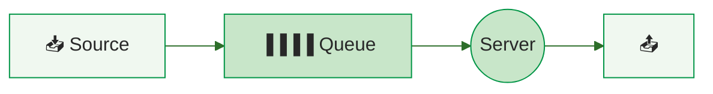
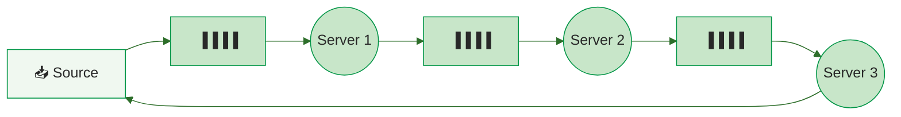

# Queuing Models

Queuing models predict **how response time, throughput, and queue length change as load increases**. They transform the [operational laws](operational-laws.md) from statements about averages into predictions about system behavior under varying workloads .

---

## Single-Queue Models

### M/M/1: The Foundational Model

The simplest useful model: Poisson arrivals (M), exponential service (M), one server (1) :



| Metric | Formula |
|--------|---------|
| **Response time** | R = S / (1 &minus; U) |
| **Queue length** | L = U / (1 &minus; U) |
| **Wait time** | W = R &minus; S = U &middot; S / (1 &minus; U) |

Where S is mean service time and U is utilization (&lambda;/&mu;). The key insight is the **1/(1-U) multiplier** — it creates the hockey stick curve :

- At U = 0.5: response time is 2&times; service time
- At U = 0.8: response time is 5&times; service time
- At U = 0.9: response time is 10&times; service time
- At U &rarr; 1.0: response time &rarr; &infin;

### M/M/c: Multiple Servers

When *c* parallel servers share a single queue (e.g., thread pool of size *c*), the model becomes M/M/c .

```mermaid
%%{init: {'theme': 'base', 'themeVariables': { 'primaryColor': '#019546', 'lineColor': '#2D6E2A'}}}%%
graph LR
    Src["📥 Source"] --> Q["▐▐▐▐ Queue"]
    Q --> S1(("Server 1"))
    Q --> S2(("Server 2"))
    Q --> Sn(("Server n"))

    style Src fill:#f0f8f0,stroke:#019546,color:#282828
    style Q fill:#c8e6c9,stroke:#019546,color:#282828
    style S1 fill:#c8e6c9,stroke:#019546,color:#282828
    style S2 fill:#c8e6c9,stroke:#019546,color:#282828
    style Sn fill:#c8e6c9,stroke:#019546,color:#282828
``` Multiple servers delay the hockey stick — a 4-server system can sustain higher total utilization before response time explodes:

| Servers (c) | Total utilization at 3&times; service time |
|-------------|-------------------------------------------|
| 1 | 67% |
| 2 | 80% |
| 4 | 88% |
| 8 | 93% |

The **Erlang C formula** gives the probability of waiting in an M/M/c queue and is widely used for staffing decisions (call centers, support teams) .

### M/G/m/m+r: General Service with Finite Buffer

For systems where service times are **not exponential** and queue capacity is **finite**, the M/G/m/m+r model captures realistic behavior :

- **G** (General service): task durations follow arbitrary distributions — critical for cloud workloads with high variability
- **m+r** (finite capacity): m servers processing + r positions in buffer; arrivals beyond capacity are **rejected** (blocking)

Khazaei et al. showed that using M/M/m instead of M/G/m significantly underestimates performance degradation when task durations are variable . The coefficient of variation of service time has a major impact on both response time and blocking probability.

---

## Queuing Networks

Real software systems are not single queues — they are **networks of interconnected queues** . A three-tier web application has at least three queuing centers (web, app, database), each with its own service demand.

### Open vs. Closed Networks

| Type | Population | Use Case | Solvability |
|------|-----------|----------|-------------|
| **Open** | Infinite (requests arrive from outside) | OLTP, API traffic | Analytically tractable  |
| **Closed** | Fixed (N users cycle through system) | Interactive users, batch jobs | Requires iterative solution (MVA) |

**Open network** — requests arrive from outside and exit after service:

```mermaid
%%{init: {'theme': 'base', 'themeVariables': { 'primaryColor': '#019546', 'lineColor': '#2D6E2A'}}}%%
graph LR
    Src["📥 Source"] --> Q1["▐▐▐▐"] --> S1(("Server 1")) --> Q2["▐▐▐▐"] --> S2(("Server 2")) --> Q3["▐▐▐▐"] --> S3(("Server 3")) --> Out["📤 Exit"]

    style Src fill:#f0f8f0,stroke:#019546,color:#282828
    style Q1 fill:#c8e6c9,stroke:#019546,color:#282828
    style Q2 fill:#c8e6c9,stroke:#019546,color:#282828
    style Q3 fill:#c8e6c9,stroke:#019546,color:#282828
    style S1 fill:#c8e6c9,stroke:#019546,color:#282828
    style S2 fill:#c8e6c9,stroke:#019546,color:#282828
    style S3 fill:#c8e6c9,stroke:#019546,color:#282828
    style Out fill:#f0f8f0,stroke:#019546,color:#282828
```

**Closed network** — fixed population recirculates through the system:



Open networks are simpler for back-of-the-envelope calculations. Closed networks model the **think time** between requests and the feedback effect where slow responses reduce the arrival rate .

### Finite Capacity Networks

When queues have bounded sizes (thread pools, connection limits, container memory), **blocking** occurs — requests are rejected or stalled when a downstream queue is full . Balsamo et al. surveyed blocking mechanisms for software architectures:

- **BAS (Blocking After Service):** A completed job at node *i* is blocked if the destination queue is full
- **BBS (Blocking Before Service):** A job cannot begin service until the downstream queue has space

This models real software constraints: a web server with a connection pool of 100 to the database will block application threads when all 100 connections are in use.

---

## Mean-Value Analysis (MVA)

MVA is the standard algorithm for solving closed queuing networks . It computes performance metrics **recursively** without solving global balance equations — avoiding the exponential state space explosion.

### The Arrival Theorem

MVA relies on a key insight: in a closed system, a job arriving at a resource **sees the system as if it were in steady state with one fewer job** . This allows computing performance for *n* users from the solution for *n &minus; 1* users.

### The Three Recursive Equations

Starting from n = 1 and iterating to N users:

**1. Residence Time:**

R'<sub>i</sub>[n] = D<sub>i</sub> &middot; (1 + Q<sub>i</sub>[n&minus;1])

Time at resource *i* = service demand + waiting for jobs already in queue.

**2. System Throughput:**

X[n] = n / (Z + &Sigma; R'<sub>i</sub>[n])

Where Z is think time.

**3. Queue Length:**

Q<sub>i</sub>[n] = X[n] &middot; R'<sub>i</sub>[n]

This is Little's Law applied per resource.

### Why MVA Matters

| Advantage | Explanation |
|-----------|-------------|
| **Intuitive inputs** | Requires only service demand D<sub>i</sub> — measured from system counters |
| **Simple implementation** | Three equations iterated in a loop — implementable in a spreadsheet  |
| **Numerically stable** | Avoids overflow issues of older convolution algorithms |
| **Finds the knee** | Reveals the saturation point where throughput flattens and response time goes linear  |

MVA is implemented in tools like PDQ (Pretty Damn Quick)  and JMT (Java Modelling Tools) .

---

## Model Selection Guide

| Scenario | Recommended Model | Rationale |
|----------|-------------------|-----------|
| Quick estimate, one resource | M/M/1 | Simple formula R = S/(1-U) |
| Thread pool or server farm | M/M/c | Multiple servers, shared queue |
| Cloud VMs with variable tasks | M/G/m/m+r | General service times, finite buffer |
| Interactive users, multi-tier app | Closed QN + MVA | Fixed population, feedback effects |
| API gateway with bounded queues | Finite-capacity QN | Blocking when downstream full |

---

### References



---

{: .highlight }
**Disclaimer:** AI is used for text summarization, polishing and explaining. Authors have verified all facts and claims. In case of an error, feel free to file an issue.
