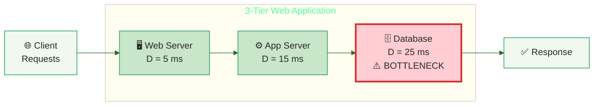

# Operational Laws

Operational analysis evaluates system performance using **measured parameters** and established mathematical relationships . Unlike traditional stochastic queuing theory — which requires assumptions about probability distributions (Poisson arrivals, exponential service times) — operational analysis uses counts of events from system instrumentation .

---

## Stochastic vs. Operational Approach

| Dimension | Stochastic Approach | Operational Approach |
|-----------|-------------------|---------------------|
| **Data basis** | Random variables with probability distributions | Counts of events (completions C, busy time B) |
| **Assumptions** | Strong: Poisson arrivals, exponential service | Testable: job flow balance (A &asymp; C) |
| **Validity** | Steady-state limits of infinite processes | Holds for each finite observation window |
| **Complexity** | Requires deep mathematical background | Simple enough for "back-of-the-envelope" calculations |

The key advantage is that operational laws are **tautologies** — they hold for every observation period by definition . An analyst can always test whether the assumptions hold by examining the measurement data .

---

## Observed and Derived Parameters

From system instrumentation (perfmon, sar, Prometheus, APM traces), we directly observe five quantities :

| Parameter | Symbol | Definition | How to collect |
|-----------|--------|-----------|----------------|
| Observation period | T | Duration of measurement | Clock |
| Arrivals | A | Total requests entering the system | HTTP logs, load balancer counters |
| Completions | C | Total requests leaving the system | HTTP logs, load balancer counters |
| Time in system | W | Sum of all request durations | APM traces (Jaeger, Datadog) |
| Busy time | B | Time the resource is not idle | Prometheus, `sar`, perfmon |

From these, we derive six performance metrics:

| Parameter | Symbol | Formula |
|-----------|--------|---------|
| Arrival rate | &lambda; | A / T |
| Throughput | X | C / T |
| Utilization | U | B / T |
| Service time | S | B / C |
| Avg. number in system | N | W / T |
| Response time | R | W / C |

**Consistency check:** If A &asymp; C over the observation period (flow balance), then &lambda; &asymp; X.

---

## The Six Operational Laws

Hillston formalizes six laws relating these parameters , all built on Little's Law as the foundation:

### 1. Little's Law

**N = X &middot; R**

The average number of requests in the system (N) equals throughput (X) times average response time (R) . Little's original formulation uses L = &lambda;W; in operational analysis the equivalent form N = X &middot; R is preferred because X and R are directly derived from the five observed counters . The law is distribution-free and requires only job flow balance .

```vega-lite
{
  "$schema": "https://vega.github.io/schema/vega-lite/v5.json",
  "width": 450,
  "height": 300,
  "title": {"text": "Cumulative Arrivals a(t) and Completions d(t)", "subtitle": "Shaded area H = accumulated time in system (req-sec)", "subtitleFontSize": 11, "subtitleColor": "#666"},
  "layer": [
    {
      "data": {"values": [
        {"time": 0, "arrivals": 0, "completions": 0},
        {"time": 0, "arrivals": 1, "completions": 0},
        {"time": 3, "arrivals": 2, "completions": 0},
        {"time": 5, "arrivals": 3, "completions": 0},
        {"time": 8, "arrivals": 3, "completions": 1},
        {"time": 11, "arrivals": 3, "completions": 2},
        {"time": 12, "arrivals": 3, "completions": 3},
        {"time": 18, "arrivals": 4, "completions": 3},
        {"time": 19, "arrivals": 5, "completions": 3},
        {"time": 23, "arrivals": 5, "completions": 4},
        {"time": 26, "arrivals": 5, "completions": 5},
        {"time": 27, "arrivals": 6, "completions": 5},
        {"time": 30, "arrivals": 7, "completions": 6},
        {"time": 33, "arrivals": 8, "completions": 6},
        {"time": 35, "arrivals": 9, "completions": 6},
        {"time": 36, "arrivals": 9, "completions": 7},
        {"time": 38, "arrivals": 9, "completions": 8},
        {"time": 40, "arrivals": 10, "completions": 8},
        {"time": 41, "arrivals": 10, "completions": 9},
        {"time": 45, "arrivals": 10, "completions": 10},
        {"time": 50, "arrivals": 10, "completions": 10}
      ]},
      "mark": {"type": "area", "interpolate": "step-after", "opacity": 0.3, "color": "#1976d2"},
      "encoding": {
        "x": {"field": "time", "type": "quantitative"},
        "y": {"field": "arrivals", "type": "quantitative"},
        "y2": {"field": "completions"}
      }
    },
    {
      "data": {"values": [
        {"time": 0, "value": 0}, {"time": 0, "value": 1}, {"time": 3, "value": 2}, {"time": 5, "value": 3},
        {"time": 18, "value": 4}, {"time": 19, "value": 5}, {"time": 27, "value": 6}, {"time": 30, "value": 7},
        {"time": 33, "value": 8}, {"time": 35, "value": 9}, {"time": 40, "value": 10}, {"time": 50, "value": 10}
      ]},
      "mark": {"type": "line", "interpolate": "step-after", "strokeWidth": 2.5, "color": "#1565c0"}
    },
    {
      "data": {"values": [
        {"time": 0, "value": 0}, {"time": 8, "value": 1}, {"time": 11, "value": 2}, {"time": 12, "value": 3},
        {"time": 23, "value": 4}, {"time": 26, "value": 5}, {"time": 30, "value": 6}, {"time": 36, "value": 7},
        {"time": 38, "value": 8}, {"time": 41, "value": 9}, {"time": 45, "value": 10}, {"time": 50, "value": 10}
      ]},
      "mark": {"type": "line", "interpolate": "step-after", "strokeWidth": 2.5, "color": "#c62828"}
    },
    {
      "data": {"values": [{"time": 48, "value": 10, "label": "a(t) = arrivals"}]},
      "mark": {"type": "text", "align": "left", "dx": 5, "fontSize": 13, "fontWeight": "bold", "color": "#1565c0"},
      "encoding": {"x": {"field": "time", "type": "quantitative"}, "y": {"field": "value", "type": "quantitative"}, "text": {"field": "label", "type": "nominal"}}
    },
    {
      "data": {"values": [{"time": 48, "value": 9.2, "label": "d(t) = completions"}]},
      "mark": {"type": "text", "align": "left", "dx": 5, "fontSize": 13, "fontWeight": "bold", "color": "#c62828"},
      "encoding": {"x": {"field": "time", "type": "quantitative"}, "y": {"field": "value", "type": "quantitative"}, "text": {"field": "label", "type": "nominal"}}
    },
    {
      "data": {"values": [{"time": 15, "value": 4.5, "label": "H"}]},
      "mark": {"type": "text", "fontSize": 16, "fontWeight": "bold", "fontStyle": "italic", "color": "#1976d2", "opacity": 0.7},
      "encoding": {"x": {"field": "time", "type": "quantitative"}, "y": {"field": "value", "type": "quantitative"}, "text": {"field": "label", "type": "nominal"}}
    }
  ],
  "encoding": {
    "x": {"field": "time", "type": "quantitative", "scale": {"domain": [0, 55]}, "axis": {"title": "time", "grid": false}},
    "y": {"field": "value", "type": "quantitative", "scale": {"domain": [0, 11]}, "axis": {"title": "units", "tickMinStep": 1}}
  },
  "config": {"font": "Tahoma, sans-serif", "view": {"stroke": null}}
}
```

The shaded area H between the arrival curve a(t) and completion curve d(t) represents the total accumulated time in system. N = H/T, R = H/C, X = C/T — therefore **N = X &middot; R**.

### 2. Utilization Law

**U<sub>i</sub> = X &middot; D<sub>i</sub>**

The utilization of resource *i* equals system throughput times the service demand at that resource. When U<sub>i</sub> approaches 1.0 (100%), that resource is the **bottleneck** .

### 3. Service Demand Law

**D<sub>i</sub> = S<sub>i</sub> &middot; V<sub>i</sub>**

Service demand equals the average service time per visit times the number of visits per transaction . Service demand is the **most important derived parameter** — it determines bottlenecks, drives MVA recursion, and connects measurements to predictions .

### 4. Forced Flow Law

**X<sub>i</sub> = X &middot; V<sub>i</sub>**

The throughput at resource *i* equals system throughput times the visit count. If a transaction visits the database 5 times, the database throughput is 5&times; the system throughput .

### 5. Residence Time Law

**W = &Sigma; W<sub>i</sub> &middot; V<sub>i</sub>**

Total response time is the sum of time spent at each resource, weighted by visit counts.

### 6. Interactive Response Time Law

**R = N / X &minus; Z**

For interactive systems with *N* users and think time *Z*, response time equals users divided by throughput minus think time .

---

## Bottleneck Identification

A resource is the system bottleneck if it has the **largest service demand** D<sub>max</sub> . This resource will reach 100% utilization first and limit total system throughput.

**Maximum throughput bound:**

X<sub>max</sub> = 1 / D<sub>max</sub>

**Example:** A three-tier web application with service demands:



| Resource | Service Demand D<sub>i</sub> |
|----------|------------------------------|
| Web server | 5 ms |
| App server | 15 ms |
| Database | 25 ms |

The database is the bottleneck: D<sub>max</sub> = 25 ms, so X<sub>max</sub> = 1/0.025 = **40 transactions/sec**.

No amount of web or app server optimization will push throughput past 40 TPS until the database service demand is reduced .

---

## Data Validation with Little's Law

Little's Law serves as a **sanity check** for measurement data . If measured throughput and response times do not satisfy N = X &middot; R, the measurements are wrong — not the law.

Common causes of violation:
- **Orphan requests** that overlapped the observation window boundary
- **Counting errors** where arrivals and completions are measured at different points
- **Non-steady-state** measurements during system startup or shutdown

Wilson recommends that changes of less than 10% in derived metrics should be treated as noise, not signal .

---

## From Operational Laws to Queuing Models

Operational laws tell us about average behavior but not about the **distribution** of response times. For that, we need [queuing models](models.md) — which use the operational parameters (especially service demand D<sub>i</sub>) as inputs to predict response time distributions, queue lengths, and the shape of the hockey stick curve.

---

### References



---

{: .highlight }
**Disclaimer:** AI is used for text summarization, polishing and explaining. Authors have verified all facts and claims. In case of an error, feel free to file an issue.
