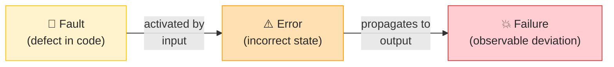
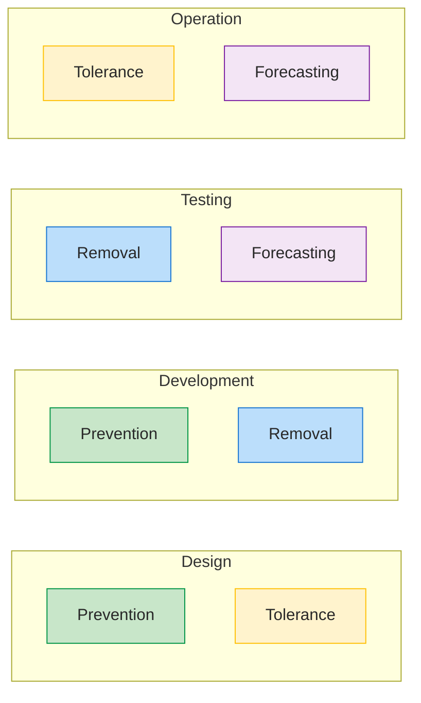
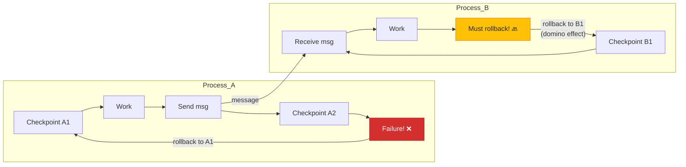
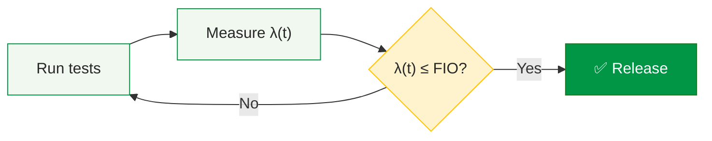
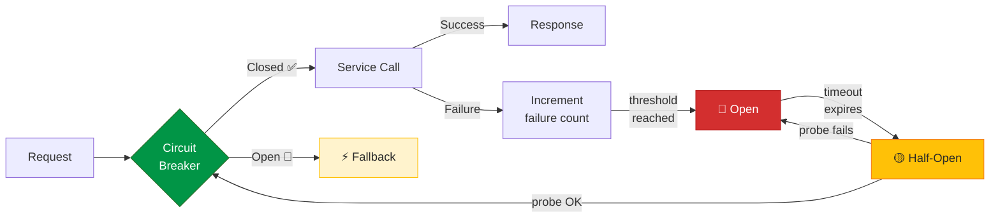
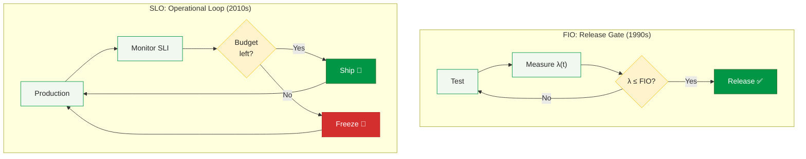
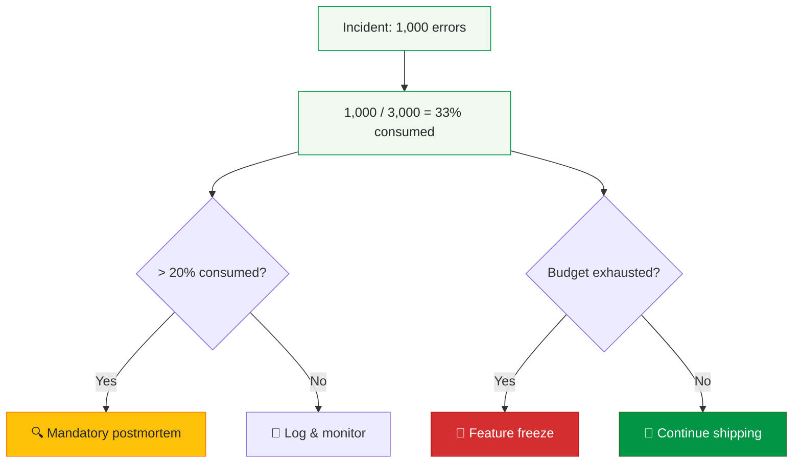

# Study Notes: Software Reliability (L08)

## Purpose
These study notes cover software reliability engineering: the fault-error-failure chain, failure severity classification, failure intensity objectives, fault tolerance strategies, software redundancy with the independence problem, and the modern bridge from classical FIO to SLOs and error budgets.

**Primary Sources:**
- Musa 2004, Software Reliability Engineering (2nd ed.) 
- Avizienis et al. 2004, Basic Concepts and Taxonomy 
- Beyer et al. 2016, Site Reliability Engineering 

**Key Research Papers:**
- Knight & Leveson 1986, Independence in NVP 
- Goel & Okumoto 1979, SRGM model 
- Littlewood et al. 2001, Design diversity modeling 
- Basiri et al. 2016, Chaos engineering 

---

## Table of Contents

1. [Part 1: Foundations — Fault → Error → Failure](#part-1-foundations--fault--error--failure)
2. [Part 2: Failure Severity Classification (FSC)](#part-2-failure-severity-classification-fsc)
3. [Part 3: Failure Intensity Objectives (FIO)](#part-3-failure-intensity-objectives-fio)
4. [Part 4: Fault Tolerance Strategies](#part-4-fault-tolerance-strategies)
5. [Part 5: Redundancy, Voting & The Independence Problem](#part-5-redundancy-voting--the-independence-problem)
6. [Part 6: From FIO to SLO — The Modern Bridge](#part-6-from-fio-to-slo--the-modern-bridge)

---

## Part 1: Foundations — Fault → Error → Failure

### 1.1 The Dependability Framework

Avizienis et al.  defined a comprehensive taxonomy of dependable computing with three dimensions:

| Dimension | Components |
|-----------|------------|
| **Attributes** | Availability, Reliability, Safety, Integrity, Maintainability |
| **Threats** | Faults, Errors, Failures |
| **Means** | Prevention, Tolerance, Removal, Forecasting |

**Software reliability** is the probability of failure-free operation for a specified time in a specified environment . Unlike hardware, software does not degrade physically — all software faults are **design faults** introduced during development.

### 1.2 Fault → Error → Failure Chain

The three terms form a causal chain — each causes the next:

| Term | Definition | Observable? | Example |
|------|------------|-------------|---------|
| **Fault** | Defect in code (design fault) | No (dormant in code) | Off-by-one in loop bound |
| **Error** | Incorrect internal state | No (internal to system) | Array index out of bounds |
| **Failure** | Observable deviation from correct service | **Yes** (externally visible) | Application crash, wrong output |



**Concrete Example — Null Pointer Bug:**

| Stage | What Happens |
|-------|-------------|
| **Fault** | Developer forgets to check `if (user != null)` before accessing `user.name` |
| **Error** | When `user` is `null`, the program dereferences a null pointer — internal state is corrupted |
| **Failure** | Application throws `NullPointerException`, user sees "500 Internal Server Error" |

The fault was dormant in the code for months. It only became an error when a specific input (a deleted user) triggered the code path. The error became a failure when it propagated to the HTTP response.

> **Key insight:** Only **failure** is externally observable. Verification finds faults (static). Testing observes failures (dynamic).

{: .highlight }
> **Exam Tip:** Be able to trace a given scenario through all three stages. "What is the fault? What is the error? What is the failure?" is a classic exam question.

### 1.3 Hardware vs Software Reliability

| Aspect | Hardware | Software |
|--------|----------|----------|
| **Failure cause** | Physical wear-out + design | Design faults **only** |
| **Failure curve** | Bathtub (infant mortality → useful life → wear-out) | Decreasing (bugs found and fixed over time) |
| **Repair** | Replace physical components | Fix code (patch) |
| **Redundancy** | Physical copies (2 power supplies) | N-version diversity (different implementations) |
| **Aging** | Degrades over time | Does not degrade — same binary, same behavior |
| **Environment** | Temperature, vibration, humidity | Input patterns, workload, timing |

**The two failure curves** (see lecture slide 6):
- **Hardware** follows the classic **bathtub curve**: high infant mortality → low steady-state (useful life) → rising wear-out.
- **Software** has a **decreasing curve with sawtooth spikes**: failure rate drops as bugs are found, but each update reintroduces new faults (spike), then drops again. There is **no wear-out** — only design change.

**Why this matters:** Because software doesn't wear out, all software failures are triggered by specific inputs that activate dormant design faults. This means **testing and operational profiles** (what inputs the system actually receives) are critical to predicting reliability.

### 1.4 Software Failures Are Not History

Software failures continue to cause massive damage — these are not problems from the 1990s:

| Case | Year | What Happened | Reliability Concept | Impact |
|------|------|---------------|---------------------|--------|
| **CrowdStrike** | 2024 | 8.5M Windows devices bricked by bad update | Common-mode failure | $5.4B |
| **Meta/Facebook** | 2021 | 6-hour global outage (FB, IG, WhatsApp) | Cascading failure (BGP→DNS→all) | ~$100M |
| **Log4j** | 2021 | 0-day in ubiquitous Java library | Supply chain fault (dormant for years) | $100M+ |
| **Boeing 737 MAX** | 2018-19 | MCAS: single sensor, no redundancy | Safety-critical SW, no diversity | 346 deaths |
| **Ariane 5** | 1996 | 64→16 bit overflow in reused code | Specification fault | $370M |

**Pattern recognition:** Every concept in this lecture — severity classes, failure intensity, fault tolerance, diversity — was developed because of incidents like these .

### 1.5 Fault → Error → Failure: Case Analyses

**CrowdStrike 2024**

| Stage | What happened |
|-------|--------------|
| **Fault** | A content configuration file (Channel File 291) shipped by CrowdStrike's update mechanism contained malformed data — a logic error in the content validator allowed an invalid pattern to pass quality checks |
| **Error** | The Falcon sensor kernel driver attempted to parse the malformed file at runtime; an out-of-bounds memory read produced an invalid internal state (corrupted pointer) inside the Windows kernel |
| **Failure** | The kernel encountered an unrecoverable exception and issued a Blue Screen of Death; 8.5 million Windows hosts could not boot, affecting hospitals, airlines, banks, and broadcasters globally |

**Reliability concept:** Common-mode failure — every host running the same sensor version failed simultaneously; redundant hardware provided no protection because all instances shared the identical fault.

---

**Meta/Facebook 2021**

| Stage | What happened |
|-------|--------------|
| **Fault** | A routine BGP (Border Gateway Protocol) configuration change contained an error that withdrew all of Facebook's BGP route advertisements — the command that should have been scoped to a subset of routers was applied globally |
| **Error** | Facebook's backbone routers stopped announcing their IP prefixes to the internet; DNS servers that needed to reach Facebook's authoritative name servers became unreachable; internal tools used to diagnose and fix the problem also relied on the same network and went dark |
| **Failure** | Facebook, Instagram, and WhatsApp became globally unreachable for ~6 hours; ~3.5 billion users could not connect; engineers had to physically travel to data centres to restore access because remote management was also cut off |

**Reliability concept:** Cascading failure — the BGP fault knocked out DNS, which knocked out all services including the recovery tooling itself.

---

**Boeing 737 MAX (MCAS)**

| Stage | What happened |
|-------|--------------|
| **Fault** | The Maneuvering Characteristics Augmentation System (MCAS) was designed to rely on input from a **single** angle-of-attack (AoA) sensor with no cross-check against the second sensor; the software specification did not require sensor disagreement detection for MCAS activation |
| **Error** | A failed AoA sensor reported an erroneously high angle of attack; MCAS accepted the reading as valid and repeatedly commanded the horizontal stabiliser to push the nose down; pilots' corrective inputs were overridden each time they tried to recover |
| **Failure** | The aircraft entered an unrecoverable dive; two crashes (Lion Air 610 and Ethiopian Airlines 302) killed 346 people |

**Reliability concept:** Lack of redundancy and diversity — safety-critical input came from a single sensor with no independent cross-check; the fault was a specification fault (the requirement for single-sensor reliance was written into the design).

{: .highlight }
> **Exam Tip:** For each case, be able to state the fault (what was wrong in the code/design), the error (which internal state became incorrect), and the failure (what users/operators observed). The fault is always a design decision or defect — it may have existed silently for a long time before being triggered.

### Practice Questions

1. A web server has a bug where requests over 8KB cause a buffer overflow. The server has been running for months without issue. Is this a fault, error, or failure?
2. Why is the "bathtub curve" not applicable to software?
3. Which famous failure best illustrates the danger of **common-mode failures** in redundant systems?

---

## Part 2: Failure Severity Classification (FSC)

### 2.1 What is FSC?

> A Failure Severity Class (FSC) is a set of failures that have the same **per-failure impact** on users .

**Key properties:**
- Typically **4 classes**, scaled by a factor of 10 in impact
- Severity ≠ complexity (a simple bug can be catastrophic)
- Severity can change with timing (a bug during peak hours is worse)
- Severity may be subjective (reputation damage is hard to quantify)

### 2.2 Three Classification Criteria

#### By Cost

| Class | Cost Impact | Example |
|-------|-------------|---------|
| 1 | > $100,000 | Major outage, data loss |
| 2 | $10K–$100K | Significant service incident |
| 3 | $1K–$10K | Minor incident, workaround exists |
| 4 | < $1,000 | Negligible, cosmetic |

Cost components include: operational cost, repair cost, loss of business, disruption, and reputation damage. **Rule of thumb:** Class 1 failure cost ≈ total development cost .

#### By System Capability

| Class | Impact | Example |
|-------|--------|---------|
| 1 | Basic service **interruption** | Database corruption, total outage |
| 2 | Basic service **degradation** | Slow response, partial features |
| 3 | Inconvenience, not deferrable | Feature unavailable, user blocked |
| 4 | Minor effects, deferrable | Cosmetic issue, typo |

#### By Human Life (Safety-Critical)

| Class | Impact | Applicable Domains |
|-------|--------|--------------------|
| 1 | Possible **loss of life** | Aerospace (DO-178C), Automotive (ISO 26262) |
| 2 | Severe injury or damage | Medical devices (IEC 62304) |
| 3 | Minor injury | Nuclear (IEC 61513) |
| 4 | Minor recoverable effects | General embedded systems |

**Safety-critical:** Class 1 failures require the highest assurance levels — MC/DC coverage, formal verification, and independent assessment.

### 2.3 How to Define FSC for Your Project

**Methods:**
1. **Experience-based** — compare to similar products, industry benchmarks
2. **Stakeholder input** — interview users, developers, business owners
3. **Formal analysis** — Fault Tree Analysis (FTA), Failure Mode & Effects Analysis (FMEA)

**5-Step Process:**
1. List all potential failure impacts
2. Narrow to the most critical and measurable factors
3. Define 4 severity classes with clear boundaries
4. Get stakeholder agreement
5. Document and communicate to the entire team

**Concrete Example — E-Commerce Checkout:**

| Class | Failure | Impact |
|-------|---------|--------|
| 1 | Payment charged but order not created | Financial loss, customer trust destroyed |
| 2 | Checkout timeout under load | Lost sales during peak hours |
| 3 | Promo code not applied correctly | Customer inconvenience, support tickets |
| 4 | Currency symbol displayed wrong | Cosmetic, no functional impact |

{: .highlight }
> **Exam Tip:** "Define FSC early — it drives testing priorities and FIO targets." If you skip FSC, you can't set meaningful FIO values because you don't know which failures matter most.

### Practice Questions

1. Why are FSC classes scaled by a factor of 10?
2. Can a Class 4 failure become Class 1? Give an example.
3. For a hospital patient record system, which FSC criterion (cost, capability, human life) should be primary?

---

## Part 3: Failure Intensity Objectives (FIO)

### 3.1 Failure Intensity vs Failure Density

These are two ways of expressing the same underlying quality — one for users, one for developers :

| Metric | Definition | Audience | Example |
|--------|------------|----------|---------|
| **Failure Intensity (λ)** | Failures per time/natural unit | End users | 5 failures/hour; 2 failures/1000 transactions |
| **Failure Density** | Failures per KLOC or FP | Developers | 1 failure/KLOC; 0.2 failures/FP |

**Why both matter:** A system with low failure density (few bugs per KLOC) can still have high failure intensity if the buggy code is on the critical path that handles 90% of requests.

**Example from Fenton :** Measuring absolute failure count identified 5 problematic modules. Measuring failures per KLOC identified only 1 module — the smallest module had the highest defect density but fewest total defects.

### 3.2 Setting FIO from Cost Impact

**Rule of thumb:** Estimate total project cost C, then set FIO = 1/C .

**Rationale:** If the cost of the highest-impact failure is roughly equal to total development cost, then the system should fail at most once in C hours.

| Failure Impact | FIO (failures/hour) | MTTF |
|----------------|---------------------|------|
| > $1B | 1 per 10⁹ hours | 114,000 years |
| > $1M | 1 per 10⁶ hours | 114 years |
| ~$1K | 1 per 10³ hours | 6 weeks |
| ~$100 | 1 per 100 hours | 4 days |
| ~$10 | 1 per 10 hours | 10 hours |

### 3.3 FIO from Reliability Requirement

**Exponential reliability model:**

$$R(t) = e^{-\lambda t}$$

Where:
- R(t) = probability of no failure during time t
- λ = failure intensity (failures per time unit)
- t = time period

**Worked Example:**
- Requirement: R = 0.992 reliability for an 8-hour shift
- Solve for λ: $\lambda = -\ln(R) / t = -\ln(0.992) / 8 \approx 0.001$ failures/hour
- FIO = **0.001 failures per hour** (= 1 failure per 1000 hours)

**Quick Reference — Reliability vs Failure Intensity:**

| Reliability (1 hour) | Failure Intensity |
|----------------------|-------------------|
| 0.90 | 105 per 1000 hours |
| 0.99 | 10 per 1000 hours |
| 0.999 | 1 per 1000 hours |
| 0.9999 | 1 per 10,000 hours |
| 0.99989 | 1 per year (8760 hours) |

### 3.4 Availability and FIO — The Exact Formula Matters

**Exact availability formula:**

$$A = \frac{MTTF}{MTTF + MTTR}$$

Solving for failure intensity:

$$\lambda = \frac{1 - A}{A \times t_m}$$

Where:
- A = availability (fraction of uptime)
- λ = failure intensity
- t_m = mean downtime per failure (MTTR)

**Linear approximation** (valid only when λ × t_m ≪ 1):

$$A \approx 1 - \lambda \times t_m \quad \Rightarrow \quad \lambda \approx \frac{1-A}{t_m}$$

**Worked Example — Why the Exact Formula Matters:**

Given: A = 99% (0.99), t_m = 0.1 hr (6 minutes)

| Formula | Calculation | Result |
|---------|-------------|--------|
| **Exact** | λ = 0.01 / (0.99 × 0.1) = 0.01 / 0.099 | **≈ 0.101 failures/hr** |
| Approximation | λ ≈ 0.01 / 0.1 | ≈ 0.100 failures/hr |

For this case, the approximation is close. But the exact formula gives **~10 failures per 100 hours**, which is the correct number to use in reliability planning.

```vega-lite
{
  "$schema": "https://vega.github.io/schema/vega-lite/v5.json",
  "title": {
    "text": "Failure Intensity vs Availability",
    "subtitle": "For different mean downtimes (t_m). Exact formula: λ = (1-A)/(A×t_m)",
    "subtitleFontSize": 11,
    "subtitleColor": "#666"
  },
  "width": 450,
  "height": 250,
  "data": {
    "values": [
      {"A": 0.90, "tm": 0.1, "lambda": 1.111, "label": "t_m = 6 min"},
      {"A": 0.95, "tm": 0.1, "lambda": 0.526, "label": "t_m = 6 min"},
      {"A": 0.99, "tm": 0.1, "lambda": 0.101, "label": "t_m = 6 min"},
      {"A": 0.999, "tm": 0.1, "lambda": 0.010, "label": "t_m = 6 min"},
      {"A": 0.90, "tm": 1.0, "lambda": 0.111, "label": "t_m = 1 hr"},
      {"A": 0.95, "tm": 1.0, "lambda": 0.053, "label": "t_m = 1 hr"},
      {"A": 0.99, "tm": 1.0, "lambda": 0.010, "label": "t_m = 1 hr"},
      {"A": 0.999, "tm": 1.0, "lambda": 0.001, "label": "t_m = 1 hr"}
    ]
  },
  "mark": {"type": "line", "point": true, "strokeWidth": 2},
  "encoding": {
    "x": {"field": "A", "type": "quantitative", "title": "Availability (A)", "scale": {"domain": [0.89, 1.0]}},
    "y": {"field": "lambda", "type": "quantitative", "title": "Failure Intensity λ (failures/hr)", "scale": {"type": "log"}},
    "color": {
      "field": "label", "type": "nominal",
      "scale": {"range": ["#d32f2f", "#019546"]},
      "legend": {"title": "Mean Downtime"}
    }
  },
  "config": {
    "font": "Tahoma, sans-serif",
    "point": {"size": 60, "filled": true},
    "view": {"stroke": null}
  }
}
```

### 3.5 MTTF, MTTR, and MTBF

| Metric | Full Name | Formula | Meaning |
|--------|-----------|---------|---------|
| **MTTF** | Mean Time To Failure | 1/λ | Average time between start/repair and next failure |
| **MTTR** | Mean Time To Repair | — | Average time to restore service after failure |
| **MTBF** | Mean Time Between Failures | MTTF + MTTR | Full cycle: working + repair |

**Relationships:**

$$MTTF = \frac{1}{\lambda} \qquad A = \frac{MTTF}{MTTF + MTTR}$$

**Example:** MTTF = 1000 hr, MTTR = 1 hr → A = 1000/1001 ≈ 0.999 (three nines)

> High availability requires **both** high MTTF (few failures) **and** low MTTR (fast recovery). Modern SRE often focuses on reducing MTTR because it's easier to improve than MTTF.

### 3.6 Worked Example: Human-Machine Team

**Requirement:** 99% availability for an operator workstation

**Given:**
- Target availability: A = 0.99
- Operator recovery time: 14 minutes
- Machine recovery time: 1 minute
- Total mean downtime: t_m = 15 min = 0.25 hr

**Calculation (exact formula):**

$$\lambda = \frac{1 - A}{A \times t_m} = \frac{0.01}{0.99 \times 0.25} = \frac{0.01}{0.2475} \approx 0.04 \text{ failures/hr}$$

**Result:** FIO = **4 failures per 100 hours** (or 1 failure per 25 hours)

**Interpretation:** The system can tolerate roughly one failure per 25-hour period while maintaining 99% availability, because each failure only takes 15 minutes to recover from.

{: .highlight }
> **Exam Tip:** Always use the exact formula λ = (1−A)/(A×t_m) unless explicitly told to use the approximation. Show your work step by step.

### Practice Questions

1. A system has λ = 0.002 failures/hour. What is its MTTF?
2. If A = 99.9% and MTTR = 30 min, what is the maximum allowed failure intensity?
3. Why might failure density be misleading for small modules?

---

## Part 4: Fault Tolerance Strategies

### 4.1 The Four Strategies

Avizienis et al.  identified four means of attaining dependability:

| Strategy | Goal | When Applied | Example |
|----------|------|--------------|---------|
| **Prevention** | Avoid introducing faults | Design, Development | Code reviews, coding standards |
| **Removal** | Detect and eliminate faults | Development, Testing | Testing, static analysis |
| **Tolerance** | Deliver correct service despite faults | Design → Operation | Redundancy, voting |
| **Forecasting** | Predict fault behavior | Testing, Operation | SRGMs, reliability models |



### 4.2 Fault Prevention

**Activities:**
- Requirements review, design review
- Coding standards and style guides
- Static analysis tools (linters, type checkers)
- CASE tools with built-in checks

**Effectiveness:** Measured as the proportion of faults prevented. Early detection is most cost-effective — a fault found in design costs 10-100× less to fix than one found in production.

**Best Practices:**
- Standards compliance (ISO 9001, CMMI)
- Training and process improvement
- Pair programming, code review culture

> **Prevention is the most cost-effective strategy** — find defects before they become code.

### 4.3 Fault Removal

**Activities:** Code review, testing (unit → integration → system → acceptance), static analysis, dynamic analysis

**V&V Distinction:**

| Question | Activity | Focus |
|----------|----------|-------|
| "Are we building it **right**?" | **Verification** | Conformance to specification |
| "Are we building the **right thing**?" | **Validation** | Conformance to user needs |

**How testing removes faults:** Testing is *indirect* — you observe a **failure**, trace it back to the **fault**, then fix the fault. Testing alone cannot guarantee absence of faults; it can only reveal their presence .

### 4.4 Fault Tolerance

> Provide correct service despite the presence of faults — through **redundancy** .

**Key properties:**
- **Designed** during specification phase
- **Acts** during operation phase
- Last line of defense when prevention and removal aren't enough

**Techniques:**

| Type | Mechanism | Example |
|------|-----------|---------|
| Recovery | Checkpoint/restart | Database transaction rollback |
| Redundancy | N-version programming | 3 independent flight control computers |
| Voting | Majority decision | 2-of-3 agree → accept result |
| Degradation | Reduced functionality | Offline mode when server unavailable |

### 4.5 Recovery: Backward vs Forward

| Aspect | Backward Recovery | Forward Recovery |
|--------|-------------------|------------------|
| **Mechanism** | Roll back to saved checkpoint | Use redundancy to continue |
| **Overhead** | Higher (checkpoints) | Lower (no state saving) |
| **Generality** | More general | Less general |
| **Real-time suitability** | Difficult | Better |
| **Problem** | **Domino effect** | Requires redundant components |

**The Domino Effect:** In systems with communicating processes, a rollback in one process can invalidate messages already sent to others, forcing them to roll back too — cascading rollbacks that can undo all work.



### 4.6 Consistency Checks (Acceptance Tests)

**Definition:** Error detection mechanisms that check whether execution results are acceptable.

**Syntax (Recovery Blocks):**
```
ensure <acceptance_test>
  by P0          -- primary
  else-by P1     -- alternate 1
  else fail      -- give up
```

**Types of checks:**

| Check Type | Example | When Used |
|------------|---------|-----------|
| Checksum | Verify file integrity after transfer | Data transmission |
| Math check | \|SQRT(x)² − x\| < ε | Numerical computation |
| Exception | Catch division by zero | Arithmetic operations |
| Overflow | Check integer limits before operation | Safety-critical systems |
| Timeout | Interrupt if loop exceeds time limit | Real-time systems |

### 4.7 SRGMs: Predicting When You'll Reach Your FIO

Software Reliability Growth Models (SRGMs) track how failure intensity decreases over time as testing finds and fixes bugs .

**Goel-Okumoto NHPP Model (1979):**

$$m(t) = a(1 - e^{-bt}) \qquad \text{cumulative faults found by time } t$$

$$\lambda(t) = ab \cdot e^{-bt} \qquad \text{failure intensity (decreasing!)}$$

**Parameters:**
- $a$ = total expected faults in the software
- $b$ = per-fault detection rate (probability of finding a given fault per time unit)

**Worked Example:**
- System: a = 50 faults, b = 0.05/week
- Initial failure intensity: λ(0) = 50 × 0.05 = **2.5 failures/week**
- FIO target: 0.5 failures/week
- When does λ(t) cross FIO?

Solve: $0.5 = 2.5 \cdot e^{-0.05t}$ → $e^{-0.05t} = 0.2$ → $t = -\ln(0.2)/0.05 \approx$ **32 weeks**

```vega-lite
{
  "$schema": "https://vega.github.io/schema/vega-lite/v5.json",
  "title": {
    "text": "SRGM: Failure Intensity λ(t) — Goel-Okumoto Model",
    "subtitle": "a = 50 faults, b = 0.05/week. FIO target = 0.5 fail/week (green dashed line)",
    "subtitleFontSize": 11,
    "subtitleColor": "#666"
  },
  "width": 450,
  "height": 250,
  "layer": [
    {
      "data": {
        "values": [
          {"t": 0, "lambda": 2.50},
          {"t": 5, "lambda": 1.95},
          {"t": 10, "lambda": 1.52},
          {"t": 15, "lambda": 1.18},
          {"t": 20, "lambda": 0.92},
          {"t": 25, "lambda": 0.72},
          {"t": 30, "lambda": 0.56},
          {"t": 35, "lambda": 0.44},
          {"t": 40, "lambda": 0.34},
          {"t": 50, "lambda": 0.21},
          {"t": 60, "lambda": 0.12},
          {"t": 80, "lambda": 0.04}
        ]
      },
      "mark": {"type": "line", "strokeWidth": 3, "point": true},
      "encoding": {
        "x": {"field": "t", "type": "quantitative", "title": "Test Time (weeks)"},
        "y": {"field": "lambda", "type": "quantitative", "title": "Failures / week", "scale": {"domain": [0, 2.8]}},
        "color": {"value": "#d32f2f"}
      }
    },
    {
      "data": {"values": [{"y": 0.5}]},
      "mark": {"type": "rule", "strokeDash": [6, 3], "strokeWidth": 2},
      "encoding": {
        "y": {"field": "y", "type": "quantitative"},
        "color": {"value": "#019546"}
      }
    },
    {
      "data": {"values": [{"x": 55, "y": 0.58, "label": "FIO = 0.5"}]},
      "mark": {"type": "text", "fontSize": 13, "fontWeight": "bold", "align": "left"},
      "encoding": {
        "x": {"field": "x", "type": "quantitative"},
        "y": {"field": "y", "type": "quantitative"},
        "text": {"field": "label"},
        "color": {"value": "#019546"}
      }
    }
  ],
  "config": {
    "font": "Tahoma, sans-serif",
    "axis": {"labelFontSize": 12, "titleFontSize": 13},
    "point": {"size": 50, "filled": true},
    "view": {"stroke": null}
  }
}
```

**The SRGM Decision Process:**



> SRGMs turn "are we done testing?" into a **quantitative** answer: test until λ(t) crosses the FIO line.

{: .highlight }
> **Exam Tip:** Given a, b, and FIO values, be able to calculate when testing should stop. Solve: FIO = ab·e^(-bt) for t.

### Practice Questions

1. Which strategy is most cost-effective and why?
2. Explain the domino effect with a concrete example of two communicating services.
3. A system has a=100 faults, b=0.02/week, FIO=1.0 fail/week. How many weeks of testing are needed?

---

## Part 5: Redundancy, Voting & The Independence Problem

### 5.1 N-Version Programming (NVP)

**Concept:** Multiple teams develop the **same specification** independently, using different designs, algorithms, or languages. A **voter** compares outputs and selects the correct one .

**Process:**
1. Write a single, rigorous specification
2. N independent teams implement it separately
3. All versions execute on the same input
4. A voter compares outputs → majority wins

**Goal:** If failures are independent across versions, the probability of a majority failing simultaneously is extremely small.

### 5.2 Recovery Blocks (RcB)

**Concept:** A primary module runs first. If its result fails an **acceptance test**, an alternate module runs. This continues until a result passes or all alternatives are exhausted.

```
ensure <acceptance_test>
  by PrimaryModule
  else-by Alternate1
  else-by Alternate2
  else fail
```

**Key difference from NVP:** Recovery blocks use an acceptance test (sequential), while NVP uses voting (parallel).

### 5.3 Voting Mechanisms

**Majority Voting:**

$$m \geq \left\lceil\frac{N+1}{2}\right\rceil$$

Where N = number of versions, m = required agreement count.

**Example:** 3 versions → need 2 to agree. 5 versions → need 3 to agree.

**Other Voting Schemes:**

| Scheme | Rule | Best For |
|--------|------|----------|
| **Consensus** | Largest agreement group wins | When exact match is unlikely |
| **2-of-N** | Any 2 agree | Large output spaces |
| **Weighted** | Expertise-based weights | Versions with known quality differences |
| **Median** | Middle value selected | Continuous numerical outputs |

**System Reliability (Majority Voting):**

$$R_{system} = \sum_{i=m}^{N} \binom{N}{i} R_c^i (1-R_c)^{N-i}$$

**Worked Example — 3-of-5 Voting:**

Given: R_c = 0.9 (each version has 90% reliability), N = 5, m = 3

$$R_{system} = \binom{5}{3}(0.9)^3(0.1)^2 + \binom{5}{4}(0.9)^4(0.1)^1 + \binom{5}{5}(0.9)^5(0.1)^0$$

$$= 10 \times 0.729 \times 0.01 + 5 \times 0.6561 \times 0.1 + 1 \times 0.59049 \times 1$$

$$= 0.0729 + 0.3281 + 0.5905 = \mathbf{0.9914}$$

**Result:** System reliability improves from 90% to **99.1%** — but only if failures are independent!

### 5.4 Knight & Leveson 1986: The Independence Experiment

This is **the most cited result** in software fault tolerance .

**Setup:**
- 27 independently developed versions of the same program
- Same specification, same language (Pascal)
- 1,000,000 randomized test cases
- Statistical test: Are version failures independent?

**Result:** Independence hypothesis **rejected at 99% confidence** (χ² test)

```vega-lite
{
  "$schema": "https://vega.github.io/schema/vega-lite/v5.json",
  "title": {
    "text": "Knight & Leveson 1986: Coincident Failures",
    "subtitle": "27 versions, 1,000,000 test cases",
    "subtitleFontSize": 11,
    "subtitleColor": "#666"
  },
  "width": 300,
  "height": 220,
  "data": {
    "values": [
      {"type": "Predicted\n(if independent)", "failures": 1.0},
      {"type": "Observed", "failures": 29.0}
    ]
  },
  "mark": {"type": "bar", "cornerRadiusTopLeft": 4, "cornerRadiusTopRight": 4, "width": 80},
  "encoding": {
    "x": {"field": "type", "type": "nominal", "axis": {"labelAngle": 0, "title": null, "labelFontSize": 13}},
    "y": {"field": "failures", "type": "quantitative", "title": "Relative Coincident Failures"},
    "color": {
      "field": "type", "type": "nominal",
      "scale": {"range": ["#c8e6c9", "#d32f2f"]},
      "legend": null
    }
  },
  "config": {
    "font": "Tahoma, sans-serif",
    "axis": {"labelFontSize": 12, "titleFontSize": 13},
    "view": {"stroke": null}
  }
}
```

**29× more coincident failures than independence would predict.**

**Why do independently developed versions fail together?**

| Cause | Explanation | Example |
|-------|-------------|---------|
| **Collinear input points** | Same geometric edge cases trip multiple versions | Points on a line: all versions mishandle boundary |
| **Numerical precision** | Same rounding/overflow traps catch multiple teams | Floating-point comparison errors |
| **Specification ambiguity** | Teams make identical misreadings of the same spec | Unclear corner case in requirement |

**Brilliant et al. ** further analyzed the faults: many were concentrated on the same "difficult" inputs, confirming that **correlated failures are the norm, not the exception**.

{: .highlight }
> **Exam Tip:** Never assume version failures are independent. Know the three causes (collinear inputs, numerical precision, spec ambiguity) and be able to explain why each leads to correlated failures.

### 5.5 From Diversity Optimism to Validated Resilience

The evolution of thinking about software diversity :

| Era | Philosophy | Approach | Limitation |
|-----|-----------|----------|------------|
| **1970s — Optimism** | "N versions → reliability guaranteed" | NVP, Recovery Blocks | Assumed independence |
| **1986 — Crisis** | "Independence doesn't hold" | Knight & Leveson experiment | Diversity value unclear |
| **2010s — Realism** | "Validate, don't assume" | Circuit breakers, chaos engineering | Ongoing investment |

**Modern Resilience Toolkit:**

| Technique | Purpose | How It Works |
|-----------|---------|-------------|
| **Timeouts** | Bound blast radius of slow dependencies | Fail fast instead of hanging indefinitely |
| **Retries + jitter** | Handle transient failures | Retry with random delay to avoid thundering herd |
| **Circuit breakers** | Stop cascading failures | Open circuit after N failures → return fallback |
| **Chaos engineering** | Validate mechanisms in production | Intentionally inject failures (Netflix ChAP)  |



> **Modern approach:** Don't assume resilience works — validate it continuously through chaos experiments.

### Practice Questions

1. Why does the voting formula assume independence, and why is that assumption problematic?
2. If R_c = 0.95 for each of 3 versions with majority voting, what is R_system? Does this assume independence?
3. Explain how a circuit breaker prevents cascading failures. What happens during the "half-open" state?

---

## Part 6: From FIO to SLO — The Modern Bridge

### 6.1 FIO ≡ SLO: Same Concept, Different Phase

Musa's Failure Intensity Objective (1990s) and Google's Service Level Objective (2010s) are fundamentally the same idea  :

| Classical SRE (Musa) | Modern SRE (Google) | Same Concept |
|------|------|------|
| FIO | SLO | Target reliability — "good enough" |
| Failure intensity λ(t) | Error rate (SLI) | What is measured |
| Operational profile | Critical User Journeys | What to measure |
| Severity classification | Service tiering | Not all failures equal |
| Demonstration chart | Burn-rate alerting | Decision mechanism |
| "Just right" reliability | Error budget (1 − SLO) | 100% is the wrong target |

**Key difference:** FIO gates **release** (pre-production). SLO governs **production velocity** (post-release).



### 6.2 Error Budgets

**Formula:**

$$\text{Error Budget} = 1 - \text{SLO}$$

The error budget quantifies **how much unreliability you can tolerate** before you must stop shipping and fix reliability .

**Worked Example — Checkout Service:**

| Metric | Calculation | Value |
|--------|-------------|-------|
| SLO | | 99.9% |
| Error budget | 100% − 99.9% | **0.1%** |
| Requests/month | | 3,000,000 |
| Allowed failures | 3M × 0.001 | **3,000 errors** |
| Allowed downtime | 30 days × 0.001 | **43 minutes** |

**Incident Analysis:**

A bad deploy causes 500 errors/hour for 2 hours = **1,000 errors**.

| Question | Calculation | Result |
|----------|-------------|--------|
| Budget consumed | 1,000 / 3,000 | **33%** |
| > 20% threshold? | Yes | → Mandatory postmortem |
| Budget exhausted? | No (67% remaining) | → Continue shipping |



**Mixed-Unit Incidents (outage time + failed requests):**

When an incident report gives both downtime *and* a failed-request count, convert everything to requests using the traffic rate before adding:

$$\text{Request rate} = \frac{\text{Total requests/month}}{\text{Minutes/month}}$$

$$\text{Requests lost to outage} = \text{Outage minutes} \times \text{Request rate}$$

$$\text{Total impact} = \text{Requests lost to outage} + \text{Failed requests (degraded period)}$$

**Example — 99.95% SLO, 50M requests/month:**

| Metric | Calculation | Value |
|--------|-------------|-------|
| Error budget | 50M × 0.0005 | **25,000 requests** |
| Budget in time | 30 × 24 × 60 × 0.0005 | **21.6 minutes** |
| Request rate | 50M / 43,200 min | **~1,157 req/min** |
| Outage impact (8 min) | 8 × 1,157 | **~9,259 requests** |
| Degraded impact | — | **5,000 requests** |
| Total consumed | (9,259 + 5,000) / 25,000 | **~57%** |

{: .highlight }
> **Exam Tip:** Always convert outage minutes to failed requests (or vice versa) before combining. Use the monthly traffic rate to do the conversion. Never add percentages computed from different unit bases — convert to one unit first.

**Why 100% is the Wrong Target:**

If you set SLO = 100%, your error budget = 0%. This means:
- **Any** failure triggers a feature freeze
- You can **never** deploy risky changes
- Innovation stops completely
- The team spends all time on reliability instead of features

The error budget creates a **healthy tension** between reliability and velocity — exactly like Musa's concept of "just right" reliability.

{: .highlight }
> **Exam Tip:** Know the error budget formula and be able to: (1) calculate allowed failures from SLO + traffic, (2) assess an incident's budget impact, (3) determine the appropriate response (postmortem, freeze, or continue).

### Practice Questions

1. A service has SLO = 99.95% and handles 10M requests/month. How many errors can it tolerate?
2. Explain why FIO and SLO are "the same concept in different phases."
3. Why is setting SLO = 100% counterproductive?

---

## Key Formulas Reference

| Formula | Expression | Use |
|---------|------------|-----|
| Reliability | $R(t) = e^{-\lambda t}$ | Probability of no failure in time t |
| Availability (exact) | $A = \frac{MTTF}{MTTF + MTTR}$ | Fraction of uptime |
| FIO from availability | $\lambda = \frac{1-A}{A \times t_m}$ | Maximum allowed failure intensity |
| Availability (approx) | $A \approx 1 - \lambda \times t_m$ | Only when λ×t_m ≪ 1 |
| MTTF | $MTTF = 1/\lambda$ | Mean time to failure |
| SRGM cumulative | $m(t) = a(1 - e^{-bt})$ | Faults found by time t |
| SRGM intensity | $\lambda(t) = ab \cdot e^{-bt}$ | Current failure rate |
| Majority voting | $m \geq \lceil(N+1)/2\rceil$ | Minimum agreeing versions |
| System reliability | $R_s = \sum_{i=m}^{N} \binom{N}{i} R_c^i (1-R_c)^{N-i}$ | Voting system reliability |
| Error budget | $\text{EB} = 1 - \text{SLO}$ | Tolerable unreliability |

---

### References



---

{: .highlight }
**Disclaimer:** AI is used for text summarization, polishing and explaining. Authors have verified all facts and claims. In case of an error, feel free to file an issue.
