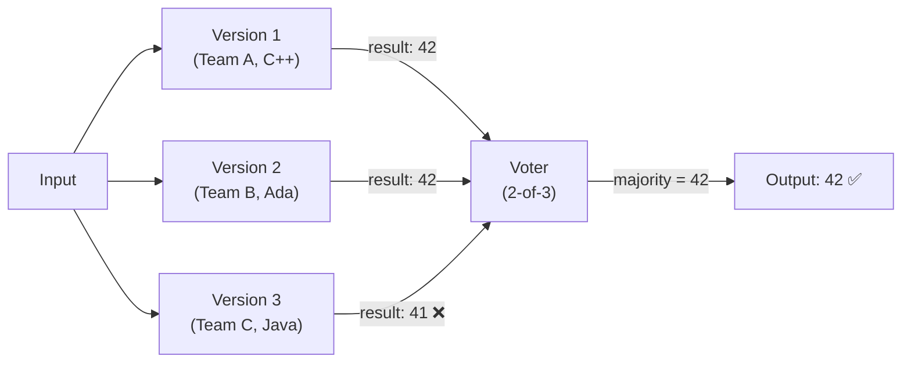
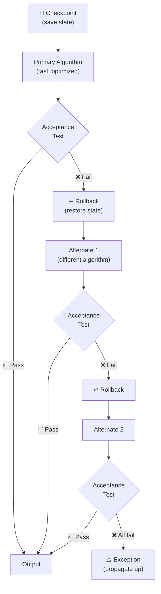
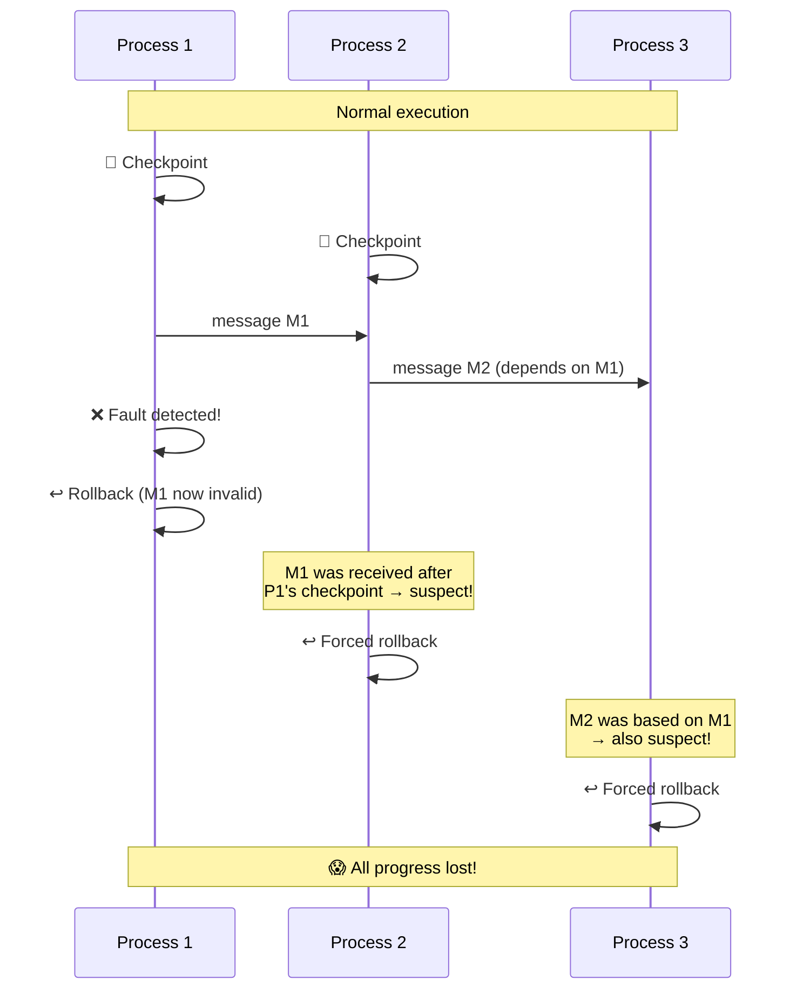
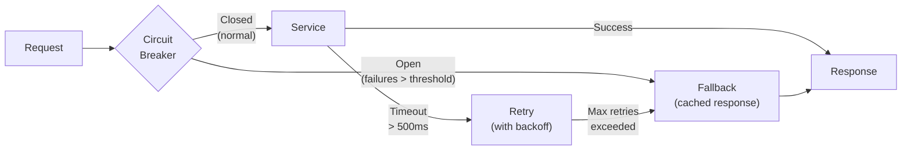

# Software Fault Tolerance

Fault tolerance is the ability to deliver correct service in the presence of active faults . For hardware, this means physical redundancy — spare components mask random failures. For software, identical copies contain identical bugs, so fault tolerance requires **design diversity**: independently developed alternatives that are unlikely to fail on the same inputs .

---

## Classical Techniques

Four canonical multi-version techniques address software faults  :

### N-Version Programming (NVP)

Independently developed versions execute **in parallel** on the same inputs. A **voter** selects the correct output by majority agreement .



- **Recovery type:** Forward (masking — no rollback needed)
- **Overhead:** High constant (all versions run always)
- **Real-time:** Good (predictable timing)
- **Adjudication:** Relative comparison (versions against each other)

**Real-world example:** The Airbus A-320 flight control system uses 2 computer types with 4 independently developed software packages .

### Recovery Blocks (RcB)

A primary block executes first. An **acceptance test** (AT) checks the result. If the AT rejects the result, the system **rolls back** to a checkpoint and tries an alternate block .



- **Recovery type:** Backward (checkpoint/rollback)
- **Overhead:** Low in fault-free case (only primary runs)
- **Real-time:** Poor (variable timing due to rollbacks)
- **Adjudication:** Absolute check (AT evaluates result independently)

**Example:** A sorting function uses QuickSort as primary (fast, O(n log n) average). If the AT detects the output is not sorted, it rolls back and tries MergeSort as alternate (guaranteed O(n log n) but uses more memory).

### NVP vs Recovery Blocks

| Aspect | NVP | Recovery Blocks |
|--------|-----|-----------------|
| Recovery | Forward (masking) | Backward (rollback) |
| Execution | Parallel (all versions) | Sequential (alternates on demand) |
| Adjudication | Voter (relative) | Acceptance test (absolute) |
| Normal overhead | High constant | Low |
| Real-time suitability | Better | Poor |
| Weakness | Voter design; what if no majority? | AT design; hard to make simple yet comprehensive |

### Hybrid Techniques

| Technique | Mechanism |
|-----------|-----------|
| **N Self-Checking Programming (NSCP)** | Self-checking components with hot-standby redundancy; forward recovery  |
| **Consensus Recovery Block (CRB)** | NVP + RcB hybrid: try voter first; if no consensus, fall back to acceptance test  |

---

## Voting Strategies

The choice of voter significantly affects system reliability :

| Strategy | Mechanism | When to Use |
|----------|-----------|-------------|
| **Majority** | >50% agreement required (e.g., 2-of-3) | Discrete outputs, high reliability needed |
| **Plurality** | Largest agreement group wins | More versions, no single majority expected |
| **Weighted average** | Weights by variant trustworthiness | Continuous outputs, historical performance data |
| **Median** | Central value from sorted outputs | Continuous outputs, outlier resistance |
| **Consensus** | Generalized majority with unique maximum | Formal correctness requirement |

---

## The Domino Effect

In concurrent systems, recovery blocks face a cascading problem: if process P1 rolls back, any information P1 sent to process P2 after the checkpoint becomes suspect, potentially forcing P2 to roll back as well. This can cascade until all processes have lost all progress .



**Modern solutions** to the domino effect:
- **Idempotent operations** — safe to retry without side effects
- **Saga patterns** — compensating transactions instead of rollback
- **Event sourcing** — rebuild state from the event log

---

## The Independence Problem

The reliability gain from multi-version techniques depends on the assumption that versions **fail independently**. Knight and Leveson's landmark experiment (1986) tested this assumption directly :

| Parameter | Value |
|-----------|-------|
| Versions | 27 independently developed |
| Test cases | 1,000,000 randomly generated |
| Application | Launch Interceptor Program (antimissile) |
| Individual reliability | >99.9% per version |
| **Result** | Independence rejected at **99% confidence** |

Coincident failures — where multiple versions failed on the same input — were significantly more frequent than statistical independence would predict .

```vega-lite
{
  "$schema": "https://vega.github.io/schema/vega-lite/v5.json",
  "title": "Knight & Leveson (1986): Predicted vs Actual Coincident Failures",
  "width": 450,
  "height": 250,
  "data": {
    "values": [
      {"category": "Expected if\nindependent", "failures": 0.2, "color": "Expected (independence)"},
      {"category": "Observed\n(actual)", "failures": 5.8, "color": "Observed"}
    ]
  },
  "mark": {"type": "bar", "width": 60},
  "encoding": {
    "x": {"field": "category", "type": "nominal", "title": null, "axis": {"labelAngle": 0}},
    "y": {"field": "failures", "type": "quantitative", "title": "Avg. coincident failures per version pair"},
    "color": {"field": "color", "type": "nominal", "title": null, "scale": {"range": ["#1565c0", "#d32f2f"]}}
  }
}
```

{: .note }
> If versions failed independently, coincident failures would be extremely rare (~0.2 per pair). The actual rate was ~29x higher — independence rejected at 99% confidence .

### Why Independence Fails

Brilliant, Knight, and Leveson (1990) analyzed the fault types and identified 93 correlated fault pairs :

| Fault Type | Example |
|-----------|---------|
| **Logical equivalence** | Multiple programmers failed to handle collinear points (angle = 0 vs π) |
| **Numerical precision** | Sign functions near zero, trigonometric comparisons on flat curves |
| **Input-domain related** | Different algorithms still failed on the same "difficult" inputs |

### Theoretical Models

Littlewood, Popov, and Strigini (2001) formalized this with two models :

| Model | Assumption | Implication |
|-------|-----------|-------------|
| **Eckhardt-Lee (EL)** | Universal difficulty function — some inputs are hard for everyone | Most pessimistic: positive failure correlation inevitable |
| **Littlewood-Miller (LM)** | Version-specific difficulty — what you find hard, I may find easy | Less pessimistic: diversity can help more than EL predicts |

**Key conclusions:**
- Independence is untenable 
- Diversity still helps — multi-version systems are more reliable than single versions 
- But the benefit **cannot be quantified reliably** — achieving high reliability is easier than proving it
- For 1-out-of-n systems, optimal strategy spreads methodologies evenly
- For majority voting, diversity is **not always beneficial** 

---

## Safety-Critical Implementations

Despite the independence limitation, multi-version techniques remain standard in safety-critical domains  :

| Domain | Approach |
|--------|----------|
| **Nuclear (NRC)** | 2-of-4 voting, mandatory diversity, defense-in-depth |
| **Aviation (Airbus A-320)** | Multi-level diversity: 2 computer types, 4 software packages |
| **Nuclear Navy** | Manual procedures over automation for irreversible actions |

The rationale: even imperfect diversity provides measurable improvement over single-version systems, and the cost is justified when failures have catastrophic consequences.

---

## From Diversity to Resilience

The field evolved through three phases:

| Era | Philosophy | Approach |
|-----|-----------|----------|
| **1970s-80s** | Structural optimism | Diversity-based redundancy will mask software faults like hardware faults |
| **1986-2000s** | Empirical crisis | Knight & Leveson proved independence untenable; benefit exists but is unquantifiable |
| **2010s-present** | Modern realism | Validate resilience mechanisms continuously rather than assume they work |

Modern systems favor **resilience** (timeouts, retries, circuit breakers, fallbacks, blast radius control) over classical multi-version redundancy. Chaos engineering validates these mechanisms through continuous fault injection in production rather than relying on static design-time diversity arguments .

### Modern Resilience Patterns



**Example:** When a recommendation service is slow, the circuit breaker opens after 5 consecutive timeouts. Users see cached "popular items" instead. This is **forward recovery** — the modern equivalent of NVP's fallback, but without requiring independently developed versions.

For the connection between classical fault tolerance testing and modern chaos engineering, see [From FIO to SLO](slo-bridge.md). For industry case studies on chaos engineering at Netflix, see [Industry Case Studies](../../organization/05-practice/07-industry-case-studies.md).

---

### References



---

{: .highlight }
**Disclaimer:** AI is used for text summarization, polishing and explaining. Authors have verified all facts and claims. In case of an error, feel free to file an issue.
