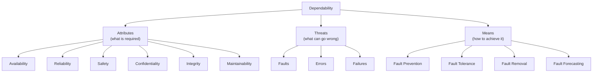
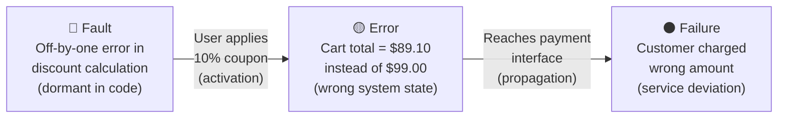
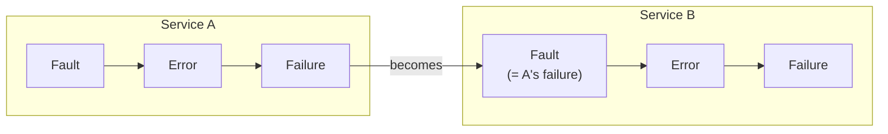

# Software Reliability

Software reliability is the probability of failure-free operation of a computer program for a specified time in a specified environment . Unlike hardware, software does not wear out — its failures stem from design faults that are activated by particular inputs .

This section covers the conceptual arc from classical software reliability engineering (Musa) through dependability theory (Avizienis/Laprie) to modern site reliability engineering (Google SRE).

---

## Dependability: The Unifying Framework

Avizienis et al. defined **dependability** as "the ability to deliver service that can justifiably be trusted" . The framework organizes the field into three branches:



### Attributes

| Attribute | Definition |
|-----------|-----------|
| **Availability** | Readiness for correct service |
| **Reliability** | Continuity of correct service |
| **Safety** | Absence of catastrophic consequences on users and environment |
| **Confidentiality** | Absence of unauthorized disclosure of information |
| **Integrity** | Absence of improper system alterations |
| **Maintainability** | Ability to undergo modifications and repairs |

**Security** is the composite of availability, confidentiality, and integrity .

---

## The Fault-Error-Failure Chain

The causal chain **fault → error → failure** is fundamental to reliability engineering. Two influential terminologies exist:

| Concept | Avizienis et al. (2004) | Musa (1993, 2004) |
|---------|------------------------|-------------------|
| **Fault** | Adjudged or hypothesized cause of an error | Defect in code ("bug") |
| **Error** | Part of system state that may lead to failure | Human mistake causing a fault |
| **Failure** | Delivered service deviates from correct service | Departure from required operation |

The key difference: Avizienis defines "error" as a **system state**, while Musa defines it as a **human action**  . Modern SRE practice (Beyer 2016) sidesteps this ambiguity with operational terminology — SLIs, SLOs, and error budgets — that map directly to observable behavior .

### Example: Online Shopping Cart

Consider a bug in an e-commerce checkout service:



The fault (off-by-one in discount logic) exists in every copy of the code. It stays dormant until a user applies a percentage discount to an item with a specific price. The wrong total (error state) propagates through checkout to become a user-visible failure.

### Propagation Across Boundaries

Faults may remain **dormant** until activated by specific inputs. An activated fault produces an error in the system state. If the error propagates to the service interface, it becomes a **failure**. One component's failure becomes a fault for the component that depends on it, creating a chain across system boundaries .



This cascading pattern explains why a single bug in a shared library can cause failures across dozens of dependent services.

---

## Hardware vs Software Faults

| Aspect | Hardware Faults | Software Faults |
|--------|----------------|-----------------|
| **Origin** | Physical deterioration | Design mistakes |
| **Nature** | Random, time-related | Systematic, input-related |
| **Aging** | Wear-out increases failure rate | No wear-out; faults are permanent |
| **Replication** | Identical copies mask random faults | Identical copies contain identical bugs |
| **Redundancy** | Physical replication works | Requires **design diversity** |

This distinction has a crucial engineering consequence: hardware reliability can be improved by adding identical spare components, but software reliability cannot — identical copies share the same bugs . Software fault tolerance requires independently developed alternatives (see [Fault Tolerance](fault-tolerance.md)).

### Failure Rate Over Time

Hardware follows the classic "bathtub curve" — infant mortality, useful life, wear-out. Software has no wear-out phase; its failure rate changes only when the code changes:

```vega-lite
{
  "$schema": "https://vega.github.io/schema/vega-lite/v5.json",
  "hconcat": [
    {
      "title": {"text": "Hardware (Bathtub Curve)", "fontSize": 14},
      "width": 280,
      "height": 200,
      "layer": [
        {
          "data": {
            "values": [
              {"t": 0, "rate": 9.0}, {"t": 3, "rate": 5.5}, {"t": 6, "rate": 3.2},
              {"t": 10, "rate": 1.8}, {"t": 15, "rate": 1.2}, {"t": 20, "rate": 1.0},
              {"t": 25, "rate": 1.0}, {"t": 30, "rate": 1.0}, {"t": 35, "rate": 1.0},
              {"t": 40, "rate": 1.0}, {"t": 45, "rate": 1.0}, {"t": 50, "rate": 1.0},
              {"t": 55, "rate": 1.0}, {"t": 60, "rate": 1.0}, {"t": 65, "rate": 1.05},
              {"t": 70, "rate": 1.2}, {"t": 75, "rate": 1.6}, {"t": 80, "rate": 2.5},
              {"t": 85, "rate": 4.0}, {"t": 90, "rate": 6.0}, {"t": 95, "rate": 8.5},
              {"t": 100, "rate": 10.0}
            ]
          },
          "mark": {"type": "line", "strokeWidth": 3, "interpolate": "monotone"},
          "encoding": {
            "x": {"field": "t", "type": "quantitative", "title": "Time", "axis": {"labels": false, "ticks": false}},
            "y": {"field": "rate", "type": "quantitative", "title": "Failure Rate λ(t)", "scale": {"domain": [0, 11]}, "axis": {"labels": false, "ticks": false}},
            "color": {"value": "#2D6E2A"}
          }
        },
        {
          "data": {"values": [{"y": 1.0}]},
          "mark": {"type": "rule", "strokeDash": [6, 3], "strokeWidth": 1.5},
          "encoding": {"y": {"field": "y", "type": "quantitative"}, "color": {"value": "#999"}}
        },
        {
          "data": {"values": [{"x": 20}, {"x": 65}]},
          "mark": {"type": "rule", "strokeDash": [4, 4], "strokeWidth": 1},
          "encoding": {"x": {"field": "x", "type": "quantitative"}, "color": {"value": "#ccc"}}
        },
        {
          "data": {"values": [
            {"x": 10, "y": 10.5, "label": "Burn In"},
            {"x": 42, "y": 10.5, "label": "Useful Life"},
            {"x": 82, "y": 10.5, "label": "Wear Out"}
          ]},
          "mark": {"type": "text", "fontSize": 11, "fontWeight": "bold"},
          "encoding": {
            "x": {"field": "x", "type": "quantitative"},
            "y": {"field": "y", "type": "quantitative"},
            "text": {"field": "label"}, "color": {"value": "#555"}
          }
        }
      ]
    },
    {
      "title": {"text": "Software (Sawtooth at Updates)", "fontSize": 14},
      "width": 280,
      "height": 200,
      "layer": [
        {
          "data": {
            "values": [
              {"t": 0, "rate": 9.0}, {"t": 3, "rate": 5.5}, {"t": 6, "rate": 3.5},
              {"t": 10, "rate": 2.2}, {"t": 14, "rate": 1.5}, {"t": 18, "rate": 1.1},
              {"t": 20, "rate": 1.0}, {"t": 24, "rate": 1.0},
              {"t": 25, "rate": 4.2}, {"t": 26, "rate": 3.0}, {"t": 28, "rate": 2.0},
              {"t": 31, "rate": 1.3}, {"t": 34, "rate": 1.0}, {"t": 38, "rate": 0.95},
              {"t": 39, "rate": 3.3}, {"t": 40, "rate": 2.4}, {"t": 42, "rate": 1.6},
              {"t": 45, "rate": 1.1}, {"t": 48, "rate": 0.9}, {"t": 52, "rate": 0.85},
              {"t": 53, "rate": 2.4}, {"t": 54, "rate": 1.8}, {"t": 56, "rate": 1.3},
              {"t": 59, "rate": 1.0}, {"t": 62, "rate": 0.85}, {"t": 65, "rate": 0.8},
              {"t": 70, "rate": 0.8}, {"t": 75, "rate": 0.8}, {"t": 80, "rate": 0.8},
              {"t": 85, "rate": 0.8}, {"t": 90, "rate": 0.8}, {"t": 95, "rate": 0.8},
              {"t": 100, "rate": 0.8}
            ]
          },
          "mark": {"type": "line", "strokeWidth": 3, "interpolate": "monotone"},
          "encoding": {
            "x": {"field": "t", "type": "quantitative", "title": "Time", "axis": {"labels": false, "ticks": false}},
            "y": {"field": "rate", "type": "quantitative", "title": "Failure Rate λ(t)", "scale": {"domain": [0, 11]}, "axis": {"labels": false, "ticks": false}},
            "color": {"value": "#d32f2f"}
          }
        },
        {
          "data": {"values": [{"y": 1.0}]},
          "mark": {"type": "rule", "strokeDash": [6, 3], "strokeWidth": 1.5},
          "encoding": {"y": {"field": "y", "type": "quantitative"}, "color": {"value": "#999"}}
        },
        {
          "data": {"values": [{"x": 20}, {"x": 65}]},
          "mark": {"type": "rule", "strokeDash": [4, 4], "strokeWidth": 1},
          "encoding": {"x": {"field": "x", "type": "quantitative"}, "color": {"value": "#ccc"}}
        },
        {
          "data": {"values": [
            {"x": 10, "y": 10.5, "label": "Test/Debug"},
            {"x": 42, "y": 10.5, "label": "Useful Life"},
            {"x": 82, "y": 10.5, "label": "Obsolescence"}
          ]},
          "mark": {"type": "text", "fontSize": 11, "fontWeight": "bold"},
          "encoding": {
            "x": {"field": "x", "type": "quantitative"},
            "y": {"field": "y", "type": "quantitative"},
            "text": {"field": "label"}, "color": {"value": "#555"}
          }
        },
        {
          "data": {"values": [
            {"x": 25, "y": 4.8, "label": "Update"},
            {"x": 39, "y": 3.9, "label": "Update"},
            {"x": 53, "y": 3.0, "label": "Update"}
          ]},
          "mark": {"type": "text", "fontSize": 10, "fontStyle": "italic", "angle": -45},
          "encoding": {
            "x": {"field": "x", "type": "quantitative"},
            "y": {"field": "y", "type": "quantitative"},
            "text": {"field": "label"}, "color": {"value": "#d32f2f"}
          }
        }
      ]
    }
  ],
  "config": {
    "font": "Tahoma, sans-serif",
    "axis": {"labelFontSize": 12, "titleFontSize": 13, "domain": true, "grid": false},
    "view": {"stroke": null}
  }
}
```

{: .note }
> Hardware eventually wears out (right side of bathtub rises). Software doesn't — but each update can reintroduce faults, creating sawtooth spikes. The overall trend is decreasing as bugs are found and fixed.

---

## Four Means of Attaining Dependability

The means are grouped into two phases :

**Procurement** (building it right):
- **Fault prevention** — Avoiding fault introduction through design methodology, formal methods, coding standards
- **Fault tolerance** — Delivering correct service despite active faults (see [Fault Tolerance](fault-tolerance.md))

**Validation** (checking it's right):
- **Fault removal** — Reducing the number of faults through verification, testing, inspection
- **Fault forecasting** — Estimating fault presence and consequences through modeling and measurement (see [Measurement](measurement.md))

### Mapping to Modern SRE

| Avizienis Means | Modern SRE Practice |
|-----------------|---------------------|
| Fault prevention | Release engineering, coding standards, CI/CD pipelines |
| Fault tolerance | Resilience mechanisms (retries, circuit breakers, fallbacks) |
| Fault removal | Testing, code review, blameless postmortems |
| Fault forecasting | Monitoring, alerting, SLO burn-rate analysis |

This mapping is explored in detail in [From FIO to SLO](slo-bridge.md).

---

## Famous Software Failures

These cases motivate why reliability engineering matters:

| Case | Year | Root Cause | Lesson |
|------|------|-----------|--------|
| **Therac-25** | 1985-87 | Race condition, no hardware interlocks | Software can kill without fault tolerance  |
| **AT&T network outage** | 1990 | Recovery-recognition bug in 114 identical switches | Identical software = common-mode failure  |
| **Patriot missile** | 1991 | Clock drift from 0.1 binary representation error | Accumulated numerical precision error  |
| **Ariane 5** | 1996 | 64→16 bit overflow in reused Ariane 4 code | Specification fault in reused components  |

---

## Section Overview

| Page | Content |
|------|---------|
| [Measurement](measurement.md) | Failure severity, failure intensity, SRGMs, operational profiles |
| [Fault Tolerance](fault-tolerance.md) | NVP, recovery blocks, voting, empirical limits, modern resilience |
| [From FIO to SLO](slo-bridge.md) | Musa's FIO → Google's SLO, error budgets, chaos engineering |
| [Study Notes (L08)](SN_L08_Reliability.md) | Comprehensive study notes for exam preparation |
| [Revision Questions (L08)](RQ_L08_Reliability.md) | 12 questions with detailed answers |

For SRE operational practices (SLOs, error budgets, toil, on-call), see [Site Reliability Engineering](../../organization/05-practice/06-site-reliability-engineering.md). For operational profile testing, see [Operational Profile](../../verif/operational-profile/index.md).

---

### References



---

{: .highlight }
**Disclaimer:** AI is used for text summarization, polishing and explaining. Authors have verified all facts and claims. In case of an error, feel free to file an issue.
