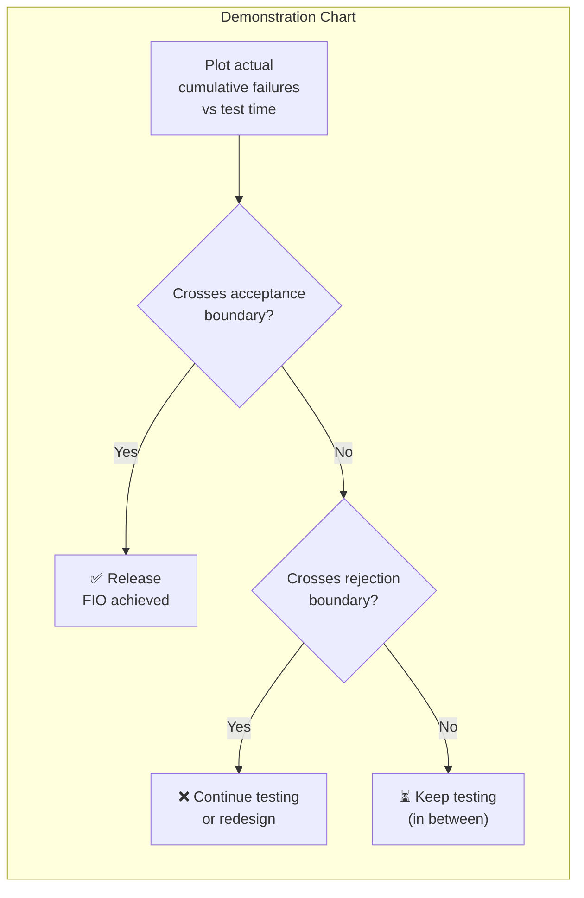

# Reliability Measurement

Reliability measurement answers two questions: **how bad are the failures?** (severity classification) and **how often do they occur?** (failure intensity and growth models) .

---

## Failure Severity Classification

Not all failures are equal. Musa defines four criteria for classifying failure severity :

| Criterion | What It Measures | Example |
|-----------|-----------------|---------|
| **Human life impact** | Risk to safety | Medical device malfunction |
| **Cost impact** | Financial consequences | Transaction processing error |
| **System capability impact** | Functional degradation | Loss of backup capability |
| **Reputation/market share** | Business consequences | Visible outage for customers |

Severity classes (typically 3-5 levels) determine how failures are weighted in reliability calculations. A system may have an acceptable failure intensity for minor failures but near-zero tolerance for safety-critical ones.

### Example: University Registration System

| Class | Definition | Example | FIO |
|-------|-----------|---------|-----|
| **1 — Critical** | Affects student records or financials | Grade database corruption | 0 failures/1000 hours |
| **2 — Major** | Blocks core workflows | Cannot register for courses during enrollment | 1 failure/1000 hours |
| **3 — Minor** | Inconvenient but workaround exists | Course search slow, filter broken | 10 failures/1000 hours |
| **4 — Cosmetic** | Visual or formatting issues | Wrong icon on schedule page | Not tracked |

A system with 5 critical failures/year is unacceptable, while the same system might tolerate 50 cosmetic issues/year. Severity classification ensures testing and monitoring effort matches business impact .

### Severity Analysis Techniques

| Technique | Approach | Best For |
|-----------|----------|----------|
| **Fault Tree Analysis (FTA)** | Top-down: start with system failure, decompose into contributing faults | Safety analysis, identifying root causes |
| **FMEA** | Bottom-up: enumerate each component's failure modes and their effects | Systematic coverage of all components |

---

## Failure Intensity and the FIO

**Failure intensity** λ(t) is the number of failures per unit time at time t — the fundamental reliability metric . Related measures:

| Metric | Formula | Meaning |
|--------|---------|---------|
| **Failure intensity** | λ(t) | Failures per time unit at time t |
| **Reliability** | R(t) = e^{-λt} | Probability of no failure in interval [0, t] (for constant λ) |
| **MTTF** | 1/λ | Mean time to next failure |
| **MTTR** | — | Mean time to repair after failure |
| **Availability** | A = MTTF/(MTTF + MTTR) | Fraction of time system is operational |

### Failure Intensity Objective (FIO)

The **FIO** is the target failure intensity that must be reached before release — "just right" reliability that balances quality against cost and schedule . The key principle: **100% reliability is the wrong target**. Beyond a threshold, users cannot distinguish reliability levels, and the opportunity cost of extreme reliability outweighs the benefit.

For availability-based objectives :

```
λ = (1 - A) / (A × t_m)
```

where A = target availability and t_m = mean repair time.

**FIO setting methods:**
1. **Profit analysis** — Balance revenue gain against testing cost
2. **Experience** — Use field data from similar systems
3. **Competition** — Match or exceed competitor reliability
4. **Sanity checks** — Verify FIO is achievable and meaningful

### Worked Example: Setting the FIO

A payment service targets **99.9% availability** with mean repair time **t_m = 1 hour**:

```
λ = (1 - 0.999) / (0.999 × 1) = 0.001 / 0.999 ≈ 0.001 failures/hour
```

This means: **at most 1 failure per 1,000 hours** of operation. Over a year (8,760 hours), that is roughly **8-9 failures allowed** — the "error budget" in modern terms.

If the current failure intensity during testing is 0.01 failures/hour, testing must continue until it drops to 0.001. The SRGM predicts when this target will be reached.

### Testing Efficiency

Operational-profile-based testing follows **diminishing returns**: the most frequent operations get tested first, finding the faults that cause the most failures. As failure intensity drops, cost per fault removal increases . The "knee" of the curve marks where system testing becomes less cost-effective than reviews or formal methods.

Industry results from AT&T's Definity PBX demonstrate the value :

| Metric | Result |
|--------|--------|
| Customer problems | Reduced **10x** |
| Serious outages (first 2 years) | **Zero** |
| System test problems | Reduced **50%** |
| SRE cost-benefit ratio | **6:1** or better |

---

## Software Reliability Growth Models (SRGMs)

SRGMs model how reliability improves during testing as faults are found and fixed. The core assumption: each fault removal permanently reduces failure intensity .

### Goel-Okumoto NHPP Model

The foundational SRGM  models cumulative failures as a Nonhomogeneous Poisson Process:

| Component | Formula | Meaning |
|-----------|---------|---------|
| Mean value function | m(t) = a(1 - e^{-bt}) | Expected cumulative failures by time t |
| Failure intensity | λ(t) = ab·e^{-bt} | Decreasing failure rate |
| Parameters | a = total expected faults, b = per-fault detection rate | Estimated from failure data |

The failure intensity decreases exponentially — the hallmark of **reliability growth**. As faults are found and fixed, the system becomes more reliable.

```vega-lite
{
  "$schema": "https://vega.github.io/schema/vega-lite/v5.json",
  "title": "Goel-Okumoto Model (a=50 faults, b=0.05/week)",
  "width": 500,
  "height": 280,
  "hconcat": [
    {
      "width": 230,
      "height": 250,
      "title": "Cumulative Failures m(t)",
      "layer": [
        {
          "data": {
            "values": [
              {"t": 0, "m": 0}, {"t": 5, "m": 11.1}, {"t": 10, "m": 19.7},
              {"t": 15, "m": 26.4}, {"t": 20, "m": 31.6}, {"t": 25, "m": 35.6},
              {"t": 30, "m": 38.8}, {"t": 35, "m": 41.3}, {"t": 40, "m": 43.2},
              {"t": 45, "m": 44.7}, {"t": 50, "m": 45.8}, {"t": 60, "m": 47.5},
              {"t": 70, "m": 48.5}, {"t": 80, "m": 49.1}
            ]
          },
          "mark": {"type": "line", "color": "#1565c0", "strokeWidth": 2.5},
          "encoding": {
            "x": {"field": "t", "type": "quantitative", "title": "Test Time (weeks)"},
            "y": {"field": "m", "type": "quantitative", "title": "Cumulative Failures", "scale": {"domain": [0, 55]}}
          }
        },
        {
          "data": {"values": [{"y": 50}]},
          "mark": {"type": "rule", "strokeDash": [4, 4], "color": "#888"},
          "encoding": {"y": {"field": "y", "type": "quantitative"}}
        }
      ]
    },
    {
      "width": 230,
      "height": 250,
      "title": "Failure Intensity λ(t)",
      "layer": [
        {
          "data": {
            "values": [
              {"t": 0, "lambda": 2.50}, {"t": 5, "lambda": 1.95}, {"t": 10, "lambda": 1.52},
              {"t": 15, "lambda": 1.18}, {"t": 20, "lambda": 0.92}, {"t": 25, "lambda": 0.72},
              {"t": 30, "lambda": 0.56}, {"t": 35, "lambda": 0.44}, {"t": 40, "lambda": 0.34},
              {"t": 45, "lambda": 0.26}, {"t": 50, "lambda": 0.21}, {"t": 60, "lambda": 0.12},
              {"t": 70, "lambda": 0.08}, {"t": 80, "lambda": 0.04}
            ]
          },
          "mark": {"type": "line", "color": "#d32f2f", "strokeWidth": 2.5},
          "encoding": {
            "x": {"field": "t", "type": "quantitative", "title": "Test Time (weeks)"},
            "y": {"field": "lambda", "type": "quantitative", "title": "Failures/week"}
          }
        },
        {
          "data": {"values": [{"y": 0.5}]},
          "mark": {"type": "rule", "strokeDash": [6, 3], "color": "#2e7d32"},
          "encoding": {"y": {"field": "y", "type": "quantitative"}}
        }
      ]
    }
  ]
}
```

{: .note }
> **Left:** Cumulative failures approach the asymptote *a* = 50 (dashed line). **Right:** Failure intensity drops exponentially; green dashed line = FIO target. Testing stops when λ(t) crosses the FIO.

### Model Classification

Vouk classifies SRGMs into three families :

| Family | Behavior | Example |
|--------|----------|---------|
| **Finite-failure** | m(t) → asymptote (finite total faults) | Goel-Okumoto, Musa Basic (BET) |
| **Infinite-failure** | m(t) grows unbounded | Musa Logarithmic Poisson (LPET) |
| **S-shaped** | Failure intensity has initial increase then decrease | Yamada delayed S-shaped |

Musa recommends using **BET and LPET together** as bounds: BET provides optimistic estimates (finite faults), LPET provides conservative estimates (unbounded). The true behavior typically falls between them .

### Certification: The Demonstration Chart

Musa's demonstration chart provides a go/no-go decision: plot cumulative failures against test time and compare to acceptance/rejection boundaries .



The acceptance and rejection boundaries are set so that the probability of a wrong release decision is below a chosen confidence level (typically 90% or 95%).

---

## SRGMs in the CI/CD Era

SRGMs assume **stable code** tested over weeks or months — the failure intensity curve decreases as faults are found. Modern CI/CD changes code hourly, invalidating the stability assumption .

| SRGM Assumption | CI/CD Reality |
|-----------------|---------------|
| Code is fixed during testing | Code changes with every commit |
| Faults are removed permanently | New faults introduced continuously |
| Failure intensity decreases | Failure intensity fluctuates |
| Testing phase has clear boundaries | Testing is continuous |

SRGMs survive in **safety-critical domains** (aerospace, nuclear, telecom) where code is stabilized before certification. In web services, they are replaced by:

- **Error budgets** as policy levers (see [From FIO to SLO](slo-bridge.md))
- **Burn-rate alerting** detecting failure spikes — the opposite of SRGM's decreasing trend
- **Canarying** limiting blast radius of new faults

The mathematical kinship remains: a burn rate of 1.0 = constant failure intensity consuming the full error budget over the SLO window.

---

## Operational Profiles

Musa's **operational profile** is a quantitative characterization of how a system will be used — a set of operations with their occurrence probabilities . It drives test allocation: test proportional to usage so the most frequent faults are found first.

Koziolek critiques the classical approach :

| Limitation | Problem |
|-----------|---------|
| Ideal users | Profiles model typical usage but real users behave unconventionally |
| Environmental gap | Ignores OS signals, device drivers, background processes |
| Protocol dependencies | Musa's tree structure can't express call ordering |
| State explosion | Markov-chain models become intractable for complex systems |

Modern systems address these limitations by measuring usage **in production** rather than predicting it upfront. Gmail's switch from server-side to client-side availability measurement revealed failures invisible to servers — exemplifying why real-time SLI monitoring superseded pre-deployment profiling .

For details on operational profile construction and testing, see [Operational Profile](../../verif/operational-profile/index.md).

---

### References



---

{: .highlight }
**Disclaimer:** AI is used for text summarization, polishing and explaining. Authors have verified all facts and claims. In case of an error, feel free to file an issue.
