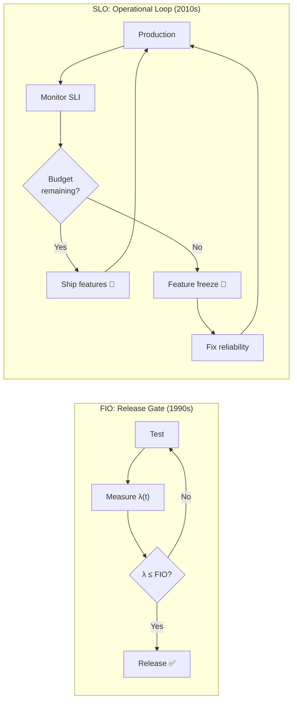
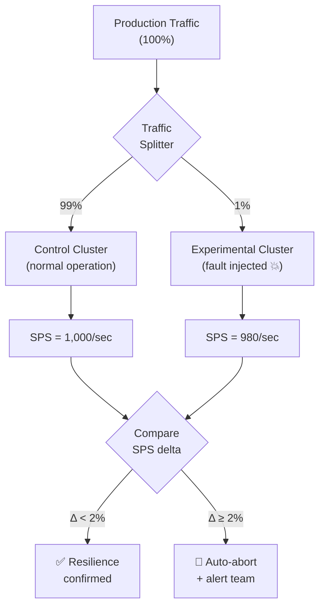
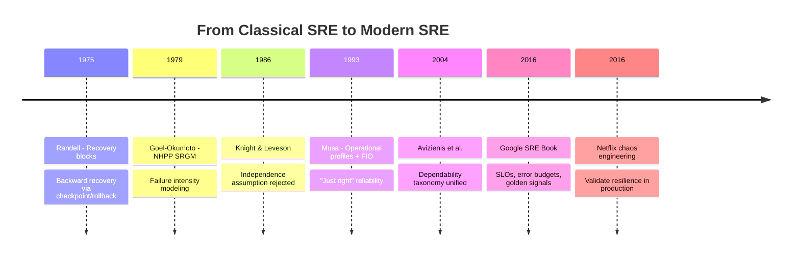

# From FIO to SLO: Classical Meets Modern Reliability

Musa's Failure Intensity Objective (1993) and Google's Service Level Objective (2016) are conceptually the same idea: define "just right" reliability to balance quality against cost and velocity  . This page traces the conceptual continuity from classical software reliability engineering to modern SRE practice.

---

## The Core Equivalence

| Classical SRE (Musa 1993-2004) | Modern SRE (Beyer 2016) | Relationship |
|--------------------------------|-------------------------|--------------|
| Failure Intensity Objective (FIO) | Service Level Objective (SLO) | Target reliability level |
| Failure intensity λ(t) | Error rate SLI | What is measured |
| Operational profile | SLI selection + Critical User Journeys | What to measure about usage |
| "Just right" reliability | Error budget (1 - SLO) | 100% is the wrong target |
| Severity classification | Service tiering | Not all failures are equal |
| Certification (demonstration chart) | SLO burn-rate alerting | Decision mechanism |
| MTTF/MTTR | Four Golden Signals | Monitoring metrics |

### The Mathematical Link

Musa's FIO formula for availability-based objectives :

```
λ = (1 - A) / (A × t_m)
```

Google's error budget :

```
Error Budget = 1 - SLO
```

Both express the same insight: **tolerable unreliability**. The FIO sets a ceiling on failure intensity before release; the error budget sets a ceiling on failure rate in production. The difference is **phase**: FIO is a release gate (stop testing when achieved), while SLO is an operational control loop (halt releases when budget is exhausted).

---

## What Changed: Phase Shift

| Aspect | FIO (Release Gate) | SLO (Operational Control) |
|--------|-------------------|--------------------------|
| **When applied** | Before release | Continuously in production |
| **Decision** | "Is the software ready to ship?" | "Can we ship more changes?" |
| **On failure** | Continue testing or redesign | Feature freeze until budget recovers |
| **Code assumption** | Stable (no changes during testing) | Changing constantly (CI/CD) |
| **Measurement** | Test environment, execution time | Production traffic, wall-clock time |
| **Feedback loop** | Weeks/months | Hours/days |

The shift from pre-deployment to operational control was driven by CI/CD: when code changes hourly, a one-time release gate is insufficient. The SLO provides the same reliability governance as the FIO but as a **continuous feedback loop** .



### Worked Example: Error Budget for a Checkout Service

A checkout service has **SLO = 99.9%** availability over a 30-day window:

| Metric | Calculation | Value |
|--------|-------------|-------|
| Error budget | 100% - 99.9% | **0.1%** |
| Total requests/month | 3,000,000 | — |
| Allowed failures/month | 3,000,000 × 0.001 | **3,000 errors** |
| Allowed downtime/month | 30 days × 0.001 | **43 minutes** |

**Scenario:** A bad deployment causes 500 errors/hour for 2 hours = 1,000 errors.

- Budget consumed: 1,000 / 3,000 = **33%** in one incident
- Remaining budget: **2,000 errors** for the rest of the month
- Action: Mandatory postmortem (>20% consumed), but no feature freeze yet

---

## From Operational Profiles to SLIs

Musa's operational profile defined **what to measure about usage** — operations and their occurrence probabilities . Modern SLIs serve the same purpose but measure symptoms in production rather than predicting usage upfront :

| Evolution | Approach | Limitation |
|-----------|----------|-----------|
| **Musa (1993)** | Task-based probability profiles for pre-deployment testing | Assumes predictable, typical users  |
| **Koziolek (2005)** | Extended profiles adding environment and data dimensions | Complex; Markov chains become intractable  |
| **Google SRE (2016)** | SLIs measuring symptoms at the system boundary in production | Reactive, not predictive |

Gmail's switch from server-side to client-side availability measurement revealed failures invisible to servers — demonstrating why production monitoring superseded pre-deployment profiling .

Musa's operational profile is the conceptual ancestor of **Critical User Journeys (CUJs)** — the key user workflows that SLOs protect.

For operational profile construction details, see [Operational Profile](../../verif/operational-profile/index.md).

---

## From SRGMs to Error Budgets

Software Reliability Growth Models track decreasing failure intensity during testing — the system improves as faults are found and fixed . Error budgets track **allowed unreliability** in production :

| SRGM Concept | Error Budget Equivalent |
|--------------|------------------------|
| Failure intensity λ(t) decreasing | Burn rate (should stay ≤ 1.0) |
| Predicted remaining faults | Budget remaining (%) |
| Certification (demo chart) | Burn-rate alerting thresholds |
| "Stop testing when FIO met" | "Halt releases when budget exhausted" |

The mathematical kinship: a **burn rate of 1.0** means constant failure intensity consuming exactly the full error budget over the SLO window. Burn rate > 1.0 triggers alerts — the operational equivalent of failing the demonstration chart .

```vega-lite
{
  "$schema": "https://vega.github.io/schema/vega-lite/v5.json",
  "title": "Error Budget Consumption Over 30-Day Window",
  "width": 500,
  "height": 280,
  "layer": [
    {
      "data": {
        "values": [
          {"day": 0, "budget": 100, "scenario": "Healthy (burn rate 0.5)"},
          {"day": 5, "budget": 92, "scenario": "Healthy (burn rate 0.5)"},
          {"day": 10, "budget": 83, "scenario": "Healthy (burn rate 0.5)"},
          {"day": 15, "budget": 75, "scenario": "Healthy (burn rate 0.5)"},
          {"day": 20, "budget": 67, "scenario": "Healthy (burn rate 0.5)"},
          {"day": 25, "budget": 58, "scenario": "Healthy (burn rate 0.5)"},
          {"day": 30, "budget": 50, "scenario": "Healthy (burn rate 0.5)"}
        ]
      },
      "mark": {"type": "line", "strokeWidth": 2.5},
      "encoding": {
        "x": {"field": "day", "type": "quantitative", "title": "Day of Month"},
        "y": {"field": "budget", "type": "quantitative", "title": "Budget Remaining (%)", "scale": {"domain": [0, 100]}},
        "color": {"field": "scenario", "type": "nominal", "title": null, "scale": {"range": ["#2e7d32", "#ff9800", "#d32f2f"]}}
      }
    },
    {
      "data": {
        "values": [
          {"day": 0, "budget": 100, "scenario": "Warning (burn rate 1.0)"},
          {"day": 5, "budget": 83, "scenario": "Warning (burn rate 1.0)"},
          {"day": 10, "budget": 67, "scenario": "Warning (burn rate 1.0)"},
          {"day": 15, "budget": 50, "scenario": "Warning (burn rate 1.0)"},
          {"day": 20, "budget": 33, "scenario": "Warning (burn rate 1.0)"},
          {"day": 25, "budget": 17, "scenario": "Warning (burn rate 1.0)"},
          {"day": 30, "budget": 0, "scenario": "Warning (burn rate 1.0)"}
        ]
      },
      "mark": {"type": "line", "strokeWidth": 2.5, "strokeDash": [6, 3]},
      "encoding": {
        "x": {"field": "day", "type": "quantitative"},
        "y": {"field": "budget", "type": "quantitative"},
        "color": {"field": "scenario", "type": "nominal"}
      }
    },
    {
      "data": {
        "values": [
          {"day": 0, "budget": 100, "scenario": "Critical (burn rate 10)"},
          {"day": 1, "budget": 67, "scenario": "Critical (burn rate 10)"},
          {"day": 2, "budget": 33, "scenario": "Critical (burn rate 10)"},
          {"day": 3, "budget": 0, "scenario": "Critical (burn rate 10)"}
        ]
      },
      "mark": {"type": "line", "strokeWidth": 2.5},
      "encoding": {
        "x": {"field": "day", "type": "quantitative"},
        "y": {"field": "budget", "type": "quantitative"},
        "color": {"field": "scenario", "type": "nominal"}
      }
    }
  ]
}
```

{: .note }
> **Green:** Healthy service — uses only half the budget. **Orange:** Budget exactly exhausted at month end (burn rate = 1.0). **Red:** Major incident — 30-day budget consumed in 3 days (burn rate = 10). This triggers an immediate page alert.

For SRE practices (error budgets, burn-rate alerting, four golden signals, toil), see [Site Reliability Engineering](../../organization/05-practice/06-site-reliability-engineering.md).

---

## Chaos Engineering: Modern Fault Tolerance Validation

Classical fault tolerance relied on design-time diversity arguments: build N versions, assume independence, predict reliability gains. Knight and Leveson (1986) showed this assumption was untenable (see [Fault Tolerance](fault-tolerance.md)). Modern systems take a different approach: **validate resilience mechanisms continuously** through fault injection in production .

### Netflix: From Chaos Monkey to ChAP

Netflix pioneered chaos engineering with four principles :

1. **Focus on steady state** — Define normal behavior via business metrics (SPS: Stream-Starts Per Second)
2. **Run in production** — Only production reveals real failure modes
3. **Vary real-world events** — Inject failures, latency, resource exhaustion
4. **Automate continuously** — Run experiments on every deployment

The Chaos Automation Platform (ChAP) compares **control vs experimental** traffic clusters with 1% sampling and automatic abort on excessive impact .



Netflix's SPS (Stream-Starts Per Second) metric serves as an SLI at the system boundary — a business-meaningful measure directly descended from Musa's "natural units" .

### Classical Concept Mapping

| Classical Concept | Chaos Engineering Equivalent |
|-------------------|------------------------------|
| Fault injection testing | FIT system (inject latency, errors, failures) |
| Operational profile (system boundary) | SPS metric (stream starts per second) |
| Failure intensity measurement | SPS deviation in experimental group |
| Graceful degradation | Fallback mechanisms (forward recovery) |
| Functional testing ("does it work?") | Chaos testing ("does it survive?") |

The evolution: from **assuming** resilience mechanisms work (classical diversity) to **validating** they work (chaos experiments) .

For chaos engineering industry practices, see [Industry Case Studies](../../organization/05-practice/07-industry-case-studies.md).

---

## The Full Arc



The conceptual thread connecting Musa to modern SRE: **quantitative, "good enough" reliability targets** that balance quality against cost. The methods changed (SRGMs → error budgets, demonstration charts → burn-rate alerts, operational profiles → SLIs), but the philosophy endured: 100% reliability is the wrong target  .

For per-service SLOs as performance budgets and tail latency in distributed systems, see [Performance in the Cloud Era](../performance/cloud-bridge.md).

---

### References



---

{: .highlight }
**Disclaimer:** AI is used for text summarization, polishing and explaining. Authors have verified all facts and claims. In case of an error, feel free to file an issue.
