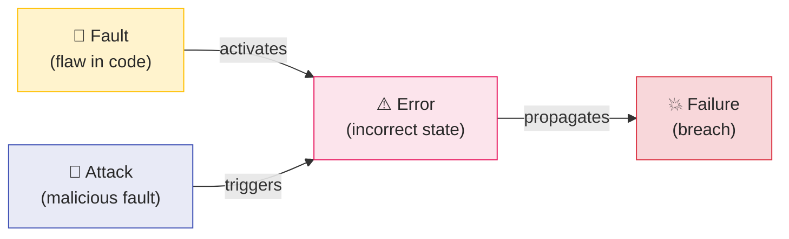

# Software Security

Software security is the ability to deliver service that can justifiably be trusted, specifically regarding the absence of unauthorized access to or handling of system state . Unlike a feature that can be bolted on, security is an **emergent property** of an entire system — adding cryptographic libraries or firewalls does not make insecure software secure .

This section covers the arc from foundational concepts (CIA triad, fault-error-failure chain) through finding vulnerabilities (SAST, DAST, fuzzing, pen testing) and threat modeling (STRIDE, OWASP, CVSS) to secure design principles (Saltzer & Schroeder) and modern DevSecOps integration.

---

## Security Within the Dependability Framework

Avizienis et al. define **dependability** as "the ability to deliver service that can justifiably be trusted" . Security is a **composite attribute** within this framework:

| Attribute | Definition | Security Role |
|-----------|-----------|---------------|
| **Confidentiality** | Absence of unauthorized disclosure | Core CIA element |
| **Integrity** | Absence of improper system alterations | Core CIA element |
| **Availability** | Readiness for correct service | Core CIA element |
| **Reliability** | Continuity of correct service | Prerequisite — secure code is more robust |
| **Safety** | Absence of catastrophic consequences | Security failures can cause safety failures |
| **Maintainability** | Ability to undergo modifications | Enables timely patching |

Both McGraw (2006) and Takanen (2008) independently affirm that "security is a subset of software quality and reliability"  . This means the same engineering discipline that produces reliable software — fault prevention, fault tolerance, fault removal, fault forecasting — applies directly to security.

---

## The Fault-Error-Failure Chain in Security

The causal chain **fault → error → failure** from dependability theory applies to security, with one critical addition: **attacks** are deliberate faults introduced by an adversary :

A **vulnerability** exists when a fault (e.g., missing bounds check) can be activated by an attack (e.g., crafted input) to produce an error (e.g., buffer overread) that propagates to a failure (e.g., data exfiltration). The Heartbleed vulnerability (CVE-2014-0160) illustrates this chain: a missing bounds check in OpenSSL's heartbeat extension allowed attackers to read up to 64KB of server memory per request .

---

## Two Strategies: Finding vs. Preventing Vulnerabilities

The literature identifies two complementary approaches  :

### Prevention (Constructive — "White Hat")

Build security into the system from the start:
- **Fault prevention:** Secure design principles , secure coding standards 
- **Fault tolerance:** Input validation, error handling, defense in depth
- **Security requirements:** SQUARE , abuse cases 

### Detection (Destructive — "Black Hat")

Find vulnerabilities before attackers do:
- **Fault removal:** SAST, DAST, code review, penetration testing 
- **Fault forecasting:** Threat modeling , CVSS scoring 

### McGraw's 50/50 Split

McGraw argues that roughly **50% of security problems are implementation bugs** (buffer overflows, SQL injection) and **50% are design flaws** (insecure architecture, missing authentication) . This means:

- Code-level tools (SAST, linters) only address half the problem
- Design-level analysis (threat modeling, architecture review) is equally essential
- His **7 Touchpoints** model interleaves constructive and destructive activities across every SDLC phase

Howard's **SD3** — Secure by Design, Secure by Default, Secure in Deployment — operationalizes prevention at every stage . "You cannot build a secure system until you understand your threats" — threat modeling alone finds approximately 50% of security flaws.

---

## The Cost of Insecurity

Security problems found late cost dramatically more to fix:

| Metric | Value | Source |
|--------|-------|--------|
| Average data breach cost | $4.88M |  |
| Time to identify breach | 194 days |  |
| Healthcare breach cost | $9.77M |  |
| Incidents exploiting known vulns | 90% |  |
| Code review security resolution | 65.9% |  |
| Effective scan results | Only 30% |  |

The economics strongly favor prevention: 90% of security incidents exploit **known** vulnerabilities that could have been caught earlier . Yet security is often treated as an afterthought, with organizations discovering breaches only after an average of 194 days .

---

## Security Across the SDLC

Security activities map to every phase of the software development lifecycle:

| Phase | Security Activity | Key Technique | Case Study |
|-------|-------------------|---------------|------------|
| **Requirements** | Security requirements engineering | SQUARE, ARQAN   | — |
| **Design** | Threat modeling | STRIDE, DFDs  | SolarWinds (no TM)  |
| **Implementation** | Static analysis, code review | SAST, CERT standards  | Heartbleed  |
| **Testing** | Dynamic testing, pen testing | DAST, fuzzing  | Equifax  |
| **Deployment** | Pipeline security | IAST, RASP, DevSecOps  | Log4Shell  |
| **Operations** | Monitoring, patching | SIEM, incident response | WannaCry  |

For the dependability framework (faults, errors, failures), see [Reliability](../reliability/index.md). For fuzzing techniques, see [Fuzzing](../../verif/random/fuzzing.md).

---

## Section Overview

| Page | Content |
|------|---------|
| [Testing Techniques](testing-techniques.md) | SAST, DAST, IAST, fuzzing, pen testing, code review — how to find vulnerabilities |
| [Threat Modeling](threat-modeling.md) | STRIDE, OWASP Top 10, CVSS, 12 TM methods — how to anticipate threats |
| [Secure Design](secure-design.md) | Saltzer & Schroeder's 8 principles, input validation, DevSecOps, SQUARE — how to build secure systems |

---

### References



---

{: .highlight }
**Disclaimer:** AI is used for text summarization, polishing and explaining. Authors have verified all facts and claims. In case of an error, feel free to file an issue.
