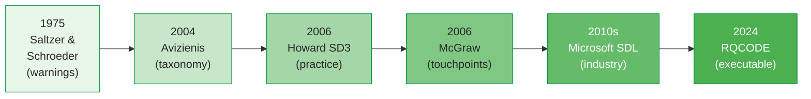
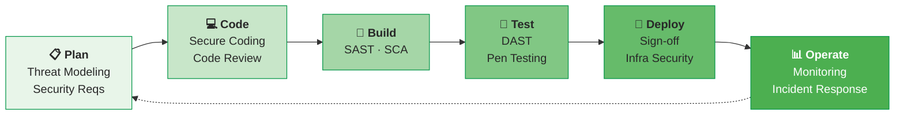

# Saltzer & Schroeder's 8 Principles Still Define Secure Design After 50 Years

In 1975, Saltzer and Schroeder published eight design principles for computer system protection . Remarkably, these principles remain the foundation of modern secure software engineering — from container isolation (least privilege) to open-source security (open design) to zero-trust architectures (complete mediation). Their evolution traces a clear arc from conceptual warnings to executable code artifacts.

---

## The Eight Principles

| # | Principle | Definition | Modern Example |
|---|-----------|-----------|----------------|
| 1 | **Economy of mechanism** | Keep the design as simple as possible | Microservices over monoliths; Log4Shell violated this — complex JNDI lookup in a logging library  |
| 2 | **Fail-safe defaults** | Base access on permission, not exclusion | Default-deny firewall rules; allowlists over blocklists |
| 3 | **Complete mediation** | Check every access to every object | Zero-trust architecture; OAuth token validation on every request |
| 4 | **Open design** | Security should not depend on secrecy of design | Open-source security; SolarWinds violated this — security depended on build process secrecy  |
| 5 | **Separation of privilege** | Require multiple conditions for access | Multi-factor authentication; code review + CI approval for merge |
| 6 | **Least privilege** | Grant only the minimum access needed | Container security (rootless), IAM roles, browser sandboxing |
| 7 | **Least common mechanism** | Minimize shared mechanisms between users | Process isolation, separate security domains, microservice boundaries |
| 8 | **Psychological acceptability** | Security mechanisms must be easy to use correctly | Password managers; if security is too hard, users bypass it |

### The Evolution Arc

The principles evolved from conceptual "warnings" (1975) → formal taxonomy elements (Avizienis 2004) → industry standard practices (Microsoft SDL, Howard's SD3) → executable code artifacts (RQCODE 2024)   .

---

## Howard's SD3: Secure by Design, Default, Deployment

Howard and LeBlanc operationalize Saltzer's principles into three actionable mandates :

| Principle | Meaning | Practice |
|-----------|---------|----------|
| **Secure by Design** | Architecture prevents entire vulnerability classes | Threat modeling, principle of least privilege, defense in depth |
| **Secure by Default** | Out-of-the-box configuration is safe | Minimal attack surface, all features opt-in, no default passwords |
| **Secure in Deployment** | Tools and guidance for secure operation | Security guides, patch management, monitoring |

### "All Input Is Evil Until Proven Otherwise"

Howard's most influential maxim: treat all external input as potentially malicious . The implementation strategy:

- **Whitelist over blacklist** — define what is allowed, reject everything else
- **Input chokepoints** — centralized validation at system boundaries (not scattered throughout code)
- **Canonical form** — normalize input before validation (prevent encoding attacks)
- **Dangerous C functions** — never use `gets()`, `strcpy()`, `sprintf()`, `scanf()` without bounds checking

Heartbleed (CVE-2014-0160) violated this principle: the OpenSSL heartbeat extension trusted the length field in the request without bounds checking, allowing attackers to read up to 64KB of server memory per heartbeat request . A 2-line bounds check would have prevented the vulnerability.

---

## Case Studies: Principles Violated

### Heartbleed (2014) — Economy of Mechanism Violated

| Aspect | Detail |
|--------|--------|
| **CVE** | CVE-2014-0160  |
| **CVSS** | 7.5 (High) |
| **Root cause** | Missing bounds check in OpenSSL heartbeat extension |
| **Impact** | 17% of HTTPS servers affected; private keys, passwords, session tokens exposed |
| **Principle violated** | Economy of mechanism — heartbeat feature added unnecessary complexity to a critical library |
| **CERT rule violated** | ARR38-C: guarantee library functions don't form invalid pointers |
| **Fix** | 2 lines of code: validate payload length against record length |

### Log4Shell (2021) — Economy of Mechanism Violated

| Aspect | Detail |
|--------|--------|
| **CVE** | CVE-2021-44228  |
| **CVSS** | 10.0 (Critical) |
| **Root cause** | JNDI lookup enabled by default in logging library |
| **Impact** | 93% of enterprise cloud environments vulnerable ; 2M+ attacks/hour |
| **Principle violated** | Economy of mechanism — a logging library should not perform remote code execution |
| **Fix** | Disable JNDI lookup by default (fail-safe defaults) |

### SolarWinds (2020) — Open Design Violated

| Aspect | Detail |
|--------|--------|
| **Timeline** | Compromise: Sep 2019 → Discovery: Dec 2020 (9 months undetected) |
| **Root cause** | Attackers injected malicious code into the Orion build process  |
| **Impact** | 18,000 organizations installed compromised update  |
| **Principle violated** | Open design — security depended on build process secrecy, not on verifiable integrity |
| **Triggered** | Executive Order 14028 mandating SBOMs and supply chain security |

### WannaCry (2017) — Complete Mediation Violated

| Aspect | Detail |
|--------|--------|
| **CVE** | CVE-2017-0144 (EternalBlue)  |
| **Impact** | 200K+ computers, 150 countries, NHS £92M |
| **Principle violated** | Complete mediation — SMBv1 did not validate all incoming packets |
| **Lesson** | Patch was available 2 months before the attack; operational discipline matters |

---

## DevSecOps: Integrating Security Into CI/CD

DevSecOps extends DevOps by embedding security activities into every pipeline stage :

### Pipeline Reality

| Challenge | Evidence | Source |
|-----------|----------|--------|
| Pipeline overhead | 14 min total; ZAP = 6:52 bottleneck |  |
| False positive rate | 70% of findings are not real vulnerabilities |  |
| Tool integration | Speed mismatch: scans take hours, deploys take minutes |  |
| Requirement mapping | ARQAN achieves 85% accuracy mapping reqs → controls |  |
| Automation rate | RQCODE automates 62% of security checks as code |  |

---

## Supply Chain Security

Williams et al. (2025) identify three attack vectors threatening the entire DevSecOps model :

| Vector | Attack Type | Case Study |
|--------|------------|------------|
| **Dependencies** | Malicious or vulnerable components | Log4Shell — accidental vulnerability in ubiquitous library  |
| **Build infrastructure** | Compromised CI/CD pipeline | SolarWinds — malicious code injected during build  |
| **Humans** | Social engineering of maintainers | XZ Utils — years-long social engineering to insert backdoor |

Countermeasures include:
- **SBOMs** (Software Bills of Materials) — inventory all dependencies; adoption accelerated by Log4Shell
- **Automated VEX** — reachability analysis to reduce false positives
- **Reproducible builds** — verify that binary matches source code
- **ML-based detection** — identify malicious commits and dependency patterns

---

## Security Requirements Engineering: SQUARE

The Security Quality Requirements Engineering (SQUARE) methodology provides a systematic 9-step process for eliciting and prioritizing security requirements :

| Step | Activity |
|------|----------|
| 1 | Agree on definitions |
| 2 | Identify security goals |
| 3 | Develop artifacts (misuse cases, attack trees) |
| 4 | Perform risk assessment |
| 5 | Select elicitation technique (e.g., ARM) |
| 6 | Elicit security requirements |
| 7 | Categorize requirements |
| 8 | Prioritize requirements (e.g., AHP) |
| 9 | Inspect requirements |

### Requirements as Code (RQCODE)

Sadovykh et al. (2024) advance requirements engineering with **RQCODE** — a framework that formalizes security controls as executable Java objects with `check()` and `enforce()` methods :

| Component | Purpose | Accuracy |
|-----------|---------|----------|
| **ARQAN** | NLP/SBERT mapping from vague requirements → STIG controls | 85% mapping accuracy |
| **RQCODE** | Testable security requirements as code | 62% automation rate |
| **Coverage** | IEC 62443 → platform-specific STIGs | 66.15% of STIGs |

This represents the current state of the art in making security requirements both **systematic** (SQUARE's structured process) and **enforceable** (RQCODE's executable checks). McGraw's three pillars — applied risk management, software security touchpoints, and knowledge — provide the strategic framework, with abuse cases explicitly integrating attacker thinking into the requirements phase .

---

### References



---

{: .highlight }
**Disclaimer:** AI is used for text summarization, polishing and explaining. Authors have verified all facts and claims. In case of an error, feel free to file an issue.
