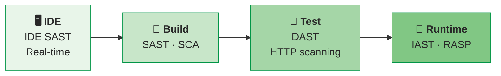

# Security Testing: No Single Technique Provides Complete Coverage

Security testing verifies that software correctly implements the CIA triad — confidentiality, integrity, and availability — plus authentication, authorization, and non-repudiation . The literature unanimously recommends combining multiple techniques because no single approach can find all vulnerability classes .

> "Security is not security software — adding SSL, crypto features, or a firewall doesn't solve the security problem." — McGraw (2006) 

---

## Five Approaches to Finding Vulnerabilities

| Technique | Approach | Best For | SDLC Phase |
|-----------|----------|----------|------------|
| **SAST** | Analyze source code without executing | Implementation bugs, coding standard violations | Build |
| **DAST** | Test running application via HTTP/inputs | Runtime vulnerabilities, configuration issues | Test |
| **Fuzzing** | Send random/mutated inputs to interfaces | Crashes, memory corruption, unexpected behavior | Test |
| **Pen Testing** | Simulate real attacker with human judgment | Business logic flaws, attack chain validation | Test/Deploy |
| **Code Review** | Human examination of code changes | Design flaws, security-sensitive logic | Implementation |

---

## Static Analysis (SAST)

Static Application Security Testing analyzes source code or bytecode **without executing** the program. Chess & West (2007) describe a spectrum of techniques, each trading precision for coverage :

| Technique | What It Checks | Precision | Speed |
|-----------|---------------|-----------|-------|
| **Lexical analysis** | Dangerous function names (e.g., `gets()`, `strcpy()`) | Low | Very fast |
| **AST / Semantic** | Language-aware pattern matching | Medium | Fast |
| **Dataflow / Taint** | Tracks untrusted data from source to sink | High | Moderate |
| **Control flow** | Execution path analysis | High | Slow |
| **Abstract interpretation** | Mathematical approximation of all states | Very high | Very slow |
| **Model checking** | Exhaustive state space exploration | Highest | Slowest |

### Why SAST Has Inherent False Positives

Rice's Theorem proves it is **impossible to perfectly determine any nontrivial property** of a general program . This means every static analysis tool must choose:

- **Sound** (find all bugs, accept false positives) — preferred for security
- **Complete** (no false positives, may miss bugs) — preferred for developer experience

In practice, only 30% of automated scan results are effective vulnerabilities, causing "alert fatigue" that leads teams to distrust and ignore findings . SAST also finds implementation bugs well but **cannot find design-level flaws** — it cannot tell you that your authentication architecture is wrong .

---

## Dynamic Analysis (DAST)

Dynamic Application Security Testing probes a **running application** through its external interfaces, typically HTTP requests for web applications. OWASP defines two modes :

- **Passive mode:** Observe traffic without modification (proxy-based)
- **Active mode:** Send attack payloads (SQL injection, XSS, CSRF probes)

### DAST in CI/CD Pipelines

Rangnau et al. (2020) measured the practical cost of integrating DAST into CI/CD :

| Metric | Value |
|--------|-------|
| Total pipeline time | 14 min 6 sec |
| ZAP container build (bottleneck) | 6 min 52 sec |
| DAST techniques tested | 3 (passive proxy, active scan, API fuzzing) |
| Pipeline behavior on findings | Fails build when thresholds exceeded |

The fundamental tension: security scans take hours while DevOps deploys in minutes . Solutions include running DAST **in parallel** (not blocking the pipeline) and using IAST for faster feedback.

---

## Fuzzing

Fuzzing tests software by sending **random or semi-random inputs** to program interfaces and monitoring for crashes or unexpected behavior. Takanen et al. (2008) define two axes of classification :

| Axis | Options |
|------|---------|
| **Input generation** | **Generation-based** (from protocol spec) vs **Mutation-based** (modify valid inputs) |
| **Intelligence** | **Dumb** (random) vs **Smart** (grammar/protocol-aware) |

### The Fuzzing Lifecycle

Takanen describes a 6-phase process :

1. **Identify interfaces** — network protocols, file formats, APIs
2. **Generate inputs** — create test cases from spec or mutation
3. **Send inputs** — deliver to target system
4. **Monitor** — watch for crashes, hangs, memory errors
5. **Analyze** — determine root cause of failures
6. **Report** — document findings with reproducible test cases

### Coverage-Bug Correlation

Takanen's empirical observation: **1% increase in code coverage ≈ 1% more bugs found** . This quantifies fuzzing's fundamental limitation — with infinite input space, fuzzing can never prove security, but it can systematically improve it.

For comprehensive fuzzing coverage (Miller's foundational work, AFL, SAGE, directed fuzzing), see [Fuzzing](../../verif/random/fuzzing.md).

---

## Penetration Testing

Penetration testing simulates a real attacker using a combination of automated tools and **human judgment**. Weidman (2014) defines a 7-phase methodology :

| Phase | Activity |
|-------|----------|
| 1. Pre-engagement | Scope, rules of engagement, authorization |
| 2. Information gathering | OSINT, DNS, network scanning |
| 3. Threat modeling | Identify likely attack paths |
| 4. Vulnerability analysis | Scan and manually verify vulnerabilities |
| 5. Exploitation | Attempt to gain access |
| 6. Post-exploitation | Pivot, escalate privileges, assess impact |
| 7. Reporting | Document findings with remediation advice |

> "Penetration tests truly begin after exploitation — post-exploitation determines real business impact." — Weidman (2014) 

### Team Structure

NIST SP 800-115 defines three team types for security assessments :

| Team | Knowledge | Simulates |
|------|-----------|-----------|
| **Red** (external) | No insider knowledge | Outside attacker |
| **Blue** (internal) | Full system knowledge | Defensive team |
| **White** (hybrid) | Partial knowledge | Insider threat or guided assessment |

---

## Code Review for Security

Yu et al. (2023) conducted the largest empirical study of security defect detection through code review, analyzing 432K review comments across OpenStack and Qt :

| Finding | Value |
|---------|-------|
| Security-related comments | < 1% of all review comments |
| Security defects resolved | 65.9% overall |
| Resolution when reviewer suggests fix | 81.3% |
| Top defect: race conditions | 39% of security defects |
| Second: crashes/resource management | 22.8% |

The key insight: security defects are **rare in code review** but have high resolution rates when reviewers provide concrete fix suggestions. Code review complements automated tools by catching design-level issues and security-sensitive logic that SAST cannot detect.

Howard estimates that threat modeling finds ~50% of security flaws, with code review finding the complementary 50% .

---

## SAST vs. DAST vs. IAST vs. RASP

Modern security testing increasingly uses hybrid approaches :

| Tool Type | How It Works | Strengths | Weaknesses |
|-----------|-------------|-----------|------------|
| **SAST** | Analyzes source/bytecode | Early feedback, full code coverage | False positives (Rice's Theorem), no runtime context |
| **DAST** | Probes running app externally | Finds runtime issues, low false positives | Slow, limited coverage, no code location |
| **IAST** | Agent inside running app | Combines SAST+DAST precision, code-level detail | Requires instrumented runtime |
| **RASP** | Self-protecting runtime agent | Real-time attack blocking | Performance overhead, not a testing tool |
| **SCA** | Scans dependencies | Finds known CVEs in libraries | Cannot detect novel vulnerabilities |

The trend is toward **shifting left** — catching vulnerabilities as early as possible in the development cycle. IDE-integrated SAST provides real-time feedback during coding, while SCA catches known dependency vulnerabilities at build time .

---

## Empirical Reality: Speed vs. Thoroughness

The fundamental challenge of security testing in modern development:

| Challenge | Evidence | Source |
|-----------|----------|--------|
| Scan speed mismatch | Static scans take hours; DevOps deploys in minutes |  |
| False positive rate | Only 30% of findings are real vulnerabilities |  |
| Alert fatigue | Teams distrust and ignore automated findings |  |
| Pipeline overhead | 14 min total; ZAP = 6:52 bottleneck |  |
| No silver bullet | No single tool covers all vulnerability classes |  |

The solution is a **layered approach**: fast tools (IDE SAST, SCA) gate the pipeline, while thorough tools (DAST, pen testing) run in parallel or on schedule. McGraw's 7 Touchpoints model provides the framework: code review (Touchpoint 1) → architecture risk analysis (Touchpoint 2) → penetration testing (Touchpoint 3), each addressing a different vulnerability class .

---

### References



---

{: .highlight }
**Disclaimer:** AI is used for text summarization, polishing and explaining. Authors have verified all facts and claims. In case of an error, feel free to file an issue.
