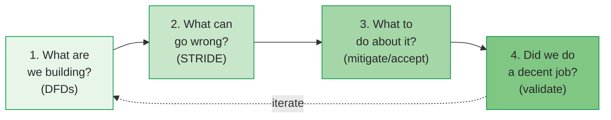

# Threat Modeling: 81% Precision, But Only 36% Recall

Threat modeling is a systematic process for identifying security threats to a system before they are exploited. Shostack (2014) argues it should be a **basic professional skill** — "like version control" — not a specialist activity . Yet empirical studies show that current practice is at the lowest maturity level, with significant room for improvement .

---

## Shostack's 4-Step Framework

Shostack distills threat modeling into four questions :

| Step | Question | Technique |
|------|----------|-----------|
| 1 | **What are we building?** | Data Flow Diagrams (DFDs) |
| 2 | **What can go wrong?** | STRIDE categories |
| 3 | **What are we going to do about it?** | Mitigate, eliminate, transfer, or accept |
| 4 | **Did we do a decent job?** | Validate completeness and consistency |

The process starts with Data Flow Diagrams showing trust boundaries, data stores, processes, and external entities. Threats are then systematically elicited by applying STRIDE categories to each DFD element.

---

## STRIDE Threat Categories

Microsoft's STRIDE framework provides a mnemonic for six threat categories :

| Category | Threat | Property Violated | Example |
|----------|--------|-------------------|---------|
| **S**poofing | Pretending to be someone else | Authentication | Stolen credentials |
| **T**ampering | Modifying data or code | Integrity | Man-in-the-middle attack |
| **R**epudiation | Denying an action occurred | Non-repudiation | Unsigned transactions |
| **I**nformation Disclosure | Exposing data to unauthorized parties | Confidentiality | Heartbleed (CVE-2014-0160)  |
| **D**enial of Service | Making a system unavailable | Availability | WannaCry ransomware  |
| **E**levation of Privilege | Gaining unauthorized access | Authorization | Buffer overflow → root |

Shostack candidly acknowledges that STRIDE "makes a lousy taxonomy" — it was designed as a **mnemonic to prompt thinking**, not a rigorous classification system . Categories overlap, and real attacks often span multiple categories.

---

## STRIDE Empirical Effectiveness

Scandariato et al. (2015) conducted the most rigorous empirical evaluation of STRIDE to date, with 57 participants applying STRIDE to a web application :

| Metric | Value | Implication |
|--------|-------|-------------|
| **Precision** | 81% | Most identified threats are valid |
| **Recall** | 36% | **64% of actual threats are missed** |
| **Productivity** | 1.8 valid threats/hour | Drops to 0.9 with documentation overhead |
| **Main weakness** | Spoofing, tampering under-reported | Participants focus on familiar categories |

### What This Means

STRIDE is **good at confirming** threats you identify (81% precision) but **poor at finding all** threats (36% recall). This means:

- STRIDE should not be the **only** threat identification technique
- Teams should combine STRIDE with attack trees, LINDDUN (privacy), or other complementary methods
- The 1.8 threats/hour rate means a moderately complex system requires significant time investment

---

## Threat Modeling Maturity

Yskout et al. (2020) proposed a 5-level maturity model and found that most organizations are at **Level 1 (ad-hoc)** :

| Level | Name | Description |
|-------|------|-------------|
| 1 | **Ad-hoc** | Informal, inconsistent, individual expertise |
| 2 | **Repeatable** | Documented process, basic templates |
| 3 | **Defined** | Standardized across organization, training |
| 4 | **Managed** | Measured, tracked, continuously improved |
| 5 | **Optimized** | Automated, self-adaptive, integrated into CI/CD |

### Key Findings

| Finding | Value |
|---------|-------|
| Average project TM effort | 69 hours (SD=32) |
| Threat elicitation share | Only 1/3 of total effort |
| Research focus | Disproportionately on elicitation |
| Adoption criteria | 6: model-based, traceable, systematic, business-integrated, context-aware, scalable |

The gap between **research focus** (mostly on threat elicitation techniques) and **practitioner needs** (equal time on modeling, analysis, and review) suggests that advancing maturity requires tools and processes for the entire TM lifecycle, not just better threat identification.

---

## 12 Threat Modeling Methods

Shevchenko et al. (2018) surveyed 12 threat modeling methods at the SEI/CMU :

| Method | Focus | Strengths | Limitations |
|--------|-------|-----------|-------------|
| **STRIDE** | Per-element threats via DFDs | Most mature, systematic | Scalability, 36% recall |
| **PASTA** | Risk-centric, 7-stage process | Business context | Complex, requires expertise |
| **LINDDUN** | Privacy threats | Complements STRIDE for GDPR | Privacy-only scope |
| **Attack Trees** | Decompose attack goals | Visual, intuitive | Manual, no tool support |
| **CVSS Scoring** | Vulnerability severity | Standardized, quantitative | Scores may vary across experts |
| **Trike** | Requirements-based, risk model | Formal risk assessment | Limited adoption |

The survey's key conclusion: **no single best method** — selection depends on project needs, team expertise, and regulatory context . STRIDE remains the most mature and widely adopted, but organizations should consider combining methods for comprehensive coverage.

---

## OWASP Top 10

The OWASP Top 10 catalogues the most critical web application security risks, updated periodically based on industry data :

| # | Risk | Case Study |
|---|------|------------|
| A01 | **Broken Access Control** | Target: HVAC vendor credentials → 40M cards  |
| A02 | **Cryptographic Failures** | Heartbleed: missing bounds check → memory leak  |
| A03 | **Injection** | Equifax: Apache Struts RCE → 147M records  |
| A04 | **Insecure Design** | SolarWinds: no threat model for build process  |
| A05 | **Security Misconfiguration** | Default credentials, unnecessary services |
| A06 | **Vulnerable Components** | Log4Shell: JNDI lookup → RCE in 93% of clouds  |
| A07 | **Authentication Failures** | Credential stuffing, session fixation |
| A08 | **Software & Data Integrity** | SolarWinds: compromised build pipeline  |
| A09 | **Logging & Monitoring Failures** | WannaCry: patch available 2 months before attack  |
| A10 | **Server-Side Request Forgery** | Cloud metadata endpoint abuse |

The Top 10 is not a testing methodology but a **prioritization guide** — it helps teams focus security effort on the most impactful risk categories.

---

## CVSS: Scoring Vulnerability Severity

The Common Vulnerability Scoring System quantifies vulnerability severity on a 0-10 scale using three metric groups  :

| Metric Group | What It Measures | When Applied |
|-------------|-----------------|--------------|
| **Base** | Intrinsic vulnerability characteristics (attack vector, complexity, impact on CIA) | At disclosure |
| **Temporal** | How the threat evolves over time (exploit maturity, patch availability) | Over time |
| **Environmental** | Organization-specific context (asset criticality, existing mitigations) | Per deployment |

### Severity Scale (CVSS v3.1)

| Rating | Score Range | Example |
|--------|------------|---------|
| None | 0.0 | Informational finding |
| Low | 0.1–3.9 | Minor information disclosure |
| Medium | 4.0–6.9 | XSS requiring user interaction |
| High | 7.0–8.9 | SQL injection in authenticated endpoint |
| Critical | 9.0–10.0 | Log4Shell (10.0), Heartbleed (7.5), EternalBlue (8.1) |

Log4Shell (CVE-2021-44228) scored **CVSS 10.0** — the maximum — because it required no authentication, could be triggered remotely, and provided full system compromise .

{: .note }
> CVSS scores may be inconsistent across experts . The Base score captures technical severity but not business impact — a CVSS 10.0 vulnerability in an internal tool may matter less than a CVSS 6.0 in a payment system.

---

### References



---

{: .highlight }
**Disclaimer:** AI is used for text summarization, polishing and explaining. Authors have verified all facts and claims. In case of an error, feel free to file an issue.
