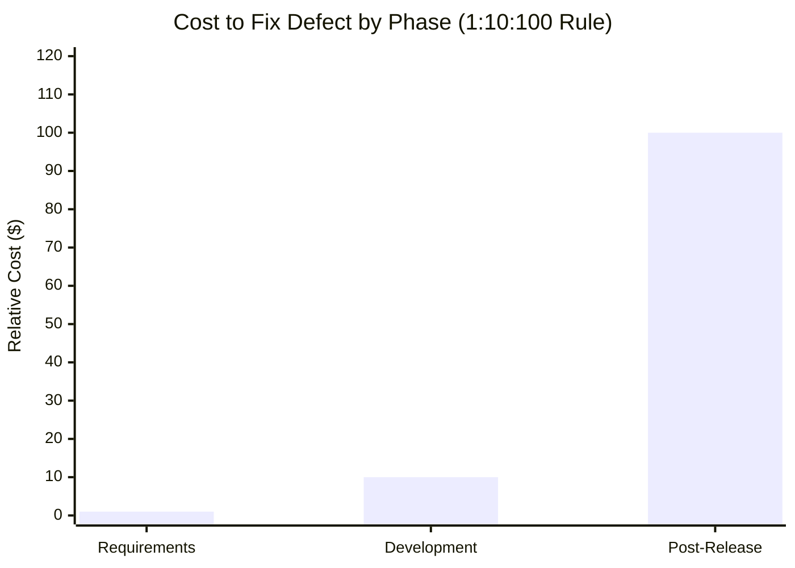

# Defect Classification Schemes

Defect Classification Schemes provide a structured methodology for technical teams to categorize software anomalies, enabling objective feedback on development processes and identification of systemic quality gaps  .

## Kan's Origin/Where-Found Matrix

The Origin/Where-Found Matrix, introduced by Kan (2002), is the simplest defect classification scheme and provides immediate insight into V&V effectiveness .

### The Core Idea

Every defect has two key properties:
- **Origin** — Which phase injected it? (Requirements, Design, Code)
- **Where Found** — Which activity detected it? (Inspection, Test, Field)

Cross-tabulating these reveals **escape patterns** — defects that slip through multiple phases before detection, accumulating cost at each stage.

### Real Project Data

Kan provides this matrix from an actual software project (3,465 defects):

| Origin ↓ / Found → | Req Insp | HLD Insp | LLD Insp | Code Insp | UT | IT | ST | Field | **Total** |
|--------------------|----------|----------|----------|-----------|-----|-----|-----|-------|-----------|
| **HLD** | 49 | 681 | — | — | — | — | — | — | 730 |
| **LLD** | 6 | 42 | 681 | — | — | — | — | — | 729 |
| **Code** | 12 | 28 | 114 | 941 | — | — | — | — | 1,095 |
| **UT** | 21 | 43 | 43 | 223 | 2 | — | — | — | 332 |
| **IT** | 20 | 41 | 61 | 261 | — | 1 | — | — | 387 |
| **ST** | 6 | 8 | 24 | 72 | — | — | 1 | — | 111 |
| **Field** | 6 | 16 | 16 | 40 | — | — | — | 1 | 81 |
| **Column Total** | 122 | 859 | 939 | 1,537 | 2 | 4 | 1 | 1 | **3,465** |

### How to Read the Matrix
```mermaid
quadrantChart
    title Matrix Interpretation
    x-axis Early Detection --> Late Detection
    y-axis Late Injection --> Early Injection
    quadrant-1 Expensive escapes
    quadrant-2 Good: caught early
    quadrant-3 Expected: code bugs in test
    quadrant-4 Very expensive
```

| Pattern | Location | Meaning | Action |
|---------|----------|---------|--------|
| **High diagonal** | Same phase | Caught where injected | ✅ Ideal |
| **Below diagonal** | Lower-left | Early injection, early catch | ✅ Good |
| **Above diagonal** | Upper-right | Escaped multiple phases | ⚠️ V&V gap |
| **High "Field" column** | Right edge | Customer found it | 💥 Expensive |

### Key Insights from the Data

1. **Inspections are effective:** 3,457 of 3,465 defects (99.8%) caught before testing
2. **Field escapes exist:** 81 defects reached customers despite strong inspections
3. **Design defects propagate:** HLD defects found in code inspection (28) indicate missed design reviews

### Actionability for CoQ

The matrix directly supports Cost of Quality decisions:

| If you see... | It means... | Invest in... |
|---------------|-------------|--------------|
| High Field column | V&V not catching defects | More/earlier inspections |
| High row total, low early columns | Injection > early removal | Prevention at that phase |
| Defects far from diagonal | Late detection of early bugs | Shift-left activities |

> **Connection to lecture:** This is the minimum classification needed to make CoQ actionable. Without knowing origin and detection phase, you can't target prevention investments.

### Agile Adaptation

Even with fewer formal phases, track:
- **Origin:** Story, Design, Code
- **Found:** PR Review, CI, QA, Production

The principle remains: diagonal = good, far from diagonal = expensive.

## Orthogonal Defect Classification (ODC)

ODC is a methodology developed by IBM that uses a set of non-redundant (orthogonal) attributes to span the defect information space . It is specifically designed to provide objective, data-based decision support for technical teams, not just management .

### Submittor Attributes (Classified at Detection)

| Attribute | Description | Examples |
|-----------|-------------|----------|
| **Activity** | Process step exposing the defect | Code Inspection, Function Test |
| **Trigger** | Condition required to expose defect | Coverage, Variation, Sequencing, Interaction |
| **Impact** | Actual or perceived customer impact | Usability, Reliability, Performance |

**Trigger Types:**
- Coverage, Variation, Sequencing
- Interaction, Workload/Stress
- Recovery/Exception
- Software Configuration

### Responder Attributes (Classified at Fix)

| Attribute | Description | Values |
|-----------|-------------|--------|
| **Target** | Entity that was fixed | Design, Code, Documentation |
| **Defect Type** | Nature of the correction | See below |
| **Qualifier** | Specificity of change | Missing, Incorrect, Extraneous |

**Defect Types:**
- Assignment/Initialization
- Checking
- Algorithm/Method
- Function/Class/Object
- Timing/Serialization
- Interface/OO Messages
- Relationship

### Process Feedback Through Signatures

ODC provides feedback through "signatures"—characteristic patterns of defect distributions :

> *If a team finds 60% of defects in base code with only single-function triggers, the product is likely not ready for release, as complex interaction testing has not yet matured.*

## HP's Defect Origins, Types, and Modes

The HP model is designed to maximize process improvement during project retrospectives :

### Critical Comparison to ODC

| Aspect | ODC | HP Model |
|--------|-----|----------|
| **Focus** | Where the fix was implemented | Where defect could have been prevented |
| **Terminology** | "Target" | "Origin" |
| **Finding** | 76% Code defects | 63% Design defects |

The fundamental semantic difference: ODC's "Target" identifies where the fix was implemented, while HP's "Origin" identifies the first activity where the defect could have been **prevented** .

### Defect Cost Weighting

HP applies industry-derived multipliers showing that not all defects are equal :

| Origin Phase | Cost Multiplier |
|--------------|-----------------|
| **Specification** | 14.25× |
| **Design** | 6.25× |
| **Code** | 2.5× |

This demonstrates the economic superiority of early-phase prevention.

## LiDeC (Lightweight Defect Classification)

LiDeC was developed for embedded automotive software where source code is often supplier-owned, limiting an OEM's ability to perform fine-grained analysis :

### Design Goals

- Minimize "process footprint" by raising abstraction level
- Reduce classification effort (vs. 19 minutes per defect for standard Root Cause Analysis)
- Support distributed development environments
- Enable safety-specific tracking (ISO 26262)

### Four Lifecycle Phases

| Phase | Purpose |
|-------|---------|
| **Recognition** | Discovery data (who, when, where found) |
| **Analysis** | Underlying cause, injection activity |
| **Resolution** | Impact, required verification |
| **Post-mortem** | Final state, lessons learned |

### Key Difference from ODC

LiDeC replaces fine-grained code categories with high-level characterizations and adds **safety-specific attributes** :

- Functional Safety Impact
- ASIL-classified requirements (per ISO 26262)
- Supplier vs. OEM responsibility tracking

## Connection to Cost of Quality

Defect classification is the bridge between technical findings and the language of money used by upper management :

### Prevention vs. Failure Tracking

Classification allows organizations to track the shift from:
- **External Failure costs** (customer complaints, reputation damage)
- **To Prevention and Appraisal costs** (training, formal inspections)

### ROI Evidence

Raytheon data shows that systematic defect tracking supports dramatic improvement :

| Metric | CMM Level 1 | CMM Level 3 |
|--------|-------------|-------------|
| Total CoSQ | ~65% | ~20% |
| Rework costs | ~50% | <10% |

### The 1:10:100 Rule

Classification schemes prove that a defect caught in requirements ($1) is 100× cheaper than one found after release ($100+), justifying the "front-loading" of quality processes .



## Choosing a Classification Scheme

## Choosing a Classification Scheme

| Scheme | Start Here If... | Dimensions | Overhead |
|--------|------------------|------------|----------|
| **Kan's Matrix** | You need quick insights with minimal process change | 2 | ⬤○○○ |
| **ODC** | You want rigorous process feedback and have resources | 8 | ⬤⬤⬤⬤ |
| **HP Model** | You focus on retrospectives and prevention planning | 3 | ⬤⬤○○ |
| **LiDeC** | You work in embedded/automotive with supplier code | 4 | ⬤⬤○○ |

---

### References



---

{: .highlight }
**Disclaimer:** AI is used for text summarization, polishing and explaining. Authors have verified all facts and claims. In case of an error, feel free to file an issue.
