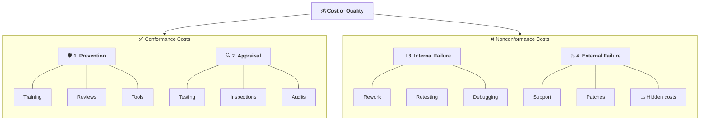
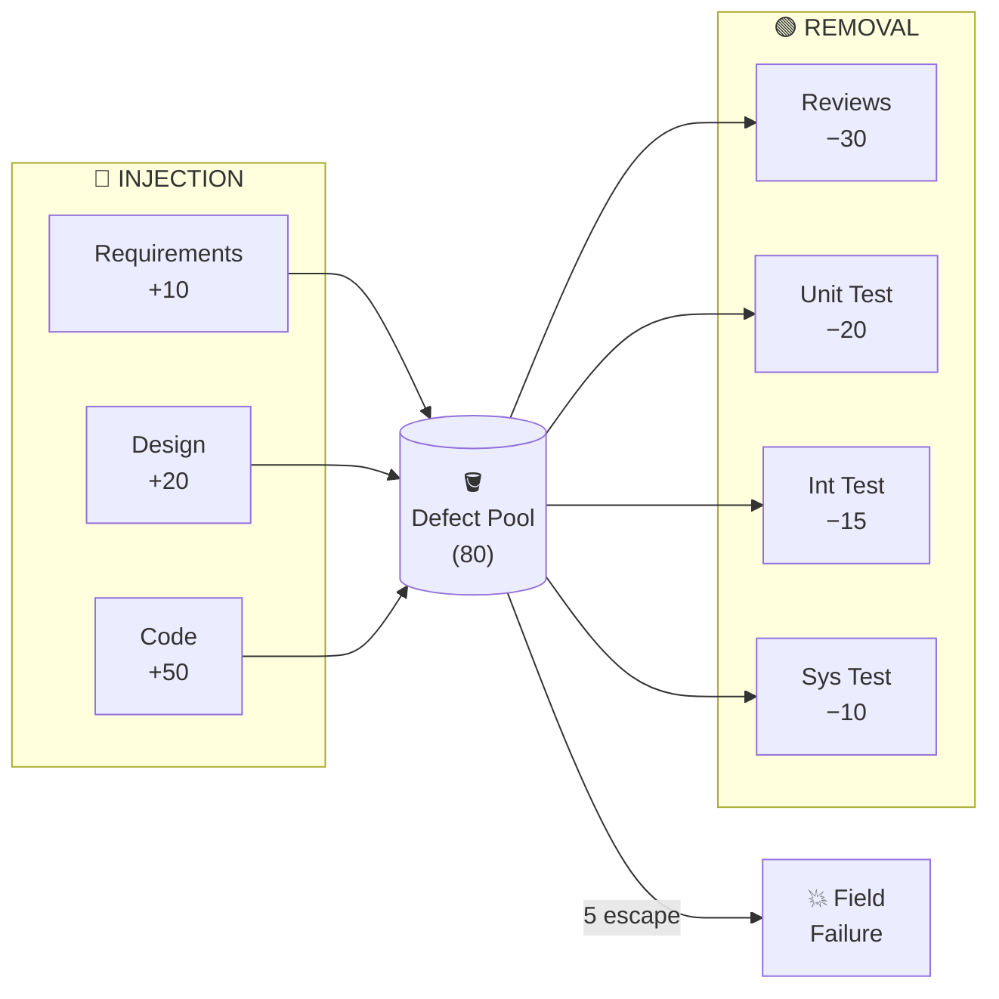
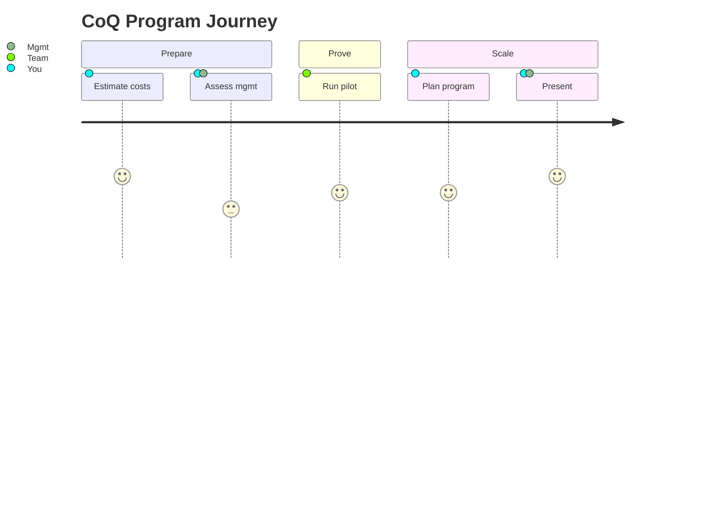

# Study Notes: Cost of Quality

## Purpose

These study notes explain the Cost of Software Quality (CoSQ) framework. Designed for MS students preparing for exams.

{: .note }
**Related Pages:** For detailed coverage, see [CoSQ Foundations](01-cosq-foundations.md), [Defect Injection & Removal](02-defect-injection-removal.md), [Defect Classification](03-defect-classification.md), and [Quality Economics in DevOps](04-quality-economics-devops.md).

---

## Overview

The Cost of Software Quality (CoSQ) provides a financial framework for translating technical quality metrics into business language. Understanding CoSQ enables data-driven decisions about where to invest in quality activities.

**Learning Objectives:**

- Describe the components of the Cost of Quality
- Understand the economics of defect prevention vs. detection
- Create a strategy to minimize total CoQ

---

## 1. Why Cost of Quality Matters

### The Business Reality

Quality-related costs are much larger than accounting reports typically show. During the 1950s, quality specialists discovered that these costs ran **10–30% of sales** or **25–40% of operating expenses** .

> **Key insight:** Money is the basic language of upper management. The concept of studying quality-related costs provides vocabulary to communicate between quality staff and company managers.

**What has greater impact?**

- "Our fault density jumped from 3 to 5 per KSLOC"
- OR "The defects delayed launch by 3 months, losing $3,000,000 in revenue"

### Modern Failures: The Cost is Real

|Incident|Year|Impact|
|---|---|---|
|CrowdStrike update|2024|$5.4B estimated, 8.5M Windows devices affected|
|Log4j vulnerability|2021|~$100M+ industry-wide remediation|
|SolarWinds supply chain|2020|Months of undetected compromise|

These examples illustrate that quality failures have quantifiable business consequences—lost revenue, remediation costs, and reputation damage.

### National Economic Impact

The NIST study by Tassey (2002) quantified the staggering cost of inadequate software testing infrastructure :

|Metric|Value|
|---|---|
|Annual cost to U.S. economy|**$22.2 – $59.5 billion**|
|Cost borne by users|**~60%**|
|Cost borne by developers|**~40%**|

**Critical finding:** Over half of quality costs are shifted to users via error avoidance and mitigation. Organizations underestimate true costs because they don't see what customers spend working around defects.

### Software vs. Manufacturing

Software CoSQ is proportionally **twice as high** as manufacturing :

|Industry|CoQ as % of Costs|
|---|---|
|Manufacturing|5–25% of sales|
|Software|20–70% of development costs|

This explains why software quality improvement has such high ROI potential.

---

## 2. Understanding Quality: Garvin's Five Views

Garvin (1984) established that "quality" is frequently a source of confusion because different stakeholders use different definitions :

|View|Definition|Example|
|---|---|---|
|**Transcendent**|Innate excellence, recognized but not defined|"I know quality when I see it"|
|**Product-based**|Measurable attributes|"More features = higher quality"|
|**User-based**|Fitness for purpose|"It does what I need"|
|**Manufacturing**|Conformance to specification|"Zero defects, built to spec"|
|**Value-based**|Excellence at acceptable cost|"Best quality I can afford"|

**Why this matters for CoQ:** The manufacturing view assumes that preventing deviations leads to lower total costs. This directly connects to CoSQ principles—investing in prevention and appraisal reduces costly failures.

> **Discussion:** The iPhone 4 antenna problem—"Just don't hold it that way" (Steve Jobs). Which view of quality does this response reflect? How would you explain a quality issue using business language?

---

## 3. The Cost of Quality Framework

### Definition

> Quality costs measure the costs associated with achievement and non-achievement of product/service quality, including all requirements established by company, contracts, customers, and society. — C. Borror, _Certified Quality Engineer Handbook_ (2009)

### The Four Categories

### Category Details

**Prevention Costs** — Proactive investments to avoid defects:

- SQA infrastructure (procedures, templates, checklists)
- Training (new employees, certifications)
- Process improvement activities
- Configuration management systems
- Code review processes, PR workflows
- Static analysis tools, linters

**Appraisal Costs** — Investments to detect existing defects:

- Testing (unit, integration, system, acceptance)
- Code reviews and inspections
- Quality audits and assessments
- CI pipeline checks, automated verification

**Internal Failure Costs** — Fixing defects found before release:

- Debugging and rework
- Redesign after review findings
- Retesting after fixes
- Defect triage and management

**External Failure Costs** — Fixing defects found after release:

- Customer support and complaint handling
- Emergency patches and hotfixes
- Warranty costs and returns
- Liability and penalties
- **Hidden:** Lost sales, reputation damage, customer churn

### The Weinberg Insight

> "When managers say, 'Testing takes too long,' what they should be saying is, 'Fixing the bugs in the product takes too long'—a different cost category." — G. Weinberg, _Perfect Software And Other Illusions About Testing_ (2010)

**Key distinction:**

- Testing = **Appraisal** cost (finding defects)
- Debugging/Rework = **Internal failure** cost (fixing defects)

The complaint "we don't have time to test" really means "we'd rather spend time fixing in production"—which is far more expensive.

> Extended discussion on PAF model history and applications is available in
> supplementary notes: [CoSQ Foundations](01-cosq-foundations.md)

---

## 4. The Economics of Quality

### The 1:10:100 Rule

This rule illustrates the exponential cost of delayed defect detection :

|Phase Found|Relative Cost|
|---|---|
|Requirements|**$1**|
|Development|**$10**|
|Post-release|**$100+**|

**Modern framing:** This is why **shift-left** works economically. CI/CD automates early detection, catching defects when they're cheapest to fix.

### Traditional vs. Modern CoQ Models

**Traditional Model (1950s–1970s):**

- Costs of achieving quality and costs due to lack of quality have an inverse relationship
- Total CoQ has a **point of diminishing returns**—a minimum _prior to_ 100% quality
- Premise: If you continue doing more of the same, you eventually hit negative returns

**Modern Model (Kondo 1978, Juran & Gryna 1988):**

- Manufacturing experience showed increased attention to prevention leads to large reductions in appraisal costs
- The minimum Total CoQ can extend toward 100% conformance
- Premise: You do something **different**—improve your process—rather than just doing more of the same

> **Key insight from Knox (1993):** "You will not experience a point of diminishing returns from investing in quality-attaining processes." The revised model suggests the optimum can shift toward 100% conformance through **process improvement** .

### Empirical Validation: Knox and Raytheon

**Knox's Hypothesis (1993)** — Hewlett Packard:

- As process maturity increases (CMM Level 1 → 5), total CoSQ decreases
- Prevention and appraisal costs remain relatively stable
- Failure costs drop dramatically

**Raytheon Empirical Data (1996):** Real data validated Knox's hypothesis :

|Metric|CMM Level 1 (1987)|CMM Level 3 (1996)|
|---|---|---|
|Total CoSQ|~65% of project|~20% of project|
|Rework|~50%|<10%|

**Result:** Fourfold reduction in rework over 8 years of process improvement.

> Modern applications of quality economics in CI/CD and DevOps are explored in
> supplementary notes: [Quality Economics in DevOps](04-quality-economics-devops.md)

### Process Maturity Impact

|CMM Level|TCoSQ (% of dev costs)|Source|
|---|---|---|
|Level 1|55–67%|Raytheon baseline|
|Level 3|40–50%|Industry average|
|Level 5|~15%|Raytheon achieved|

---

## 5. Defect Injection and Removal

### The "Tank and Pipes" Model

This model, proposed by Capers Jones and formalized in COQUALMO , visualizes defect flow:

**Key concepts:**

- **Injection pipes:** Defects flow INTO the system at each development phase
- **The tank:** Cumulative "backlog" of defects residing in the system
- **Removal pipes:** V&V activities act as filters, removing defects
- **Residual defects:** What remains after all removal activities—these become field defects

### Process Signatures

A **process signature** shows the characteristic defect profile of a development process:

**Typical Injection Profile:**

|Phase|Cumulative Defects|
|---|---|
|Requirements|10|
|High-Level Design|20|
|Low-Level Design|40|
|Code|80|

**Baseline Removal (50% effectiveness at each stage):**

|Stage|Remaining Defects|
|---|---|
|After Code|80|
|After Unit Test (50%)|40|
|After Integration Test (50%)|20|
|After System Test (50%)|10|
|**Reaching Customer**|**10**|

> The gap between the "injected" and "detected" curves at ship time represents **latent faults**—defects that escape to customers and become external failure costs.

Mathematical models and detailed analysis of defect injection/removal are in
supplementary notes: [Defect Injection & Removal](02-defect-injection-removal.md)

### Improvement Strategies

**Three levers to reduce CoSQ:**

1. **Inject fewer** — Prevention (training, better tools, clearer requirements)
2. **Detect earlier** — Shift-left (CI, pre-commit hooks, code review)
3. **Detect more** — Higher test coverage (but diminishing returns apply)

### Comparing Improvement Approaches

**Scenario A: Improve Unit Testing by 20%**

- UT effectiveness: 50% → 70%
- IT and ST remain at 50%
- Result: 6 defects reach customer (vs. 10 baseline)

**Scenario B: Add Inspections (20% removal each)**

- Requirements inspection → catches defects at source
- Design inspection → catches design defects early
- Code inspection → catches code defects before testing
- Result: 6 defects reach customer (vs. 10 baseline)

**Both achieve same residual count, but:**

- Scenario A: Finds defects later (higher fix cost per defect)
- Scenario B: Finds defects earlier (lower fix cost per defect)

> **How do you choose?** Analyze the cost of each alternative AND the likelihood of achieving the assumed improvements. A 10–20% improvement is achievable; a 2× improvement is unlikely unless current processes are severely broken .

For detailed analysis of code review effectiveness and ROI calculations, see
supplementary notes: [Code Review ROI](05-code-review-roi.md)

---

## 6. Making CoQ Actionable

### Where Does Data Come From?

|Source|What It Provides|
|---|---|
|**Time reports**|Appraisal costs, rework time (internal failure)|
|**Bug tracking**|Defect density, escape rates, field failures|
|**Defect classification**|Root cause patterns, prevention targets|

### Defect Classification Basics

To make CoQ actionable, you need to classify defects systematically. 
At minimum, track:

1. **Origin phase** — Where was the defect injected? (Requirements, Design, Code)
2. **Detection phase** — Where was it found? (Review, Unit Test, System Test, Field)
3. **Defect type** — What kind of defect? (Logic, Interface, Data, Timing)

**Kan's Origin/Where Found Matrix** cross-tabulates origin vs detection:
- Defects on the diagonal are caught early (low cost)
- Defects far from diagonal escaped multiple phases (high cost)
- Patterns reveal which phases need stronger V&V

> Detailed classification schemes (ODC, HP Model) are covered in 
> supplementary notes: [Defect Classification](03-defect-classification.md)

### The 5-Step Approach to CoQ Programs

### Goals of CoQ Analysis

Understanding CoSQ helps answer critical quality planning questions:

1. **Which techniques** should be used?
2. **When** should they be applied?
3. **In what sequence?**
4. **How much effort** to invest?
5. **On which components?**

These questions form the core of **Quality Planning**—the subject of the next lecture (A2).

---

## 7. Key Takeaways

1. **Money talks:** Frame quality in financial terms to communicate with management
    
2. **Prevention beats detection:** Investing in prevention reduces total CoQ more effectively than increasing testing
    
3. **Earlier is cheaper:** The 1:10:100 rule—shift-left to reduce costs
    
4. **Process improvement shifts the curve:** Don't just do more of the same; do something different
    
5. **Measure to manage:** Without data (time reports, bug tracking, classification), you can't optimize CoQ

For deeper exploration of related topics, see supplementary notes:

- [Technical Debt](06-technical-debt.md) — Understanding tech debt as deferred quality costs
- [Defect Prediction with ML](07-defect-prediction-ml.md) — Using machine learning to predict defect-prone components

---

## References



### Other Primary Sources

- Campanella, J. (1999). _Principles of Quality Costs_ (3rd ed.). ASQ Quality Press.
- Weinberg, G. (2010). _Perfect Software And Other Illusions About Testing_.

### Further Reading

- Kan, S.H. (2002). _Metrics and Models in Software Quality Engineering_ (2nd ed.). Addison-Wesley.
- Jones, C. (2008). _Applied Software Measurement_ (3rd ed.). McGraw-Hill.
- Borror, C. (2009). _Certified Quality Engineer Handbook_ (3rd ed.).

---

{: .highlight }
**Disclaimer:** AI is used for text summarization, polishing and explaining. Authors have verified all facts and claims. In case of an error, feel free to file an issue.