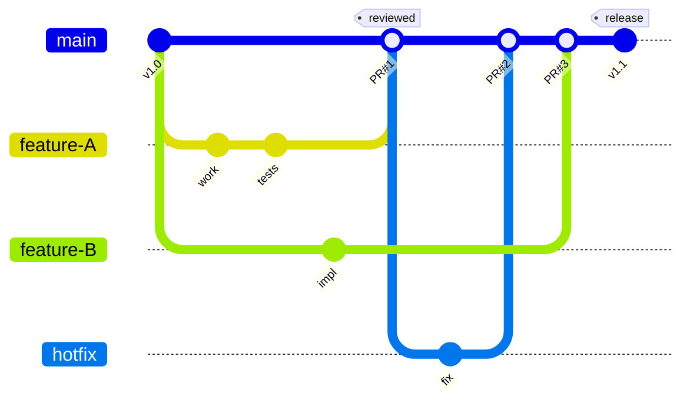
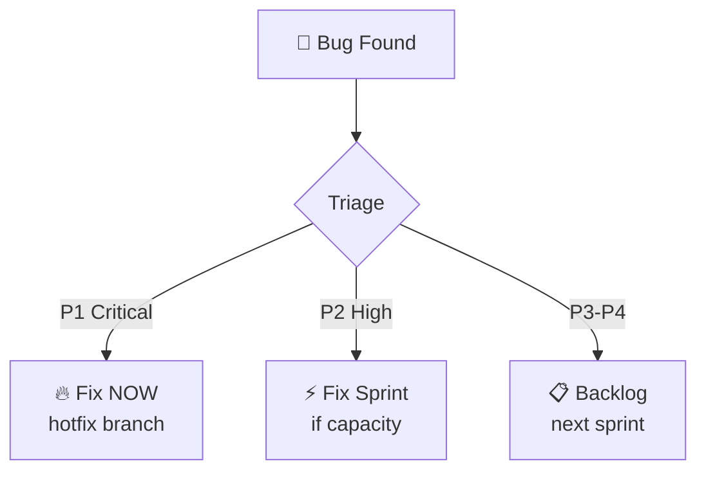
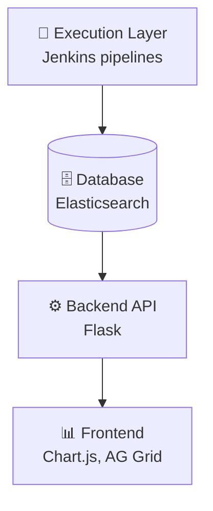

# Study Notes: Project Quality Planning

## Purpose
These study notes explain how to create effective quality plans for software projects, covering the theoretical frameworks and practical applications from industry leaders.

**Primary Sources:**
- Software Verification and Validation: An Overview 
- IEEE Std 829-2008: Software Test Documentation 
- Software Engineering at Google 
- How We Test Software at Microsoft 

**Key Research Papers:**
- Quality Gates in Software Development 
- Software Testing Effort Estimation SLR 
- Testing Process Models SLR 
- CI/CD Information Needs 

---

## Part 1: Why Quality Plans Matter

### 1.1 Quality as an Afterthought

**The Problem:**

> "Why do we put emphasis on a quality plan? Because in most situations quality is an afterthought." 

Wallace and Fujii's 1989 study found that only 10% of test plan topics were actually addressed in surveyed projects. When development and quality roles are combined, quality activities become the first casualty of schedule pressure.

**Why Quality Gets Skipped:**

| Pressure | Result |
|----------|--------|
| Deadline approaching | "We'll test later" |
| Budget cuts | "Testing is overhead" |
| Feature creep | "No time for tests" |
| Optimism bias | "Our code doesn't have bugs" |

**The Core Insight:**
Without a plan, quality activities compete with features for time and resources—and features always win. The solution is to build quality activities into the process so they cannot be skipped.

---

### 1.2 Four Components of Quality Management

A complete quality management approach includes four components :

| Component | Purpose | Examples |
|-----------|---------|----------|
| **Quality Planning** | Identify activities, tools, training; organize execution | Test plan, quality gates, RACI matrix |
| **Quality Assurance** | Provide confidence product *will* meet requirements | Process audits, reviews, standards |
| **Quality Control** | Verify product *is* of required quality | Testing, inspections, static analysis |
| **Quality Improvement** | Enhance process effectiveness | Retrospectives, root cause analysis |

**Key Distinction:**
- **Quality Assurance (QA):** Process-focused, preventive ("Are we doing things right?")
- **Quality Control (QC):** Product-focused, detective ("Did we make the thing right?")

---

### 1.3 Google's Solution: Process Built-In

Google doesn't rely on willpower to ensure quality. The process **requires** quality activities before code can merge :

| Requirement | Why It Matters |
|-------------|----------------|
| Continuous build | Can't skip if automated |
| Tests classified by size | Know what you're testing |
| Smoke test suite | Critical paths always tested |
| Flaky tests identified | Trust your test results |

**Test Certified Level 1 Requirements (from Day 1):**
- Continuous build running
- Tests classified as small/medium/large
- Smoke test suite defined
- Flaky tests tracked and labeled

**The Principle:**
Build quality into the process, not into heroic individual effort.

---

### 1.4 Quality Plan Operationalizes Quality Requirements

A quality plan is only meaningful when tied to measurable quality requirements (see SQR L01: Quality Models, L02: Metrics).

**Quality Requirement Template:**
```
While in [condition], the [component] shall exhibit
[quality attribute] of [threshold] [measurement].
```

**Example Requirements with Measurement:**

| Characteristic | Requirement | Metric | Tool |
|----------------|-------------|--------|------|
| **Maintainability** | CC < 10 per function | Cyclomatic Complexity | `radon` |
| **Reliability** | 99% uptime, <1 crash/week | MTBF, crash count | Monitoring |
| **Performance** | API response < 200ms, P95 | Latency percentile | `locust` |
| **Security** | 0 high-severity vulns | Vulnerability count | `bandit` |

**Key Insight:** A requirement without a measurement method is not testable. Tools make it enforceable.

---

## Part 2: The 11 Decisions Framework

### 2.1 What a Quality Plan Must Address

A Quality Plan documents 11 key decisions :

| # | Decision | Question |
|---|----------|----------|
| 1 | **Activities** | What QA, QC, and improvement activities will we conduct? |
| 2 | **Interactions** | How do quality activities connect to development activities? |
| 3 | **Artifacts** | Which work products will activities apply to? |
| 4 | **Timing** | When will activities occur? |
| 5 | **Responsibility** | Who performs each activity? |
| 6 | **Extent** | To what depth/breadth? |
| 7 | **Cost/Time** | What are up-front and recurring costs? |
| 8 | **Tools** | What tooling is required? |
| 9 | **Training** | What skills and training are needed? |
| 10 | **Defect Handling** | How are defects reported, tracked, resolved? |
| 11 | **Measurements** | What metrics provide visibility into processes? |

**Rule:** A complete quality plan addresses ALL 11 decisions. Missing any creates gaps.

---

### 2.2 Organizing the 11 Decisions

The 11 decisions can be grouped into four categories:

**WHAT to do?**
1. Activities — Reviews, inspections, tests
2. Coverage — What % of code/requirements
3. Tools — Static analysis, test frameworks
4. Deliverables — Reports, metrics, docs

**WHEN to do it?**
5. Schedule — Timeline for activities
6. Gates — Entry/exit criteria
7. Milestones — Quality checkpoints

**WHO does it?**
8. Roles — Testers, reviewers, QA
9. Responsibilities — RACI matrix

**HOW to do it?**
10. Methods — Test techniques, review types
11. Standards — IEEE 829, coding standards

---

### 2.3 How Google Addresses the 11 Decisions

| Decision | Google's Answer  |
|----------|-------------------------------------------|
| **What activities?** | Test pyramid: 70% unit, 20% integration, 10% E2E |
| **What coverage?** | 80% target, tracked per project |
| **What tools?** | Tricorder (static analysis), TAP (150M tests/day) |
| **When to test?** | Pre-submit gates (before merge) |
| **What gates?** | Pre-submit → Post-submit → Release |
| **Who tests?** | "You build it, you break it" (developers) |
| **What roles?** | SWE + SET + TE structure |
| **How to test?** | Test Certified requirements per level |
| **What standards?** | Readability certification, style guides |

**Your Turn:** Map YOUR project's answers to these 11 decisions.

---

### 2.4 Choosing Activities: Defense in Depth

Different V&V techniques are suited for different quality characteristics (see SQR L03: Verification Methods):

| Quality Characteristic | Inspection | Analysis | Testing | Demo |
|----------------------|:----------:|:--------:|:-------:|:----:|
| **Functionality** | ○ | ○ | ● | ● |
| **Reliability** | ○ | ● | ● | ○ |
| **Usability** | ○ | ○ | ○ | ● |
| **Efficiency** | ○ | ○ | ● | ● |
| **Maintainability** | ● | ● | ○ | ○ |
| **Security** | ○ | ● | ● | ○ |

**Legend:** ● = Strong fit | ○ = Partial fit

**Key Insights:**
- **Maintainability** is best verified through **Inspection** (code review) and **Analysis** (static analysis tools)
- **Usability** can only be truly verified through **Demonstration** (user testing)
- **Security** requires both **Analysis** (SAST tools like `bandit`) and **Testing** (penetration testing)
- No single technique finds all defects — combine them!

---

## Part 3: Criticality and Coverage

### 3.1 Criticality Levels

Not all software needs the same level of rigor. Criticality determines how much testing is required.

**DO-178B Avionic Software Criticality:**

| Level | Safety Impact | Coverage Requirement |
|-------|--------------|---------------------|
| **A** | Catastrophic failure | 100% Modified Condition/Decision Coverage (MC/DC) |
| **B** | Hazardous/severe failure | 100% Decision Coverage |
| **C** | Major failure | 100% Statement Coverage |
| **D** | Minor failure | 100% Requirements Coverage |
| **E** | No adverse effect | No coverage requirements |

**ISO 26262 ASIL (Automotive):**

| Level | Example Systems |
|-------|-----------------|
| **D** | Steering, brakes (highest) |
| **C** | Airbags |
| **B** | Headlights |
| **A** | Wipers (lowest safety) |
| **QM** | Infotainment (quality managed, no safety) |

**Key Insight:** Your web app is probably QM/Level E. Don't over-engineer. Don't under-engineer.

---

### 3.2 Coverage Targets by Criticality

Quality gates should be tailored to artifact criticality :

| Condition | Low (C) | Medium (B) | High (A) |
|-----------|---------|------------|----------|
| Coverage type | Statement | Branch | Basis paths |
| Code inspections | No | Yes | Yes |
| Coding standards | Yes | Yes | Yes |
| Testing strength | All pairs | All triples | All quadruples |
| Cyclomatic complexity | <20 | <20 | <15 |

---

### 3.3 Microsoft Coverage by Milestone

Coverage targets should **increase** as you approach release :

| Milestone | Coverage | Bug Bar | Other Criteria |
|-----------|----------|---------|----------------|
| **M1** | — | P1 bugs fixed | Feature spec complete |
| **M2** | **65%** | 60% crashes fixed | Threat model mitigated |
| **M3** | **75%** | 70% crashes fixed | Performance baseline met |
| **Release** | **80%** | All P1/P2 fixed | All mandatory policies |

**Why This Works:**
- Early milestones: Focus on building features
- Later milestones: Focus on stabilizing quality
- Release: High bar, no exceptions

---

### 3.4 Choosing Criticality for YOUR Project

| Project Type | Criticality | Coverage Target | V&V Rigor |
|--------------|-------------|-----------------|-----------|
| **SQR Project** (BS teams) | Low-Medium | **70%** | Code review, unit tests, CI |
| **IPP** (industry partner) | Medium | **80%** | + Integration tests, gates |
| **Safety-critical** | High | **100% MC/DC** | + Independent V&V, formal methods |

**SQR Project Minimum:**
- Code review required
- CI with automated tests
- 70% unit test coverage

**IPP Minimum:**
- All SQR requirements
- Quality gates defined
- 80% coverage for new code
- Static analysis enabled

---

## Part 4: Quality Gates

### 4.1 What Are Quality Gates?

Quality gates are predefined checkpoints within the SDLC positioned at various stages :

| Definition | Description |
|------------|-------------|
| **Structured Checkpoints** | Predefined quality criteria a project must meet to move between stages |
| **Decision Points** | Critical junctures with quality-focused "go/no-go" criteria |
| **Transparency Mechanism** | Formal checklists, sign-offs, and acceptance procedures |

> "Quality gates are predefined checkpoints within the software development life-cycle." 

---

### 4.2 Entry and Exit Criteria

Every quality gate has entry criteria (before starting) and exit criteria (before proceeding) :

**Entry Criteria (before starting):**
- Spec approved
- Environment ready
- Reviewers assigned
- Test data prepared

**Exit Criteria (before proceeding):**
- All tests pass
- Coverage met
- No Sev-1 bugs
- Code review approved

**Gate Decisions:**

| Decision | Meaning |
|----------|---------|
| **Pass** | All criteria met, proceed |
| **Conditional** | Minor issues, proceed with plan |
| **Fail** | Major issues, must fix |
| **Suspend** | Blocking issues, escalate |

---

### 4.3 Google's 3-Stage Quality Gates

Google uses a three-stage gate system :

| Gate | When | Checks | Who |
|------|------|--------|-----|
| **Pre-submit** | Before merge | Static analysis, unit tests, 80% coverage | Automated |
| **Post-submit** | After merge | Integration tests, affected tests | CI system |
| **Release** | Before deploy | E2E, canary 1%, error budget | Ship Room |

**Pre-submit Gate Details:**
- Code review approved (readability certified)
- Static analysis clean (Tricorder)
- All unit tests pass
- 80% incremental coverage

---

### 4.4 Git Flow + Quality Gates

Each branch transition is a quality gate. Code cannot reach `main` without passing all gates.

**Branch Strategy:**



**Quality Gates by Stage:**

| Stage | Branch | Quality Gate | Tools |
|-------|--------|--------------|-------|
| **Develop** | `feature/*` | Pre-commit hooks | `pre-commit`, `flake8`, `bandit` |
| **Review** | PR → `main` | CI checks + Code review | GitHub Actions, `pytest-cov` |
| **Merge** | `main` | All checks pass | Branch protection rules |
| **Release** | `main` → tag | E2E + manual approval | Staging environment, `locust` |

**SQR Project Rules:**
- `main` branch is always deployable
- No direct commits to `main`—all changes via Pull Request
- Hotfixes for P1 bugs get expedited review but still pass all gates

---

### 4.5 Defect Triage: Fix Now or Later?

Defects discovered during testing/development need immediate triage. The Quality Plan must define how bugs are prioritized and when they get fixed.

**Defect Triage Flow:**



**Triage Decision Table:**

| Priority | Definition | Sprint Rule | Release Gate |
|----------|------------|-------------|--------------|
| **P1 (Critical)** | Data loss, security breach, blocks feature | Fix NOW—hotfix branch | **Blocks release** |
| **P2 (High)** | Major bug, workaround exists | Fix this sprint if capacity | ≤3 open allowed |
| **P3 (Medium)** | Minor bug, cosmetic issues | Add to backlog | Tracked, not blocking |
| **P4 (Low)** | Enhancement, nice-to-have | Backlog for future sprint | Not tracked for release |

**Quality Plan Must Define:**

| Decision | Example Rule |
|----------|--------------|
| **Who triages?** | Dev + PO at daily standup |
| **What's P1 vs P2?** | P1 = blocks feature, data loss, security. P2 = workaround exists |
| **Does P1 block "Done"?** | Yes—feature not Done until P1s fixed |
| **P2 at sprint end?** | Must document, can release if ≤3 open |
| **Who can interrupt sprint?** | Only PO for P1 bugs |

**Release Gate Example:**
- ✅ 0 open P1s
- ✅ ≤3 open P2s (documented with workarounds)
- ⚠️ P3-P4 tracked but don't block

**Cross-reference:** See A03 for Microsoft's bug bar and severity definitions.

---

### 4.6 Quality Gate Tools

Modern tools automate quality gate enforcement :

| Tool | Focus |
|------|-------|
| **SonarQube/SonarCloud** | Static analysis; blocks builds if bugs/coverage criteria not met |
| **Sigrid (SIG)** | Risk management, architecture, technical debt monitoring |
| **Veracode** | Security-focused static/dynamic analysis |
| **Maverix.ai** | AI-driven issue detection, real-time feedback |
| **Squore (Vector)** | Maintainability, technical debt dashboards |

---

### 4.7 Define Your Project's Gates

| Gate | Entry Criteria | Exit Criteria |
|------|---------------|---------------|
| **Feature Start** | Spec approved, JIRA created | — |
| **Code Review** | Code complete, tests written | LGTM received, CI green |
| **Sprint End** | All tasks in PR | 70% coverage, demo ready |
| **Release** | All sprint gates passed | All P1 bugs fixed, 80% coverage |

**SQR Project Gates:**
1. Code review gate
2. CI gate (tests pass)
3. Sprint demo gate

**IPP Gates:**
1. All SQR gates
2. Milestone exit criteria
3. Release approval gate

---

## Part 5: Organizing Testing

### 5.1 Test Process Maturity Levels

A systematic review identified 17 testing process models, most defining 5 maturity levels :

| Level | TMMi Name | Key Characteristics |
|-------|-----------|---------------------|
| **1** | Initial | Ad hoc, chaotic, hero-dependent |
| **2** | Managed | Test planning exists, tracked |
| **3** | Defined | Standardized process, documented |
| **4** | Measured | Metrics collected, analyzed |
| **5** | Optimization | Continuous improvement |

**Most student projects are Level 1-2. Goal: Reach Level 2-3.**

**Key Insight:** You don't need Level 5. You need the RIGHT level for your context.

---

### 5.2 Testing Process Models

| Model | Structure |
|-------|-----------|
| **TMM** | Initial → Definition → Integration → Management/Measurement → Optimization |
| **TMMi** | Initial → Managed → Defined → Measured → Optimization |
| **TPI** | 20 Key Areas with 4 maturity levels each |
| **ISO/IEC/IEEE 29119** | Organizational → Test Management → Dynamic Test Processes |
| **TIM** | Initial → Baselining → Cost-effectiveness → Risk-lowering → Optimizing |

**Five Testing Phases (Common to Most Models):**

1. **Planning** — Define objectives, scope, approach, schedule
2. **Test Case Design** — Create test cases from requirements/specifications
3. **Setup** — Prepare test environment and data
4. **Execution/Evaluation** — Run tests and evaluate results
5. **Monitoring/Control** — Track progress and manage deviations

---

### 5.3 Google Test Certified Levels

Google's internal Test Certified program defines progressive maturity :

| Level | Requirements |
|-------|--------------|
| **L1** | CI build, tests classified by size, smoke suite, flaky tests identified |
| **L2** | No red tests at release, smoke tests pass before submit |
| **L3** | Tests required for all nontrivial changes |
| **L4** | Pre-submit automation runs in <30 minutes |
| **L5** | Bug fix = regression test, 60% total coverage, 40% small tests |

**Your Target:**
- **SQR Project:** Reach Level 2 (CI green, smoke tests)
- **IPP:** Reach Level 3 (tests required for all changes)

---

### 5.4 RACI: Who Does What?

| Activity | Dev | Tester | PM | QA |
|----------|:---:|:------:|:--:|:--:|
| Write unit tests | **R** | C | I | I |
| Write integration tests | C | **R** | I | I |
| Code review | **R** | C | I | I |
| Run CI | A | **R** | I | I |
| Triage bugs | C | **R** | **A** | C |
| Release decision | C | C | **A** | **R** |

**Legend:**
- **R** = Responsible (does the work)
- **A** = Accountable (makes the decision)
- **C** = Consulted (provides input)
- **I** = Informed (kept updated)

**"You build it, you break it"** = Developer is R for unit tests, not just Tester.

---

### 5.5 V&V Activities by SDLC Phase

Wallace 1989 defines minimum V&V tasks for each phase :

**Requirements Phase:**
- Traceability Analysis — Trace requirements back to system concept
- Requirements Validation — Correctness, consistency, completeness
- Interface Analysis — Hardware, software, operator interfaces
- System/Acceptance Test Planning — Begin planning

**Design Phase:**
- Traceability Analysis — Trace design back to requirements
- Design Evaluation — Correctness, consistency, design quality
- Component/Integration Test Planning — Plan for design compliance

**Implementation Phase:**
- Code Evaluation — Correctness, code quality
- Component Test Execution — Verify component integrity

**Test Phase:**
- Integration Test Execution — Subsystem integration
- System Test Execution — Entire system at stress
- Acceptance Test Execution — Operational scenarios

---

### 5.6 Agile and Quality Assurance

**Common Misconception:** "I am using an agile approach so my plan does not require quality assurance activities."

Philip Koopman's critique :

> "Without an external check and balance it is all too easy to have a process failure."

**The Trust Problem:**

| Risk | Description |
|------|-------------|
| **Lack of External Oversight** | No independent verification mechanisms |
| **Subjectivity of Success** | Hard to tell if team is actually writing quality code |
| **Sustainability Risks** | Quality depends on "hero" leaders—high risk if they leave |
| **Auditing Gaps** | Audits not part of typical Agile trust model |

**Three Evaluative Questions for Agile Teams:**
1. "Show me the written process you are following"
2. "Explain how an external person can tell whether you are following that process"
3. "Explain how an external person can tell that the process is producing the quality you want"

**Key Insight:** Even Agile teams need defined processes combined with independent quality verification.

---

## Part 6: Test Documentation (IEEE 829)

### 6.1 Master Test Plan Structure

IEEE 829-2008 provides the standard structure for software test documentation :

**Part 1: Introduction**
- Identifier — Unique document identifier
- Scope — What is and isn't covered
- References — Related documents
- System Overview — High-level description
- Test Overview — Schedule, resources, responsibilities

**Part 2: Details**
- Test Processes — How testing will be conducted
- Test Levels — Component, integration, system, acceptance
- Documentation Requirements — What documents will be produced

**Part 3: General**
- Glossary — Definitions of terms
- Change Procedures — How plan changes are handled
- Version History — Document revision history

---

### 6.2 The "Addressed" Principle

> All topics must be formally decided: include, record in tool, or exclude with rationale. 

| Option | Meaning |
|--------|---------|
| **Include** | Document the information in the plan |
| **Record in Tool** | Reference where information is stored (e.g., in JIRA) |
| **Exclude with Rationale** | Explicitly state why not applicable |

**Never leave topics unaddressed.**

---

### 6.3 Lightweight Test Plan Template

A one-page test plan can address all 11 decisions:

| Section | Content | Example |
|---------|---------|---------|
| **1. Scope** | What's tested, what's not | "API endpoints; NOT mobile app" |
| **2. Approach** | Test pyramid, tools | "70/20/10, Jest, Postman" |
| **3. Gates** | Entry/exit per milestone | "Sprint: 70% coverage, CI green" |
| **4. Roles** | Who does what | "Devs: unit tests; QA: E2E" |
| **5. Schedule** | When activities happen | "Week 1-2: unit; Week 3: integration" |
| **6. Risks** | What could go wrong | "Flaky tests, environment issues" |

**This template addresses all 11 decisions in 1 page.** Perfect for SQR/IPP projects.

---

### 6.4 Integrity-Level Mapping

Documentation depth should match criticality :

| Integrity Level | Documentation Depth |
|----------------|---------------------|
| High (safety-critical) | Full documentation, formal reviews |
| Medium | Standard documentation |
| Low | Abbreviated documentation allowed |

**Tailoring Guidelines:**

**Combine documents when:**
- Project is small
- Single test level
- Resources limited

**Separate documents when:**
- Project is complex
- Multiple teams involved
- Regulatory requirements

---

## Part 7: Test Effort Estimation

### 7.1 Estimation Challenges

> "Test effort estimation remains challenging due to the many factors affecting testing." 

**Key Factors Affecting Test Effort:**
- System size and complexity
- Tester experience
- Test environment stability
- Requirements volatility
- Defect density

---

### 7.2 Estimation Methods

A systematic review identified multiple approaches :

| Method | Description |
|--------|-------------|
| **Test Point Analysis (TPA)** | Function point-based, accounts for test complexity |
| **Use Case Points (UCP)** | Estimates from use case specifications |
| **Machine Learning** | Neural networks, regression for prediction |
| **Expert Judgment** | Experience-based estimation |
| **Analogy** | Based on similar past projects |

---

### 7.3 Tester-to-Developer Ratios

Ratios vary significantly by product type :

| Product Type | Developers | Ratio (Dev:Tester) | Testers |
|--------------|------------|-------------------|---------|
| Commercial (Large Market) | 30 | 3:2 | 20 |
| Commercial (Small Market) | 30 | 3:1 | 10 |
| Heavy COTS Integration | 30 | 4:1 | 7 |
| Government (Internal) | 30 | 5:1 | 6 |
| Corporate (Internal) | 30 | 4:1 | 7 |

**Industry Range:** From 1:5 through 5:1

**Microsoft:** 1:1 ratio 

---

### 7.4 Function Point-Based Estimation

Test cases per function point by software type:

| Test Type | Systems | MIS | Military | Commercial |
|-----------|---------|-----|----------|------------|
| Unit test | 0.30 | 0.20 | 0.50 | 0.30 |
| New function test | 0.35 | 0.25 | 0.35 | 0.25 |
| Regression test | 0.30 | 0.10 | 0.30 | 0.35 |
| Integration test | 0.45 | 0.25 | 0.75 | 0.35 |
| System test | 0.40 | 0.20 | 0.55 | 0.40 |
| **Total** | **1.80** | **1.00** | **2.45** | **1.65** |

**Formula:** `TotalTestCases = FunctionPoints^1.2`

*Example: 100 FP → ~251 test cases*

---

### 7.5 Back-of-Envelope Calculations

**White Box Estimation:**
- Number of tests for branch coverage = **n + 1** (where n = number of predicates)
- Average from SONAR database: **25% of LOC are decisions**
- Example: 1000 LOC → 250 decisions → 250 test cases

**Black Box Estimation:**

| Complexity | Non-critical | Medium | Critical |
|------------|--------------|--------|----------|
| Simple (2 inputs) | 8 | 12 | 12 |
| Medium (4 inputs) | 8 | 15 | 21 |
| Complex (6 inputs) | 8 | 16 | 40 |

---

### 7.6 Sanity Checks

> "A sanity check is a final check to see whether your answer makes sense in the context of the problem." 

**Validation Approaches:**
- Compare with function point estimates
- Check against industry ratios
- Use alternative estimation methods
- Testing is typically ~30% of total development effort

---

## Part 8: Metrics, Dashboards & Reporting

### 8.1 Multi-Dimensional Test Measurement

"Extent of testing" is multi-dimensional; no single metric suffices :

| Dimension | Description |
|-----------|-------------|
| **Product Coverage** | Testing vs. "good enough" quality model |
| **Agreement-Based** | Progress against documented test plan |
| **Risk-Based** | Critical areas of risk remaining |
| **Effort-Based** | Tester hours, calendar time consumed |
| **Obstacles** | Tests blocked by defects, environment issues |

---

### 8.2 Coverage Metrics

| Type | Measures |
|------|----------|
| Statement coverage | % of code statements executed |
| Branch coverage | % of decision branches taken |
| Loop coverage | Loop boundary conditions |
| Requirements coverage | % of requirements tested |

---

### 8.3 CI Dashboard Architecture

CI dashboards transform raw test data into actionable intelligence :



> "A CI dashboard is like the glass cockpit of a modern airliner." 

---

### 8.4 Information Needs in CI/CD

A study identified 39 distinct information needs across CI/CD pipelines :

| Category | Key Needs |
|----------|-----------|
| **Test Suite** | Test suite ownership (most important), flaky tests, failure causes |
| **Code/Commit** | Functional behavior, non-functional impact |
| **CI Jobs** | Longest-running jobs, recently failed jobs |
| **Infrastructure** | Hardware/simulator availability |
| **Trends** | Frequent defects, delivery flow trends |

**Most Important Need:** Test suite ownership — who is responsible for maintaining and fixing each test suite.

---

### 8.5 Stakeholder-Tailored Reporting

Tailor metrics by stakeholder level :

| Stakeholder | Focus | Units |
|-------------|-------|-------|
| **Managers** | Business impact | Dollars, schedule |
| **Technical Leads** | Quality trends | Defect rates, coverage |
| **Developers** | Immediate issues | Failed tests, blockers |

---

## Part 9: Python Toolstack for SQR Projects

### 9.1 Quality Requirements with Tools

A quality plan must specify not just WHAT to measure, but HOW (see SQR L02: Metrics for thresholds).

**SQR Python Toolstack:**

| Requirement | Tool | Command | Threshold |
|-------------|------|---------|-----------|
| Cyclomatic Complexity < 10 | `radon` | `radon cc -a -s src/` | Grade A-B |
| Maintainability Index > 20 | `radon` | `radon mi -s src/` | Green |
| Style conformance | `flake8` | `flake8 src/` | 0 errors |
| Test coverage ≥ 70% | `pytest-cov` | `pytest --cov=src --cov-fail-under=70` | ≥ 70% |
| Security vulnerabilities | `bandit` | `bandit -r src/` | 0 high severity |
| API performance | `locust` | Load test with 10 users | P95 < 200ms |
| UI performance | `lighthouse` | Chrome DevTools audit | Score > 50 |

**Installation:**
```bash
pip install radon flake8 pytest-cov bandit locust
```

---

### 9.2 Cyclomatic Complexity Thresholds

McCabe  defined cyclomatic complexity as a measure of code testability:

| CC Range | Grade | Risk Level | Action |
|----------|-------|------------|--------|
| 1-5 | A | Low | OK |
| 6-10 | B | Low | OK |
| 11-20 | C | Moderate | Review, consider refactoring |
| 21-30 | D | High | Refactor recommended |
| 31-40 | E | Very High | Must refactor |
| 41+ | F | Untestable | Split immediately |

**Example radon output:**
```
$ radon cc src/main.py -s
src/main.py
    F 12:0 process_data - C (15)
    F 45:0 validate_input - A (3)
```

---

### 9.3 Integrating Tools into Quality Gates

**Pre-commit hook (`.pre-commit-config.yaml`):**
```yaml
repos:
  - repo: local
    hooks:
      - id: flake8
        name: flake8
        entry: flake8
        language: python
        types: [python]
      - id: bandit
        name: bandit
        entry: bandit -r
        language: python
        types: [python]
```

**CI Pipeline Gate (GitHub Actions):**
```yaml
- name: Check code quality
  run: |
    flake8 src/
    radon cc src/ -a -s --total-average
    bandit -r src/ -ll
    pytest --cov=src --cov-fail-under=70
```

**Quality Gate Criteria:**
- Pre-merge: flake8 clean, bandit clean, tests pass
- Release: Coverage ≥ 70%, CC average < 10, no high-severity issues

---

## Summary: Theory + Practice = Your Plan

| Theory (A04) | Practice (A03) | Foundations (SQR) |
|--------------|----------------|-------------------|
| 11 Decisions | Test Certified | L03: V&V Techniques |
| Criticality levels | Coverage targets | L03: Defense in Depth |
| Quality gates | Pre-submit/post-submit/release | L03: Inspection ROI 10:1 |
| Defect triage | Bug bar (P1/P2/P3) | A03: Microsoft bug bar |
| Process maturity | TC Levels 1-5 | L03: Test Pyramid |
| IEEE 829 | Lightweight template | L02: Metrics & Tools |
| Quality requirements | Python toolstack | L01: Quality Models |

**The Formula:**
- **SQR L01** teaches WHAT quality characteristics to require
- **SQR L02** teaches HOW to measure them (metrics, tools)
- **SQR L03** teaches WHAT verification techniques exist
- **A03** teaches WHAT Google/Microsoft do in practice
- **A04** teaches HOW to plan quality for your project

**Your Deliverable:** A one-page quality plan with:
1. Quality requirements with measurement methods
2. Tools configured (radon, flake8, pytest-cov, bandit)
3. Quality gates defined (pre-merge, release)
4. Bug bar defined (P1 blocks release, ≤3 P2 allowed)
5. Target Test Certified level (L2 for SQR, L3 for IPP)

---

### References



---

{: .highlight }
**Disclaimer:** AI is used for text summarization, polishing and explaining. Authors have verified all facts and claims. In case of an error, feel free to file an issue.
