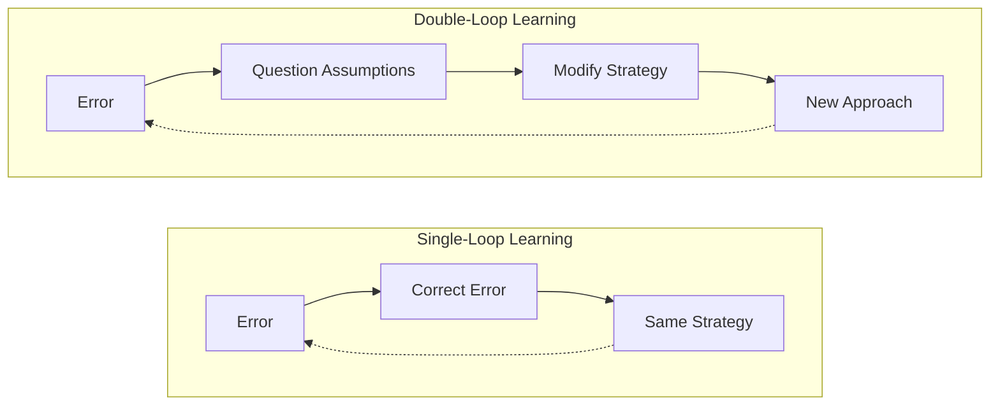
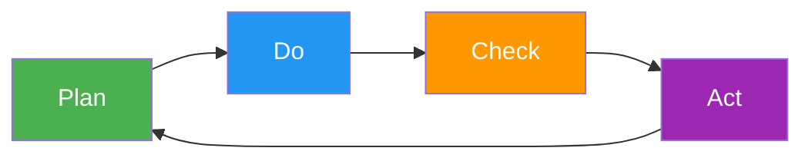
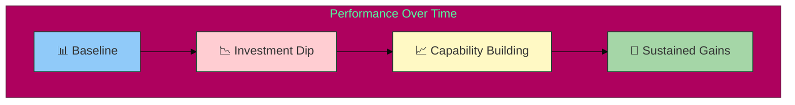
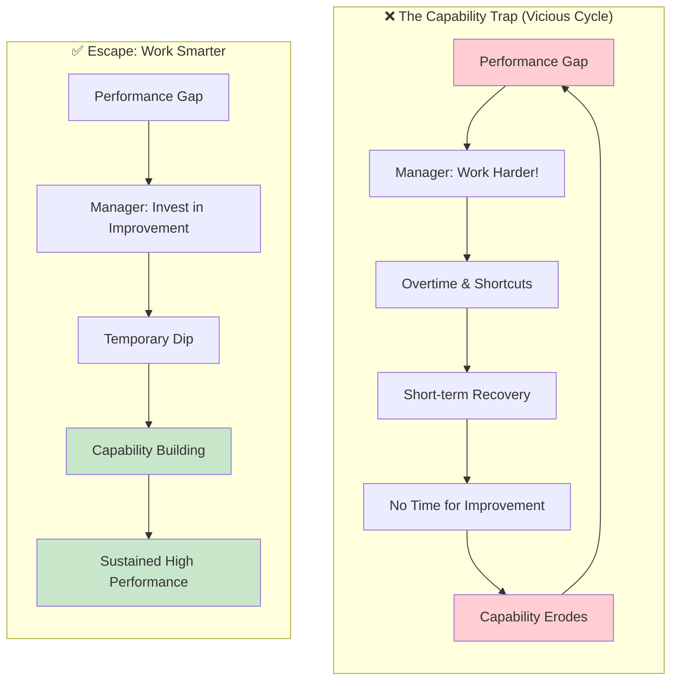
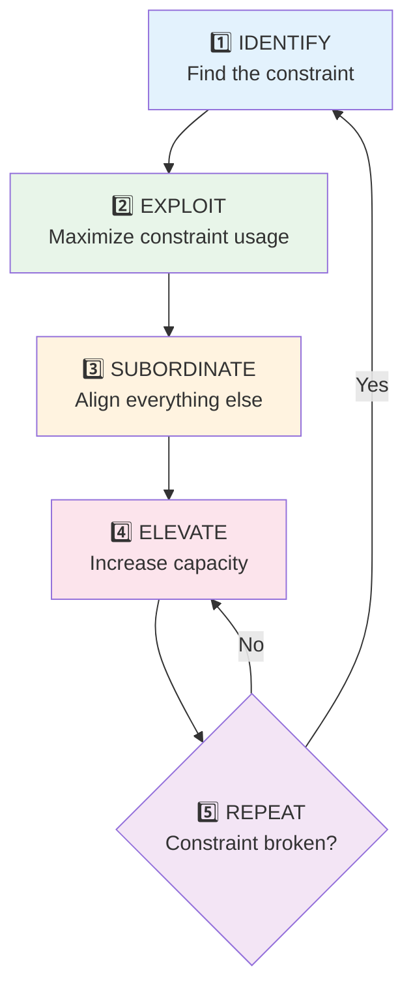
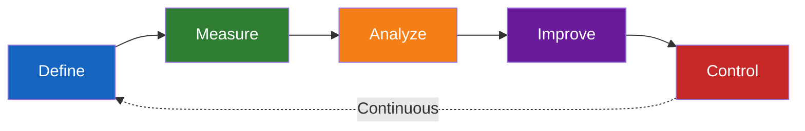
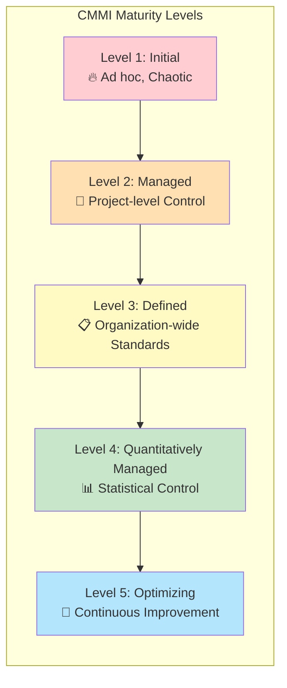

# Study Notes: Process Improvement

## Purpose

These study notes explain Software Process Improvement (SPI) concepts for MS students preparing for exams. The content covers why organizations pursue process improvement, key learning models, major improvement methods, CMMI framework, and critical success factors.

{: .note }
**Related Pages:** For detailed coverage, see [Why Process Improvement?](01-why-process-improvement.md), [Learning & Improvement Models](02-learning-improvement-models.md), [Improvement Methods](03-improvement-methods.md), and [Change Management](04-change-management.md).

**Key Sources:**
- Humphrey 1989, Managing the Software Process 
- Mays et al. 1990, IBM Defect Prevention Process 
- Goldratt 1984, Theory of Constraints 
- Argyris & Schon 1978, Organizational Learning 
- Pfeffer 1998, The Human Equation 
- Repenning & Sterman 2001, Capability Dynamics 

---

## Part 1: Why Process Improvement?

### 1.1 Learning Objectives

After studying this part, you should be able to:
- Explain why organizations pursue process improvement
- Describe the gap between management theory and practice
- Analyze how organizational failure precedes physical failure
- Understand the One-Eighth Rule and its implications

### 1.2 The Credibility Gap

Watts Humphrey  challenged executives with a fundamental question: **Why don't organizations practice what they believe?**

| Management Theory Says | Actual Practice |
|------------------------|-----------------|
| Measure what matters | Rely on intuition |
| Invest in learning | Cut training first |
| Use data for decisions | Ignore metrics |
| Continually improve | Fight fires |

**The Reality of Most Organizations:**
- Success depends on "heroics" rather than processes
- Tendency to over-commit to deadlines
- Budget overruns are common
- Cannot repeat past successes reliably

> **Key Insight:** Professional management should not rely on heroics. The gap between theory and practice is where SPI lives.

### 1.3 Business Scenarios Driving SPI

Three common scenarios explain why organizations pursue process improvement:

| Scenario | Problem | Quick Fix vs. Real Fix |
|----------|---------|------------------------|
| **Internet Company** | Bugs in client-facing products affecting profits | Fix the bug → OR → Fix why bugs keep appearing |
| **Small Engineering Firm** | Great products but consistently beaten to market | Work harder → OR → Fix the delivery process |
| **Consulting Firm** | Late on milestones, client threatening to leave | Overtime → OR → Improve estimation and planning |

**Example - The Bug Fix Dilemma:**
```
Scenario: E-commerce site has recurring payment failures

Quick fix approach:
  - Developer patches the specific bug
  - Manager declares victory
  - Next week: similar bug appears

Process improvement approach:
  - Root cause analysis: Why do payment bugs keep appearing?
  - Finding: No integration tests for payment flow
  - Fix: Add mandatory payment test coverage
  - Result: Payment bugs reduced by 60%
```

> **Exam Tip:** When asked about SPI motivations, remember: quick fixes address symptoms, process improvement addresses root causes.

### 1.4 Case Study: Columbia Disaster

The 2003 Space Shuttle Columbia tragedy demonstrates how **organizational failure precedes physical failure** .

**What Happened:**
- Shuttle disintegrated on reentry, killing all seven crew members
- Physical cause: foam debris struck wing during launch
- **Root cause: Organizational systems failure**

**Organizational Failures:**

| Issue | Impact |
|-------|--------|
| **Silencing dissent** | Engineers stopped raising technical concerns |
| **Success-oriented culture** | Bad news was filtered out before reaching decision-makers |
| **Hierarchical communication** | Information didn't reach those who needed it |
| **Normalization of deviance** | Anomalies treated as "maintenance events" rather than dangers |

> "If dissent and questioning are not welcomed, you stop doing it." — Sheila Widnall, CAIB Member

**The Culture Definition:**
Culture is the "set of rules you have to follow to have a fast-track career." At NASA, questioning schedule decisions was not a path to career success, so engineers stopped questioning.

### 1.5 The One-Eighth Rule

Jeff Pfeffer  explains why only **12.5%** of organizations see full benefits from improvement initiatives:

| Stage | Filter | Organizations Remaining |
|-------|--------|-------------------------|
| Start | All organizations | 100% |
| **Belief** | Only half believe the evidence | 50% |
| **Systemic approach** | Only half try comprehensive change | 25% |
| **Persistence** | Only half persist long enough | **12.5%** |

```vega-lite
{
  "$schema": "https://vega.github.io/schema/vega-lite/v5.json",
  "title": "The One-Eighth Rule: SPI Success Funnel",
  "width": 300,
  "height": 200,
  "data": {
    "values": [
      {"stage": "1. Start", "percentage": 100, "order": 1},
      {"stage": "2. Believe", "percentage": 50, "order": 2},
      {"stage": "3. Systemic", "percentage": 25, "order": 3},
      {"stage": "4. Persist", "percentage": 12.5, "order": 4}
    ]
  },
  "mark": {"type": "bar", "cornerRadiusEnd": 4},
  "encoding": {
    "y": {"field": "stage", "type": "nominal", "sort": {"field": "order"}, "title": null},
    "x": {"field": "percentage", "type": "quantitative", "title": "Organizations (%)"},
    "color": {
      "field": "percentage",
      "type": "quantitative",
      "scale": {"scheme": "reds", "reverse": true},
      "legend": null
    }
  }
}
```

**Why Organizations Fail at Each Stage:**

1. **Belief Filter (50% → 50%):**
   - "Our situation is different"
   - "That won't work here"
   - Resistance to change based on past failures

2. **Systemic Filter (50% → 25%):**
   - Isolated "checkbox" changes instead of comprehensive reform
   - Implementing tools without changing processes
   - Training without cultural shift

3. **Persistence Filter (25% → 12.5%):**
   - Abandoning initiatives when short-term results dip
   - Budget cuts during economic downturns
   - Leadership changes resetting priorities

> **Exam Tip:** The One-Eighth Rule (½ × ½ × ½ = ⅛) appears frequently in exam questions. Know the three filters: Belief, Systemic, Persistence.

---

## Part 2: Learning Models

### 2.1 Learning Objectives

After studying this part, you should be able to:
- Distinguish single-loop from double-loop learning
- Apply the PDCA cycle to software development scenarios
- Explain Kaizen principles and their software manifestations
- Understand the "worse-before-better" dynamic and capability trap

### 2.2 Single-Loop vs Double-Loop Learning

Argyris and Schon  introduced these concepts to explain different levels of organizational learning:

| Type | Definition | Focus | Characteristic Response |
|------|------------|-------|------------------------|
| **Single-Loop** | Recognize error, correct it, continue same strategy | "Fixing the problem" | *"Someone is screwing up"* |
| **Double-Loop** | Recognize error, question assumptions, modify strategy | "Fixing the system" | *"The system is failing"* |

**Diagram: The Learning Loops**



**Software Engineering Examples:**

| Scenario | Single-Loop Response | Double-Loop Response |
|----------|---------------------|---------------------|
| Server crashes | Restart the server | Add monitoring policy; implement auto-restart |
| Test failures | Fix the failing tests | Analyze why tests weren't written earlier; improve TDD practices |
| Late delivery | Work overtime to catch up | Examine estimation process; improve planning methodology |
| Bug in production | Patch and deploy hotfix | Root cause analysis; add regression tests and code review |

**Example - The Recurring Bug:**
```
Scenario: Login failures spike every Monday morning

Single-loop thinking:
  Week 1: Fix the bug, deploy hotfix
  Week 2: Same type of bug, fix again
  Week 3: "Why does this keep happening?"

Double-loop thinking:
  Analysis: All Monday bugs relate to weekend batch jobs
  Root cause: Batch jobs don't have integration tests
  Strategy change: Require tests for all batch processes
  Result: No more Monday login spikes
```

> **Exam Tip:** The key distinction is: Single-loop = blame individuals, Double-loop = change the system. Remember the IBM DPP example.

### 2.3 PDCA Cycle (Deming Cycle)

The Plan-Do-Check-Act cycle is the foundation of continuous improvement:

| Stage | Activity | Key Questions |
|-------|----------|---------------|
| **Plan** | Establish objectives and processes | What do we want to achieve? How will we measure success? |
| **Do** | Implement the plan/process | Execute changes on a small scale first |
| **Check** | Measure results against goals | Did we achieve what we planned? What did we learn? |
| **Act** | Adjust based on learning | Standardize if successful; revise if not |



**PDCA in Software Frameworks:**

| Framework | Plan | Do | Check | Act |
|-----------|------|-----|-------|-----|
| **Scrum** | Sprint planning | Sprint work | Sprint demo | Retrospective |
| **CMMI** | Assessment | Implement | Measure | Adjust |
| **DevOps** | Deploy strategy | Deploy | Monitor | Improve pipeline |

**Example - PDCA for Reducing Build Time:**
```
PLAN: "We will reduce build time from 45 min to 15 min by adding caching"
  - Objective: 15-minute builds
  - Measure: CI pipeline duration

DO: Implement build caching for dependencies
  - Add cache layer for npm packages
  - Cache compiled intermediate files

CHECK: Measure results after 2 weeks
  - Average build time: 22 minutes (not 15)
  - Finding: Test execution is now the bottleneck

ACT: Adjust strategy
  - Caching helped (45→22 min)
  - Next cycle: parallelize tests to reach 15 min target
```

### 2.4 Kaizen: Continuous Small Improvements

Kaizen is a Japanese philosophy meaning "continuous improvement" — involving everyone from CEO to front-line workers.

**Core Principles:**

| Principle | Description | Example |
|-----------|-------------|---------|
| **Incremental** | Small, frequent changes (not "Big Bang") | Daily code reviews vs. quarterly audits |
| **Everyone participates** | From CEO to developers | Retrospectives include whole team |
| **Bottom-up** | Developer-driven, not mandated | Engineers propose automation ideas |
| **Continuous** | Part of daily work, never stops | CI/CD, not manual releases |

**Software Kaizen Manifestations:**

| Traditional Approach | Kaizen Approach |
|---------------------|-----------------|
| Quarterly releases with extensive change logs | Dozens of deployments per day |
| Annual performance reviews | Continuous feedback and retrospectives |
| One-time training events | Daily learning and pair programming |
| Large refactoring projects | Incremental "boy scout rule" improvements |

> **Key Insight:** Kaizen + DevOps = Continuous deployment with real-time feedback loops.

### 2.5 The "Worse-Before-Better" Dynamic

Repenning & Sterman  explain why "Working Smarter" causes a temporary performance dip:

**The Dynamic:**

| Phase | What Happens | Example |
|-------|--------------|---------|
| **Investment** | Time diverted from production to improvement | Team spends 2 days learning new testing framework |
| **Initial dip** | Short-term metrics decline | Velocity drops 20% during learning curve |
| **Capability building** | Skills and processes improve | Team becomes proficient with new tools |
| **Payoff** | Performance exceeds baseline | Velocity increases 30% above original |

**Diagram: Worse-Before-Better**



**Visual Representation:**
- **Baseline** → Starting performance level
- **Investment Dip** → Short-term decline during learning
- **Capability Building** → Skills improve, performance recovers
- **Sustained Gains** → Long-term performance exceeds original baseline

### 2.6 The Capability Trap

When managers cannot tolerate the short-term dip, they revert to "Working Harder":

**Two Responses to Performance Gap:**

| Option | Short-term Effect | Long-term Effect |
|--------|------------------|------------------|
| **Work Harder** | Immediate recovery (overtime, shortcuts) | Capability erosion, burnout |
| **Work Smarter** | Performance dip | Sustainable high performance |

**The Trap Mechanism:**
1. Team invests in improvement → performance dips
2. Manager panics → "Stop improving, just deliver!"
3. Team reverts to Working Harder → immediate recovery
4. Working Harder becomes the norm → less time for improvement
5. Capability erodes → more pressure → vicious cycle
6. Eventually: burnout, technical debt, quality collapse



**Example - The Automation Trap:**
```
Quarter 1: Team proposes automation to reduce manual testing (2 weeks investment)
  Manager: "We don't have time, just do manual testing"

Quarter 2: Manual testing takes longer as codebase grows
  Team: "We really need that automation now"
  Manager: "We're already behind, no time for automation"

Quarter 3: Testing bottleneck causes release delays
  Manager: "Work overtime to meet the deadline!"

Quarter 4: Burnout, turnover, quality problems
  The team that stayed invested in automation is 40% more productive
```

> **Exam Tip:** The capability trap is why only 12.5% succeed - organizations can't tolerate the "worse-before-better" phase.

---

## Part 3: Improvement Methods

### 3.1 Learning Objectives

After studying this part, you should be able to:
- Compare the three major improvement approaches (DPP, ToC, Six Sigma)
- Apply the Five Focusing Steps of Theory of Constraints
- Explain the DMAIC cycle and Six Sigma targets
- Differentiate Agile retrospectives from defect prevention

### 3.2 Overview: Three Major Approaches

| Approach | Philosophy | Origin | Key Tool |
|----------|------------|--------|----------|
| **Opportunistic (DPP)** | Double-loop learning | IBM 1983 | Causal analysis meetings |
| **Theory of Constraints** | Fix the weakest link | Goldratt 1984 | Five Focusing Steps |
| **Analytic (Six Sigma)** | Data-driven variation reduction | Motorola 1985 | DMAIC cycle |

**When to Use Each:**

| Method | Use When |
|--------|----------|
| **DPP** | Defects are recurring; need systematic prevention |
| **ToC** | One area consistently limits overall performance |
| **Six Sigma** | Variation and inconsistency cause quality issues |
| **Retrospectives** | Regular team improvement regardless of specific problems |

### 3.3 IBM's Defect Prevention Process (DPP)

DPP  represents a paradigm shift from defect **detection** to defect **prevention**.

**The Four Key Components:**

| Component | Description | Purpose |
|-----------|-------------|---------|
| **Causal Analysis Meetings** | Teams analyze defects using fishbone diagrams | Understand *why* defects occur |
| **Action Team** | Cross-functional group with authority | Implement preventive actions |
| **Stage Kickoff Meetings** | Review common errors at each stage | Increase awareness, prevent known issues |
| **Data Collection & Tracking** | Systematic tracking of defects and causes | Enable feedback and continuous improvement |

**Quantitative Results:**

| Metric | Improvement |
|--------|-------------|
| Defect reduction (development) | **54%** |
| Defect reduction (field/production) | **60%** |
| Resource cost | Only **0.5%** of project budget |
| ROI | Significant positive return |

```vega-lite
{
  "$schema": "https://vega.github.io/schema/vega-lite/v5.json",
  "title": "IBM DPP: Defect Reduction Results",
  "width": 250,
  "height": 150,
  "data": {
    "values": [
      {"category": "Development", "before": 100, "after": 46, "type": "Before DPP"},
      {"category": "Development", "before": 100, "after": 46, "type": "After DPP"},
      {"category": "Field/Production", "before": 100, "after": 40, "type": "Before DPP"},
      {"category": "Field/Production", "before": 100, "after": 40, "type": "After DPP"}
    ]
  },
  "transform": [
    {"fold": ["before", "after"], "as": ["measure", "value"]},
    {"calculate": "datum.measure == 'before' ? 'Before DPP' : 'After DPP (54-60% reduction)'", "as": "period"}
  ],
  "mark": {"type": "bar", "cornerRadiusEnd": 4},
  "encoding": {
    "y": {"field": "category", "type": "nominal", "title": null},
    "x": {"field": "value", "type": "quantitative", "title": "Defect Rate (%)"},
    "xOffset": {"field": "period"},
    "color": {
      "field": "period",
      "scale": {"range": ["#EF5350", "#66BB6A"]},
      "legend": {"orient": "bottom", "title": null}
    }
  }
}
```

**DPP as Double-Loop Learning:**
- Single-loop: Fix the bug and move on
- Double-loop (DPP): Identify process flaws (communication gaps, tool deficiencies) and implement preventive actions

**Example - Causal Analysis Meeting:**
```
Defect: User authentication fails for email addresses with "+" character

Single-loop: Fix the regex pattern

Causal Analysis (Double-loop):
  Q: Why wasn't this caught in testing?
  A: No test cases for special characters in emails

  Q: Why no test cases?
  A: No specification for valid email format

  Q: Why no specification?
  A: Requirements review didn't include edge cases

Action Items:
  1. Create email validation specification
  2. Add test cases for special characters
  3. Update requirements review checklist
```

### 3.4 Theory of Constraints (ToC)

Goldratt  introduced TOC based on a fundamental principle:

> "Every system has at least one constraint; otherwise unlimited results would be possible."

**The Five Focusing Steps:**

| Step | Name | Action | Software Example |
|------|------|--------|------------------|
| 1 | **Identify** | Find the weakest link | Code review queue is slow |
| 2 | **Exploit** | Use bottleneck effectively | Prioritize critical reviews first |
| 3 | **Subordinate** | Align others to support it | Slow down PR submissions to match review capacity |
| 4 | **Elevate** | Invest to increase capacity | Add more reviewers, automate linting |
| 5 | **Repeat** | Return to step 1 | Testing is now the new bottleneck |



**The Hiking Group Analogy:**
```
Scenario: Group hiking to summit. One person keeps falling behind.

That person IS the constraint - group speed = slowest person's speed.

Five Focusing Steps applied:
  1. IDENTIFY: "Alex is the slowest"
  2. EXPLOIT: Move heavy items from Alex's backpack to others
  3. SUBORDINATE: Strongest hiker walks with Alex (not ahead)
  4. ELEVATE: Give Alex hiking poles, lightest boots
  5. REPEAT: Now someone else is slowest - repeat process
```

**Advantages and Disadvantages:**

| Advantages | Disadvantages |
|------------|---------------|
| Easy to understand | Requires full organizational buy-in |
| Based on local knowledge | Must align with incentive systems |
| Quick results possible | New bottleneck emerges after fixing old one |
| Focuses resources | "Inertia" can become the new constraint |

> **Warning:** Don't let inertia become the new constraint. When you break a bottleneck, immediately look for the next one.

### 3.5 Six Sigma (DMAIC)

Six Sigma  is a data-driven methodology aiming for **3.4 defects per million opportunities**.

**The DMAIC Cycle:**

| Phase | Activity | Key Questions | Tools |
|-------|----------|---------------|-------|
| **Define** | Identify goals and customer requirements (CTQ) | What is the problem? Who is the customer? | Project charter, Voice of Customer |
| **Measure** | Determine how to measure; establish baseline | How do we measure success? Current state? | Process mapping, data collection |
| **Analyze** | Use statistical methods to find root causes | What causes the defects? | Statistical analysis, fishbone diagram |
| **Improve** | Implement solutions to remove causes | Does the solution work? | Pilot testing, optimization |
| **Control** | Maintain improvements | How do we prevent regression? | Control charts, documentation |



**Six Sigma Infrastructure:**

| Role | Responsibility |
|------|----------------|
| **Champion** | Executive sponsor, removes barriers |
| **Black Belt** | Full-time improvement specialist |
| **Green Belt** | Part-time improvement participant |
| **Yellow Belt** | Awareness and participation |

**12 Critical Success Factors** (ranked) :

| Rank | CSF |
|------|-----|
| 1 | **Management commitment and involvement** (PRIMARY) |
| 2 | Cultural change |
| 3 | Linking Six Sigma to business strategy |
| 4 | Understanding of methodology and tools |
| 5 | Linking Six Sigma to customers |
| 6-12 | Project selection, infrastructure, training, communication... |

> **Key Insight:** "Six Sigma must be viewed as an overall theory for running an organization, rather than just a collection of statistical tools."

### 3.6 Agile Retrospectives

Retrospectives are a modern grassroots improvement mechanism embodying double-loop learning .

**Core Questions:**
1. What went well?
2. What didn't go well?
3. What will we change?

**Structured Activities:**

| Activity | Purpose | How It Works |
|----------|---------|--------------|
| **Sailboat** | Identify threats and opportunities | Team draws anchors (blockers) and wind (helpers) |
| **Five Whys** | Root cause analysis | Ask "why?" five times to find root cause |
| **6 Thinking Hats** | Multiple perspectives | Team wears different "hats" (facts, emotions, risks...) |
| **Timeline** | Map patterns over time | Create visual timeline of sprint events |

**Retrospectives vs DPP:**

| Aspect | DPP | Retrospectives |
|--------|-----|----------------|
| Trigger | Defects discovered | Sprint/iteration end |
| Focus | Root cause of defects | Team effectiveness |
| Frequency | After defect discovery | Regular cadence (2-4 weeks) |
| Participants | Action team | Whole team |
| Data source | Defect database | Team discussion + repository data |

**Empirical Finding:** 75% of retrospective statements focus on controllable topics (sprint planning, implementation, testing) .

### 3.7 Methods Comparison Summary

**The Relay Race Analogy:**
> "Improving a process is like managing a relay race team:
> - **DPP** studies footage to prevent dropped batons
> - **ToC** supports the slowest runner
> - **Six Sigma** measures every stride for consistency
> - **Retrospectives** ask if your strategy is even correct"

| Method | Origin | Focus | Key Tool | Best When |
|--------|--------|-------|----------|-----------|
| **DPP** | IBM 1983 | Defect prevention | Causal analysis | Recurring defects need prevention |
| **ToC** | Goldratt 1984 | Bottleneck elimination | Five Focusing Steps | One area limits performance |
| **Six Sigma** | Motorola 1985 | Variation reduction | DMAIC cycle | Inconsistency causes quality issues |
| **Retrospectives** | Agile 2001 | Team effectiveness | Structured reflection | Regular improvement needed |

---

## Part 4: CMMI Framework

### 4.1 Learning Objectives

After studying this part, you should be able to:
- Describe the CMMI structure (Process Areas, Goals, Practices)
- Explain the five maturity levels and their detailed characteristics
- List all 22 Process Areas and their abbreviations
- Understand how CMMI integrates with Agile
- Cite quantitative results from CMMI adoption

### 4.2 What is CMMI?

CMMI (Capability Maturity Model Integration) is a **best practice framework** providing structured guidance for process improvement.

**How Organizations Use Frameworks:**
- Qualify/rank suppliers
- Gap analysis ("Where are we vs. where should we be?")
- Improvement roadmap
- Shared vision across teams

**Major Frameworks Comparison:**

| Framework | Focus |
|-----------|-------|
| **ISO 9001** | Quality management systems |
| **CMMI** | Process maturity (software development) |
| **ITIL** | IT service management |

### 4.3 CMMI Structure

**Hierarchical Meta-Model:**

| Component | Description | Example |
|-----------|-------------|---------|
| **Process Areas (PA)** | Groups of related practices | Project Planning (PP), Configuration Management (CM) |
| **Specific Goals (SG)** | Unique objectives for one PA | "Establish and maintain project estimates" |
| **Specific Practices (SP)** | Concrete activities to achieve goals | "Estimate effort and cost for work products" |
| **Generic Goals (GG)** | Apply to every PA | "Institutionalize a managed process" |

**Generic Goals Ensure Sustainability:**

| Component | Purpose | Example |
|-----------|---------|---------|
| Commitment | Policies and sponsorship | "Management commits to process" |
| Ability | Resources and training | "Team has required skills" |
| Directing | Measurement and analysis | "Process performance is measured" |
| Verification | Conformance audits | "Process is reviewed for compliance" |

**Two Representations:**
- **Staged:** Organization's overall maturity level (1-5)
- **Continuous:** Individual process area capability levels

### 4.4 Five Maturity Levels - Quick Reference

| Level | Name | Process Scope | Approach | Key Phrase |
|:-----:|------|---------------|----------|------------|
| **1** | Initial | Ad-hoc | Reactive | "Heroics and chaos" |
| **2** | Managed | Project-level | Disciplined | "Retained under stress" |
| **3** | Defined | Organization-level | Proactive | "Standards and consistency" |
| **4** | Quant. Managed | Statistical | Measured | "Fact-based decisions" |
| **5** | Optimizing | Continuous | Improving | "Incremental & innovative" |



### 4.5 Detailed Level Definitions

#### Level 1: Initial
**Summary:** Process ad-hoc and/or incomplete. Reactive.

**Definition:** Processes are usually ad hoc and chaotic; the environment is not stable. Success depends on the competence and heroics of the people, not on the use of proven processes. These organizations often produce products and services that work; however, they frequently exceed time and monetary budgets.

**Characteristics:**
- Tendency to over-commit
- Abandonment of processes in a time of crisis
- Inability to repeat successes

> **Exam Tip:** Level 1 organizations succeed through individual heroics, not repeatable processes.

---

#### Level 2: Managed
**Summary:** Process developed at the projects level, practices are retained during times of stress.

**Definition:** Projects ensure that requirements are managed and that processes are planned, performed, measured, and controlled according to documented plans. Process discipline helps to ensure that existing practices are retained during times of stress.

**Key Characteristics:**
- Status of work products visible to management at defined points (milestones)
- Commitments established among relevant stakeholders and revised as needed
- Work products are appropriately controlled
- Products and services satisfy specified process descriptions, standards, and procedures

**Process Areas:** REQM, PP, PMC, SAM, MA, PPQA, CM (7 PAs)

> **Key Distinction from Level 1:** Practices are **retained during stress** — this is the critical difference.

---

#### Level 3: Defined
**Summary:** Process developed at the organization level. Proactive.

**Definition:** Processes are well characterized and understood, and are described in standards, procedures, tools, and methods.

**Key Characteristics:**
- Processes are established and improve over time
- Used to establish organizational consistency
- Projects tailor from the organization's set of standard processes

**Process Areas:** RD, TS, PI, VER, VAL, OPF, OPD, OT, IPM, RSKM, DAR (11 PAs)

> **Key Distinction from Level 2:** Standards exist at the **organization level**, not just project level.

---

#### Level 4: Quantitatively Managed
**Summary:** Process measured and controlled.

**Definition:** Organization and projects establish quantitative objectives of quality and process performance measurements (based on needs of customers, end users, organization, and improvement plans) and use them as criteria in managing processes.

**Key Characteristics:**
- Quality and performance are understood in statistical terms and managed throughout process
- Detailed measures may be collected and analyzed
- Quality and process performance measures incorporated into the organization's repository to support **fact-based decision making**
- Special causes of variation are identified and, where appropriate, corrected

**Process Areas:** OPP, QPM (2 PAs)

> **Key Distinction from Level 3:** Decisions are based on **statistical data**, not just qualitative assessment.

---

#### Level 5: Optimizing
**Summary:** Focus on process improvement.

**Definition:** A maturity level 5 organization continually improves its processes based on a quantitative understanding of the common causes of variation inherent in processes. Maturity level 5 focuses on continually improving process performance through incremental and innovative process and technological improvements.

**Key Characteristics:**
- Quantitative process-improvement objectives for the organization are established
- Objectives are continually revised to reflect changing business objectives
- Used as criteria in managing process improvement
- The organization's set of standard processes are targets of measurable improvement activities

**Process Areas:** OID, CAR (2 PAs)

> **Key Distinction from Level 4:** Focus shifts from **control** to **continuous improvement** and innovation.

### 4.6 Key Transitions Between Levels

| Transition | Key Change | What's New |
|------------|------------|------------|
| **1 → 2** | From chaos to project control | Basic planning, tracking, configuration management |
| **2 → 3** | From project to organization | Standard processes, training, process definition |
| **3 → 4** | From qualitative to quantitative | Statistical process control, performance baselines |
| **4 → 5** | From managed to optimizing | Continuous improvement, innovation deployment |

> **Exam Tip:** Remember the key phrase for each transition — this is a common exam question.

### 4.7 CMMI Process Areas by Level

| Level | Name | Focus | Process Areas |
|:-----:|------|-------|---------------|
| **5** | Optimizing | Continuous process improvement | OID, CAR |
| **4** | Quantitatively Managed | Quantitative management | OPP, QPM |
| **3** | Defined | Process standardization | RD, TS, PI, VER, VAL, OPF, OPD, OT, IPM, RSKM, DAR |
| **2** | Managed | Basic project management | REQM, PP, PMC, SAM, MA, PPQA, CM |
| **1** | Initial | Work harder | *(none defined - ad hoc)* |

### 4.8 Process Areas by Category

| Category | Process Areas | Levels |
|----------|---------------|--------|
| **Process Management** | OPF, OPD, OT, OPP, OID | 3-5 |
| **Project Management** | PP, PMC, SAM, IPM, RSKM, QPM | 2-4 |
| **Engineering** | REQM, RD, TS, PI, VER, VAL | 2-3 |
| **Support** | CM, PPQA, MA, DAR, CAR | 2-5 |

### 4.9 Process Area Abbreviations Reference

**Level 2 Process Areas (7 total):**

| Abbrev | Full Name |
|--------|-----------|
| REQM | Requirements Management |
| PP | Project Planning |
| PMC | Project Monitoring and Control |
| SAM | Supplier Agreement Management |
| MA | Measurement and Analysis |
| PPQA | Process and Product Quality Assurance |
| CM | Configuration Management |

**Level 3 Process Areas (11 total):**

| Abbrev | Full Name |
|--------|-----------|
| RD | Requirements Development |
| TS | Technical Solution |
| PI | Product Integration |
| VER | Verification |
| VAL | Validation |
| OPF | Organizational Process Focus |
| OPD | Organizational Process Definition |
| OT | Organizational Training |
| IPM | Integrated Project Management |
| RSKM | Risk Management |
| DAR | Decision Analysis and Resolution |

**Level 4 Process Areas (2 total):**

| Abbrev | Full Name |
|--------|-----------|
| OPP | Organizational Process Performance |
| QPM | Quantitative Project Management |

**Level 5 Process Areas (2 total):**

| Abbrev | Full Name |
|--------|-----------|
| OID | Organizational Innovation and Deployment |
| CAR | Causal Analysis and Resolution |

> **Exam Tip:** Know the abbreviations! Common exam questions ask you to identify which level a Process Area belongs to.

### 4.10 CMMI v1.3 vs v2.0 Changes

| Aspect | CMMI v1.3 | CMMI v2.0 |
|--------|-----------|-----------|
| Structure | 3 constellations (DEV, SVC, ACQ) | Single unified model |
| Process Areas | 22 Process Areas | 20 Practice Areas |
| Levels | ML 1-5, CL 0-3 | ML 1-5, CL 1-5 |
| Agile support | Challenging | Native integration |
| Appraisal | SCAMPI A/B/C | Benchmark, Sustainment, Action |

> **Key Insight:** CMMI v2.0 was redesigned with Agile, SAFe, and DevSecOps in mind.

### 4.11 CMMI + Agile Integration

**Common Misconception:**
- CMMI = heavy, bureaucratic
- Agile = light, flexible
- Therefore: incompatible?

**Reality:** CMMI v2.0 was designed for Agile, SAFe, and DevSecOps integration .

**Challenges of Integration:**
- Agile lacks explicit org-level processes
- Philosophy tension: control vs. minimal bureaucracy
- Documentation requirements

**The Hybrid Model:**

| Aspect | CMMI Contribution | Agile Contribution |
|--------|-------------------|-------------------|
| Structure | Organization-wide consistency | Team flexibility |
| Documentation | Required artifacts | Minimal viable docs |
| Planning | Long-term roadmap | Iteration planning |
| Improvement | Formal assessment | Retrospectives |

### 4.12 CMMI Results

**Quantitative Results from CMMI v2.0:**

| Metric | Improvement |
|--------|-------------|
| Estimation accuracy | **+17%** |
| Rework reduction | **70%** |
| On-time delivery | **97%** |

**Bangalore IT Study Results** :

| Outcome | Respondents Reporting |
|---------|----------------------|
| Improved software quality | 37% |
| Reduced defects | 35% |
| Enhanced customer satisfaction | 32% |
| Higher employee engagement | 29% |

> **Key:** Success requires leadership commitment and cultural alignment, not just process documentation.

---

## Part 5: Change Management

### 5.1 Learning Objectives

After studying this part, you should be able to:
- Explain why improvement initiatives fail (One-Eighth Rule details)
- Distinguish operational from cultural changes
- Identify critical success factors for SPI
- Describe mitigation strategies for adoption barriers

### 5.2 Why Improvements Fail

Returning to Pfeffer's One-Eighth Rule  in detail:

**Filter 1: Belief (100% → 50%)**
- Only half believe the connection between management practices and business results
- Common excuses: "Our situation is different," "That won't work here"
- **Result:** 50% don't even start seriously

**Filter 2: Systemic Approach (50% → 25%)**
- Only half of believers try comprehensive systemic change
- Common mistake: Isolated "checkbox" changes
- Example: Implementing a tool without changing processes or training

**Filter 3: Persistence (25% → 12.5%)**
- Only half persist long enough for results to manifest
- Killed by: Budget cuts, leadership changes, "worse-before-better" phase
- Timeline: Real improvements often take 18-24 months

**Implications:**
1. Evidence alone is insufficient
2. Must believe AND act systematically AND persist
3. Most fail not because SPI doesn't work, but because they don't follow through

### 5.3 Two Levels of Organizational Change

Andrews & Stalick  identified two levels that must both change:

**Operational Changes (Easier, Visible):**

| Component | Examples |
|-----------|----------|
| **Structure** | Who reports to whom, team composition |
| **Process** | Steps, procedures, workflows |
| **Technology** | Tools, platforms, automation |
| **Rewards** | Promotions, incentives, recognition |

**Cultural Changes (Harder, Deeper):**

| Component | Examples |
|-----------|----------|
| **Mental models** | How people think about problems |
| **Power structures** | Who has influence and why |
| **Dissent tolerance** | Protection for alternative viewpoints |
| **Problem framing** | Willingness to re-examine from ground up |

**Why Cultural Change Matters:**

| Without Cultural Shift | With Cultural Shift |
|------------------------|---------------------|
| Old behaviors persist | New behaviors adopted |
| New processes gamed | Processes followed in spirit |
| Improvements abandoned under stress | Practices retained during crisis |
| Return to "the way we've always done it" | Permanent transformation |

> **Key Insight:** Culture is "the set of rules you have to follow to have a fast-track career." If questioning isn't rewarded, people stop questioning.

### 5.4 Critical Success Factors

Research consistently identifies these top factors :

| Rank | Factor | Evidence |
|------|--------|----------|
| 1 | **Management Commitment** | #1 in ITIL, Six Sigma, Lean Sigma surveys |
| 2 | Cultural Change | Learning culture over blame culture |
| 3 | Training | Experiential, role-based, hands-on |
| 4 | Communication | Clear, consistent messaging |
| 5 | Staff Involvement | Developer-driven, not just top-down |

**Why Management Commitment is #1:**

Without visible leadership as "champions":
- Resources not allocated
- Improvement time lost to "firefighting"
- Desired behaviors not modeled
- Initiatives seen as temporary

**Research Data** :

| Success Factor | Impact |
|----------------|--------|
| Leadership-driven change | 42% cite as key enabler |
| Role-based training | 38% cite as key enabler |
| Phased rollout with pilots | 30% resistance reduction |

### 5.5 Adoption Barriers

**Primary Barriers (2025 Study)** :

| Barrier | Percentage |
|---------|------------|
| Employee resistance | **42%** |
| Resistance to change | **38%** |
| Documentation burden | **32-38%** |
| Knowledge gaps | **34%** |
| Process vs. agility tension | **25-30%** |

### 5.6 Mitigation Strategies

Based on research :

**1. Prepare for the Dip**
- Set realistic expectations about timeline
- Communicate that performance may decline before improving
- Protect improvement resources during the dip

**2. Build Visible Early Successes**
- Start with pilot projects that demonstrate value
- Quantify ROI and share it widely
- Success stories create momentum

**3. Use Learning Tools**
- Simulations help staff experience "worse-before-better" safely
- Role-playing exercises build confidence
- Training reduces fear of unknown

**4. Decentralize Responsibility**
- Let original champions lead through example
- Avoid purely top-down mandates
- Build grassroots support

**5. Use Hybrid Approaches**
- CMMI + Agile integration
- Flexible documentation
- Match rigor to context

### 5.7 Summary Table

| Concept | Key Point |
|---------|-----------|
| **One-Eighth Rule** | Only 12.5% of organizations see full SPI benefits |
| **Worse-Before-Better** | Performance dips before improvement pays off |
| **Capability Trap** | Reverting to "Working Harder" erodes capability |
| **Two Levels** | Must address operational AND cultural change |
| **Top CSF** | Management commitment is non-negotiable |

---

## Revision Questions

For practice questions, key numbers, glossary, comparison tables, and sample exam questions with model answers, see:

**[Revision Questions: Process Improvement](RQ-A2-Proc.md)**

---

### References



---

{: .highlight }
**Disclaimer:** AI is used for text summarization, polishing and explaining. Authors have verified all facts and claims. In case of an error, feel free to file an issue.

---

*Last updated: 2026-01-25*
