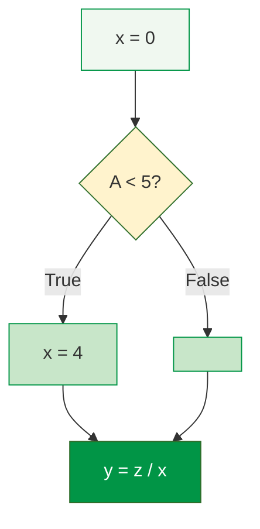
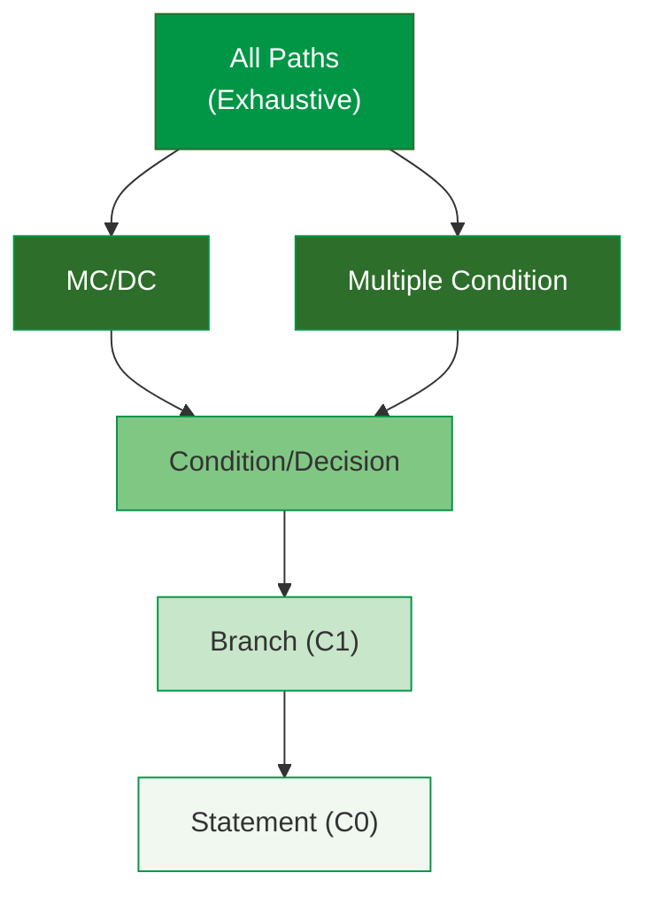
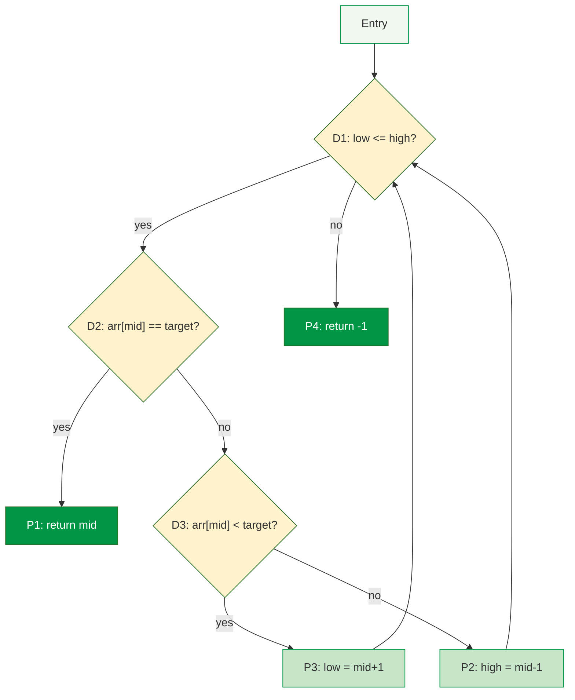

# Study Notes: Adequacy Criteria (L04)

## Purpose
These study notes cover test adequacy criteria including coverage metrics, their relationships, and practical application in software testing.

**Primary Sources:**
- McCabe 1976, A Complexity Measure 
- Chilenski & Miller 1994, MC/DC Applicability 
- Ammann & Offutt 2016, Introduction to Software Testing 

**Key Research Papers:**
- Inozemtseva & Holmes 2014, Coverage-effectiveness relationship 
- Zhang & Mesbah 2015, Assertions and effectiveness 
- Hemmati 2015, Coverage criteria comparison 
- Marick 1997, How to Misuse Code Coverage 

---

## Part 1: Coverage Concepts & Categories

### 1.1 What is Test Adequacy?

**The Core Question:**
> "How do you know when you've tested enough?"

Test adequacy criteria provide objective measures of test suite completeness. Coverage metrics answer: *What portion of the testable elements have been exercised?*

**Real-World Example - The Therac-25 Disaster:**
The Therac-25 radiation therapy machine killed three patients and injured three others (1985-1987). Post-mortem analysis revealed that testing focused on "normal" operation paths. The fatal race condition only occurred when operators typed commands rapidly—a path never exercised during testing. Better path coverage might have revealed the deadly bug.

**Why Adequacy Matters:**
- **Without criteria:** Testing stops when time/budget runs out
- **With criteria:** Testing stops when measurable goals are met
- **The gap:** What you test vs. what could fail

**Two Uses of Coverage:**

| Use | Purpose | Example |
|-----|---------|---------|
| **Generator** | Create tests to satisfy criterion | Write tests until 80% branch coverage |
| **Measure** | Evaluate existing tests | Report current coverage percentage |

**The Coverage Formula:**

$$\text{Coverage} = \frac{\text{Measured Items Executed}}{\text{Total Measured Items}} \times 100\%$$

**Concrete Example:**
```python
def grade(score):          # Line 1
    if score >= 90:        # Line 2 (decision)
        return "A"         # Line 3
    elif score >= 70:      # Line 4 (decision)
        return "B"         # Line 5
    else:                  # Line 6
        return "C"         # Line 7
```

| Test | Input | Statements Hit | Coverage |
|------|-------|----------------|----------|
| T1 | 95 | 1,2,3 | 3/7 = 43% |
| T1+T2 | 95, 75 | 1,2,3,4,5 | 5/7 = 71% |
| T1+T2+T3 | 95, 75, 50 | All 7 | 7/7 = 100% |

---

### 1.2 Categories of Coverage Criteria

| Category | Criteria | Focus | Code Needed? |
|----------|----------|-------|--------------|
| **White Box** | Statement, Branch, Path, MC/DC | Code structure | Yes |
| **Black Box** | Equivalence, Boundary, Combinatorial | Input space | No |
| **Mutation** | Mutation score | Fault detection | Yes |
| **Requirements** | N-switch, State coverage | Specification | No |

**Selection Factors:**
- Purpose of testing (unit, integration, system)
- Code availability (open source vs. compiled)
- Targeted fault types
- Compliance requirements (DO-178C, ISO 26262)

> **Exam Tip:** Know which criteria require source code access (white box, mutation) vs. those that don't (black box, requirements-based).

---

### 1.3 Industry Coverage Gates

**Google Test Certified Program** :

| Level | Total Coverage | Small Tests | Requirements |
|-------|----------------|-------------|--------------|
| L2 | 50% incremental | 10% | Continuous build |
| L4 | 40% | 25% | No red tests at release |
| **L5** | **60%** | **40%** | All code reviewed |

**Microsoft Milestone Gates** :

| Stage | Coverage Requirement |
|-------|---------------------|
| Pre-submit | **80%** for new features |
| Milestone 2 | 65% |
| Milestone 3 | 70% |

> **Key Insight:** Even Google acknowledges: 100% coverage ≠ no bugs.

---

## Part 2: Statement Coverage & Control Flow Basics

### 2.1 Control Flow Graph (CFG) Terminology

| Term | Definition | Example |
|------|------------|---------|
| **Statement** | Single executable instruction | `x = x + 1` |
| **Basic Block** | Sequence with single entry/exit | Multiple statements, no branches |
| **Decision** | Point with multiple outcomes | `if`, `while`, `switch` |
| **Condition** | Boolean sub-expression | `a > b` in `a > b && c == 1` |
| **Branch** | Edge from decision to target | True/False paths |
| **Path** | Sequence from entry to exit | Complete execution trace |

**CFG Construction:**
- **Nodes** = Basic blocks
- **Edges** = Control flow transitions
- **Entry/Exit** = Special start and end nodes

**Example CFG: If-Then-Else**

```python
x = 0           # Block 1
if A < 5:       # Decision
    x = 4       # Block 2 (True)
                # Block 3 (False - skip)
y = z / x       # Block 4
```



**CFG Metrics:** Nodes=5, Edges=5, V(G) = 5 - 5 + 2 = **2**

---

### 2.2 Statement Coverage (C0)

**Definition:** Each statement must be executed at least once.

**Formula:**

$$\text{Statement Coverage} = \frac{\text{Statements Executed}}{\text{Total Statements}} \times 100\%$$

**Example - The Hidden Bug:**

```python
x = 0           # S1
if A < 5:       # Decision
    x = 4       # S2
y = z / x       # S3 ← Potential division by zero!
```

**Test: A = 3**
- Executes: S1, S2, S3
- Coverage: **100%** ✓
- **Problem:** Misses `A >= 5` path where `x = 0` causes division by zero!

**Why Statement Coverage Is Weak:**

| Advantage | Disadvantage |
|-----------|--------------|
| Simple to measure | Insensitive to control flow |
| Low test count | Misses branch-specific faults |
| Easy to achieve | Ignores predicate structure |

> **Key Rule:** Statement coverage is the **floor**, not the **ceiling**. Never rely on it alone!

---

### 2.3 Coverage Subsumption Hierarchy

**Subsumption Rule:** C1 **subsumes** C2 means any test satisfying C1 **also** satisfies C2.

**The Hierarchy (strongest to weakest):**



**Reading the diagram:** An arrow A → B means "A subsumes B" (satisfying A guarantees B).

**Implications:**
- Higher criteria are **stronger** (catch more faults)
- Higher criteria require **more tests**
- Branch subsumes Statement
- MC/DC subsumes Branch and Condition

---

## Part 3: Branch Coverage & Basis Path

### 3.1 Branch Coverage (C1)

**Definition:** Each branch of every decision must be traversed at least once.

**Formula:**

$$\text{Branch Coverage} = \frac{\text{Branches Executed}}{\text{Total Branches}} \times 100\%$$

**Example - Catching the Bug:**

```python
x = 0
if A < 5:      # 2 branches
    x = 4
y = z / x
```

| Test | A | Path | Catches Bug? |
|------|---|------|--------------|
| T1 | 3 | True branch | No |
| T2 | 6 | False branch | **Yes!** x=0 triggers error |

> **Key Insight:** Branch coverage catches faults that statement coverage misses.

---

### 3.2 Branch Coverage Limitations

**Problem:** Compound predicates `if (A && B)` — branch coverage needs only 2 tests:

| Test | A | B | Outcome | Note |
|------|---|---|---------|------|
| T1 | true | true | True branch | ✓ |
| T2 | false | any | False branch | Short-circuit! |

**Missing:** `A=true, B=false` — never tested!

**Fault Example:**
```python
if A and B:    # Should be: A or B
    x = 1
```

The `AND` vs `OR` error remains **undetected**.

---

### 3.3 Cyclomatic Complexity & Basis Path

**Cyclomatic Complexity** :

$$V(G) = E - N + 2$$

Where:
- E = Number of edges
- N = Number of nodes
- V(G) = Minimum number of independent paths

**Alternative formula:** V(G) = D + 1 (where D = number of decisions)

**Why McCabe Invented This:**
McCabe observed that code with many decision points is harder to test and more error-prone. His metric gives:
1. **Upper bound** on tests needed for basis path coverage
2. **Complexity threshold** for refactoring (typically V(G) ≤ 10)
3. **Risk indicator** — high V(G) correlates with defects

**Why Basis Path Instead of All Paths?**

| Decisions | All-Path ($2^n$) | Basis Path (n+1) |
|-----------|-----------------|------------------|
| 2 | 4 | **3** |
| 4 | 16 | **5** |
| 8 | 256 | **9** |
| 10 | 1,024 | **11** |

All-path coverage is **exponential** — infeasible for real code.

**Basis Path Advantages:**
- **Linear** growth in test count
- Covers all independent control flow paths
- Covers every edge at least once
- V(G) gives **upper bound** on required tests

**Example: Binary Search CFG**

```python
def binary_search(arr, target):
    low, high = 0, len(arr) - 1
    while low <= high:         # D1
        mid = (low + high) // 2
        if arr[mid] == target: # D2
            return mid         # P1: found
        elif arr[mid] < target: # D3
            low = mid + 1      # P3: right
        else:
            high = mid - 1     # P2: left
    return -1                  # P4: not found
```



**V(G) = 3 decisions + 1 = 4 basis paths = 4 test cases**

---

### 3.4 Unfeasible Paths

**Problem:** Semantic dependencies prevent execution of some paths.

```python
if x > 0:
    y = 1
if x > 0:     # Same condition!
    z = y + 1
```

**Impossible Path:** `x > 0` → `y = 1` → `x ≤ 0` → skip z

The CFG shows 4 possible paths, but only 2 are actually executable:
- `x > 0`: Execute both if-blocks
- `x ≤ 0`: Skip both if-blocks

The paths where the first condition is true but the second is false (or vice versa) are **semantically impossible** because `x` doesn't change between checks.

**Real-World Example - Login System:**

```python
is_valid = validate_password(password)
if is_valid:
    log_success()
if not is_valid:  # Mutually exclusive with above
    log_failure()
```

CFG shows 4 paths, but only 2 are feasible. You can never execute both `log_success()` AND `log_failure()` in the same run.

**Practical Rule:** Target 85-90% path coverage; remaining may be unfeasible.

---

## Part 4: Condition Coverage & MC/DC

### 4.1 Condition Coverage Types Compared

| Coverage Type | Definition | Tests for `if (A && B)` |
|---------------|------------|-------------------------|
| **Basic Condition** | Each condition true/false once | 2: (T,T), (F,F) |
| **Decision Coverage** | Each decision true/false | 2: (T,T), (F,any) |
| **Condition/Decision** | Both above combined | 2-3 tests |
| **Multiple Condition** | All combinations | 4: TT, TF, FT, FF |
| **MC/DC** | Each condition independently affects outcome | 3: TT, TF, FT |

**Multiple Condition Problem:** Exponential growth — $2^n$ test cases!

| Conditions | Multiple Condition | MC/DC |
|------------|-------------------|-------|
| 2 | 4 | 3 |
| 3 | 8 | 4 |
| 4 | 16 | 5 |
| n | $2^n$ | **n+1** |

---

### 4.2 MC/DC: Modified Condition/Decision Coverage

**MC/DC Requirements:**
1. Every **decision** takes all outcomes
2. Every **condition** takes all outcomes
3. Each condition **independently** affects decision

**Key insight:** Change ONE condition, change the outcome.

**Real-World Example - Autopilot Engagement:**

```python
# Engage autopilot only if all safety conditions met
if altitude_ok and speed_ok and no_warnings:
    engage_autopilot()
```

**MC/DC Test Set:**

| Test | altitude_ok | speed_ok | no_warnings | Result | Proves Independence Of |
|------|-------------|----------|-------------|--------|------------------------|
| T1 | T | T | T | **Engage** | Baseline |
| T2 | **F** | T | T | No engage | **altitude_ok** |
| T3 | T | **F** | T | No engage | **speed_ok** |
| T4 | T | T | **F** | No engage | **no_warnings** |

**Reading the table:**
- Compare T1↔T2: Only `altitude_ok` changed, outcome changed → altitude independently affects result
- Compare T1↔T3: Only `speed_ok` changed, outcome changed → speed independently affects result
- Compare T1↔T4: Only `no_warnings` changed, outcome changed → warnings independently affect result

**4 tests for 3 conditions** — not 8 for multiple condition!

---

### 4.3 MC/DC in Safety-Critical Standards

| Standard | Domain | Requirement |
|----------|--------|-------------|
| **DO-178C** | Aerospace | Level A requires MC/DC |
| **ISO 26262** | Automotive | Recommends MC/DC for ASIL D |
| **IEC 62304** | Medical | Considers MC/DC for Class C |

**Advantages:**
- Strong fault detection capability
- Linear test growth (n+1)
- Catches masking in compound predicates

**Challenges:**
- Manual generation is laborious
- Requires tool support
- Some combinations may be infeasible

> **Exam Tip:** Know the n+1 formula for MC/DC and be able to construct independence pairs.

---

## Part 5: Mutation & Combinatorial Testing

### 5.1 Mutation Testing 

**The Core Idea:**
If your tests are good, they should detect small changes (mutations) to the code. If a mutant "survives" (tests still pass), your tests aren't checking something important.

**Process:**
1. **Create mutants:** Inject small faults into code
2. **Execute tests:** Run test suite against each mutant
3. **Classify results:**
   - **Killed:** Test fails → Good!
   - **Survived:** Test passes → Test suite weak
   - **Equivalent:** Mutant behaves identically → Exclude

**Concrete Example:**

```python
# Original code
def is_adult(age):
    return age >= 18

# Mutant 1: Change >= to >
def is_adult_m1(age):
    return age > 18  # Bug: 18-year-olds excluded

# Mutant 2: Change 18 to 17
def is_adult_m2(age):
    return age >= 17  # Bug: 17-year-olds included
```

| Test | Input | Original | M1 | M2 | Kills |
|------|-------|----------|----|----|-------|
| T1 | age=25 | True | True | True | None |
| T2 | age=18 | True | **False** | True | **M1** |
| T3 | age=17 | False | False | **True** | **M2** |

**T1 alone:** 0% mutation score (both survive)
**T1+T2+T3:** 100% mutation score (all killed)

**Mutation Score:**

$$\text{Mutation Score} = \frac{\text{Killed}}{\text{Total} - \text{Equivalent}} \times 100\%$$

**Target:** 60-80% mutation score is considered good.

---

### 5.2 Mutation Operators

| Category | Operator | Example |
|----------|----------|---------|
| **Arithmetic** | Replace + with - | `a + b` → `a - b` |
| **Relational** | Replace < with <= | `x < 5` → `x <= 5` |
| **Logical** | Replace && with \|\| | `A && B` → `A \|\| B` |
| **Constant** | Change value | `x = 0` → `x = 1` |
| **Statement** | Delete statement | `x++` → (removed) |

> **Key Insight:** If a mutant survives, you need better tests!

---

### 5.3 Combinatorial Testing 

**Problem:** Too many input combinations to test exhaustively.

**Example:** 4 parameters × 3 values each = $3^4$ = **81 combinations**

**Pairwise (2-way) Testing:**
Cover all pairs of parameter values.

| Test | Browser | OS | Screen | Theme |
|------|---------|-----|--------|-------|
| 1 | Chrome | Win | Desktop | Light |
| 2 | Chrome | Mac | Mobile | Dark |
| 3 | Firefox | Win | Mobile | Dark |
| 4 | Firefox | Mac | Desktop | Light |

**Result:** ~9 tests instead of 81

**Research shows:** Most bugs involve ≤ 2-way interactions.

**Tools:** ACTS (NIST), Pairwise.org generators

---

### 5.4 N-Switch State Coverage

**Definition:** Cover all sequences of N state transitions.

| N | Coverage | Tests |
|---|----------|-------|
| 0-switch | All states | Few |
| 1-switch | All transitions | Moderate |
| 2-switch | All transition pairs | Many |

**Use for:** Protocol testing, UI workflows, embedded systems

---

## Part 6: Coverage vs Quality — Modern Research

### 6.1 The Coverage-Quality Gap

**Popular Belief:** Linear relationship between coverage and quality

**Empirical Findings:**
- Diminishing returns above 80-90%
- Non-linear relationship
- High coverage ≠ high quality

| Coverage Measures | Does NOT Measure |
|-------------------|------------------|
| Code executed | Oracle correctness |
| Paths traversed | Missing code (faults of omission) |
| Conditions tested | Requirements coverage |
| Mutations killed | Usability |

> "Coverage can only tell me how the code that exists has been exercised. It can't tell me how code that ought to exist would have been exercised." — Marick 1997 

---

### 6.2 The Size Confounding Problem

**Landmark Finding** :

> "Coverage is NOT strongly correlated with test suite effectiveness when size is controlled."

| Condition | Correlation |
|-----------|-------------|
| Size ignored | 0.79 - 0.95 (appears strong) |
| **Size controlled** | **~0** (essentially none) |

**Lu et al. 2025**  quantified:

```vega-lite
{
  "$schema": "https://vega.github.io/schema/vega-lite/v5.json",
  "width": 350,
  "height": 200,
  "title": {"text": "How Much of Coverage Effect is Actually Test Suite Size?", "subtitle": "Source: Lu et al. 2025"},
  "data": {
    "values": [
      {"metric": "Statement Coverage", "size_effect": 69, "independent_effect": 31},
      {"metric": "Branch Coverage", "size_effect": 81.9, "independent_effect": 18.1}
    ]
  },
  "transform": [
    {"fold": ["size_effect", "independent_effect"], "as": ["component", "value"]}
  ],
  "mark": {"type": "bar"},
  "encoding": {
    "y": {"field": "metric", "type": "nominal", "axis": {"title": null}},
    "x": {"field": "value", "type": "quantitative", "title": "% of Correlation", "stack": "normalize", "axis": {"format": ".0%"}},
    "color": {"field": "component", "type": "nominal", "scale": {"range": ["#d32f2f", "#019546"]}, "legend": {"title": null, "labelExpr": "datum.value === 'size_effect' ? 'Explained by Size' : 'Independent Effect'"}}
  },
  "config": {"font": "Tahoma, sans-serif", "view": {"stroke": null}}
}
```

| Metric | % Explained by Size |
|--------|---------------------|
| Statement Coverage | **69%** |
| Branch Coverage | **81.9%** |

**The Hidden Variable:**
More tests → Higher coverage AND more faults found (Correlation, not causation!)

**What this means practically:**
When someone says "we increased coverage from 60% to 80% and found more bugs," the real cause is likely:
- They wrote 33% more tests (size increase)
- More tests = more chances to find bugs
- Coverage increase was a **side effect**, not the cause

---

### 6.3 What Actually Predicts Fault Detection?

**Assertions > Coverage** :

```vega-lite
{
  "$schema": "https://vega.github.io/schema/vega-lite/v5.json",
  "width": 350,
  "height": 150,
  "title": {"text": "Correlation with Fault Detection Effectiveness", "subtitle": "Source: Zhang & Mesbah 2015"},
  "data": {
    "values": [
      {"factor": "Assertion Count", "correlation": 0.95, "order": 1},
      {"factor": "Test Count", "correlation": 0.65, "order": 2},
      {"factor": "Statement Coverage", "correlation": 0.35, "order": 3}
    ]
  },
  "mark": {"type": "bar", "cornerRadiusEnd": 4},
  "encoding": {
    "y": {"field": "factor", "type": "nominal", "sort": {"field": "order"}, "axis": {"title": null}},
    "x": {"field": "correlation", "type": "quantitative", "title": "Correlation Coefficient", "scale": {"domain": [0, 1]}},
    "color": {"condition": {"test": "datum.factor === 'Assertion Count'", "value": "#019546"}, "value": "#c8e6c9"}
  },
  "config": {"font": "Tahoma, sans-serif", "view": {"stroke": null}}
}
```

| Factor | Correlation with Effectiveness |
|--------|-------------------------------|
| **Assertion quantity** | **0.927 - 0.973** |
| Statement coverage (alone) | Weak |

> "The correlation between size and effectiveness is driven by assertions, not coverage."

**What this means practically:**
A test that executes 100 lines but checks nothing (no assertions) is almost worthless. A test that executes 10 lines but has strong assertions on the output is valuable. **Coverage measures exploration; assertions measure verification.**

**Coverage Criteria Compared** :

```vega-lite
{
  "$schema": "https://vega.github.io/schema/vega-lite/v5.json",
  "width": 400,
  "height": 200,
  "title": {"text": "Fault Detection by Coverage Criterion", "subtitle": "Source: Hemmati 2015"},
  "data": {
    "values": [
      {"criterion": "Statement", "faults": 10, "order": 1},
      {"criterion": "Branch", "faults": 19, "order": 2},
      {"criterion": "MC/DC", "faults": 19, "order": 3},
      {"criterion": "All Control-Flow", "faults": 28, "order": 4},
      {"criterion": "+ Data-Flow (DU)", "faults": 85, "order": 5}
    ]
  },
  "mark": {"type": "bar", "cornerRadiusEnd": 4},
  "encoding": {
    "y": {"field": "criterion", "type": "nominal", "sort": {"field": "order"}, "axis": {"title": null}},
    "x": {"field": "faults", "type": "quantitative", "title": "% Faults Detected", "scale": {"domain": [0, 100]}},
    "color": {"condition": {"test": "datum.criterion === '+ Data-Flow (DU)'", "value": "#019546"}, "value": "#c8e6c9"}
  },
  "config": {"font": "Tahoma, sans-serif", "view": {"stroke": null}}
}
```

| Criterion | Faults Detected |
|-----------|-----------------|
| Statement Coverage | **10%** |
| Branch Coverage | 19% |
| MC/DC | 19% |
| All control-flow | 28% |
| **+ Data-flow (DU pairs)** | **85%** |

> **Key Finding:** Statement coverage misses **90%** of real faults!

**Why Data-Flow is so effective:**
Data-flow coverage tracks where variables are **defined** (assigned) and where they are **used** (read). This catches faults like:
- Variable used before initialization
- Wrong variable used in calculation
- Value overwritten before use

---

### 6.4 Coverage Anti-Patterns 

| Anti-Pattern | Problem |
|--------------|---------|
| Tests designed FOR coverage | Uniformly weak test suite |
| Quick tests to satisfy tool | Misses faults of omission |
| 85% as shipping gate | People cluster at threshold |
| Ignoring low coverage | Missing the process signal |

**Example of "Gaming Coverage":**

```python
# Bad: Written just to hit lines, no real verification
def test_calculate_discount():
    result = calculate_discount(100, 0.1)  # Executes code
    # No assertion! Just running the code for coverage

# Good: Written to verify behavior
def test_calculate_discount():
    result = calculate_discount(100, 0.1)
    assert result == 90.0  # 10% off $100 = $90
    assert calculate_discount(100, 0) == 100.0  # No discount
    assert calculate_discount(0, 0.5) == 0.0  # Zero base
```

Both tests might show the same coverage, but only the second catches bugs!

**Healthy Practices:**

1. Design tests from **requirements first**
2. Use coverage to find **gaps** in test design
3. Low coverage = **process problem**, not just test gap
4. Track **trends**, not absolute numbers
5. Combine with **specification-based** testing

> "If a part of your test suite is weak in a way coverage can detect, it's likely also weak in a way coverage can't detect." — Marick

---

## Part 7: Practical Guidelines & Tools

### 7.1 Choosing the Right Coverage Level

| Criterion | Strength | Tests | Use When |
|-----------|----------|-------|----------|
| Statement (C0) | Weak | Low | Minimum bar |
| Branch (C1) | Moderate | ~2×D | Default |
| Basis Path | Good | V(G) | Complex flow |
| MC/DC | Strong | n+1 | Safety-critical |
| All Paths | Exhaustive | $2^n$ | Infeasible |

### 7.2 Recommended Targets

| Coverage | Min | Target | Note |
|----------|-----|--------|------|
| Statement | 70% | 80% | Diminishing >90% |
| Branch | 75% | 85% | Good balance |
| MC/DC | 100%* | 100%* | *Safety-critical |
| Mutation | 60% | 80% | Expensive >80% |

### 7.3 Coverage Tools by Language

| Language | Tool | Coverage Types |
|----------|------|----------------|
| Java | **JaCoCo** | Stmt, Branch, Line, Method, Complexity |
| Python | **Coverage.py** | Stmt, Branch |
| C/C++ | **LLVM-cov**, gcov | Stmt, Branch |
| C# | **Coverlet**, dotCover | Stmt, Branch |
| JavaScript/TS | **c8**, Vitest | Stmt, Branch, Func |
| Go | `go test -cover` | Stmt |
| Rust | **cargo-llvm-cov** | Stmt, Branch |

**Integration Pipeline:** IDE plugins → Pre-commit hooks → CI/CD gates → PR comments

---

## Key Takeaways

1. **Coverage hierarchy:** Paths → Branches → Statements (subsumption)
2. **Statement coverage is weak:** Minimum bar, not goal
3. **Branch coverage is default:** Good balance of effort/detection
4. **MC/DC for safety-critical:** Required by DO-178C, ISO 26262
5. **Cyclomatic complexity:** V(G) = E - N + 2 gives upper bound
6. **Coverage ≠ Quality:** Measures thoroughness, not correctness
7. **Assertions matter more:** 0.927+ correlation vs. weak for coverage alone
8. **Use coverage for gaps:** Not as sole shipping criterion
9. **Size confounds correlation:** 69-82% of effect explained by test count

---

### References



---

{: .highlight }
**Disclaimer:** AI is used for text summarization, polishing and explaining. Authors have verified all facts and claims. In case of an error, feel free to file an issue.
