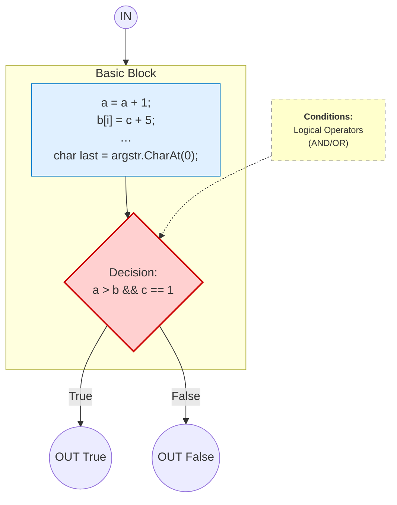
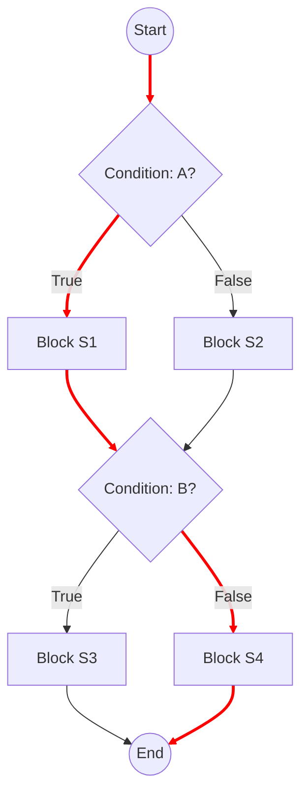

# Terminology

## Decisions, Conditions & Branches

*Reference: Adapted from A. Hass, Guide to Advanced Software Testing, 2008 *

1. **Statement**

   * The smallest executable unit in code (non-comment, non-whitespace).
   * Example: `x = y + 1` or `return z;`.

2. **Basic Block**

   * A **sequence** of one or more statements that always execute together.
   * **Entry** at the first statement; **exit** at the last.
   * No internal branches—only the last statement can transfer control elsewhere.

3. **Decision (Branch Point)**

   * A statement whose outcome (True/False or multiple cases) determines the next basic block.
   * Examples:

     * `IF … THEN … ELSE`
     * `FOR …`, `WHILE …`, `DO … WHILE`
     * `CASE … OF`

4. **Branch**

   * A directed edge in the control-flow graph representing one possible outcome of a decision.
   * Each decision can have two or more branches (e.g., True/False or multiple CASE labels).

5. **Condition**

   * A Boolean expression evaluated inside a decision (e.g., `A > B`).
   * Decisions may combine several conditions with logical operators (`&&`, `||`).

---

## Control-Flow Graphs (CFG)

A **control-flow graph** models all possible execution paths through a program:

* **Nodes**

  * Represent either individual statements or basic blocks.
* **Edges**

  * Represent possible transfers of control (which statement/block follows).

**Key properties:**

* There is a unique **start node** and **end node**.
* Nodes with **multiple outgoing edges** are decision points.
* An _execution_ **path** is any sequence of nodes and edges from start to end (or between any two nodes).

> **Why CFGs matter:**
>
> * They provide the foundation for **structural testing** (statement, branch, path coverage).
> * They help identify all decision points and possible execution paths.

---

### Compact CFG via Basic Blocks

Instead of one node per statement, we can merge consecutive non-branching statements into a **basic-block node**:

1. **Partition** the code into basic blocks.
2. Build a graph where each node is a block, and edges represent jumps between blocks.
3. This yields a **smaller** but **equivalent** CFG for analysis and coverage metrics.

---

## Example: Simple IF/ELSE CFG

The example below demonstrates a CFG with two decision nodes.

The figure shows a **Test case**: `A=true, B=false`

The execution path for this test case is shown in red on the diagram.

The set of all _selected test cases_ is a **Test suite**. For example, **Test suite** = **Test case 1**: `A=true, B=false` + **Test case 1**: `A=true, B=true`

---

{: .note }
For data-flow coverage criteria (Definition-Use pairs, All-Defs, All-Uses, All-DU-Paths), see [Data Flow Coverage](data-flow.md).

---

### References



---

{: .highlight }
**Disclaimer:** AI is used for text polishing and explaining. Authors have verified all facts and claims. In case of an error, feel free to file an issue.
