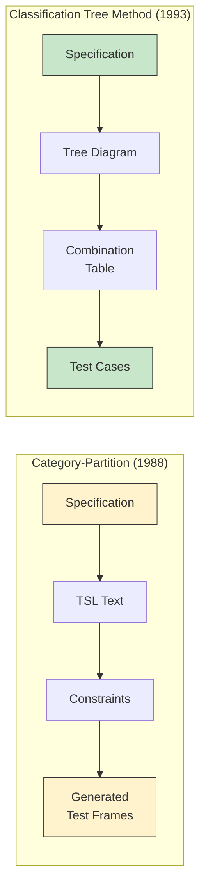
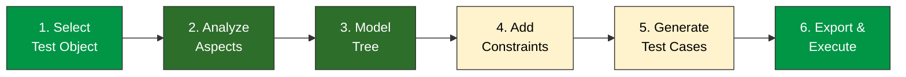
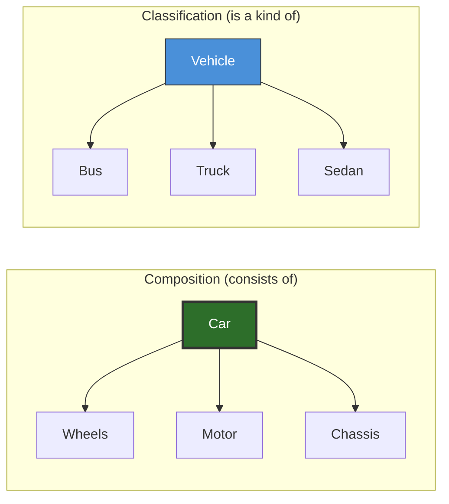
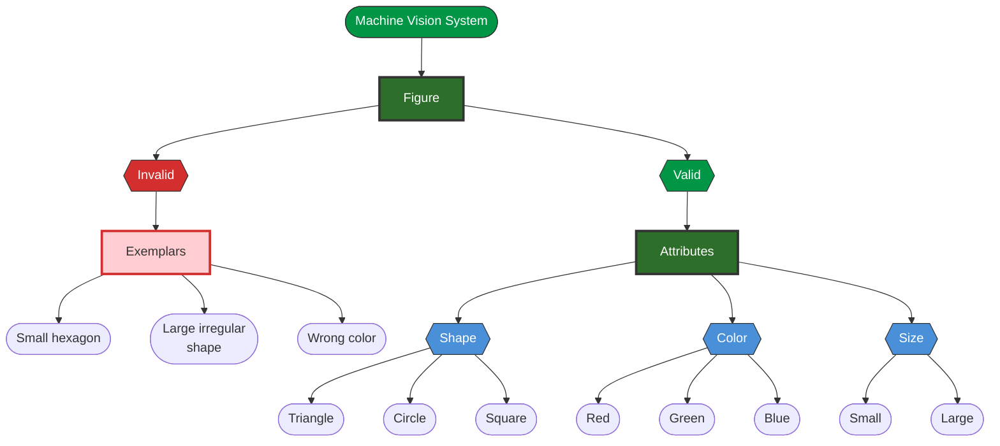
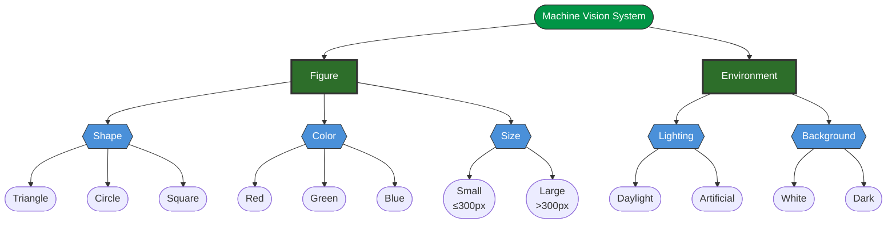
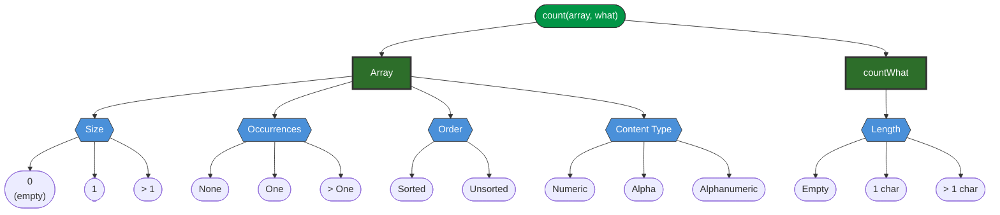
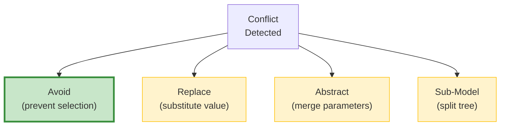
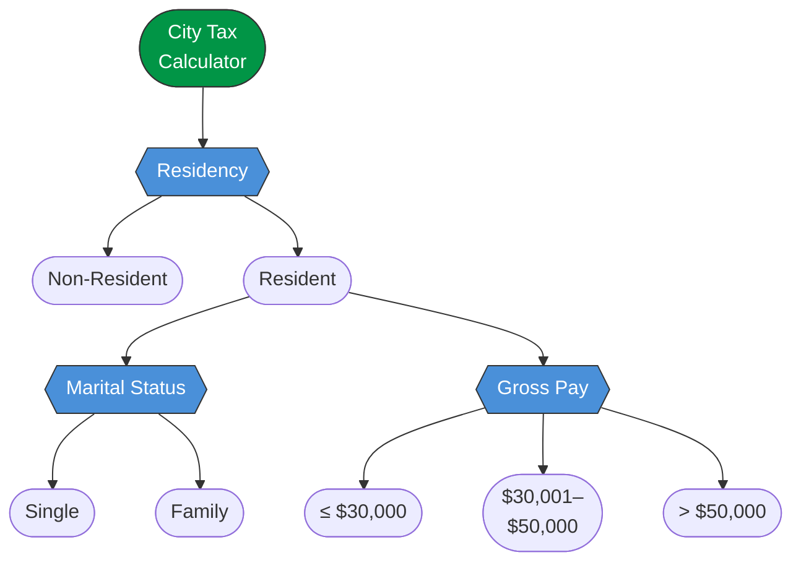
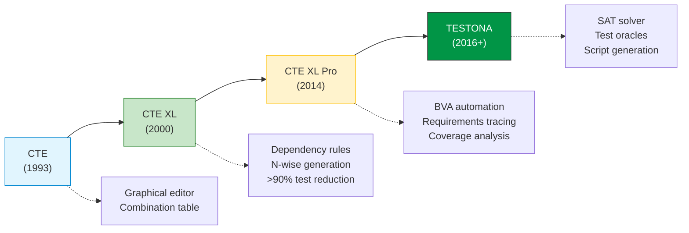
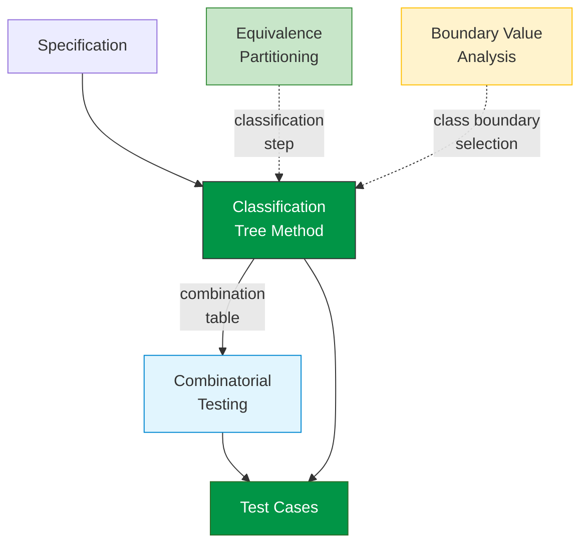

# Study Notes: Classification Tree Method

## Purpose
These study notes cover the **Classification Tree Method (CTM)** — a systematic technique for modeling input domains and deriving test specifications. Aimed at MS-level students who need to apply CTM in practice and understand its theoretical foundations.

For full definitions, diagrams, and references, see the [Classification Tree Method](classification-tree.md) page.

**Primary Sources:**
- Grochtmann & Grimm 1993, "Classification Trees for Partition Testing" 
- Buechner 2009, "Test Case Design Using the Classification Tree Method" 

**Key Research Papers:**
- Yu et al. 2004  — the only controlled empirical study of CTM (162 students)
- Chen et al. 2000  — E[T] tree quality metric and restructuring
- Lehmann & Wegener 2000  — CTE XL tool with >90% test reduction
- Grindal et al. 2007  — constraint-handling strategies (3,854 test suites)

---

## Part 1: Introduction & Motivation

### 1.1 The Problem: Combinatorial Explosion

Even a simple system has many test-relevant aspects, and the number of combinations grows multiplicatively:

**Example — Machine Vision System:**
A robot classifies figures on a conveyor belt. Test-relevant aspects include:

| Aspect | Values | Count |
|--------|--------|-------|
| Shape | Triangle, Circle, Square | 3 |
| Color | Red, Green, Blue | 3 |
| Size | Small, Large | 2 |
| Lighting | Bright, Dim | 2 |
| Background | White, Dark | 2 |

**Total combinations:** 3 x 3 x 2 x 2 x 2 = **72 test cases** — and this is a *simple* example.

### 1.2 From Category-Partition to CTM

The CTM  was developed as an improvement over the **Category-Partition (CP) method** :



| Aspect | Category-Partition (1988) | Classification Tree Method (1993) |
|--------|--------------------------|-----------------------------------|
| **Notation** | Formalized text (TSL language) | Graphical tree + combination table |
| **Structure** | Flat categories, all at same level | Hierarchical, multi-level |
| **Test volume** | Start large, add restrictions | Start minimal, add until sufficient |
| **Specification** | Implicit, lengthy generated lists | Direct, compact combination table |

{: .exam-tip }
> **Exam Tip:** The key improvement is **visual structure**. CP uses text; CTM uses a tree you can see, discuss with stakeholders, and reason about hierarchically.

### 1.3 The CTM Process: Six Steps



Steps 2 and 3 are **intertwined** — you go back and forth between analyzing the spec and refining the tree.

{: .exam-tip }
> **Exam Tip:** Remember the 6 steps as **SAMCGE** — "**S**elect, **A**nalyze, **M**odel, **C**onstrain, **G**enerate, **E**xport." The key insight is that Analyze and Model iterate together.

### 1.4 Does CTM Work? Empirical Evidence

Yu et al.  conducted the **only controlled empirical study** of CTM with 162 students (104 full-time + 58 part-time). After just 3 hours of training:

```vega-lite
{
  "$schema": "https://vega.github.io/schema/vega-lite/v5.json",
  "title": "Testing Method Preference: Before vs. After CTM Training",
  "width": 400,
  "height": 250,
  "data": {
    "values": [
      {"Method": "White-box", "Phase": "Before Training", "Percentage": 53},
      {"Method": "White-box", "Phase": "After Training", "Percentage": 18},
      {"Method": "BVA", "Phase": "Before Training", "Percentage": 12},
      {"Method": "BVA", "Phase": "After Training", "Percentage": 8},
      {"Method": "EP", "Phase": "Before Training", "Percentage": 15},
      {"Method": "EP", "Phase": "After Training", "Percentage": 5},
      {"Method": "CTM", "Phase": "Before Training", "Percentage": 0},
      {"Method": "CTM", "Phase": "After Training", "Percentage": 66},
      {"Method": "Other", "Phase": "Before Training", "Percentage": 20},
      {"Method": "Other", "Phase": "After Training", "Percentage": 3}
    ]
  },
  "mark": "bar",
  "encoding": {
    "x": {"field": "Method", "type": "nominal", "axis": {"labelAngle": 0}},
    "y": {"field": "Percentage", "type": "quantitative", "title": "% of students"},
    "xOffset": {"field": "Phase", "type": "nominal"},
    "color": {
      "field": "Phase",
      "type": "nominal",
      "scale": {"range": ["#fff3cd", "#019546"]}
    }
  }
}
```

| Metric | Result |
|--------|--------|
| Preferred CTM over ad hoc | **66%** |
| Perceived CTM as systematic | **63%** |
| Valued graphical representation | **54%** |
| Ad hoc fault detection | Only **55%** of faulty programs |

> "None of the students' test suites, except one developed by a mix of black and white box methods, could detect all faulty programs that our test suite derived from CTM did."

**Industrial evidence** (see [main page](classification-tree.md#empirical-evidence) for full table):

| Domain | Key Result | Source |
|--------|-----------|--------|
| Aerospace | 263 test cases for 2,700 modules | Grochtmann 1993 |
| Industrial | 70,000 to 5,560 tests (>90% reduction) | Lehmann 2000 |
| Automotive | TPT for continuous behavior testing | Bringmann 2008 |

{: .exam-tip }
> **Exam Tip:** Be aware of the **caveat**: all early industrial evidence comes from the Daimler / Berner & Mattner ecosystem. Yu 2004 is the only independent study. No independent industrial replications exist yet.

---

## Part 2: Core Concepts

### 2.1 Test Objects

A **test object** must be **invocable** (can be called), **observable** (output can be verified), and **restful** (returns to initial state). The choice of test object determines which aspects are relevant — testing the *full conveyor system* means lighting matters; testing just the *image processing module* means only figure properties matter.

{: .exam-tip }
> **Exam Tip:** If a test object violates the "restful" property, tests become order-dependent — results change based on execution sequence, making systematic coverage unreliable.

### 2.2 Aspects and Equivalence Classes

An **aspect** is any property that might influence the test object's behavior. Use **probing questions** to discover them: "What inputs? What environment? What values differ? What boundaries? What can go wrong?"

An **equivalence class** partitions aspect values into groups that produce **equivalent behavior**:
1. **Mutually exclusive** — no value belongs to multiple classes
2. **Collectively exhaustive** — every possible value is covered

{: .exam-tip }
> **Exam Tip:** Aspect identification is NOT mechanical — it requires creativity and domain insight. Use probing questions systematically.

### 2.3 Four Node Types

| Node Type | Meaning | Selectable? |
|-----------|---------|:-----------:|
| **Root** | The test object being tested | No |
| **Composition** | "Consists of" — aggregation (has-a) | No |
| **Classification** | Test-relevant aspect — equivalence partition (is-a) | No |
| **Class** | Disjoint, complete subset of values | **Yes** |

**Critical rule:** Only **Classes** are test-selectable — they form the columns of the combination table.

### 2.4 Composition vs Classification

This is one of the most important distinctions in CTM :



- **Composition** = parts list (a car *has* wheels, motor, chassis — ALL exist simultaneously)
- **Classification** = multiple-choice (a vehicle *is* a bus, truck, or sedan — exactly ONE applies)

**In the machine vision example:** **Figure** is a *composition* (has Shape, Color, AND Size). **Shape** is a *classification* (Triangle, Circle, OR Square).

### 2.5 Modeling Invalid Cases

Invalid cases form a **separate branch**, parallel to valid aspects — NOT scattered as individual leaves within each classification.



**Why?** If invalids sit inside each valid classification, the generator combines them with every valid value from other aspects — producing meaningless test cases. A separate branch ensures invalids are tested **individually**.

**Decision guide:** If the application tests invalids one at a time, use a separate branch. If it processes combinations of valid and invalid inputs together (e.g., multi-field form validation), consider mixing.

{: .exam-tip }
> **Exam Tip:** **Enumerate** invalid cases as concrete exemplars rather than comprehensively defining them. Ask: "What specific inputs would the system reject?" The answers become exemplars.

### 2.6 Machine Vision: Complete Tree



**Combinatorial count:** 3 (Shape) x 3 (Color) x 2 (Size) x 2 (Lighting) x 2 (Background) = **72 potential valid combinations**. Invalid exemplars are tested separately.

---

## Part 3: The CTM Process in Detail

### 3.1 Step 1: Select Test Object

The test object choice shapes the entire tree:

| Level | Test Object | Relevant Aspects | Irrelevant |
|-------|------------|-------------------|------------|
| **End-to-end** | Full conveyor system | Shape, Color, Size, Lighting, Background | -- |
| **Module** | Image processing library | Shape, Color, Size | Lighting, Background |

### 3.2 Steps 2-3: Analyze & Model (Intertwined)

Use **probing questions** to systematically uncover aspects:

1. What inputs does the test object receive?
2. What environment conditions exist at execution time?
3. What values might be treated differently by the system?
4. What boundary conditions matter?
5. What can go wrong? (invalid cases)

**Worked Example -- `count(searchedArray, countWhat)`:**

| Probing Question | Revealed Aspect | Classes |
|-----------------|----------------|---------|
| Does array size affect processing? | **Size** | 0, 1, >1 |
| Does element order matter? | **Order** | Sorted, Unsorted |
| How many times does the element occur? | **Occurrences** | None, One, Many |
| Does content type matter? | **Content** | Numeric, Alpha, Alphanumeric |
| What about countWhat length? | **Length** | Empty, One char, Multiple |
| What if countWhat is null? | **Invalid** | null countWhat |

### 3.3 Count Function Tree



**Combinatorial count:** 3 x 2 x 3 x 3 x 3 = **162 potential combinations** (valid only). Many are **infeasible** — e.g., "Array size = 0" AND "Occurrences = Many" is impossible. This is where constraints come in.

**Constraints (impossible combinations):**

| Constraint | Reason |
|------------|--------|
| Size = 0 -> Occurrences = None | Empty array cannot contain the value |
| Size = 0 -> Order is irrelevant | Cannot sort an empty array |
| Size = 1 -> Occurrences in {None, One} | Single element: either matches or doesn't |
| Size = 1 -> Order is irrelevant | Single element is trivially sorted |

### 3.4 Step 4: Constrain (Dependency Rules)

Grindal et al.  studied four strategies for handling conflicts across **3,854 test suites**:



| Strategy | How It Works | Suite Size |
|----------|-------------|-----------|
| **Avoid** | Modify the generator to skip conflicts | **Smallest** |
| **Replace** | Generate all, then clone & fix conflicts | 2nd best |
| **Abstract** | Merge conflicting parameters into one | Larger |
| **Sub-models** | Split into conflict-free sub-models | Largest |

{: .exam-tip }
> **Exam Tip:** Remember: **Avoid > Replace > Abstract > Sub-models** in terms of suite size efficiency. "Avoid" is the recommended default strategy.

### 3.5 Step 5: Generate Test Specifications

CTE XL  provides four generation strategies:

| Strategy | Description | When to Use |
|----------|-------------|-------------|
| **Minimality** | Every class covered at least once | Quick smoke tests |
| **Maximality** | All valid combinations | Exhaustive — only for small trees |
| **N-wise** | Every n-tuple of classes appears at least once | Balanced coverage vs cost |
| **Optimum** | User-defined rules + heuristic search | Custom priorities |

**N-wise** (especially **pairwise / 2-wise**) is the practical sweet spot: every pair of class values appears together in at least one test. Research shows most bugs involve interactions of 2-3 parameters.

### 3.6 Step 6: Export to Test Harness

| Approach | Leaf Values | Pros | Cons |
|----------|------------|------|------|
| **Concrete** | Actual test data (`array = [3, 1, 4]`) | Direct automation | Brittle to changes |
| **Abstract** | Value descriptions (`"Array: size > 1, unsorted"`) | Reusable, flexible | Needs manual instantiation |

{: .exam-tip }
> **Exam Tip:** Best practice is to **delay parameterization** — keep test specs abstract and reusable. One abstract spec can generate many concrete test cases .

### 3.7 Tree Quality -- The E[T] Metric

Chen et al.  proposed a metric to measure tree quality:

**Formula:** `E[T] = legitimate test cases / potential test cases`

| Tree Version | Potential | Legitimate | E[T] | Waste |
|-------------|----------|------------|------|-------|
| Ad hoc tree | 108 | 28 | **0.26** | 74% infeasible |
| Restructured tree | 60 | 28 | **0.47** | 53% infeasible |

**Restructuring nearly doubles effectiveness** while preserving all 28 legitimate test cases. Formal guarantees:
- **Preservation:** No legitimate test case is lost during restructuring
- **Convergence:** The potential count never increases

{: .exam-tip }
> **Exam Tip:** E[T] = 0.26 means **74% of generated tests are wasted** on infeasible combinations. Restructuring (moving aspects to different tree levels) can dramatically improve this without losing coverage.

---

## Part 4: Worked Examples

### 4.1 City Tax Example -- Full Walkthrough

**Step 1 -- Specification:**

| Residency | Status | Gross Pay | Tax Rate |
|-----------|--------|-----------|----------|
| Non-resident | Any | Any | 1% |
| Resident | Single | <= $30,000 | 1% |
| Resident | Single | $30,000-$50,000 | 5% |
| Resident | Single | > $50,000 | 15% |
| Resident | Family | <= $50,000 | 1% |
| Resident | Family | > $50,000 | 5% |

**Step 2-3 -- Classification Tree:**

Notice that Non-Residents don't need marital status or pay brackets. The tree models this **structurally** by nesting those classifications under the Resident class:



{: .important }
The hierarchy **eliminates impossible combinations structurally** — when Non-Resident is selected, Marital Status and Gross Pay simply don't exist in that subtree. No explicit constraint rules needed.

**Step 5 -- Combination Table:**

| TC | Resident? | Status | Gross Pay | Expected Tax |
|----|-----------|--------|-----------|-------------|
| 1 | No | -- | -- | 1% |
| 2 | Yes | Single | <= $30k | 1% |
| 3 | Yes | Single | $30k-$50k | 5% |
| 4 | Yes | Single | > $50k | 15% |
| 5 | Yes | Family | <= $50k | 1% |
| 6 | Yes | Family | > $50k | 5% |

**Step 6 -- Concrete Test Cases:**

| TC | Input | Expected Output |
|----|-------|----------------|
| 1 | Non-resident, $40,000 | $400 (1%) |
| 2 | Resident, Single, $18,000 | $180 (1%) |
| 3 | Resident, Single, $35,000 | $1,750 (5%) |
| 4 | Resident, Single, $80,000 | $12,000 (15%) |
| 5 | Resident, Family, $25,000 | $250 (1%) |
| 6 | Resident, Family, $60,000 | $3,000 (5%) |

{: .exam-tip }
> **Exam Tip:** This example demonstrates **hierarchy as constraint elimination**. A flat tree with Residency, Status, and Pay all at root level would produce infeasible combinations (Non-Resident + Single + $30k). The hierarchical tree avoids this without explicit dependency rules.

### 4.2 Document Identifier Example

A single value can encode **multiple** test-relevant aspects:

| Part of Document Number | Aspect | Classes |
|------------------------|--------|---------|
| First 3 digits | Document Type | Invoice, Receipt, Credit Note |
| Next 3 digits | Document Class | Internal, External, Intercompany |
| Last 4 digits | Sequence | Valid range, Out of range, Duplicate |

**Key lesson:** Look at **information conveyed**, not just the surface representation. Probing question: "Does the system treat document type 101 differently from 201?" If yes, document type is a test-relevant aspect.

### 4.3 Password Validation Example

Password validation requires **all aspects satisfied simultaneously** (intersection, not union):

| Aspect | Classes |
|--------|---------|
| Length | <8 (invalid), 8-16 (valid), >16 (invalid) |
| Numeric chars | None (invalid), Some (valid), All (invalid) |
| Uppercase chars | None (invalid), Some (valid), All (invalid) |

**Valid password** = Length(8-16) AND Numeric(Some) AND Uppercase(Some)

Example valid value: `Passw0rD` — satisfies all three aspects simultaneously.

### 4.4 Test Specification vs Test Case

| Test Specification (What) | Test Case (How) |
|--------------------------|----------------|
| Array size > 1 | `["world", "father", "father", "country"]` |
| Occurrences > 1 | `countWhat = "father"` |
| Unsorted | (order is not sorted) |
| Alphanumeric content | (strings contain letters) |
| **Abstract -- many valid concrete values** | **Concrete -- one specific execution, expected: 2** |

**Best practice:** Delay parameterization. One abstract spec can generate many valid concrete test cases .

---

## Part 5: Advanced Topics & Tools

### 5.1 Multiple Functions in One Form

Complex UI forms often contain **multiple functions** that should be tested separately (e.g., a Replace dialog has Find Next, Replace, Replace All, Close). **Principle:** Simpler trees lead to clearer coverage. Some duplication between trees is acceptable.

### 5.2 Tool Evolution



| Feature | CTE (1993) | CTE XL (2000) | TESTONA (2016+) |
|---------|:---------:|:-------------:|:---------------:|
| Dependency rules | -- | Boolean | Boolean + numerical |
| Generation | Manual | Min, max, n-wise | + SAT solver |
| Test oracles | -- | -- | 4 oracle types |
| Script generation | -- | -- | Integrated |

**Key result:** CTE XL dependency rules enabled **>90% test case reduction** (70,000 to 5,560 test cases) .

### 5.3 Common Pitfalls

 :

| # | Pitfall | Frequency | Mitigation |
|---|---------|-----------|------------|
| 1 | **Infeasible test cases** | 60% of novices | Use dependency rules / constraints |
| 2 | **Classification identification** | Common | Use probing questions systematically |
| 3 | **Subjectivity** | 25% | Use E[T] metric to evaluate tree quality |
| 4 | **Flat trees** | Common | Use composition nodes for hierarchy |
| 5 | **Skipping boundary values** | Common | Combine CTM with BVA |

**Most dangerous:** Infeasible test cases (pitfall #1). When 60% of novices create impossible combinations, the majority of generated tests are wasted.

### 5.4 CTM as an Integrating Framework



| Technique | Relationship to CTM |
|-----------|-------------------|
| **EP** | CTM classes ARE equivalence partitions |
| **BVA** | Apply BVA within each class range |
| **Decision Tables** | CTM combination table generalizes decision tables |
| **Combinatorial Testing** | N-wise strategies apply directly to CTM trees |

---

## Part 6: Summary & Review

### Six Key Takeaways

1. **Systematic:** CTM provides a 6-step repeatable process for test design 
2. **Visual:** Tree notation makes test design transparent -- you can *see* what you're testing
3. **Measurable:** The E[T] metric quantifies tree quality -- bad trees waste 74-83% of tests 
4. **Proven:** 66% of testers prefer CTM after just 3 hours of training 
5. **Scalable:** Tool support enables >90% test case reduction 
6. **Integrating:** CTM subsumes EP, connects to BVA, and feeds into combinatorial testing

### Self-Assessment Checklist

Before the exam, ensure you can:

- [ ] Explain the difference between composition and classification nodes
- [ ] Build a classification tree from a written specification
- [ ] Derive a combination table from a classification tree
- [ ] Explain why invalid cases should be in a separate branch
- [ ] Calculate E[T] and explain what a low value means
- [ ] Compare the four constraint-handling strategies
- [ ] Name the four generation strategies (minimality, maximality, n-wise, optimum)
- [ ] Explain why CTM integrates EP, BVA, and combinatorial testing
- [ ] Critique the empirical evidence for CTM (strengths and limitations)
- [ ] Apply probing questions to identify test-relevant aspects

---

### References



---

{: .highlight }
**Disclaimer:** AI is used for text summarization, polishing and explaining. Authors have verified all facts and claims. In case of an error, feel free to file an issue.
