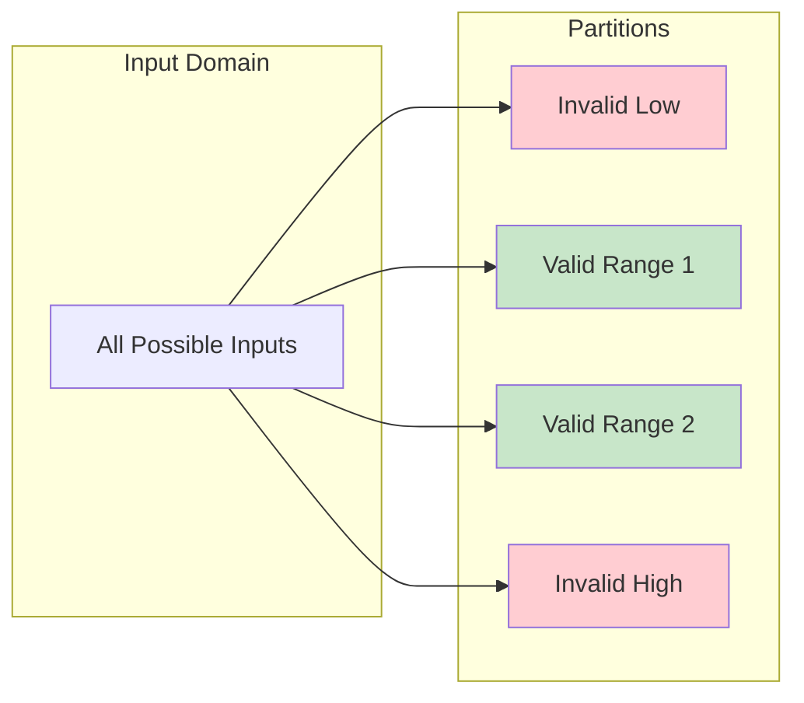
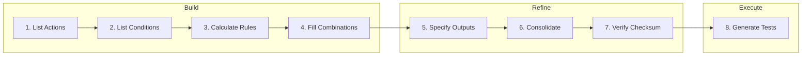
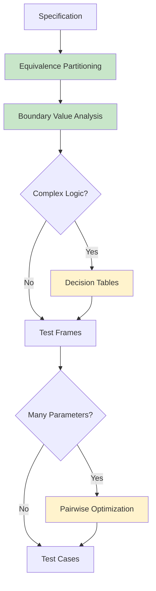

# Study Notes: Input Domain Testing (L05)

## Purpose
These study notes cover black-box testing techniques including equivalence partitioning, boundary value analysis, decision tables, and combinatorial testing overview.

**Primary Sources:**
- Myers 2011, The Art of Software Testing 
- Ammann & Offutt 2016, Introduction to Software Testing 
- Beizer 1995, Black-Box Testing 

**Key Research Papers:**
- Teasley et al. 1994, Positive Test Bias 
- Kuhn et al. 2004, Software Fault Interactions 
- Wallace & Kuhn 2001, Medical Device Failures 

---

## Part 1: Testing Fundamentals

### 1.1 Core Definitions

| Term | Definition |
|------|------------|
| **Test Case** | Input + expected output + oracle |
| **Test Suite** | Collection of test cases |
| **Oracle** | Mechanism to determine correct output |
| **Test Input** | Values provided to system |

**The Oracle Problem:** How do we know what the output *should* be?

**Testing Dimensions:**

| Dimension | Options |
|-----------|---------|
| **Knowledge** | Black-box (specification) vs White-box (code) |
| **Intent** | Positive (valid inputs) vs Negative (invalid inputs) |
| **Level** | Unit, Integration, System |

> **Key Insight:** Test input ≠ test case. Without an oracle, you cannot verify correctness!

---

### 1.2 Positive Test Bias

**From Teasley et al. 1994** :

> "Testers naturally gravitate toward inputs they expect to work."

**Psychology Experiment:**
- Group A: Rewarded for finding bugs
- Group B: Penalized for false alarms
- **Result:** Group A found significantly more real bugs

**Implications:**

| Mindset | Outcome |
|---------|---------|
| "Prove it works" | Miss edge cases |
| "Find where it breaks" | Better coverage |

> **Exam Tip:** The positive test bias research shows why **negative testing** (invalid inputs) must be explicitly planned. Testers will naturally under-test invalid partitions without conscious effort.

---

## Part 2: Equivalence Partitioning (EP)

### 2.1 Core Principle

The input domain is divided into **equivalence classes** where all values in a class are expected to produce similar behavior. This fundamental technique was formalized by Myers  and remains the foundation of black-box testing.

**Key insight from Ammann & Offutt** :
> "The assumption is that inputs that belong to the same sub-domain trigger a similar behaviour and that therefore it is sufficient to select one input from each sub-domain."

**Partition Requirements:**
- **Complete:** Every possible input belongs to some partition
- **Disjoint:** No input belongs to multiple partitions

**Concrete Example - Age Validation:**
```
Input: User age for insurance quote
Valid range: 18-120

Partitions:
├── Invalid: age < 0 (negative)
├── Invalid: 0-17 (too young)
├── Valid: 18-64 (standard adult)
├── Valid: 65-120 (senior)
└── Invalid: age > 120 (implausible)
```

**One test per partition:** Instead of testing ages 18, 19, 20, ..., 64, we pick ONE representative (e.g., 30) because they all trigger "standard adult" processing.

---

### 2.2 Partition Types



| Type | Description | Example |
|------|-------------|---------|
| **Range-Based** | Numeric ranges defined by comprehension | Age: {<0, 0-12, 13-19, 20-64, 65+} |
| **Enumeration-Based** | Discrete set of values | State: {CA, TX, NY, ...} |
| **Invalid** | Values outside valid domain | String when number expected |

**Common Partition Dimensions:**

| Attribute | Partition Values |
|-----------|------------------|
| String length | 0, 1, typical, max, >max |
| Set size | Empty, 1 element, many |
| Pointer/Reference | Null, valid, invalid |
| File | Missing, empty, normal, huge |

**Example - Password Validation:**

| Partition | Values | Expected Result |
|-----------|--------|-----------------|
| Too short | length < 8 | "Password too short" |
| Valid simple | 8-12, letters only | "Weak password" |
| Valid complex | 8-20, mixed chars | "Strong password" |
| Too long | length > 20 | "Password too long" |

---

### 2.3 Weak vs Strong EP

| Strategy | Description | Formula | Use Case |
|----------|-------------|---------|----------|
| **Weak EP** | One value from each partition | max(class counts) | Standard testing (one-fault assumption) |
| **Strong EP** | All combinations of partition values | product of class counts | Higher criticality systems |

**Example:**
- Variable A: 3 classes
- Variable B: 4 classes
- Variable C: 2 classes

| Strategy | Formula | Tests |
|----------|---------|-------|
| **Weak** | max(3,4,2) | **4** |
| **Strong** | 3×4×2 | **24** |

> **Practical Approach:** Start with weak, add strong for high-risk combinations.

---

### 2.4 Finding Equivalence Classes: Heuristics

| Source | Method | Example |
|--------|--------|---------|
| **Specification** | One class per stated case | "Discounts for orders > $100" |
| **Code paths** | One class per branch | `if/else` → 2 classes |
| **Error types** | One class per error | Invalid format, overflow |
| **Ranges** | Valid + boundary violations | 1-100 → {<1, 1-100, >100} |
| **Membership** | Inside + outside groups | Prime vs composite |
| **Outputs** | Classes producing same output | All inputs → "Error 404" |

> **Smell:** If you're writing many similar test cases, they probably belong to the same equivalence class!

---

### 2.5 Category-Partition Method

Systematic approach to EP:

1. **Identify parameters** and environment variables
2. **Define categories** (characteristics relevant for testing)
3. **Specify choices** (how domain splits into sub-domains)
4. **Add constraints** (choices that must/cannot appear together)
5. **Generate test frames** (combinations of choices)
6. **Derive test cases** (concrete values for each frame)

**Selection Criteria:**

| Criterion | Description |
|-----------|-------------|
| **Each-Choice** | Exercise each choice at least once |
| **Pair-Wise** | All pairs of choices from different categories |
| **Base-Choice** | One base + vary one category at a time |
| **All-Combinations** | Exhaustive (usually impractical) |

---

## Part 3: Boundary Value Analysis (BVA)

### 3.1 Why Boundaries Matter

**Empirical observation from Tian** : Faults cluster at boundaries between partitions.

**Most common bug:** Off-by-one errors (`<` vs `≤`, array index 0 vs 1, loop termination)

**Real-World Example - The Mars Climate Orbiter (1999):**
A unit conversion error at a boundary caused $327 million loss. Ground software used pounds; spacecraft expected Newtons. This wasn't caught because testing focused on "typical" values, not boundary conditions between systems.

**Why boundaries are dangerous:**
```python
# Intended: Accept ages 18-65
if age > 18 and age < 65:    # BUG! Excludes 18 and 65
    return "eligible"

# Correct:
if age >= 18 and age <= 65:  # Includes boundaries
    return "eligible"
```

Testing only age=30 (middle value) would pass both versions!

---

### 3.2 Boundary Fault Types

| Fault Type | Description | Example |
|------------|-------------|---------|
| **Closure bug** | Wrong operator (< vs ≤) | `if (x < 10)` should be `if (x <= 10)` |
| **Boundary shift** | Constant off by δ | `if (x < 10)` should be `if (x < 11)` |
| **Boundary tilt** | Parameter coefficient wrong | ax + by = K vs ax + cy = K |
| **Missing boundary** | Condition omitted | No upper bound check |
| **Extra boundary** | Spurious condition | Unnecessary range check |

---

### 3.3 ON/OFF Point Formalism

Tian  formalized boundary testing with the ON/OFF point methodology:

| Concept | Definition |
|---------|------------|
| **ON point** | Exactly on the boundary (satisfies f(x) = K) |
| **OFF point** | Just off boundary, within ε distance |
| **ε-neighborhood** | Small distance for distinguishing ON/OFF |

**OFF point placement depends on boundary type:**

| Boundary Type | OFF Point Location |
|---------------|-------------------|
| **Closed** (≤, ≥) | OFF point **outside** domain |
| **Open** (<, >) | OFF point **inside** domain |

**Concrete Example - Shipping Discount:**
```
Rule: Free shipping for orders ≥ $50 (closed boundary)

ON point:  $50.00  → should get free shipping
OFF point: $49.99  → should NOT get free shipping (outside domain)

Rule: Discount for orders > $100 (open boundary)

ON point:  $100.00 → should NOT get discount (boundary excluded)
OFF point: $100.01 → should get discount (inside domain)
```

> **Key Insight:** The OFF point must be in the **opposite** processing region from the ON point. This ensures you detect whether the boundary operator is correct.

> **Exam Tip:** For closed boundaries (≤, ≥), the OFF point goes OUTSIDE. For open boundaries (<, >), the OFF point goes INSIDE. Think: "OFF point tests the OTHER side."

---

### 3.4 BVA Testing Strategies

| Strategy | Points per Boundary | Detects | Test Count |
|----------|---------------------|---------|------------|
| **EPC** (Extreme Point Combinations) | 4^n + 1 | Vertex issues | Exponential |
| **Weak N×1** | N ON + 1 OFF | Closure, shift, tilt | (n+1) × b + 1 |
| **Weak 1×1** | 1 ON + 1 OFF | Closure, shift | 2 per condition |

**Practical formulas for k variables:**

| Strategy | Formula | Example (k=3) |
|----------|---------|---------------|
| Basic BVA | 4k + 1 | 13 tests |
| Robust BVA | 6k + 1 | 19 tests |

> **Exam Tip:** Know the 4k+1 and 6k+1 formulas. Weak 1×1 is the practical minimum - 1 ON + 1 OFF per boundary condition. Use N×1 for safety-critical when tilt detection is important.

---

### 3.5 Closed vs Open Boundaries

The key difference between closed and open intervals determines where you place ON and OFF test points:

```vega-lite
{
  "$schema": "https://vega.github.io/schema/vega-lite/v5.json",
  "width": 400,
  "height": 80,
  "title": "Closed Interval: L ≤ X ≤ R",
  "layer": [
    {
      "data": {"values": [{"x1": 1, "x2": 3}]},
      "mark": {"type": "rule", "strokeWidth": 8, "color": "#019546"},
      "encoding": {"x": {"field": "x1", "type": "quantitative", "scale": {"domain": [-0.5, 4.5]}, "axis": null}, "x2": {"field": "x2"}}
    },
    {
      "data": {"values": [{"x": 1, "label": "L"}, {"x": 3, "label": "R"}]},
      "mark": {"type": "point", "size": 300, "filled": true, "color": "#019546"},
      "encoding": {"x": {"field": "x", "type": "quantitative"}}
    },
    {
      "data": {"values": [{"x": 0, "label": "L-1"}, {"x": 4, "label": "R+1"}]},
      "mark": {"type": "point", "size": 250, "filled": false, "stroke": "#d32f2f", "strokeWidth": 3},
      "encoding": {"x": {"field": "x", "type": "quantitative"}}
    },
    {
      "data": {"values": [{"x": 2}]},
      "mark": {"type": "point", "size": 150, "filled": true, "color": "#81c784"},
      "encoding": {"x": {"field": "x", "type": "quantitative"}}
    },
    {
      "data": {"values": [{"x": 0, "label": "L-1"}, {"x": 1, "label": "L"}, {"x": 2, "label": "mid"}, {"x": 3, "label": "R"}, {"x": 4, "label": "R+1"}]},
      "mark": {"type": "text", "dy": 25, "fontSize": 12, "fontWeight": "bold"},
      "encoding": {"x": {"field": "x", "type": "quantitative"}, "text": {"field": "label"}}
    },
    {
      "data": {"values": [{"x": 0, "status": "OFF"}, {"x": 1, "status": "ON"}, {"x": 3, "status": "ON"}, {"x": 4, "status": "OFF"}]},
      "mark": {"type": "text", "dy": 40, "fontSize": 10, "color": "#666"},
      "encoding": {"x": {"field": "x", "type": "quantitative"}, "text": {"field": "status"}}
    }
  ],
  "config": {"view": {"stroke": null}}
}
```

**Closed Interval: L ≤ X ≤ R** (boundaries INCLUDED)

| Test Point | Purpose | In Domain? |
|------------|---------|------------|
| L - 1 | Just outside left (OFF) | No |
| **L** | Left boundary (ON) | **Yes** |
| mid | Nominal interior | Yes |
| **R** | Right boundary (ON) | **Yes** |
| R + 1 | Just outside right (OFF) | No |

```vega-lite
{
  "$schema": "https://vega.github.io/schema/vega-lite/v5.json",
  "width": 400,
  "height": 80,
  "title": "Open Interval: L < X < R",
  "layer": [
    {
      "data": {"values": [{"x1": 1, "x2": 3}]},
      "mark": {"type": "rule", "strokeWidth": 8, "color": "#019546"},
      "encoding": {"x": {"field": "x1", "type": "quantitative", "scale": {"domain": [-0.5, 4.5]}, "axis": null}, "x2": {"field": "x2"}}
    },
    {
      "data": {"values": [{"x": 0, "label": "L"}, {"x": 4, "label": "R"}]},
      "mark": {"type": "point", "size": 300, "filled": false, "stroke": "#d32f2f", "strokeWidth": 3},
      "encoding": {"x": {"field": "x", "type": "quantitative"}}
    },
    {
      "data": {"values": [{"x": 1, "label": "L+ε"}, {"x": 3, "label": "R-ε"}]},
      "mark": {"type": "point", "size": 250, "filled": true, "color": "#019546"},
      "encoding": {"x": {"field": "x", "type": "quantitative"}}
    },
    {
      "data": {"values": [{"x": 2}]},
      "mark": {"type": "point", "size": 150, "filled": true, "color": "#81c784"},
      "encoding": {"x": {"field": "x", "type": "quantitative"}}
    },
    {
      "data": {"values": [{"x": 0, "label": "L"}, {"x": 1, "label": "L+ε"}, {"x": 2, "label": "mid"}, {"x": 3, "label": "R-ε"}, {"x": 4, "label": "R"}]},
      "mark": {"type": "text", "dy": 25, "fontSize": 12, "fontWeight": "bold"},
      "encoding": {"x": {"field": "x", "type": "quantitative"}, "text": {"field": "label"}}
    },
    {
      "data": {"values": [{"x": 0, "status": "ON"}, {"x": 1, "status": "OFF"}, {"x": 3, "status": "OFF"}, {"x": 4, "status": "ON"}]},
      "mark": {"type": "text", "dy": 40, "fontSize": 10, "color": "#666"},
      "encoding": {"x": {"field": "x", "type": "quantitative"}, "text": {"field": "status"}}
    }
  ],
  "config": {"view": {"stroke": null}}
}
```

**Open Interval: L < X < R** (boundaries EXCLUDED)

| Test Point | Purpose | In Domain? |
|------------|---------|------------|
| **L** | Left boundary (ON) | **No** |
| L + ε | Just inside left (OFF) | Yes |
| mid | Nominal interior | Yes |
| R - ε | Just inside right (OFF) | Yes |
| **R** | Right boundary (ON) | **No** |

> **Note:** For open boundaries, the ON point is on the boundary but NOT in the domain (boundary excluded). The OFF point is placed just inside the domain. This ensures both test points are in opposite processing regions — necessary to detect closure faults (e.g., `<` vs `≤`).

> **Memory Trick:**
> - **Closed** = filled circle ● = points included = OFF goes OUTSIDE
> - **Open** = hollow circle ○ = points excluded = OFF goes INSIDE

---

### 3.6 BVA Limitations

- Assumes case-like processing model (no loops affecting input)
- **Coincidental correctness** is common (bug exists but test passes)
- ε-limits problematic for multi-platform testing
- OFF point undefined for some closed domains
- Requires detailed specification analysis

---

## Part 4: Decision Tables

### 4.1 When to Use Decision Tables

**Good Fit:**

| Characteristic | Example |
|----------------|---------|
| Logical relationships | AND, OR, NOT combinations |
| Subsets of inputs | Different processing paths |
| Unequivocal actions | Clear, discrete outcomes |
| Order-independent | Sequence doesn't matter |

**Best Applications:**
- Business rules engines
- Permission/access control
- Insurance/tax calculations
- Configuration validation
- State machine transitions

---

### 4.2 Decision Table Structure

**Components:**

| Section | Content |
|---------|---------|
| **Conditions** | Input variables (rows) |
| **Condition values** | Y/N or enumerated values |
| **Rules** | Columns - each combination |
| **Actions** | Output behaviors |
| **Don't care** | `-` or `*` - value doesn't affect outcome |

**ATM Withdrawal Example:**

**Problem Statement:**
An ATM should dispense cash only if ALL of the following conditions are met:
- The account has **sufficient balance** for the withdrawal
- The requested amount is **divisible by 20** (ATM denominations)
- The withdrawal is **within the daily limit**

Otherwise, the ATM should display the appropriate error message:
- "Insufficient funds" - if balance is too low
- "Invalid amount" - if amount is not divisible by 20
- "Daily limit exceeded" - if limit has been reached

**Legend:** Y = Yes (condition true), N = No (condition false), * = Don't care

| Conditions | R1 | R2 | R3 | R4 | R5 |
|------------|:--:|:--:|:--:|:--:|:--:|
| Sufficient Balance? | Y | Y | N | N | * |
| Amount ÷ 20? | Y | N | Y | N | * |
| Daily Limit OK? | Y | Y | Y | Y | N |
| **Actions** | | | | | |
| Dispense Cash | ✓ | | | | |
| Show "Invalid Amount" | | ✓ | | ✓ | |
| Show "Insufficient Funds" | | | ✓ | ✓ | |
| Show "Limit Exceeded" | | | | | ✓ |

**Reading the table:**
- **R1:** All conditions met → Dispense cash
- **R2:** Good balance but bad amount → "Invalid amount"
- **R3:** Bad balance, good amount → "Insufficient funds"
- **R4:** Bad balance, bad amount → Show both errors (or priority error)
- **R5:** Daily limit exceeded → "Limit exceeded" (other conditions don't matter)

---

### 4.3 The 8-Step Method (Beizer)

Beizer  defined an 8-step systematic method for building decision tables:



| Step | Purpose | Example |
|------|---------|---------|
| 1. List actions | Define output equivalence classes | "Dispense cash", "Show error" |
| 2. List conditions | Define input variables/partitions | "Balance OK?", "Amount valid?" |
| 3. Calculate rules | Product of condition values | 2×2×2 = 8 rules |
| 4. Fill combinations | Systematic enumeration | YYY, YYN, YNY, ... |
| 5. Specify outputs | Map rules to actions | Rule 1 → Dispense |
| 6. Consolidate | Identify don't-care conditions | "If limit exceeded, don't care about balance" |
| 7. Verify checksum | Ensure complete coverage | Sum of covers = original count |
| 8. Generate tests | 1 per rule + don't-care verification | 5 tests from 8 rules |

> **Key Insight:** Decision tables force completeness - they force explicit consideration of all combinations and can reveal don't-care conditions that reduce test count.

---

### 4.4 Consolidation and Verification

**Why consolidate?** Rules that produce the *same actions* can be merged using don't-care (`*`) values, reducing the number of test cases.

**Full ATM Table (8 rules):**

| | R1 | R2 | R3 | R4 | R5 | R6 | R7 | R8 |
|-|:--:|:--:|:--:|:--:|:--:|:--:|:--:|:--:|
| Balance OK? | Y | Y | Y | Y | N | N | N | N |
| ÷20? | Y | Y | N | N | Y | Y | N | N |
| Limit OK? | Y | N | Y | N | Y | N | Y | N |
| **Actions** ||||||||
| Dispense Cash | ✓ | | | | | | | |
| "Invalid Amount" | | | ✓ | | | | ✓ | |
| "Insufficient Funds" | | | | | ✓ | | ✓ | |
| **"Limit Exceeded"** | | **✓** | | **✓** | | **✓** | | **✓** |

Notice that R2, R4, R6, R8 all produce the same action ("Limit Exceeded") — whenever `Limit OK? = N`, the other conditions don't matter. These 4 rules consolidate into a single rule with don't-cares.

**After Consolidation (5 rules):**

| | R1 | R2 | R3 | R4 | R5 |
|-|:--:|:--:|:--:|:--:|:--:|
| Balance OK? | Y | Y | N | N | * |
| ÷20? | Y | N | Y | N | * |
| Limit OK? | Y | Y | Y | Y | N |
| **Actions** ||||||
| Dispense Cash | ✓ | | | | |
| "Invalid Amount" | | ✓ | | ✓ | |
| "Insufficient Funds" | | | ✓ | ✓ | |
| "Limit Exceeded" | | | | | ✓ |
| **Covers** | 1 | 1 | 1 | 1 | 4 |

**Checksum verification:** Sum of "covers" counts must equal original rule count.

$$1 + 1 + 1 + 1 + 4 = 8 \checkmark$$

---

## Part 5: Combinatorial Testing (Overview)

### 5.1 The Interaction Problem

**Problem:** Testing all combinations is exponential.

**Example:** 4 parameters × 3 values each = 3^4 = **81 combinations**

With many parameters, exhaustive testing is impossible.

---

### 5.2 Key Research Finding

From Kuhn et al. 2004  and Wallace & Kuhn 2001 :

> **90% of software failures are triggered by 1-2 way interactions between parameters.**

**NIST/FDA Research (15 years of medical device recall data):**

```vega-lite
{
  "$schema": "https://vega.github.io/schema/vega-lite/v5.json",
  "width": 450,
  "height": 250,
  "title": {"text": "Cumulative Fault Detection by Interaction Strength", "subtitle": "Source: Kuhn et al. 2004, Wallace & Kuhn 2001"},
  "data": {
    "values": [
      {"interaction": "1-way", "percent": 67, "order": 1},
      {"interaction": "2-way", "percent": 93, "order": 2},
      {"interaction": "3-way", "percent": 98, "order": 3},
      {"interaction": "4-way", "percent": 99.5, "order": 4},
      {"interaction": "5-way", "percent": 99.9, "order": 5},
      {"interaction": "6-way", "percent": 100, "order": 6}
    ]
  },
  "layer": [
    {
      "mark": {"type": "area", "line": true, "point": true, "color": "#019546", "opacity": 0.3},
      "encoding": {
        "x": {"field": "interaction", "type": "ordinal", "sort": {"field": "order"}, "axis": {"title": "Interaction Strength", "labelAngle": 0}},
        "y": {"field": "percent", "type": "quantitative", "title": "% Faults Detected (Cumulative)", "scale": {"domain": [0, 100]}}
      }
    },
    {
      "mark": {"type": "point", "size": 100, "filled": true, "color": "#019546"},
      "encoding": {
        "x": {"field": "interaction", "type": "ordinal", "sort": {"field": "order"}},
        "y": {"field": "percent", "type": "quantitative"}
      }
    },
    {
      "mark": {"type": "text", "dy": -15, "fontSize": 12, "fontWeight": "bold"},
      "encoding": {
        "x": {"field": "interaction", "type": "ordinal", "sort": {"field": "order"}},
        "y": {"field": "percent", "type": "quantitative"},
        "text": {"field": "percent", "type": "quantitative", "format": ".0f"}
      }
    },
    {
      "mark": {"type": "rule", "strokeDash": [4, 4], "color": "#d32f2f"},
      "encoding": {
        "y": {"datum": 90}
      }
    },
    {
      "mark": {"type": "text", "align": "left", "dx": 5, "color": "#d32f2f", "fontSize": 11},
      "encoding": {
        "x": {"datum": "1-way"},
        "y": {"datum": 90},
        "text": {"value": "90% threshold"}
      }
    }
  ],
  "config": {"font": "Tahoma, sans-serif", "view": {"stroke": null}}
}
```

**Key insight:** The curve flattens rapidly after 2-way - pairwise testing catches 93% of faults, and the remaining 7% requires increasingly complex interactions to trigger.

| Domain | % at 2-way | Max Found |
|--------|------------|-----------|
| Medical devices | 97% | 4-way |
| Web servers | 95% | 4-way |
| Browser | 95% | 3-way |
| NASA | 93% | 4-way |
| FAA | 98% | 2-way |

**What this means practically:**
- **67%** of faults are triggered by a single wrong value
- **93%** are caught when you test all pairs of values
- **Only 7%** require 3+ variables to interact simultaneously
- **No fault ever required more than 6 variables** to trigger

> **Key Finding:** The most complex interaction ever observed in these studies was **6-way**. This is why pairwise testing is so effective - it catches the vast majority of real-world faults.

> **Exam Tip:** Memorize "90% at 2-way" and "max 6-way ever found" - these justify why pairwise testing is cost-effective.

---

### 5.3 Pairwise (2-Way) Testing

**Concept:** Cover all pairs of parameter values without testing all combinations.

```vega-lite
{
  "$schema": "https://vega.github.io/schema/vega-lite/v5.json",
  "width": 350,
  "height": 200,
  "title": "Test Count: Exhaustive vs Pairwise (log scale)",
  "data": {
    "values": [
      {"approach": "2-way (Pairwise)", "tests": 29, "order": 1},
      {"approach": "4-way", "tests": 85, "order": 2},
      {"approach": "6-way", "tests": 350, "order": 3},
      {"approach": "All combinations", "tests": 17179869184, "order": 4}
    ]
  },
  "mark": {"type": "bar", "cornerRadiusEnd": 4},
  "encoding": {
    "y": {"field": "approach", "type": "nominal", "sort": {"field": "order"}, "axis": {"title": null}},
    "x": {"field": "tests", "type": "quantitative", "scale": {"type": "log"}, "title": "Number of Tests (log scale)"},
    "color": {"condition": {"test": "datum.approach === '2-way (Pairwise)'", "value": "#019546"}, "value": "#c8e6c9"}
  },
  "config": {"font": "Tahoma, sans-serif", "view": {"stroke": null}}
}
```

| Approach | Tests Needed |
|----------|--------------|
| All combinations (34 binary switches) | 17,179,869,184 |
| All 4-way | 85 |
| All 2-way (pairwise) | **29** |

**When to Use Higher Strength:**

| Strength | Use Case |
|----------|----------|
| 2-way (Pairwise) | General applications, UI testing |
| 3-way | Business-critical systems |
| 4-6 way | Safety-critical, medical devices |

---

### 5.4 Combinatorial Testing Tools

| Tool | Source |
|------|--------|
| **ACTS** | NIST (free) |
| **Pairwise.org** | Online generators |
| **Pict** | Microsoft |
| **Jenny** | Open source |

---

### 5.5 Combinatorial Testing Limitations

- Still need **proper partitioning** first (EP/BVA)
- **Timing** issues not covered
- **Masking** can hide faults
- Tool-generated tests need **oracles**

> **Best Practice:** Combine with equivalence partitioning and BVA - don't rely on combinatorial alone!

---

## Part 6: Technique Selection

### 6.1 When to Use Each Technique

| Technique | Best For | Key Advantage |
|-----------|----------|---------------|
| **EP** | Discrete categories, clear partitions | Reduces test count systematically |
| **BVA** | Numeric ranges, boundary-sensitive logic | Targets high-defect-density areas |
| **Decision Tables** | Complex conditional logic, business rules | Ensures all combinations considered |
| **Pairwise** | Many parameters, moderate interactions | Balances coverage and test count |

---

### 6.2 Integration Pattern



**Recommended Approach:**
1. **Start:** Equivalence partitioning (always)
2. **Refine:** Add boundary values (always)
3. **Extend:** Decision tables for complex logic (when needed)
4. **Optimize:** Pairwise for many parameter interactions (when needed)

**Example Integration - Login System:**

| Step | Technique | Result |
|------|-----------|--------|
| 1. EP | Username: valid, invalid, empty; Password: correct, wrong, empty | 3×3 = 9 classes |
| 2. BVA | Username length: 0, 1, 50, 51; Password: 0, 1, 128, 129 | 8 boundary tests |
| 3. Decision Table | Account locked? + Attempts exceeded? + Valid credentials? | 8 rules → 5 after consolidation |
| 4. Pairwise | Browser × OS × Language × Theme | 81 → 9 tests |

---

### 6.3 Black-Box Techniques by Quality Attribute

| Quality Attribute | Primary Techniques | Secondary |
|-------------------|-------------------|-----------|
| **Functionality** | EP, BVA, Decision tables | State transition |
| **Robustness** | Negative testing, BVA extremes | Fuzz testing |
| **Performance** | Load testing, stress testing | Soak testing |
| **Integration** | API testing, protocol testing | EP + BVA |
| **Security** | Fuzz testing, penetration | Negative testing |

---

## Key Formulas Summary

| Technique | Formula |
|-----------|---------|
| Weak EP | max(&#124;classes&#124;) tests |
| Strong EP | ∏&#124;classes&#124; tests |
| BVA (k variables) | 4k + 1 tests |
| Robust BVA | 6k + 1 tests |
| Pairwise | ~log₂(n) growth |

---

## Key Takeaways

1. **Positive test bias:** Testers naturally prefer valid inputs - explicitly plan negative testing
2. **Equivalence partitioning:** One test per class; weak = max(classes), strong = product(classes)
3. **Boundary value analysis:** Test at edges; ON/OFF point formalism; 4k+1 formula
4. **Decision tables:** 8-step process; verify checksum; forces completeness
5. **Combinatorial testing:** 90% of faults from 1-2 way interactions; pairwise as baseline
6. **Technique selection:** Match to problem; combine for coverage

---

### References



---

{: .highlight }
**Disclaimer:** AI is used for text summarization, polishing and explaining. Authors have verified all facts and claims. In case of an error, feel free to file an issue.
