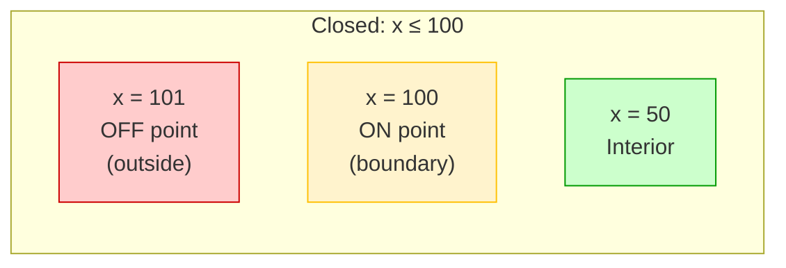
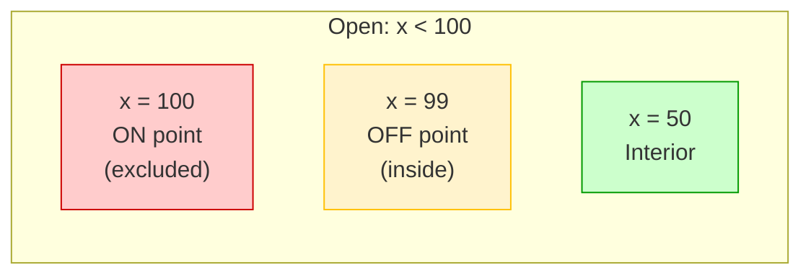
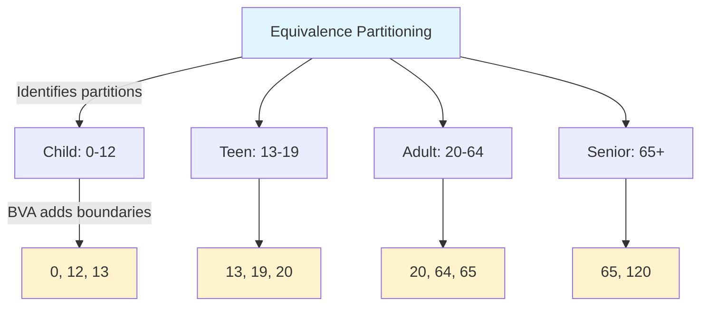

# Boundary Value Analysis

Boundary Value Analysis (BVA) focuses testing on the edges of equivalence partitions, where faults are most likely to occur. Off-by-one errors and incorrect boundary operators are among the most common programming mistakes.

---

## Why Boundaries Matter

**Empirical observation:** Faults cluster at partition boundaries.

**Common boundary bugs:**
- Loop termination (`< n` vs `<= n`)
- Array indexing (0-based vs 1-based)
- Range checks (`x < max` vs `x <= max`)
- Comparison operators (`>` vs `>=`)

> "Boundary problems are most likely to happen at boundaries." 

---

## Boundary Fault Types

| Fault Type | Description | Example |
|------------|-------------|---------|
| **Closure** | Wrong operator (`<` vs `≤`) | `if (x < 10)` should be `if (x <= 10)` |
| **Shift** | Boundary at wrong value | `if (x < 10)` should be `if (x < 11)` |
| **Tilt** | Coefficient wrong (2D+) | `ax + by = K` vs `ax + cy = K` |
| **Missing** | Boundary not implemented | No upper bound check |
| **Extra** | Spurious boundary | Unnecessary constraint added |

### Example: Off-by-One Error

```python
# Bug: Processes items 1-9, misses item 10
for i in range(1, 10):
    process(items[i])

# Correct: Processes items 1-10
for i in range(1, 11):
    process(items[i])
```

BVA would test values 9, 10, and 11 to catch this.

---

## ON/OFF Point Formalism

A rigorous approach to boundary testing from Tian :

### Definitions

| Concept | Definition |
|---------|------------|
| **ON point** | Exactly on the boundary (satisfies `f(x) = K`) |
| **OFF point** | Just off boundary, within ε distance |
| **ε-neighborhood** | Small distance distinguishing ON from OFF |

### Key Rule

> **The OFF point must be in the opposite processing region from the ON point.**

### Closed Boundaries (≤, ≥)

The boundary point is **included** in the valid region.



**Test points for `x ≤ 100`:**
- ON point: x = 100 (valid, on boundary)
- OFF point: x = 101 (invalid, just outside)

### Open Boundaries (<, >)

The boundary point is **excluded** from the valid region.



**Test points for `x < 100`:**
- ON point: x = 100 (invalid, exactly on boundary)
- OFF point: x = 99 (valid, just inside)

---

## BVA Testing Strategies

### Basic BVA (4k + 1)

For each of k input variables, test:
- Minimum value
- Just above minimum (min + ε)
- Nominal (middle) value
- Just below maximum (max - ε)
- Maximum value

Plus one test with all nominal values.

**Formula:** `4k + 1` tests for k variables

**Example:** k = 3 variables → **13 tests**

### Robust BVA (6k + 1)

Adds values **beyond** valid boundaries:
- Below minimum (min - ε)
- Above maximum (max + ε)

**Formula:** `6k + 1` tests for k variables

**Example:** k = 3 variables → **19 tests**

### Strategy Comparison

| Strategy | Points per Boundary | Detects | Formula |
|----------|---------------------|---------|---------|
| **Weak 1×1** | 1 ON + 1 OFF | Closure, shift | 2 per condition |
| **Weak N×1** | N ON + 1 OFF | + tilt detection | (n+1) × b + 1 |
| **Basic BVA** | 4 per variable | Standard faults | 4k + 1 |
| **Robust BVA** | 6 per variable | + beyond-boundary | 6k + 1 |

> **Practical minimum:** Weak 1×1 (one ON + one OFF per boundary condition).

---

## Test Count Examples

| Variables (k) | Basic BVA (4k+1) | Robust BVA (6k+1) |
|---------------|------------------|-------------------|
| 1 | 5 | 7 |
| 2 | 9 | 13 |
| 3 | 13 | 19 |
| 4 | 17 | 25 |
| 5 | 21 | 31 |

---

## Closed vs Open Boundary Summary

| Boundary Type | Operator | ON Point | OFF Point Location |
|---------------|----------|----------|-------------------|
| **Closed** | ≤ | On boundary (valid) | Outside (invalid) |
| **Closed** | ≥ | On boundary (valid) | Outside (invalid) |
| **Open** | < | On boundary (invalid) | Inside (valid) |
| **Open** | > | On boundary (invalid) | Inside (valid) |

---

## Multidimensional BVA

When testing functions with multiple numeric inputs:

### Single Variable at Extreme

Hold all variables at nominal, vary one to extreme:

| Test | X | Y | Z |
|------|---|---|---|
| T1 | min | nom | nom |
| T2 | max | nom | nom |
| T3 | nom | min | nom |
| T4 | nom | max | nom |
| T5 | nom | nom | min |
| T6 | nom | nom | max |
| T7 | nom | nom | nom |

### Combining Extremes

For higher assurance, combine extreme values:

| Test | Latitude | Longitude |
|------|----------|-----------|
| T1 | -90 (min) | -180 (min) |
| T2 | -90 (min) | +180 (max) |
| T3 | +90 (max) | -180 (min) |
| T4 | +90 (max) | +180 (max) |
| T5 | 0 (nom) | 0 (nom) |

### Ordered Pairs

When relationship between variables matters:

| Relationship | Test Values | Purpose |
|--------------|-------------|---------|
| x < y | (1, 5) | Normal order |
| x = y | (3, 3) | Equal values |
| x > y | (5, 1) | Inverted order |

---

## Practical Example: Date Validation

**Function:** `isValidDate(year, month, day) -> Boolean`

### Boundary Identification

| Variable | Min | Max | Special |
|----------|-----|-----|---------|
| Year | 1 | 9999 | Leap years |
| Month | 1 | 12 | - |
| Day | 1 | 28/29/30/31 | Month-dependent |

### Test Cases

| Test | Year | Month | Day | Expected | Boundary |
|------|------|-------|-----|----------|----------|
| T1 | 2024 | 1 | 0 | Invalid | Day below min |
| T2 | 2024 | 1 | 1 | Valid | Day at min |
| T3 | 2024 | 1 | 31 | Valid | Day at max (Jan) |
| T4 | 2024 | 1 | 32 | Invalid | Day above max |
| T5 | 2024 | 0 | 15 | Invalid | Month below min |
| T6 | 2024 | 13 | 15 | Invalid | Month above max |
| T7 | 2024 | 2 | 29 | Valid | Leap year Feb |
| T8 | 2023 | 2 | 29 | Invalid | Non-leap Feb |
| T9 | 0 | 6 | 15 | Invalid | Year below min |

---

## BVA Limitations

1. **Case-like processing assumption:** BVA assumes inputs map directly to processing regions without loops that modify the input.

2. **Coincidental correctness:** A bug may exist but the test happens to pass because of specific values chosen.

3. **ε-limit problems:** Floating-point precision varies across platforms. What is "just above" 1.0?

4. **Closed domain issues:** For some domains, the OFF point may be undefined (e.g., minimum of unsigned integer).

5. **Specification dependency:** Boundaries must be documented; implicit boundaries are easily missed.

---

## Combining BVA with EP

BVA complements Equivalence Partitioning:



**EP alone:** Tests 5, 15, 30, 70 (one per partition)
**EP + BVA:** Adds 0, 12, 13, 19, 20, 64, 65 (boundary points)

---

## Key Takeaways

1. **Faults cluster at boundaries** — test edges of every partition
2. **ON/OFF formalism** provides rigorous boundary point selection
3. **Closed boundaries:** OFF point outside; **Open boundaries:** OFF point inside
4. **4k+1 formula** for basic BVA; **6k+1** for robust BVA
5. **Combine with EP** — EP identifies what to partition, BVA tests the edges
6. **Weak 1×1** is practical minimum when resources are limited

---

### References



---

{: .highlight }
**Disclaimer:** AI is used for text summarization, polishing and explaining. Authors have verified all facts and claims. In case of an error, feel free to file an issue.
