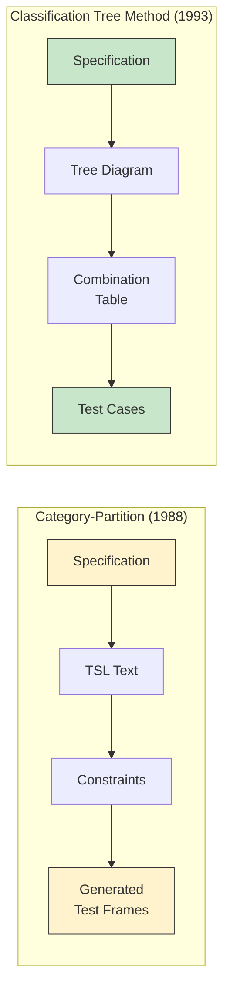
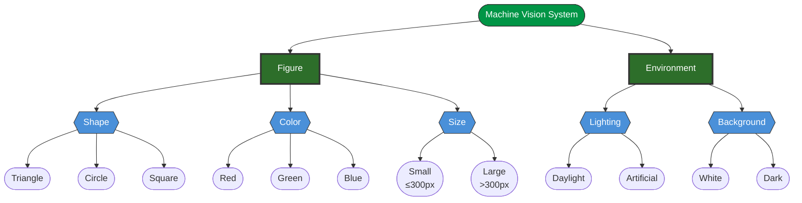
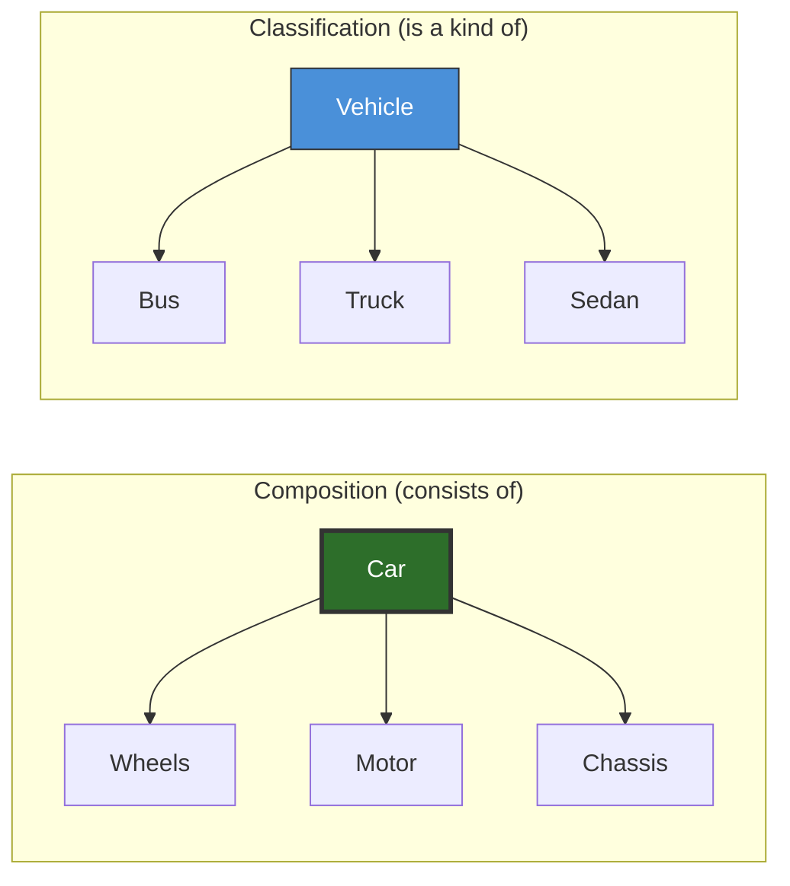
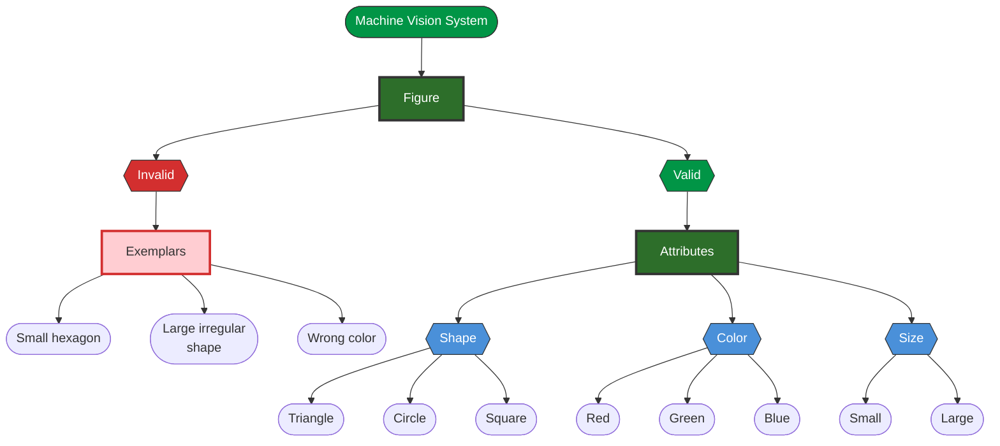
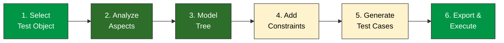
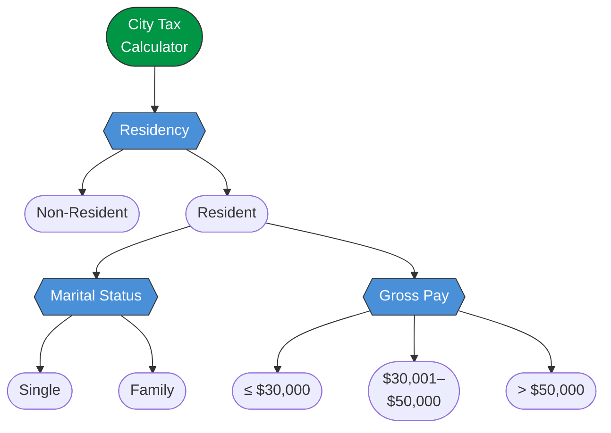
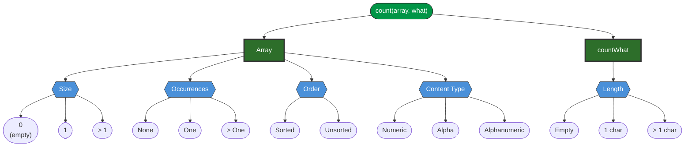
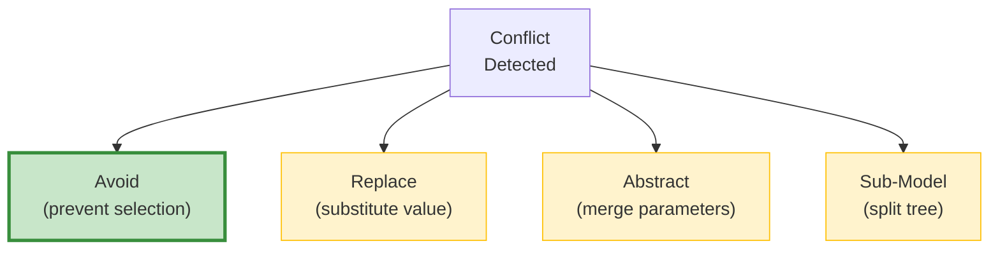
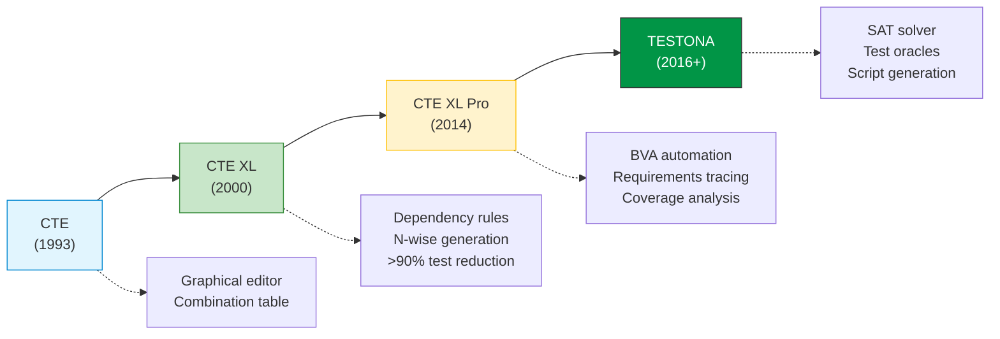
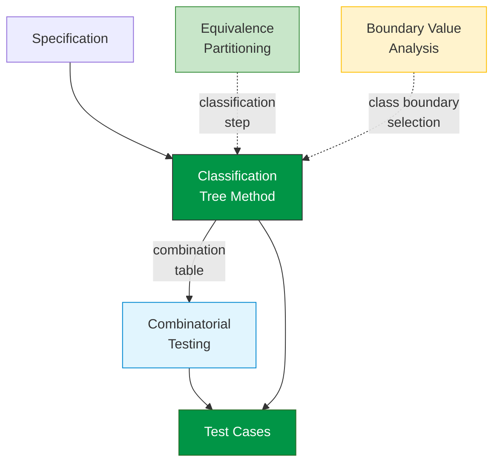

# Classification Tree Method

The **Classification Tree Method (CTM)** is a systematic, graphical technique for designing test cases by partitioning the input domain of a test object into a tree structure and combining selections in a table. Introduced by Grochtmann and Grimm in 1993 , it transforms test design from an ad hoc activity into a structured, visual, and documentable process.

---

## Why CTM?

Before CTM, the **Category-Partition Method**  used a textual formalism (TSL — Test Specification Language) to define categories, choices, and constraints. While systematic, TSL was hard to learn, produced flat lists, and generated test cases implicitly through lengthy frame expansion.

CTM addresses these limitations with three key improvements:



| Aspect | Category-Partition | Classification Tree Method |
|--------|:--:|:--:|
| **Notation** | Textual (TSL syntax) | Graphical (tree + table) |
| **Structure** | Flat list of categories | Hierarchical tree |
| **Test case creation** | Start large, add restrictions | Start minimal, add until sufficient |
| **Specification** | Implicit (lengthy generated lists) | Direct (compact combination table) |
| **Hierarchy support** | Complex constraints needed | Built into tree structure |

> "The crucial activity during testing is test case determination, since it determines the kind and scope of the examination and thus the quality of the test." 

---

## Tree Notation

A classification tree uses four node types to model the input domain. Here is a complete example — a **machine vision system** that classifies figures on a conveyor belt (valid aspects only — see [Modeling Invalid Cases](#modeling-invalid-cases) below for the full tree with invalid exemplars):



### Node Types

| Node | Visual | Meaning | Example | Test-Selectable? |
|------|--------|---------|---------|:---:|
| **Root** | Top of tree | The test object (SUT) | Machine Vision System | No |
| **Composition** | Thick-bordered (green above) | "Consists of" — aggregation | Figure, Environment | No |
| **Classification** | Rectangle (blue above) | "Is a kind of" — partition | Shape, Color, Size | No |
| **Class** | Leaf node (rounded above) | Equivalence class value | Triangle, Red, Small | **Yes** |

{: .important }
**Composition = "consists of"** (aggregation). **Classification = "is a kind of"** (partition). Classes must be **disjoint and complete** — every possible value belongs to exactly one class.

### Composition vs. Classification

The distinction is critical. Consider modeling a **Car** :



- A car **consists of** wheels, motor, and chassis — all exist simultaneously (composition)
- A vehicle **is a kind of** bus, truck, or sedan — exactly one applies (classification)

### Modeling Invalid Cases

For robust (negative) testing, invalid inputs must be included in the classification tree. The key principle: **invalid cases form a separate branch, parallel to valid aspects** — they are not scattered as individual leaves within each valid classification.



**Why a separate branch?** If invalid values sit inside each valid classification, they enter the **combinatorial explosion** — the test generator combines them with every valid value from other aspects, producing meaningless test cases like "undefined shape + red + small + bright + white." A separate branch ensures invalids are tested individually.

{: .important }
**Enumerate** invalid cases as concrete exemplars rather than comprehensively defining them. Ask: "What specific inputs would the system reject?" The answer gives you the exemplars.

**When to combine instead:** If the application logic processes combinations of valid and invalid inputs together (e.g., checking multiple fields in a form), it may make sense to include invalid classes within aspects. The decision depends on how the system under test handles errors .

---

## The 6-Step Process



| Step | Action | Key Question |
|:---:|--------|-------------|
| **1** | **Select test object** — a function, module, or system with observable output | What are we testing? |
| **2** | **Analyze aspects** — identify inputs, environment conditions, and characteristics that influence behavior | What factors matter? |
| **3** | **Model tree** — organize aspects as compositions/classifications; partition values into disjoint classes | How do factors relate? |
| **4** | **Add constraints** — mark impossible combinations using dependency rules | Which combinations are infeasible? |
| **5** | **Generate test cases** — select one class per classification in the combination table | How many tests do we need? |
| **6** | **Export & execute** — assign concrete values, predict expected results, run tests | Did we find faults? |

{: .highlight }
"The Classification Tree Method is **guidance for thinking, not replacement of thinking!**" 

---

## Example 1: City Tax Calculator

**Specification:** A city levies income tax as follows:
- **Non-residents** pay 1% of gross pay
- **Residents — Single:**
  - Gross pay ≤ $30,000 → 1%
  - Gross pay $30,001–$50,000 → 5%
  - Gross pay > $50,000 → 15%
- **Residents — Family:**
  - Gross pay ≤ $50,000 → 1%
  - Gross pay > $50,000 → 5%

### Step 1–3: Build the classification tree



### Step 4: Identify constraints

When **Non-Resident** is selected, Marital Status and Gross Pay brackets are irrelevant — they only apply to Residents. This is naturally handled by placing those classifications under the **Resident** class in the tree hierarchy.

### Step 5: Combination table

| TC | Residency | Marital Status | Gross Pay | Expected Tax |
|:--:|-----------|:-:|-----------|:--:|
| 1 | Non-Resident | — | — | 1% |
| 2 | Resident | Single | ≤ $30,000 | 1% |
| 3 | Resident | Single | $30,001–$50,000 | 5% |
| 4 | Resident | Single | > $50,000 | 15% |
| 5 | Resident | Family | ≤ $50,000 | 1% |
| 6 | Resident | Family | > $50,000 | 5% |

### Step 6: Concrete test cases

| TC | Residency | Status | Gross Pay | Expected Tax Amount |
|:--:|-----------|--------|----------:|--------------------:|
| 1 | Non-Resident | — | $45,000 | $450 |
| 2 | Resident | Single | $25,000 | $250 |
| 3 | Resident | Single | $40,000 | $2,000 |
| 4 | Resident | Single | $75,000 | $11,250 |
| 5 | Resident | Family | $48,000 | $480 |
| 6 | Resident | Family | $60,000 | $3,000 |

{: .note }
Notice how the tree structure **naturally handles the constraint**: Non-Residents don't need marital status or pay brackets. By placing those classifications under the Resident class, impossible combinations are eliminated structurally rather than with explicit rules.

---

## Example 2: Count Function

`count(searchedArray, countWhat)` — counts occurrences of a value in an array.

**Probing questions:** Does array size matter? Does element order affect results? What about empty arrays? What if countWhat is null?



### Constraints (impossible combinations)

This example shows why **dependency rules** are essential:

| Constraint | Reason |
|------------|--------|
| Size = 0 → Occurrences = None | Empty array cannot contain the value |
| Size = 0 → Order is irrelevant | Cannot sort an empty array |
| Size = 1 → Occurrences ∈ {None, One} | Single element: either matches or doesn't |
| Size = 1 → Order is irrelevant | Single element is trivially sorted |

Without constraints, the tree produces **3 × 3 × 2 × 3 × 3 = 162** combinations. Many are impossible (e.g., empty array with multiple occurrences). Constraints reduce this to a manageable and meaningful test suite.

---

## Constraint Handling

Real systems always have impossible combinations. Constraint handling has evolved through three generations:

| Generation | Method | Example | Tool |
|:--:|--------|---------|------|
| **1st** (1988) | Textual annotations | `[if Resident]`, `[error]`, `[single]` | TSL  |
| **2nd** (2000) | Boolean dependency rules | `NonResident → NOT MaritalStatus` | CTE XL  |
| **3rd** (2012) | Numerical constraints + SAT solver | `a + b > c` (triangle inequality) | TESTONA  |

### Conflict Resolution Strategies

When generating test cases from a constrained tree, four strategies exist :



{: .highlight }
The **"avoid" strategy** — prohibiting conflict selection during generation — produces the **smallest test suites** while preserving coverage criteria .

### Tree Quality: Effectiveness Metric

Chen et al.  defined a metric for tree quality:

> **E[T] = legitimate test cases / potential test cases**

- **Legitimate:** combinations that exist in the real input domain
- **Potential:** all combinations the tree can generate (including infeasible ones)

Ad hoc trees can have E[T] as low as **0.17** — meaning 83% of generated test cases are wasted on impossible combinations. Systematic restructuring can **double** effectiveness.

---

## Tool Support

CTM tool support has evolved over 27+ years from a research prototype to a full test automation platform:



| Feature | CTE (1993) | CTE XL (2000) | TESTONA (2016+) |
|---------|:--:|:--:|:--:|
| Graphical editor | ✓ | ✓ | ✓ |
| Dependency rules | — | Boolean (AND, OR, ⇒) | Boolean + Numerical |
| Test generation | Manual | Minimality, Maximality, N-wise | + SAT solver |
| Tool integration | Standalone | Server API | DOORS, HP ALM |
| Test oracles | — | — | Dependency rule-based |
| Script generation | — | — | Code fragments |

{: .highlight }
"In some cases the amount of theoretically possible test cases given by the classification tree was **reduced by more than 90%**" through CTE XL dependency rules .

---

## Empirical Evidence

### Controlled Study: CTM vs. Ad Hoc Testing

The only controlled empirical evaluation of CTM  studied 162 students (two groups: 104 + 58) before and after a 3-hour CTM training session:

```vega-lite
{
  "$schema": "https://vega.github.io/schema/vega-lite/v5.json",
  "title": "Testing Method Preference: Before vs. After CTM Training",
  "width": 400,
  "height": 250,
  "data": {
    "values": [
      {"Method": "White-box", "Phase": "Before Training", "Percentage": 53},
      {"Method": "White-box", "Phase": "After Training", "Percentage": 18},
      {"Method": "BVA", "Phase": "Before Training", "Percentage": 12},
      {"Method": "BVA", "Phase": "After Training", "Percentage": 8},
      {"Method": "EP", "Phase": "Before Training", "Percentage": 15},
      {"Method": "EP", "Phase": "After Training", "Percentage": 5},
      {"Method": "CTM", "Phase": "Before Training", "Percentage": 0},
      {"Method": "CTM", "Phase": "After Training", "Percentage": 66},
      {"Method": "Other", "Phase": "Before Training", "Percentage": 20},
      {"Method": "Other", "Phase": "After Training", "Percentage": 3}
    ]
  },
  "mark": "bar",
  "encoding": {
    "x": {"field": "Method", "type": "nominal", "axis": {"labelAngle": 0}},
    "y": {"field": "Percentage", "type": "quantitative", "title": "% of students"},
    "xOffset": {"field": "Phase", "type": "nominal"},
    "color": {
      "field": "Phase",
      "type": "nominal",
      "scale": {"range": ["#fff3cd", "#019546"]}
    }
  }
}
```

| Finding | Value |
|---------|:--:|
| Initially preferred white-box | 53% |
| Preferred CTM after 3h training | **~66%** |
| Perceived CTM as systematic | 63% |
| Perceived CTM as complete | 56% |
| Original suites' fault detection | 55% |

> "None of the students' test suites, except one developed by a mix of black and white box methods, could detect all faulty programs that our test suite derived from CTM did." 

### Industrial Case Studies

| Domain | Application | Finding | Source |
|--------|------------|---------|--------|
| Aerospace | Airfield lighting system | 263 test cases for 2,700 modules | Grochtmann 1993 |
| Logistics | Letter sorting machine | Halved test cases, found new errors | Grochtmann 1993 |
| Automotive | Adaptive cruise control | Embedded testing with Tessy | Buechner 2009 |
| Aviation/Space | Multiple systems | >90% test reduction via dependency rules | Lehmann 2000 |
| Automotive | Engine control, central locking | TPT for continuous behavior testing | Bringmann 2008 |

{: .important }
All documented industrial applications are from the Daimler/Berner & Mattner ecosystem. Independent replications outside this group are notably absent.

---

## CTM and Other Techniques

CTM is not an isolated technique — it acts as an **integrating framework** that connects several test design methods:



| Technique | Relationship to CTM |
|-----------|-------------------|
| [Equivalence Partitioning](equivalence.md) | CTM's classification step **is** equivalence partitioning |
| [Boundary Value Analysis](boundary.md) | Applied when selecting concrete values at class boundaries |
| [Decision Tables](decision-tables.md) | Alternative for condition-action rules; CTM better for hierarchical inputs |
| [Combinatorial Testing](../combinatorial/) | Pairwise/n-wise strategies applied to CTM's combination table |

**Extensions:** CCTM extracts classification trees from UML activity diagrams , while TPT extends CTM to continuous signals in automotive systems .

---

## Common Pitfalls

Based on empirical observations  :

1. **Infeasible test cases** (60% of novices) — use dependency rules or tree restructuring to eliminate impossible combinations
2. **Flat trees with no hierarchy** — use composition nodes to group related aspects
3. **Too many classifications at root level** — abstract, then refine; large trees can use sub-tree refinements
4. **Confusing composition with classification** — ask: "consists of" (parts) vs. "is a kind of" (variants)?
5. **Skipping boundary values** — apply BVA at class borders (e.g., $30,000 and $30,001)
6. **Over-specifying** — keep test cases as abstract specifications; delay concrete value assignment

---

## Key Takeaways

1. **CTM provides a visual, structured approach** to test design — tree + combination table
2. **Composition vs. classification** is the fundamental modeling decision
3. **Constraints are essential** — real systems always have impossible combinations
4. **Start minimal, add until sufficient** — unlike Category-Partition which starts large and restricts
5. **Tool support is mature** — 27+ years of evolution from CTE to TESTONA
6. **CTM integrates EP, BVA, and combinatorial testing** into a single framework

---

### References



---

{: .highlight }
**Disclaimer:** AI is used for text summarization, polishing and explaining. Authors have verified all facts and claims. In case of an error, feel free to file an issue.
