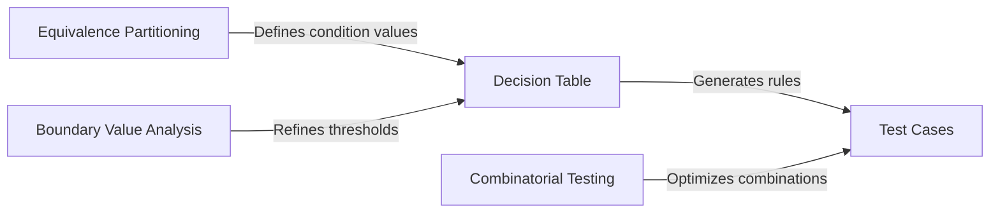

# Decision Table Testing

Decision tables systematically enumerate all combinations of input conditions and their corresponding actions. They are particularly effective for testing complex business logic where multiple conditions interact to determine behavior.

---

## When to Use Decision Tables

**Good fit:**
- Multiple conditions combine to determine outcomes
- Logical relationships (AND, OR, NOT)
- Discrete, enumerable condition values
- Clear mapping from conditions to actions
- Order of evaluation doesn't matter

**Best applications:**
- Business rules engines
- Permission and access control
- Insurance/tax calculations
- Configuration validation
- State machine transitions

**Not suitable when:**
- Continuous outputs required
- Evaluation order matters
- Actions are probabilistic
- Conditions are not enumerable

---

## Decision Table Structure

A decision table has four quadrants:

```
┌─────────────────┬──────────────────────────┐
│   Condition     │   Condition Values       │
│   Stubs         │   (per rule)             │
├─────────────────┼──────────────────────────┤
│   Action        │   Action Entries         │
│   Stubs         │   (per rule)             │
└─────────────────┴──────────────────────────┘
```

| Component | Description |
|-----------|-------------|
| **Conditions** | Input variables (rows) |
| **Condition values** | Y/N, True/False, or enumerated values |
| **Rules** | Columns—each unique combination |
| **Actions** | Outputs or behaviors triggered |
| **Don't care (-)** | Value doesn't affect this rule's outcome |

---

## Example: ATM Withdrawal

| Conditions | R1 | R2 | R3 | R4 | R5 |
|------------|:--:|:--:|:--:|:--:|:--:|
| Sufficient Balance? | Y | Y | N | N | * |
| Amount Divisible by 20? | Y | N | Y | N | * |
| Daily Limit OK? | Y | Y | Y | Y | N |
| **Actions** | | | | | |
| Dispense Cash | ✓ | | | | |
| Show "Invalid Amount" | | ✓ | | ✓ | |
| Show "Insufficient Funds" | | | ✓ | ✓ | |
| Show "Limit Exceeded" | | | | | ✓ |

**Legend:** Y = Yes, N = No, * = Don't care, ✓ = Action triggered

**Reading the table:**
- **R1:** Balance OK, amount valid, within limit → Dispense cash
- **R5:** Limit exceeded (other conditions don't matter) → Show limit error

---

## The 8-Step Method (Beizer)

A systematic process for creating decision tables :

### Step 1: List Actions
Identify all possible outputs or behaviors.

### Step 2: List Conditions
Identify all input variables that affect actions.

### Step 3: Calculate Rule Count
**Formula:** Product of condition values

For binary conditions: `2ⁿ` where n = number of conditions

| Conditions | Binary Values | Rules |
|------------|---------------|-------|
| 2 | Y/N each | 4 |
| 3 | Y/N each | 8 |
| 4 | Y/N each | 16 |
| 5 | Y/N each | 32 |

### Step 4: Fill Combinations
Systematically enumerate all combinations:

| | R1 | R2 | R3 | R4 | R5 | R6 | R7 | R8 |
|-|:--:|:--:|:--:|:--:|:--:|:--:|:--:|:--:|
| C1 | Y | Y | Y | Y | N | N | N | N |
| C2 | Y | Y | N | N | Y | Y | N | N |
| C3 | Y | N | Y | N | Y | N | Y | N |

### Step 5: Specify Outputs
Determine which actions apply to each rule.

### Step 6: Consolidate
Identify rules with identical actions that can be merged using don't-care values.

### Step 7: Verify Checksum
**Critical:** Sum of rules covered must equal original count.

### Step 8: Generate Test Cases
Create one test case per rule (after consolidation).

---

## Consolidation with Don't-Care

When multiple rules produce the same action, consolidate using `-` (don't care):

### Before Consolidation (8 rules):

| | R1 | R2 | R3 | R4 | R5 | R6 | R7 | R8 |
|-|:--:|:--:|:--:|:--:|:--:|:--:|:--:|:--:|
| A | Y | Y | Y | Y | N | N | N | N |
| B | Y | Y | N | N | Y | Y | N | N |
| C | Y | N | Y | N | Y | N | Y | N |
| **Action X** | ✓ | | | | | | | |
| **Action Y** | | ✓ | ✓ | ✓ | ✓ | ✓ | ✓ | ✓ |

### After Consolidation (2 rules):

| | R1' | R2' |
|-|:---:|:---:|
| A | Y | - |
| B | Y | - |
| C | Y | - |
| **Covers** | 1 | 7 |
| **Action X** | ✓ | |
| **Action Y** | | ✓ |

**Checksum:** 1 + 7 = 8 ✓

---

## Checksum Verification

The checksum ensures no rules are lost during consolidation:

```
Original rules = Σ (rules covered by each consolidated rule)
```

**Example:**

| Consolidated Rule | Original Rules Covered |
|-------------------|----------------------|
| R1' | 1 |
| R2' | 2 |
| R3' | 4 |
| R4' | 1 |
| **Total** | **8** |

If the original table had 8 rules, the consolidation is **valid**.

---

## Practical Example: Login System

**Conditions:**
- Username valid?
- Password valid?
- Account active?

**Actions:**
- Login success
- Show "Invalid credentials"
- Show "Account inactive"

### Full Table (8 rules):

| | R1 | R2 | R3 | R4 | R5 | R6 | R7 | R8 |
|-|:--:|:--:|:--:|:--:|:--:|:--:|:--:|:--:|
| Username valid? | Y | Y | Y | Y | N | N | N | N |
| Password valid? | Y | Y | N | N | Y | Y | N | N |
| Account active? | Y | N | Y | N | Y | N | Y | N |
| **Login success** | ✓ | | | | | | | |
| **Invalid credentials** | | | ✓ | ✓ | ✓ | ✓ | ✓ | ✓ |
| **Account inactive** | | ✓ | | | | | | |

### Consolidated (3 rules):

| | R1' | R2' | R3' |
|-|:---:|:---:|:---:|
| Username valid? | Y | Y | - |
| Password valid? | Y | - | N |
| Account active? | Y | N | - |
| **Covers** | 1 | 2 | 5 |
| **Login success** | ✓ | | |
| **Invalid credentials** | | | ✓ |
| **Account inactive** | | ✓ | |

**Checksum:** 1 + 2 + 5 = 8 ✓

### Test Cases:

| Test | Username | Password | Active | Expected |
|------|----------|----------|--------|----------|
| T1 | valid | correct | yes | Login success |
| T2 | valid | any | no | Account inactive |
| T3 | invalid/wrong password | any | any | Invalid credentials |

---

## Non-Binary Conditions

Decision tables work with multi-valued conditions:

### Tax Rate Example

| | R1 | R2 | R3 | R4 | R5 | R6 |
|-|:--:|:--:|:--:|:--:|:--:|:--:|
| Resident? | Y | Y | Y | Y | Y | Y |
| Family? | Y | Y | Y | N | N | N |
| Income | Low | Med | High | Low | Med | High |
| **Tax Rate** | 2% | 4% | 6% | 3% | 5% | 7% |

**Rule count:** 2 × 2 × 3 = 12 (but non-resident = flat 1% can consolidate)

---

## Extended Entry Tables

For complex conditions, use extended entries instead of Y/N:

| Condition | R1 | R2 | R3 | R4 |
|-----------|:--:|:--:|:--:|:--:|
| Order amount | <$50 | $50-$100 | $100-$500 | >$500 |
| Customer type | Regular | Regular | Premium | Premium |
| **Discount** | 0% | 5% | 10% | 15% |
| **Free shipping** | | | ✓ | ✓ |

---

## Decision Table Testing Coverage

| Criterion | Description |
|-----------|-------------|
| **Each column** | One test per rule (after consolidation) |
| **Don't care expansion** | Test multiple values for `-` entries |
| **Boundary integration** | Apply BVA to condition thresholds |

---

## Common Pitfalls

1. **Missing combinations:** Ensure all logical combinations are covered
2. **Conflicting rules:** Same conditions mapping to different actions
3. **Over-consolidation:** Merging rules that shouldn't be merged
4. **Ignoring invalid:** Not testing invalid input combinations
5. **Checksum errors:** Losing rules during consolidation

---

## Integration with Other Techniques



**Use decision tables when:**
- Conditions have logical relationships
- Multiple conditions determine single action
- You need to ensure complete coverage

**Combine with:**
- **EP:** Define condition value sets
- **BVA:** Test condition boundaries
- **Pairwise:** Reduce test count for many conditions

---

## Key Takeaways

1. **Decision tables force completeness** — every combination is explicit
2. **8-step method** provides systematic construction process
3. **Consolidation** reduces test count via don't-care values
4. **Always verify checksum** — ensure no rules are lost
5. **One test per rule** after consolidation is the minimum
6. **Best for discrete logic** — not continuous or order-dependent behavior

---

### References



---

{: .highlight }
**Disclaimer:** AI is used for text summarization, polishing and explaining. Authors have verified all facts and claims. In case of an error, feel free to file an issue.
