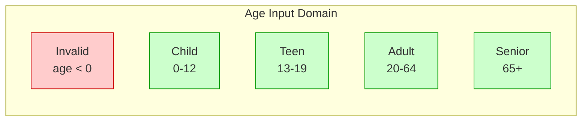

# Equivalence Partitioning

Equivalence Partitioning (EP) divides the input domain into classes where all values are expected to produce similar behavior. Testing one representative from each class provides confidence for the entire class.

---

## Core Principle

> "If one value in a class fails, all values in that class will fail the same way."

**Key assumption:** Inputs within an equivalence class:
- Trigger the **same code paths**
- Reveal the **same faults**
- Produce **similar (not identical) results**

**Partition requirements:**
- **Complete:** Every possible input belongs to some partition
- **Disjoint:** No input belongs to multiple partitions

---

## Partition Types

### Range-Based (Comprehension)

Defined by numeric or ordered ranges:



**Test values:** -1 (invalid), 5 (child), 15 (teen), 30 (adult), 70 (senior)

### Enumeration-Based

Defined by discrete sets of values:

| US Region | Representative State |
|-----------|---------------------|
| Northeast | New York |
| South | Texas |
| Midwest | Illinois |
| West | California |

One test per region exercises the complete set.

### Invalid Partitions

**Critical:** Include invalid inputs explicitly:

| Attribute | Valid Partitions | Invalid Partitions |
|-----------|------------------|-------------------|
| String length | 1-100 chars | 0, >100 |
| Set size | 1+ elements | Empty set |
| Pointer | Valid reference | Null, dangling |
| File | Exists, readable | Missing, locked, corrupt |

---

## Weak vs Strong EP

### Weak Equivalence Partitioning

**Formula:** `max(|partition counts|)` tests

**Assumption:** Single-fault—only one input variable causes the fault at a time.

**Example:**
- Variable A: 3 partitions
- Variable B: 4 partitions
- Variable C: 2 partitions

**Weak EP tests:** max(3, 4, 2) = **4 tests**

```
Test 1: A₁, B₁, C₁
Test 2: A₂, B₂, C₂
Test 3: A₃, B₃, C₁  (wrap C)
Test 4: A₁, B₄, C₂  (wrap A)
```

### Strong Equivalence Partitioning

**Formula:** `∏(|partition counts|)` tests

**Assumption:** Multi-fault—interactions between variables may cause faults.

**Same example:**
**Strong EP tests:** 3 × 4 × 2 = **24 tests**

All combinations of partitions are tested.

### Comparison

| Aspect | Weak EP | Strong EP |
|--------|---------|-----------|
| **Tests** | max(n₁, n₂, ...) | n₁ × n₂ × ... |
| **Coverage** | Each partition once | All combinations |
| **Detects** | Single-variable faults | Interaction faults |
| **Cost** | Low | High (exponential) |
| **Use when** | Resource-constrained | High criticality |

```mermaid
xychart-beta
    title "Test Count Growth: Weak vs Strong EP"
    x-axis "Number of Variables (3 partitions each)" [2, 3, 4, 5]
    y-axis "Test Cases" 0 --> 300
    bar "Weak EP" [3, 3, 3, 3]
    bar "Strong EP" [9, 27, 81, 243]
```



---

## Finding Equivalence Classes: Heuristics

| Source | Method | Example |
|--------|--------|---------|
| **Specification** | One class per stated case | "Discounts for orders > $100" → {≤$100, >$100} |
| **Code paths** | One class per branch | `if/else` → 2 classes |
| **Error types** | One class per error | Invalid format, overflow, null |
| **Ranges** | Valid + boundary violations | 1-100 → {<1, 1-100, >100} |
| **Membership** | Inside + outside groups | Prime vs composite numbers |
| **Outputs** | Classes producing same output | All inputs → "Error 404" |

> **Smell:** If you're writing many similar test cases, they probably belong to the same equivalence class!

---

## Category-Partition Method

A systematic 6-step approach to equivalence partitioning :

### Step 1: Identify Parameters
List all input parameters and environment variables.

**Example:** File copy function
- Source file path
- Destination file path
- Overwrite flag
- File system state

### Step 2: Define Categories
Identify characteristics relevant for testing each parameter.

| Parameter | Categories |
|-----------|------------|
| Source file | Existence, size, permissions |
| Destination | Existence, directory, permissions |
| Overwrite flag | True, false |

### Step 3: Specify Choices
Define how each category splits into sub-domains.

| Category | Choices |
|----------|---------|
| Source existence | Exists, Missing |
| Source size | Empty, Small, Large |
| Destination existence | Exists, New |

### Step 4: Add Constraints
Mark choices that must/cannot appear together.

```
[if Dest exists] Overwrite = true → allowed
[if Dest exists] Overwrite = false → error expected
[property] Source missing → [error] (marks expected error)
```

### Step 5: Generate Test Frames
Combine choices according to selection criteria.

### Step 6: Derive Test Cases
Assign concrete values to each test frame.

---

## Selection Criteria

| Criterion | Description | Tests |
|-----------|-------------|-------|
| **Each-Choice** | Each choice at least once | Minimum |
| **Pair-Wise** | All pairs from different categories | Moderate |
| **Base-Choice** | Base + vary one category | Moderate |
| **All-Combinations** | Every combination | Exhaustive |

**Example (3 categories, 2 choices each):**

| Criterion | Test Count |
|-----------|-----------|
| Each-Choice | 2 |
| Pair-Wise | 4 |
| All-Combinations | 8 |

---

## Multidimensional Partitioning

When multiple attributes matter:

| Dimension | Values |
|-----------|--------|
| Size | Small, Medium, Large |
| Color | Red, Green, Blue |
| Shape | Circle, Square, Triangle |

**Total classes:** 3 × 3 × 3 = 27 combinations

**Common multidimensional cases:**

| Attribute | Partition Values |
|-----------|------------------|
| String | Empty, 1 char, typical, max, >max |
| Collection | Empty, 1 element, few, many |
| Numeric | Below min, min, typical, max, above max |
| Reference | Null, valid, invalid |

---

## Practical Example: Email Validation

**Function:** `isValidEmail(email: String) -> Boolean`

### Step 1: Identify Partitions

| Aspect | Valid | Invalid |
|--------|-------|---------|
| @ symbol | Present (1) | Missing, multiple |
| Local part | Non-empty | Empty |
| Domain | Valid format | Empty, no TLD |
| Characters | Allowed | Spaces, control chars |
| Length | 1-254 | 0, >254 |

### Step 2: Create Test Cases

| Test | Input | Expected | Partition |
|------|-------|----------|-----------|
| T1 | `user@domain.com` | Valid | Standard email |
| T2 | `a@b.co` | Valid | Minimum valid |
| T3 | `user+tag@domain.com` | Valid | Plus addressing |
| T4 | `userdomain.com` | Invalid | Missing @ |
| T5 | `user@@domain.com` | Invalid | Multiple @ |
| T6 | `@domain.com` | Invalid | Empty local |
| T7 | `user@` | Invalid | Empty domain |
| T8 | `` | Invalid | Empty string |

**Weak EP:** 8 tests (one per class)

---

## Key Takeaways

1. **One test per class** is sufficient if partitions are well-defined
2. **Include invalid partitions** explicitly—positive test bias will skip them
3. **Weak EP** for resource-constrained testing; **Strong EP** for critical systems
4. **Category-Partition Method** provides systematic rigor
5. **Combine with BVA** to test partition boundaries

---

### References



---

{: .highlight }
**Disclaimer:** AI is used for text summarization, polishing and explaining. Authors have verified all facts and claims. In case of an error, feel free to file an issue.
