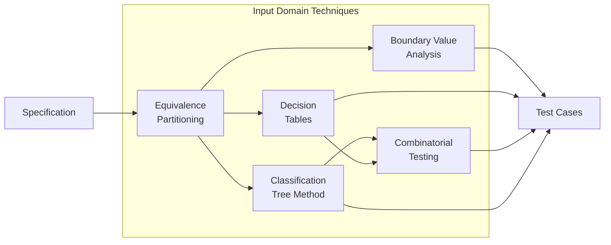

# Input Domain Testing

Input domain testing applies **black-box techniques** to systematically select test inputs based on specifications, without access to source code. These techniques partition the vast input space into manageable, meaningful subsets.

---

## What is Input Domain Testing?

The input domain is the set of all possible inputs to a program. For most systems, exhaustive testing is impossible—even a simple function with two 32-bit integers has over 18 quintillion combinations.

**Input domain testing** addresses this by:
- **Partitioning** inputs into equivalence classes
- **Focusing** on boundaries where faults cluster
- **Systematically combining** conditions and parameters

> "The assumption is that inputs that belong to the same sub-domain trigger similar behaviour, and therefore it is sufficient to select one input from each sub-domain." 

---

## The Positive Test Bias Problem

Research by Teasley et al.  revealed a critical insight:

> **Testers naturally gravitate toward inputs they expect to work.**

**Experiment findings:**
- Group rewarded for finding bugs → found significantly more bugs
- Group penalized for false alarms → missed many real faults

| Mindset | Outcome |
|---------|---------|
| "Prove it works" | Misses edge cases |
| "Find where it breaks" | Better fault detection |

**Implication:** Negative testing (invalid inputs) must be explicitly planned—it won't happen naturally.

---

## Core Techniques

### [Equivalence Partitioning](equivalence.md)
Divide inputs into classes where all values behave similarly:
- **Weak EP**: One test per partition (single-fault assumption)
- **Strong EP**: All partition combinations (interaction testing)
- **Category-Partition Method**: Systematic 6-step process

### [Boundary Value Analysis](boundary.md)
Test at partition boundaries where faults cluster:
- **ON/OFF points**: Formal boundary testing strategy
- **Fault types**: Closure, shift, tilt, missing, extra
- **Formulas**: 4k+1 basic, 6k+1 robust

### [Decision Tables](decision-tables.md)
Systematically test condition combinations:
- **8-step method**: Beizer's systematic process
- **Consolidation**: Reduce tests with don't-care values
- **Checksum verification**: Ensure completeness

### [Classification Tree Method](classification-tree.md)
Systematic test design using graphical trees and combination tables:
- **Tree notation**: Composition ("consists of") and classification ("is a kind of") nodes
- **Combination table**: Direct, visual test case specification
- **Constraint handling**: Dependency rules for eliminating infeasible combinations

### [Combining Techniques](integration.md)
Integrate techniques for comprehensive coverage:
- **90% finding**: Most faults from 1-2 way interactions
- **Selection guide**: Match technique to problem type
- **Integration pattern**: EP → BVA → DT → Combinatorial

---

## Technique Selection Guide

| Situation | Primary Technique | Why |
|-----------|-------------------|-----|
| Discrete input categories | **Equivalence Partitioning** | Groups similar behaviors |
| Numeric ranges with boundaries | **Boundary Value Analysis** | Faults cluster at edges |
| Multiple conditions → actions | **Decision Tables** | Forces complete coverage |
| Many parameters, interactions | **Combinatorial Testing** | Catches interaction faults |
| Hierarchical parameters, many aspects | **Classification Tree Method** | Visual tree structure, constraint handling |
| Complex business logic | **EP + DT combination** | Partitions + rule coverage |

---

## Key Statistics

90%

of faults from 1-2 way interactions

4k+1

BVA tests for k variables

6-way

maximum interaction ever observed

---

## Integration with Other Testing

Input domain testing complements structural (white-box) coverage:

| Approach | Focus | Finds |
|----------|-------|-------|
| **Input Domain (Black-box)** | What should be tested | Missing functionality |
| **Code Coverage (White-box)** | What has been tested | Unexecuted code |

**Best practice:** Use input domain techniques to design tests, then measure structural coverage to find gaps.

---

## Topics in This Section

- [Equivalence Partitioning](equivalence.md) — Partition inputs into classes
- [Boundary Value Analysis](boundary.md) — Test at partition edges
- [Decision Tables](decision-tables.md) — Systematic condition testing
- [Classification Tree Method](classification-tree.md) — Graphical tree-based test design
- [Combining Techniques](integration.md) — Integration and the 90% finding

---

## Further Reading

- [Coverage Criteria](../coverage/) — White-box structural coverage
- [Combinatorial Testing](../combinatorial/) — Pairwise and n-way testing
- [Testing Overview](../overview/testing/) — Testing fundamentals

---

### References



---

{: .highlight }
**Disclaimer:** AI is used for text summarization, polishing and explaining. Authors have verified all facts and claims. In case of an error, feel free to file an issue.
