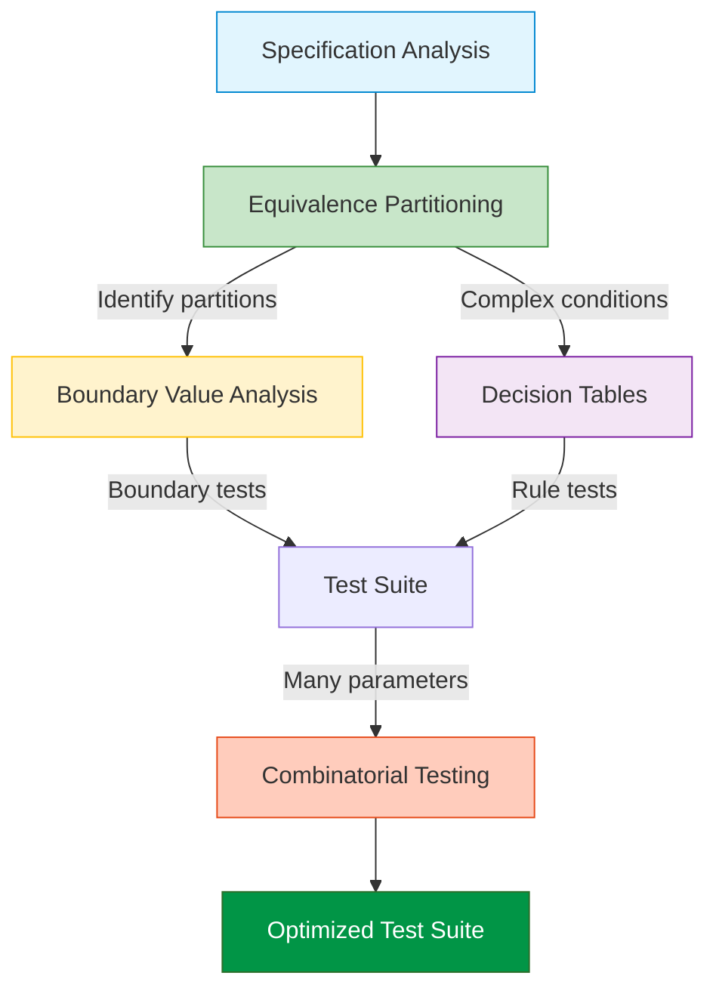
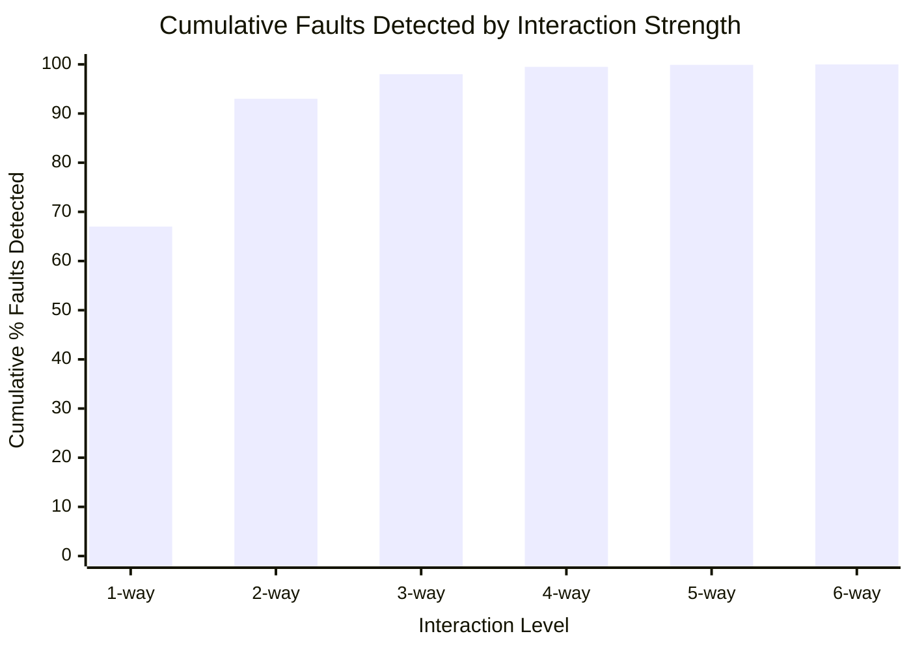
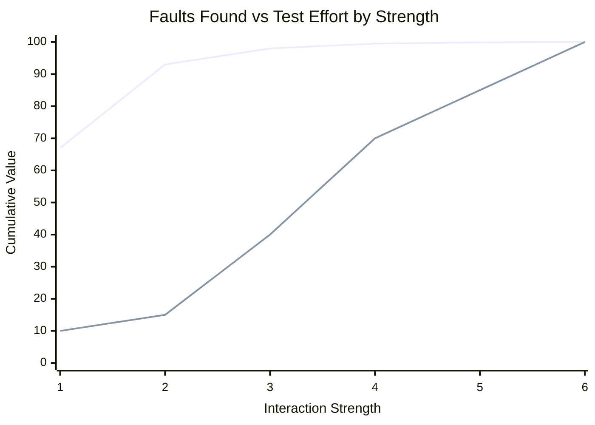
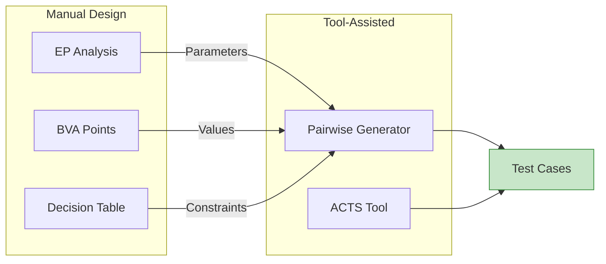

# Combining Input Domain Techniques

No single input domain technique is sufficient for comprehensive testing. This page explains how to integrate Equivalence Partitioning, Boundary Value Analysis, Decision Tables, and Combinatorial Testing for maximum effectiveness.

---

## The Integration Pattern

**Recommended sequence:**
1. **EP first:** Identify input categories and partitions
2. **BVA second:** Add tests at partition boundaries
3. **Decision Tables:** Handle complex multi-condition logic
4. **Combinatorial last:** Optimize parameter combinations

---

## The 90% Finding

Research by Kuhn et al.  and Wallace & Kuhn  revealed a crucial insight about software faults:

> **90% or more of software failures are triggered by 1-2 way parameter interactions.**

### Cumulative Fault Detection by Interaction Level

| Interaction Level | Cumulative Faults | Implication |
|-------------------|-------------------|-------------|
| 1-way | 67% | Single variable testing catches most |
| 2-way (pairwise) | 93% | Pairwise catches almost all |
| 3-way | 98% | Diminishing returns |
| 4-way | 99.5% | Safety-critical systems |
| 5-way | 99.9% | Very rare interactions |
| 6-way | 100% | Maximum ever observed |

### Industry Data

| Domain | % Faults at ≤2-way | Maximum Observed |
|--------|-------------------|------------------|
| Medical devices | 97% | 4-way |
| Web servers | 95% | 4-way |
| Browsers | 95% | 3-way |
| NASA systems | 93% | 4-way |
| FAA systems | 98% | 2-way |

**Key insight:** Testing beyond 4-way rarely finds additional faults.

---

## Technique Selection Guide

### By Problem Characteristics

| Situation | Primary Technique | Reason |
|-----------|-------------------|--------|
| Discrete input categories | **Equivalence Partitioning** | Groups similar behaviors |
| Numeric ranges with edges | **Boundary Value Analysis** | Faults cluster at boundaries |
| Multiple conditions → actions | **Decision Tables** | Forces complete enumeration |
| Many parameters, few values each | **Combinatorial (Pairwise)** | Catches interaction faults efficiently |
| Complex business rules | **EP + DT** | Partitions + rule coverage |
| Safety-critical systems | **Strong EP + BVA + 4-way** | Maximum rigor |

### By Quality Attribute

| Quality Attribute | Primary Techniques | Secondary |
|-------------------|-------------------|-----------|
| **Functionality** | EP, BVA, Decision Tables | State transition |
| **Robustness** | Negative testing, BVA extremes | Fuzz testing |
| **Performance** | Load testing, stress | EP for load profiles |
| **Integration** | API testing, protocol | EP + BVA for parameters |
| **Security** | Fuzz testing, penetration | Negative testing |
| **Usability** | A/B testing, exploratory | Surveys |

---

## Integration Example: Payment Processing

**Function:** `processPayment(amount, cardType, currency, isRecurring)`

### Step 1: Equivalence Partitioning

| Parameter | Partitions |
|-----------|------------|
| Amount | Negative, Zero, Small (0.01-99.99), Medium (100-999.99), Large (1000+), Over limit |
| Card type | Visa, MasterCard, Amex, Invalid |
| Currency | USD, EUR, GBP, Unsupported |
| Is recurring | True, False |

### Step 2: Boundary Value Analysis

| Parameter | Boundary Values |
|-----------|-----------------|
| Amount | -0.01, 0, 0.01, 99.99, 100, 999.99, 1000, 9999.99, 10000, 10000.01 |
| (others are enumerated, no numeric boundaries) |

### Step 3: Decision Table (for error handling)

| | R1 | R2 | R3 | R4 | R5 |
|-|:--:|:--:|:--:|:--:|:--:|
| Amount valid? | Y | Y | N | - | - |
| Card valid? | Y | N | - | Y | N |
| Currency supported? | Y | Y | - | N | - |
| **Process payment** | ✓ | | | | |
| **Card error** | | ✓ | | | ✓ |
| **Amount error** | | | ✓ | | |
| **Currency error** | | | | ✓ | |

### Step 4: Pairwise for Valid Combinations

For the "happy path" (all inputs valid), use pairwise to cover parameter interactions:

| Test | Amount | Card | Currency | Recurring |
|------|--------|------|----------|-----------|
| P1 | Small | Visa | USD | True |
| P2 | Small | MasterCard | EUR | False |
| P3 | Medium | Visa | EUR | False |
| P4 | Medium | Amex | USD | True |
| P5 | Large | MasterCard | GBP | True |
| P6 | Large | Amex | EUR | False |
| ... | ... | ... | ... | ... |

**Result:** ~15 tests cover all pairwise interactions vs. 72 exhaustive combinations.

---

## Selecting Interaction Strength

| Context | Recommended Strength | Tests (10 params, 3 values) |
|---------|---------------------|----------------------------|
| Quick smoke test | 1-way (each value once) | ~30 |
| General application | 2-way (pairwise) | ~15 |
| Business-critical | 3-way | ~45 |
| Safety-critical | 4-way or higher | ~100+ |
| Maximum assurance | 6-way | ~300+ |

### Cost-Benefit Analysis

**Sweet spot:** 2-way (pairwise) provides excellent fault detection (93%) with modest test count.

---

## Anti-Patterns to Avoid

### 1. Using One Technique Only
**Problem:** Each technique has blind spots.
**Solution:** Combine EP (what to test) + BVA (edges) + DT (logic).

### 2. Ignoring Invalid Inputs
**Problem:** Positive test bias skips error paths.
**Solution:** Explicitly include invalid partitions in EP.

### 3. Redundant Boundary Tests
**Problem:** Testing boundaries that EP already covers.
**Solution:** BVA adds to EP, doesn't replace it.

### 4. Exhaustive Combinations
**Problem:** Testing all combinations is infeasible.
**Solution:** Use pairwise—90%+ faults with 10% tests.

### 5. Skipping Decision Table Verification
**Problem:** Consolidation errors lose test cases.
**Solution:** Always verify checksum after consolidation.

---

## Tool Support

### Combinatorial Testing Tools

| Tool | Source | Strengths |
|------|--------|-----------|
| **ACTS** | NIST (free) | Industry standard, constraint support |
| **PICT** | Microsoft | Easy syntax, good documentation |
| **Jenny** | Open source | Command-line, scriptable |
| **Hexawise** | Commercial | Web-based, reporting |

### Integration Workflow

---

## Worked Example: Configuration Testing

**System:** Web application with multiple configuration options

| Parameter | Values |
|-----------|--------|
| Browser | Chrome, Firefox, Safari, Edge |
| OS | Windows, macOS, Linux |
| Screen | Desktop, Tablet, Mobile |
| Theme | Light, Dark |
| Language | EN, ES, FR, DE |

**Exhaustive:** 4 × 3 × 3 × 2 × 4 = **288 tests**

**Pairwise:** ~**15-20 tests** covering all pairs

### Sample Pairwise Output

| # | Browser | OS | Screen | Theme | Language |
|---|---------|----|----|-------|----------|
| 1 | Chrome | Windows | Desktop | Light | EN |
| 2 | Chrome | macOS | Tablet | Dark | ES |
| 3 | Chrome | Linux | Mobile | Light | FR |
| 4 | Firefox | Windows | Tablet | Dark | FR |
| 5 | Firefox | macOS | Mobile | Light | DE |
| 6 | Firefox | Linux | Desktop | Dark | EN |
| 7 | Safari | Windows | Mobile | Dark | ES |
| 8 | Safari | macOS | Desktop | Light | FR |
| 9 | Safari | Linux | Tablet | Light | DE |
| 10 | Edge | Windows | Desktop | Dark | DE |
| 11 | Edge | macOS | Tablet | Dark | EN |
| 12 | Edge | Linux | Mobile | Light | ES |

Every pair of values appears in at least one test.

---

## Quick Reference: When to Use Each Technique

| Question | Technique |
|----------|-----------|
| "What are the categories of inputs?" | EP |
| "What values are at the edges?" | BVA |
| "What happens when conditions combine?" | Decision Tables |
| "How do we cover all parameter pairs?" | Pairwise |
| "How do we ensure robustness?" | BVA extremes + Negative EP |
| "How do we test critical systems?" | Strong EP + 4-way + BVA |

---

## Key Takeaways

1. **No single technique is sufficient** — combine for comprehensive coverage
2. **EP → BVA → DT → Combinatorial** is the recommended sequence
3. **90% of faults** come from 1-2 way interactions (pairwise is effective)
4. **Match strength to criticality** — 2-way for general, 4-way for safety-critical
5. **Use tools** for combinatorial generation — don't create pairwise tests manually
6. **Always include invalid inputs** — fight the positive test bias

---

### References



---

{: .highlight }
**Disclaimer:** AI is used for text summarization, polishing and explaining. Authors have verified all facts and claims. In case of an error, feel free to file an issue.
