# Empirical Evidence for Exploratory Testing

The effectiveness of exploratory testing has been studied through multiple controlled experiments and industrial case studies. The evidence converges on three robust findings: ET matches scripted testing in defect detection, is dramatically more efficient, and produces fewer false positives.

---

## Reading the Evidence: A Quick Statistics Glossary

The experiments below use standard statistical measures. Here is what they mean:

| Term | Meaning | Rule of Thumb |
|------|---------|---------------|
| **p-value** | The probability that the observed difference happened by chance. A small p-value means the result is unlikely to be a coincidence. | p < 0.05 = statistically significant; p < 0.001 = highly significant; "n.s." = not significant |
| **Effect size (d)** | How *large* the difference is, independent of sample size. A significant p-value tells you the difference is real; effect size tells you if it matters. | d = 0.2 small, d = 0.5 medium, d = 0.8 large, d > 1.0 very large |
| **n.s.** | "Not significant" — the difference could easily be due to chance | Does *not* mean "no difference" — it means we cannot be confident one exists |

*Example:* If ET finds 7.04 defects and scripted finds 6.37 defects with p=0.088 (n.s.), it means: the raw numbers favor ET, but the difference is small enough that random variation could explain it. We cannot conclude ET is better — but we *can* conclude it is **not worse**.

---

## Controlled Experiments

### Itkonen & Mantyla (2007, 2014) — The Landmark Study

The most influential ET experiment and its replication :

| Metric | ET | TCT | p-value | Source |
|--------|-----|-----|---------|--------|
| **Defects found** | 7.04 | 6.37 | 0.088 (n.s.) |  |
| **Total effort** | 1.5h | 8.5h (7h design + 1.5h exec) | — |  |
| **False reports** | 1.03 | 2.08 | 0.000 |  |
| **Defects (replication)** | 5.47 | 6.06 | 0.093 (n.s.) |  |
| **Total effort (replication)** | 4.58h | 19.47h | d=-1.33 (large) |  |
| **False reports (replication)** | 1.84 | 2.90 | 0.006 |  |

*n=79 students (2007), n=51 students (2014). TCT = Test-Case-Based Testing.*

{: .highlight }
> ET was **4-6x more efficient** than scripted testing when total effort (including test case design time) is accounted for, with a large effect size (d=1.33).

### Afzal et al. (2015) — Equal-Time Experiment

Under a strict 90-minute equal-time constraint for all activities :

| Metric | ET | TCT | p-value | Effect Size |
|--------|-----|-----|---------|-------------|
| **Defects found** | 8.34 | 1.83 | 1.16e-10 | d=2.065 (huge) |

*n=70 (46 students + 24 practitioners). Largest effect size in any ET study.*

{: .important }
> When time is truly equal (including test case design), ET found **4.6x more defects**. This is the strongest evidence that ET's efficiency advantage translates directly into effectiveness under time pressure.

No significant difference between students and practitioners (p=0.07), challenging the assumption that ET requires extensive experience .

### Shah et al. (2014) — Three-Way Comparison

Comparison of ET, Hybrid Testing (HT), and Scripted Testing (ST) with experienced practitioners :

| Metric | ET | Hybrid | Scripted | ANOVA |
|--------|-----|--------|----------|-------|
| **Defects found** | 13.16 | 10.67 | 7.0 | F=20.53, p<0.001 |
| **Functionality coverage** | 6.67 | 8.83 | 7.83 | — |

*n=6 experienced testers (10+ years).*

{: .note }
> ET found the most defects but achieved the lowest systematic coverage. The hybrid approach (combining requirement-based test cases for coverage with test missions for exploratory freedom) provided the best balance .

### Prakash & Gopalakrishnan (2011) — Efficiency Comparison

Both groups found similar bug counts, but :
- ET found bugs **earlier** and across **more diverse quality criteria**
- Test case writing effort: **12 hours** (scripted) vs. **2 hours** (checklists for ET) — a 6x difference

---

## Summary of Experimental Evidence

```vega-lite
{
  "$schema": "https://vega.github.io/schema/vega-lite/v5.json",
  "title": "ET vs. Scripted Testing: Defect Detection Across Studies",
  "width": 450,
  "height": 250,
  "data": {
    "values": [
      {"study": "Itkonen 2007", "method": "ET", "defects": 7.04},
      {"study": "Itkonen 2007", "method": "Scripted", "defects": 6.37},
      {"study": "Itkonen 2014", "method": "ET", "defects": 5.47},
      {"study": "Itkonen 2014", "method": "Scripted", "defects": 6.06},
      {"study": "Afzal 2015", "method": "ET", "defects": 8.34},
      {"study": "Afzal 2015", "method": "Scripted", "defects": 1.83},
      {"study": "Shah 2014", "method": "ET", "defects": 13.16},
      {"study": "Shah 2014", "method": "Scripted", "defects": 7.0}
    ]
  },
  "mark": "bar",
  "encoding": {
    "x": {"field": "study", "type": "nominal", "title": "Study", "axis": {"labelAngle": 0}},
    "y": {"field": "defects", "type": "quantitative", "title": "Mean Defects Found"},
    "xOffset": {"field": "method"},
    "color": {
      "field": "method",
      "type": "nominal",
      "scale": {"domain": ["ET", "Scripted"], "range": ["#2e7d32", "#d32f2f"]},
      "title": "Method"
    }
  }
}
```

{: .note }
> *Chart reconstructed from published means. See  for original data.*

| Finding | Consistency |
|---------|-------------|
| ET >= scripted in defect detection | 4/5 experiments |
| ET dramatically more efficient (4-6x) | 5/5 experiments |
| Scripted produces more false positives | 2/2 experiments measuring this |
| ET achieves lower systematic coverage | 2/2 experiments measuring this |

### The Efficiency Story

The most consistent finding across all studies is ET's dramatic efficiency advantage when total effort (including test case design) is counted:

```vega-lite
{
  "$schema": "https://vega.github.io/schema/vega-lite/v5.json",
  "title": "Total Effort: ET vs. Scripted Testing (hours)",
  "width": 450,
  "height": 250,
  "data": {
    "values": [
      {"study": "Itkonen 2007", "method": "ET", "hours": 1.5},
      {"study": "Itkonen 2007", "method": "Scripted (design + execution)", "hours": 8.5},
      {"study": "Itkonen 2014", "method": "ET", "hours": 4.58},
      {"study": "Itkonen 2014", "method": "Scripted (design + execution)", "hours": 19.47},
      {"study": "Prakash 2011", "method": "ET", "hours": 2.0},
      {"study": "Prakash 2011", "method": "Scripted (design + execution)", "hours": 12.0}
    ]
  },
  "mark": "bar",
  "encoding": {
    "y": {"field": "study", "type": "nominal", "title": "Study", "sort": null},
    "x": {"field": "hours", "type": "quantitative", "title": "Total Hours"},
    "yOffset": {"field": "method"},
    "color": {
      "field": "method",
      "type": "nominal",
      "scale": {"domain": ["ET", "Scripted (design + execution)"], "range": ["#2e7d32", "#d32f2f"]},
      "title": "Method"
    }
  }
}
```

{: .note }
> *Chart reconstructed from published means. Scripted testing effort includes test case design time. See  for original data.*

---

## Industrial Evidence

### Defect Detection Rates

Studies of ET in real organizations show high defect detection rates :

| Context | ET Method | Defect Rate |
|---------|-----------|-------------|
| Industrial sessions | Session-based ET | 4.8-8.7 defects/hour |
| Benchmarks | Usage-based testing | <3 defects/hour |
| Benchmarks | Functional testing | 2.47 defects/hour |

### Defect Types

ET excels at finding certain defect types that scripted testing misses :

| Defect Type | ET | Scripted | ET Advantage |
|-------------|-----|---------|-------------|
| **Usability defects** | 19 | 5 | 380% more |
| **GUI defects** | 70 | 49 | 143% more |

---

## The Role of Tester Knowledge

ET effectiveness depends heavily on the tester's knowledge and cognitive engagement :

| Factor | Evidence |
|--------|----------|
| **Effort does not equal effectiveness** | ET effort does not correlate with defects found (r=0.025, p=0.86)  |
| **Experience matters** | More experienced practitioners significantly more likely to use ET (Fisher's exact p=0.016)  |
| **Domain knowledge critical** | None of 7 industrial ET practitioners had formal testing training — effectiveness relied on domain knowledge  |
| **Personality effects** | Extroverts more effective at ET (75% vs. 51.5% control)  |
| **But novices can learn** | No significant difference between students and practitioners in one study (p=0.07)  |

{: .highlight }
> In ET, it is the **quality of the tester's thinking**, not the quantity of effort, that determines outcomes.

### Teaching ET

> "It is definitely easier to start learning testing when it is fully scripted. If we do freestyle then it would be difficult" — Focus group participant 

The evidence suggests ET can be taught through structured progression:
1. Start novices with **low exploration** (detailed charters, steps provided)
2. Gradually increase exploration as domain knowledge grows
3. Teach heuristics and tours as a vocabulary for exploration
4. Use session debriefings as a coaching mechanism

---

## ET Complements Scripted Testing

The evidence consistently shows ET and scripted testing are **complementary**, not competing approaches:

```mermaid
flowchart LR
    subgraph et["Exploratory Testing"]
        direction TB
        E1["Usability defects"]
        E2["GUI defects"]
        E3["Edge cases"]
        E4["Unknown unknowns"]
    end

    subgraph st["Scripted Testing"]
        direction TB
        S1["Specification conformance"]
        S2["Regression detection"]
        S3["Systematic coverage"]
        S4["Traceability to requirements"]
    end

    subgraph overlap["Both Find"]
        direction TB
        O1["Functional defects"]
        O2["Logic errors"]
    end

    et --- overlap --- st

    style et fill:#c8e6c9,stroke:#388e3c
    style st fill:#bbdefb,stroke:#1976d2
    style overlap fill:#fff9c4,stroke:#f9a825
```



| Dimension | ET Strength | Scripted Strength |
|-----------|-------------|-------------------|
| Defect types | Usability, GUI, edge cases  | Conformance, specification-based |
| Efficiency | Higher (no design overhead) | — |
| Coverage | — | Higher systematic coverage  |
| Traceability | — | Full traceability to requirements |
| Adaptability | High (responds to discoveries) | Low (follows script) |

> "ET is not a replacement for existing test-case based approaches, but a complementary testing approach suitable for certain situations" 

---

### References



---

{: .highlight }
**Disclaimer:** AI is used for text summarization, polishing and explaining. Authors have verified all facts and claims. In case of an error, feel free to file an issue.
