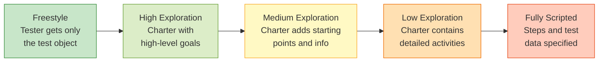

# Exploratory Testing

**Exploratory testing (ET)** is simultaneous learning, test design, and test execution . Unlike ad-hoc testing, ET operates within predefined testing parameters — it uses structured heuristics, charters, and sessions to guide the tester's investigation .

ET is not the absence of structure but a different relationship between test design and execution: the tester's cognitive engagement during testing replaces upfront test case documentation.

---

## ET vs. Ad-Hoc Testing

{: .important }
> "Don't mix ET with Session Based Testing. The plainest definition of exploratory testing is test design and test execution at the same time. ET is an approach, not another testing technique." — Industry practitioner 

| Aspect | Ad-Hoc Testing | Exploratory Testing |
|--------|----------------|---------------------|
| Planning | None | Charter, goals, heuristics |
| Structure | Random, unguided | Structured by techniques and sessions |
| Documentation | None | Session notes, defect logs |
| Reproducibility | Low | Medium (via session reports) |
| Skill dependency | Low | High (domain knowledge, test design intuition) |

---

## What Does ET Look Like in Practice?

Imagine you are testing a **coupon system** for an e-commerce site. A scripted tester would receive pre-written test cases: "Apply valid coupon → verify 10% discount," "Apply expired coupon → verify error message," and so on.

An exploratory tester receives a charter instead:

> *Explore the coupon system using unusual input combinations to discover pricing errors.*

During a 90-minute session, the tester might:

1. **Apply a valid coupon** — it works. But what if the tester applies it twice? The discount doubles. Bug #1.
2. **Try a coupon on a sale item** — the coupon stacks with the sale, creating a negative price. Bug #2.
3. **Add items to cart, apply coupon, then remove items** — the discount stays but the subtotal drops below zero. Bug #3.
4. **Open two browser tabs, apply different coupons in each** — both apply. Bug #4.

None of these scenarios were in any test plan. The tester discovered them by observing the system's behavior, forming hypotheses ("What if coupons stack?"), and testing those hypotheses immediately. This is the core of ET: **learning drives test design in real time**.

After the session, the tester writes up the four bugs with reproduction steps and notes which areas were explored — creating accountability without requiring upfront test case documentation.

---

## The Exploration Spectrum

ET and scripted testing are not binary alternatives but endpoints of a continuum :

Each level has distinct strengths :

| Factor | Higher Exploration | Lower Exploration |
|--------|-------------------|-------------------|
| **Defect detection** | Better | — |
| **Time efficiency** | Better | — |
| **Tester motivation** | Higher | Lower |
| **Adaptability to change** | Better | — |
| **Traceability** | — | Better |
| **Conformance verification** | — | Better |
| **Novice-friendly** | — | Better |

---

## Why Exploratory Testing?

The empirical evidence across five controlled experiments consistently shows :

| Finding | Evidence |
|---------|----------|
| **Matches scripted testing** in defect detection | No significant difference in 4 of 5 experiments |
| **4-6x more efficient** when total effort counted | ET: 4.58h vs. TCT: 19.47h for equivalent results  |
| **Fewer false positives** | TCT produces 2x more false defect reports  |
| **88% industry adoption** | Mainstream practice, not academic theory  |

However, ET consistently achieves **lower systematic coverage** than scripted testing , creating a fundamental trade-off between efficiency and coverage assurance.

---

## Key Topics

### [Techniques and Heuristics](techniques)

Structured approaches to guide exploration:
- Whittaker's Tourist Metaphor (18+ tours across 5 districts)
- Hendrickson's heuristics (CRUD, Goldilocks, Follow the Data)
- Dynamic application of test design techniques

### [Session-Based Test Management](session-based)

Managing ET with accountability:
- Charter + time box + reviewable result + debriefing
- Metrics and reporting
- Degrees of exploration decision framework

### [Empirical Evidence](effectiveness)

Comprehensive effectiveness data:
- Five controlled experiments comparing ET vs. scripted testing
- Industrial case studies and defect detection rates
- The role of tester knowledge and experience

---

## ET in Agile Context

ET fits naturally into agile testing cycles, supplementing scripted regression and progression tests at every level . Agile values rapid feedback and adaptation — exactly the strengths of ET.

| Agile Practice | ET Role |
|----------------|---------|
| Sprint testing | Quick exploration of new features |
| Regression | Supplement automated regression with exploratory sessions |
| User stories | Explore edge cases beyond acceptance criteria |
| Bug hunting | Focused sessions on risk areas |

---

## Quick Reference

| Parameter | Value | Source |
|-----------|-------|--------|
| ET session length | 1-2 hours |  |
| Industrial defect rate | 4.8-8.7 defects/hour |  |
| Industry adoption | 88% of professionals |  |
| Efficiency advantage | 4-6x over scripted |  |
| Tool support | 75% have none |  |

---

### References



---

{: .highlight }
**Disclaimer:** AI is used for text summarization, polishing and explaining. Authors have verified all facts and claims. In case of an error, feel free to file an issue.
