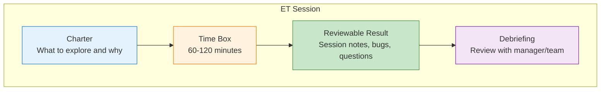
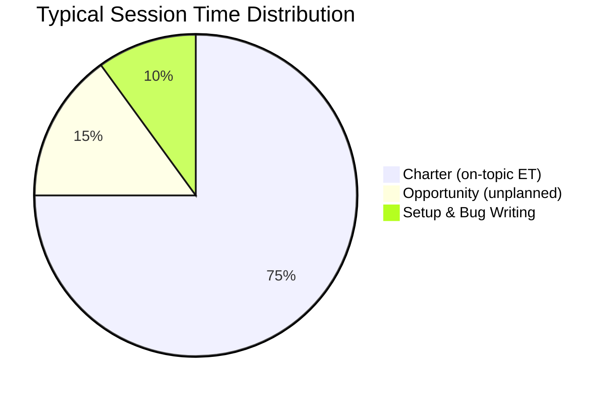

# Session-Based Test Management

A key obstacle to ET adoption is accountability: how do managers track testing progress without test cases? **Session-Based Test Management (SBTM)**, introduced by Jonathan Bach, provides a management framework that brings structure and metrics to exploratory testing without constraining the tester's freedom .

---

## The Four Pillars

SBTM structures ET around four elements:

### Charter

A brief statement directing the session's focus:
- **Target**: What area of the software to explore
- **Resources**: Tools, data, techniques to use
- **Information**: What to discover or verify

> *"Explore the payment processing module using boundary credit card values to discover validation edge cases"*

### Time Box

Sessions are typically **60-120 minutes** . Shorter sessions lose momentum; longer sessions suffer from fatigue. The time box is strict — when time is up, the tester writes up findings regardless of completion.

### Reviewable Result

The session sheet captures:
- **Bugs found** (with reproduction steps)
- **Issues/questions** raised during exploration
- **Coverage areas** explored
- **Observations** about the system's behavior

### Debriefing

After each session, the tester meets briefly with a manager or team lead to review findings. This serves three purposes:
1. **Knowledge transfer** — team learns what was discovered
2. **Coverage tracking** — manager understands what was tested
3. **Guidance** — next session's charter can be adjusted based on findings

---

## Session Metrics

SBTM tracks where session time is spent using three categories :

| Metric | Meaning | Target |
|--------|---------|--------|
| **%Session** | Time on the charter's topic | 80-100% |
| **%Charter** | Time doing ET within the charter | High |
| **%Opportunity** | Time exploring unplanned discoveries | Low-Medium |

### Session Reporting

A lightweight status format tracks team-level progress:
- **S** = Number of sessions completed
- **T** = Total session time
- **B** = Bugs found
- **R** = Bugs remaining (backlog)

Example: *"Last sprint: 12 sessions, 18 hours total, 23 bugs found, 8 in backlog"*

---

## Choosing the Degree of Exploration

Not every testing situation calls for the same amount of exploration. The five-level framework  helps teams decide:

| Level | Tester Receives | Best For | Concrete Example |
|-------|----------------|----------|-----------------|
| **1. Freestyle** | Only the test object | Uncovering unknown unknowns, creative exploration | *"Here is our new messaging app. You have 2 hours. Find problems."* — Tester decides what to explore. |
| **2. High exploration** | Charter with high-level goals | Defect detection, time-critical testing | *"Explore the file attachment feature to discover security and usability issues."* — Goal is clear, path is open. |
| **3. Medium exploration** | Charter + starting points + info | Balanced coverage and exploration | *"Explore file attachments. Start with: PDFs > 10 MB, ZIP files, files with special characters in names. Known risk: server timeout on large files."* — Starting points given, tester still decides how to explore. |
| **4. Low exploration** | Charter with detailed activities | When traceability matters | *"Test file attachments: (1) upload PDF > 10 MB, (2) upload ZIP with nested folders, (3) upload file with Unicode name, (4) upload while offline. Note any additional issues found."* — Activities listed, but tester can still observe and react. |
| **5. Fully scripted** | Steps and test data | Conformance verification, novice testers | *"Step 1: Click Attach. Step 2: Select test_file.pdf (provided). Step 3: Verify progress bar appears. Step 4: Verify file name shown in attachment list. Expected: 'test_file.pdf' displayed."* — No tester judgment needed. |

### Decision Criteria

A study at Ericsson using the repertory grid technique identified the top decision factors :

| Criterion | Weight | Favors |
|-----------|--------|--------|
| Verification of requirements | 20 pts | Lower exploration |
| Reproducibility of defects | 20 pts | Lower exploration |
| Finding new/unknown defects | 20 pts | Higher exploration |
| Time pressure | High | Higher exploration |
| Tester experience | High | Affects feasible level |

{: .important }
> Ericsson's actual practice was 80% scripted / 20% exploratory, but the decision support method recommended ~57% exploratory (16% freestyle + 18% high + 23% medium) .

---

## ET in Industry Practice

Survey data from professionals who use ET (88% of respondents) :

| Finding | Value |
|---------|-------|
| Use ET at any point in testing | 72.7% |
| Apply to safety-critical software | 48% |
| Apply to security-critical software | 64% |
| Apply to usability-critical software | 82% |
| Have specific tool support | 25% |
| Most popular tool | Mind maps |

### Top Advantages (practitioner ratings)

| Advantage | Score (/56) |
|-----------|-------------|
| Creativity support | 47 |
| Efficiency | 43 |
| Effectiveness | 32 |

### Top Disadvantage

| Disadvantage | Score (/56) |
|--------------|-------------|
| High requirement for tester skills | 36 |

---

## Industrial Defect Detection Rates

Studies of ET in real organizations show consistently high defect detection rates :

| Organization | ET Method | Defect Rate |
|--------------|-----------|-------------|
| Industrial sessions | Session-based ET | 4.8-8.7 defects/hour |
| Benchmarks | Usage-based testing | <3 defects/hour |
| Benchmarks | Functional testing | 2.47 defects/hour |

Six distinct ET approaches observed in industry :

1. **Session-based ET** (structured, chartered)
2. **Functional testing of features** (feature-focused exploration)
3. **Exploratory smoke testing** (quick coverage check)
4. **Exploratory regression testing** (explore after changes)
5. **Subcontracted ET** (real end-users explore)
6. **Freestyle ET** (unstructured exploration)

---

### References



---

{: .highlight }
**Disclaimer:** AI is used for text summarization, polishing and explaining. Authors have verified all facts and claims. In case of an error, feel free to file an issue.
