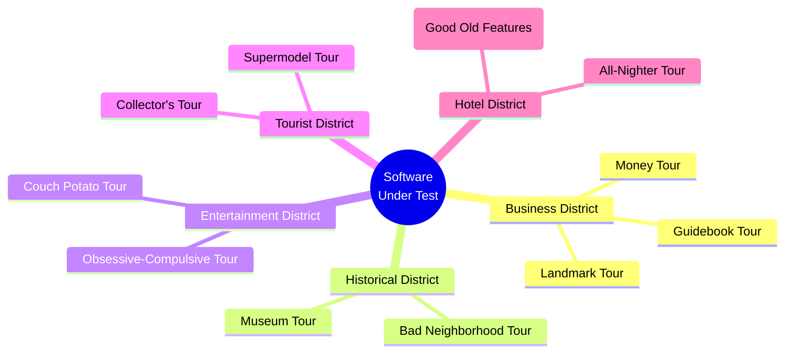
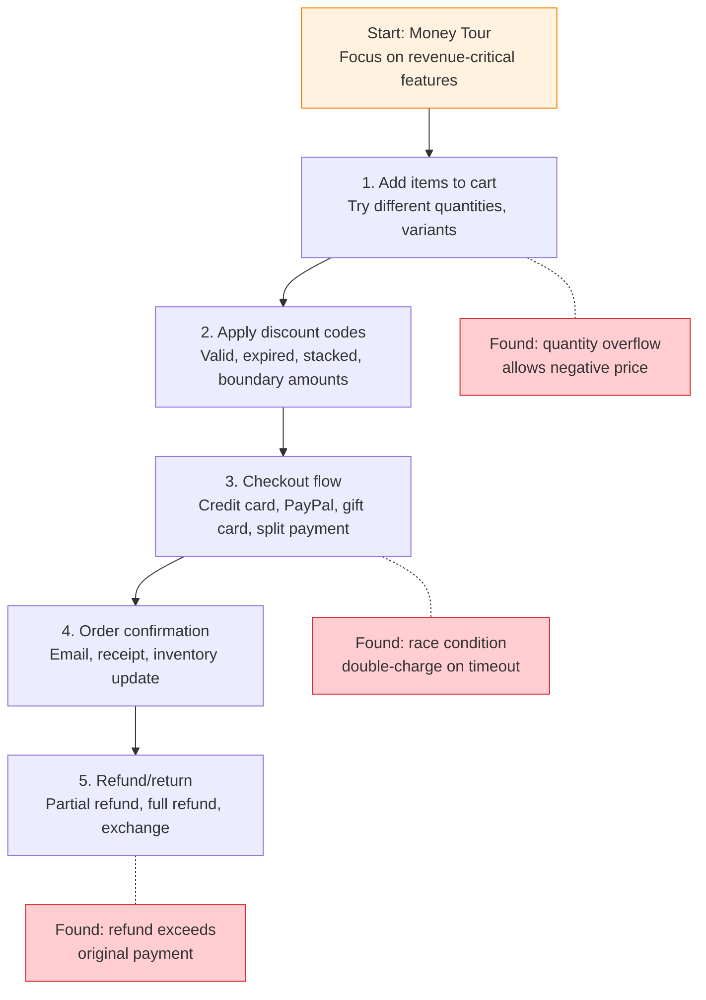

# ET Techniques and Heuristics

Exploratory testing is not unstructured — it employs a rich vocabulary of techniques and heuristics that guide the tester's investigation. Experienced ET practitioners naturally apply the same underlying principles as formal test design techniques (equivalence partitioning, boundary values, combinatorial coverage) — they simply apply them during execution rather than in a separate design phase .

---

## Whittaker's Tourist Metaphor

James Whittaker's tourist metaphor provides memorable, actionable guidance for testers. Each "tour" represents a specific testing goal with a distinct exploration strategy :

### The Five Districts

| District | Focus | Example Tours |
|----------|-------|--------------|
| **Business District** | Features users rely on daily | Guidebook Tour, Money Tour, Landmark Tour |
| **Historical District** | Legacy code and old features | Bad Neighborhood Tour, Museum Tour |
| **Entertainment District** | Fun, unusual inputs | Obsessive-Compulsive Tour, Couch Potato Tour |
| **Tourist District** | First-time user experience | Collector's Tour, Supermodel Tour |
| **Hotel District** | Background processes | All-Nighter Tour, TOGOF Tour (Tour Of Good Old Features — verify that existing features still work after changes) |

### Selected Tours

| Tour | Strategy | What It Finds |
|------|----------|--------------|
| **Guidebook Tour** | Follow the user manual exactly | Documentation-code mismatches |
| **Money Tour** | Test the features that sell the product | Critical feature defects |
| **Antisocial Tour** | Do everything the software isn't designed for | Error handling gaps |
| **Back Alley Tour** | Visit the least popular features | Neglected code defects |
| **Couch Potato Tour** | Accept all defaults, change nothing | Default configuration issues |
| **Obsessive-Compulsive Tour** | Repeat the same action with slight variations | State accumulation bugs |
| **All-Nighter Tour** | Leave the application running overnight | Memory leaks, resource exhaustion |
| **Saboteur Tour** | Disrupt resources (network, disk, memory) | Resilience failures |
| **Collector's Tour** | Try to collect every output the software can produce | Output validation gaps |
| **Supermodel Tour** | Focus only on the UI, ignore functionality | Visual and layout defects |

---

## Hendrickson's Heuristics

Elisabeth Hendrickson provides a complementary set of lightweight heuristics for test idea generation :

### Charter Template

Every ET session begins with a **charter** — a brief statement of intent:

> **Explore** [target] **using** [resources] **to discover** [information]

Examples:
- *Explore the checkout flow using boundary credit card numbers to discover input validation gaps*
- *Explore the admin dashboard using a slow network connection to discover timeout handling*

### Core Heuristics

| Heuristic | Technique | What It Tests |
|-----------|-----------|--------------|
| **CRUD** | Create, Read, Update, Delete every entity | Data lifecycle completeness |
| **Goldilocks** | Too big, too small, just right | Boundary conditions |
| **Follow the Data** | Trace data through the entire system | Data flow integrity |
| **Interruptions** | Cancel, back, timeout mid-operation | State management |
| **Soap Opera** | Extreme, dramatic user scenarios | Edge case combinations |
| **Undo/Redo** | Test all reversible operations | State reversal correctness |

### The Nightmare Headline Game

A risk-identification technique: ask *"What would be the worst headline if this software fails?"* and then explore scenarios that could produce that headline . This grounds exploration in business risk rather than technical coverage.

---

## Dynamic Test Design

A key finding from observational studies: experienced testers doing ET naturally apply classical test design techniques, but **dynamically during execution** rather than in a separate design phase :

| Formal Technique | ET Application |
|------------------|---------------|
| Equivalence partitioning | Tester intuitively groups similar inputs during exploration |
| Boundary value analysis | Tester probes edges of observed ranges |
| Combinatorial testing | Tester varies multiple parameters simultaneously |
| State transition testing | Tester explores sequences of actions |
| Error guessing | Tester applies domain knowledge to target likely failures |

{: .highlight }
> This suggests ET and scripted testing share a common cognitive foundation; the difference lies in *when and how* techniques are deployed, not in the techniques themselves .

---

## AI-Assisted Exploration

Early research explores tool support for ET practitioners :

**BotExpTest** (Discord chatbot) provides:
- Charter management and time alerts
- Bug reporting templates
- Technique knowledge (suggests applicable heuristics)
- Active suggestions during sessions

In a pilot study with 6 professionals, the chatbot contributed to discovering 3 of 13 previously unknown bugs through its suggestions. Future directions include LLM integration for smarter, context-aware test idea generation .

{: .note }
> AI-assisted ET is nascent but addresses two longstanding challenges: the high skill requirement for testers and the lack of tool support (75% of practitioners have no specific ET tools ).

---

## Worked Example: Money Tour on a Shopping App

A concrete example of applying the Money Tour  to an e-commerce application:

The tester follows the money: every path where money changes hands gets explored. Unlike a scripted test that checks "can the user buy item X," the Money Tour encourages creative variations at each step — stacking discount codes, splitting payments, interrupting checkout mid-transaction.

---

## Choosing the Right Technique

| Situation | Recommended Approach |
|-----------|---------------------|
| New feature, unfamiliar territory | Tourist metaphor tours  |
| Data-heavy application | CRUD + Follow the Data  |
| Risk-focused testing | Nightmare Headline Game  |
| Regression after changes | Antisocial + Back Alley tours  |
| Time-constrained session | Charter with specific heuristics |
| Performance concerns | All-Nighter + Saboteur tours  |

---

### References



---

{: .highlight }
**Disclaimer:** AI is used for text summarization, polishing and explaining. Authors have verified all facts and claims. In case of an error, feel free to file an issue.
