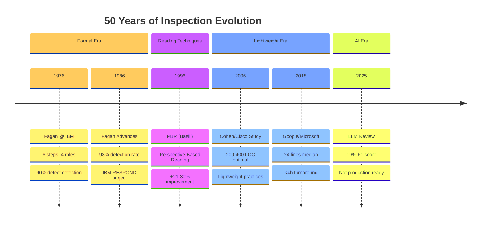
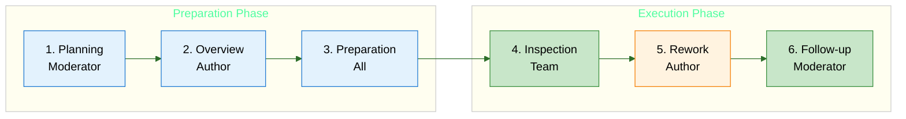
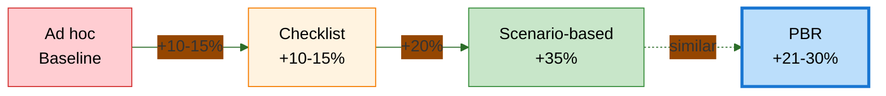
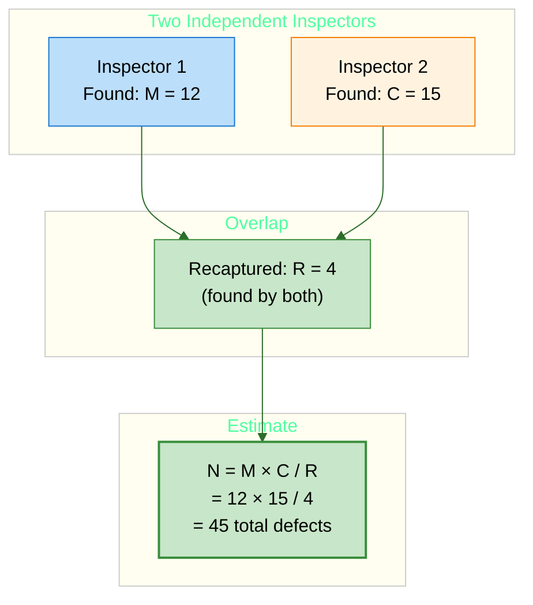

# Study Notes: Software Inspection

## Purpose
These study notes explain how software inspection works, covering 50 years of evolution from Fagan's formal process to modern code review practices and emerging LLM-based tools.

**Primary Sources:**
- Design and Code Inspections to Reduce Errors in Program Development 
- Best Kept Secrets of Peer Code Review 
- Modern Code Review: A Case Study at Google 

**Key Research Papers:**
- A Comprehensive Evaluation of Capture-Recapture Models 
- State-of-the-art: Software Inspections After 25 Years 
- Characteristics of Useful Code Reviews 
- SWR-Bench: Evaluating LLMs in Real-World Software Review 

---

## Part 1: History & Evolution

### 1.1 The Origins: Fagan Inspection (1976)

Michael Fagan  at IBM developed the first formal inspection process in 1976. His key insight was that **systematic human review of code can find defects more cost-effectively than testing**.

**Original Fagan findings:**
- 67% of all errors found by inspections
- 38% reduction in machine test time
- Error-free code sections: 23% before inspections → 60% after

### 1.2 Evolution Timeline

| Year | Milestone | Key Innovation |
|------|-----------|----------------|
| 1976 | Fagan @ IBM | 6 phases, 4 roles, formal meetings |
| 1986 | Fagan Advances | 93% detection rate reported |
| 1996 | PBR (Basili) | Perspective-based reading (+21-30%) |
| 2006 | Cisco Study | Lightweight: 200-400 LOC optimal |
| 2015 | Google/Microsoft | Modern CR studies at scale |
| 2018 | Sadowski | 24 lines median, 1 reviewer, <4h |
| 2025 | Zeng SWR-Bench | LLM achieves 19% F1 (not ready) |

### 1.3 Evolution Diagram



### 1.4 The Evolution Trajectory

**1976: Formal Fagan**
- 4 roles (Moderator, Author, Reader, Inspector)
- 6 phases with entry/exit criteria
- In-person meetings essential
- "Phantom Inspector" synergy effect

**2006: Lightweight (Cohen)**
- Tool-assisted review
- 200-400 LOC chunks
- 60-90 minute sessions
- Asynchronous possible

**2018: Modern Code Review (Google)**
- 24 lines median change size
- 1 reviewer typically sufficient
- <4 hour turnaround
- Fully async, integrated with CI/CD

**2025: AI-Assisted**
- LLM-based review tools emerging
- 19% F1 score (not production ready)
- High false positive rate
- Human review still essential

<div class="takeaway">

**Key insight:** The process lightened over 50 years, but core principles remain unchanged—preparation matters, small chunks work better.

</div>

---

## Part 2: Inspection Types

### 2.1 Types Comparison

Laitenberger  provides a comprehensive comparison of inspection types:

| Attribute | **Fagan Inspection** | **Code Review** | **Walkthrough** | **Audit** |
|-----------|---------------------|-----------------|-----------------|-----------|
| **Purpose** | Defect identification | Defect identification | Design evaluation | Process verification |
| **Formality** | Very high | Medium | Low | Very high |
| **Team size** | 4-5 | 1-2 | 5-15 | ~5 |
| **Cost** | High | Low | Medium | Very high |
| **Efficiency** | Very high | Average | Low | Low |
| **Rework** | Mandatory | Optional | Optional | Mandatory |

### 2.2 When to Inspect

**Inspect these (high-risk artifacts):**
- Requirements (ambiguity, completeness)
- Architecture (quality attributes)
- Security-critical code
- API contracts
- Complex algorithms

**Skip inspection for:**
- Style issues (use linters)
- Trivial changes
- Throwaway/prototype code
- Auto-generated code
- Auto-formatted code

### 2.3 Cost-Benefit Evidence

**Cost per defect found:**

| Method | Hours/Defect |
|--------|-------------|
| Design inspection | 1.4-1.75 |
| Code inspection | 1.46-1.58 |
| Testing | 6.0-17.0 |

**Cost to fix by stage:**

| Stage | Multiplier |
|-------|-----------|
| During review | 1× |
| During testing | 8-12× |
| In production | 30-100× |

**ROI:** Inspection finds defects 4-10× faster than testing, and fixing them costs 10-100× less than in production .

---

## Part 3: Fagan Inspection Process

### 3.1 The Six Phases

Fagan  defined six structured phases:

1. **Planning** — Moderator schedules, distributes materials
2. **Overview** — Author presents scope and context
3. **Preparation** — Inspectors study materials individually
4. **Inspection Meeting** — Team examines artifact systematically
5. **Rework** — Author fixes identified defects
6. **Follow-up** — Moderator verifies all fixes

**Entry/exit criteria** at each phase ensure quality gates are enforced.



### 3.2 The Four Roles

| Role | Responsibility |
|------|----------------|
| **Moderator** | Facilitates meeting, tracks issues, verifies fixes |
| **Author** | Clarifies (not justifies), fixes defects afterward |
| **Reader** | Paraphrases material, leads walk-through |
| **Inspector** | Identifies discrepancies, votes on issues |

**Critical rule:** Management does NOT participate in examining subordinates' work.

### 3.3 Ground Rules for Effective Meetings

1. **Focus on problems, not solutions** — Solutions waste meeting time
2. **Criticize product, not producer** — Psychological safety matters
3. **Author clarifies, doesn't justify** — Avoid defensive posture
4. **Maximum 2 hours duration** — Fatigue degrades detection
5. **Preparation is mandatory** — Cancel if team unprepared

> **Key principle:** Your work will be inspected next. Treat others as you wish to be treated.

### 3.4 Optimal Fagan Parameters

| Parameter | Recommendation | Source |
|-----------|----------------|--------|
| Team size | 4 people |  |
| Meeting duration | Max 2 hours |  |
| Inspection rate | 90-125 NCSS/hr |  |
| Preparation rate | 100-125 NCSS/hr |  |

---

## Part 4: Reading Techniques

### 4.1 Technique Hierarchy

Reading techniques range from ad hoc to highly structured approaches :

| Technique | Description | Effectiveness |
|-----------|-------------|---------------|
| **Ad hoc** | No guidance, relies on experience | Baseline |
| **Checklist-based** | Structured questions to answer | +10-15% |
| **Scenario-based** | Specific scenarios to execute | +35% |
| **Perspective-Based Reading (PBR)** | Stakeholder role assignment | **+21-30%** |



**Key finding:** 90-95% of defects are found during *preparation*, not in meetings .

### 4.2 Perspective-Based Reading (PBR)

PBR  assigns stakeholder perspectives to inspectors:

| Perspective | Focus | Work Product Created |
|-------------|-------|---------------------|
| **Tester** | Testability | Test plan outline |
| **Designer** | Implementability | High-level design sketch |
| **User** | Usability | Usage scenarios |

**Key insight:** If you can't build the work product, there's a defect in the artifact!

**Research results:**
- Basili et al. (1996) : PBR found 21-30% more defects than traditional reading
- Shull et al. (2000) : PBR consistently improved detection rates, especially for less-experienced reviewers in unfamiliar domains

### 4.3 Checklist Best Practices

Cohen  provides guidance for effective checklists:

**Do:**
- 10-20 items maximum
- Focus on omissions (hardest to spot)
- Include common error patterns
- Update based on defect data

**Don't:**
- Overemphasize style (use linters)
- Create checklist bureaucracy
- Use for all review types
- Ignore domain-specific issues

> "Checklists are most effective at detecting omissions—the hardest errors for a reviewer to notice naturally" — Cohen 2006

---

## Part 5: Modern Code Review Practices

### 5.1 The Cisco Study

Cohen  analyzed 50 programmers reviewing 3.2 million lines of code at Cisco Systems.

**Finding 1: Size Matters**

Defect density drops rapidly beyond 200 LOC. The optimal review size is 200-400 LOC :

```vega-lite
{
  "$schema": "https://vega.github.io/schema/vega-lite/v5.json",
  "title": "Defect Density vs. Review Size",
  "width": 400,
  "height": 280,
  "layer": [
    {
      "data": {
        "values": [
          {"loc": 10, "defects": 200}, {"loc": 20, "defects": 170},
          {"loc": 30, "defects": 145}, {"loc": 50, "defects": 110},
          {"loc": 75, "defects": 85}, {"loc": 100, "defects": 65},
          {"loc": 150, "defects": 45}, {"loc": 200, "defects": 35},
          {"loc": 300, "defects": 22}, {"loc": 400, "defects": 15},
          {"loc": 600, "defects": 8}, {"loc": 800, "defects": 5},
          {"loc": 1000, "defects": 3}
        ]
      },
      "mark": {"type": "line", "color": "#d32f2f", "strokeWidth": 3},
      "encoding": {
        "x": {"field": "loc", "type": "quantitative", "title": "LOC under Review", "scale": {"domain": [0, 1000]}},
        "y": {"field": "defects", "type": "quantitative", "title": "Defects Found / KSLOC", "scale": {"domain": [0, 220]}}
      }
    },
    {
      "data": {
        "values": [
          {"loc": 15, "defects": 200}, {"loc": 25, "defects": 165},
          {"loc": 40, "defects": 92}, {"loc": 60, "defects": 75},
          {"loc": 80, "defects": 55}, {"loc": 100, "defects": 100},
          {"loc": 120, "defects": 25}, {"loc": 140, "defects": 60},
          {"loc": 180, "defects": 55}, {"loc": 220, "defects": 15},
          {"loc": 280, "defects": 8}, {"loc": 350, "defects": 10},
          {"loc": 450, "defects": 8}, {"loc": 550, "defects": 0},
          {"loc": 700, "defects": 12}, {"loc": 850, "defects": 0},
          {"loc": 950, "defects": 3}
        ]
      },
      "mark": {"type": "point", "color": "#1976d2", "size": 50, "filled": true},
      "encoding": {
        "x": {"field": "loc", "type": "quantitative"},
        "y": {"field": "defects", "type": "quantitative"}
      }
    },
    {
      "data": {"values": [{"x": 200}, {"x": 400}]},
      "mark": {"type": "rule", "color": "#388e3c", "strokeWidth": 2, "strokeDash": [5, 5]},
      "encoding": {"x": {"field": "x", "type": "quantitative"}}
    }
  ]
}
```

The green dashed lines mark the 200-400 LOC sweet spot:

| LOC Reviewed | Defects/KLOC | Effectiveness |
|--------------|--------------|---------------|
| 10-50 LOC | 150-200 | Highest |
| 100-200 LOC | 50-100 | High |
| 200-400 LOC | 20-40 | Good |
| > 400 LOC | 5-15 | Near zero |

**Finding 2: Rate Matters**

Optimal review rate is < 500 LOC/hour. The red line shows the threshold — above it, reviews become "rubber stamping":

```vega-lite
{
  "$schema": "https://vega.github.io/schema/vega-lite/v5.json",
  "title": "Defect Density vs. Review Rate",
  "width": 400,
  "height": 280,
  "layer": [
    {
      "data": {
        "values": [
          {"rate": 50, "defects": 142}, {"rate": 100, "defects": 100},
          {"rate": 150, "defects": 48}, {"rate": 200, "defects": 55},
          {"rate": 250, "defects": 100}, {"rate": 300, "defects": 98},
          {"rate": 350, "defects": 30}, {"rate": 400, "defects": 50},
          {"rate": 450, "defects": 30}, {"rate": 550, "defects": 28},
          {"rate": 650, "defects": 10}, {"rate": 750, "defects": 12},
          {"rate": 850, "defects": 80}, {"rate": 950, "defects": 10},
          {"rate": 1100, "defects": 12}, {"rate": 1300, "defects": 8}
        ]
      },
      "mark": {"type": "point", "color": "#1976d2", "size": 50, "filled": true},
      "encoding": {
        "x": {"field": "rate", "type": "quantitative", "title": "Review Rate (LOC/hour)", "scale": {"domain": [0, 1400]}},
        "y": {"field": "defects", "type": "quantitative", "title": "Defects Found / KSLOC", "scale": {"domain": [0, 160]}}
      }
    },
    {
      "data": {"values": [{"x": 500}]},
      "mark": {"type": "rule", "color": "#d32f2f", "strokeWidth": 3},
      "encoding": {"x": {"field": "x", "type": "quantitative"}}
    }
  ]
}
```

| Review Rate | Defects/KLOC | Quality |
|-------------|--------------|---------|
| < 200 LOC/hr | 80-140 | Excellent |
| 200-300 LOC/hr | 50-100 | Thorough |
| 300-500 LOC/hr | 30-50 | Acceptable |
| > 500 LOC/hr | 10-30 | Hasty |

Above 500 LOC/hr = "rubber stamping" — rushed reviews correlate with more post-release defects.

### 5.2 The Magic Numbers

**Empirically validated optimal parameters:**

| Parameter | Recommendation | Source |
|-----------|----------------|--------|
| **Review size** | 200-400 LOC max | Cisco study |
| **Review rate** | < 500 LOC/hour | Cisco study |
| **Session duration** | 60-90 minutes max | Fatigue research |
| **Bug detection speed** | 1 bug / 10-15 min | Efficient teams |

**Business impact:** Cisco saved $2.6M by reducing support calls from 50K to 20K per year.

### 5.3 Google Modern Code Review

Sadowski  studied modern code review at Google:

| Metric | Value |
|--------|-------|
| Median change size | 24 lines |
| Median reviewers | 1 |
| Median review latency | < 4 hours |
| Changes needing ≤1 iteration | >80% |
| Dev time on review | 3.2 hrs/week |

**Key insights:**
- Small changes = fast reviews
- Single reviewer usually sufficient
- Async works at scale
- Integrate with CI/CD

**Contrast:** Google's 24-line median vs Fagan's 200-300 NCSS sessions.

### 5.4 Microsoft Research

Bosu  studied useful code review comments at Microsoft:

| Metric | Value |
|--------|-------|
| Comments marked useful | 65.5% |
| Experienced reviewer usefulness | 65-71% |
| First-time reviewer usefulness | 32-37% |
| Reviews without discussion | More defect-prone |

**Key insight:** Participation quality matters more than coverage. Silent approvals and hasty reviews correlate with post-release defects .

### 5.5 Anti-Patterns to Avoid

| Anti-Pattern | Why It's Harmful |
|--------------|------------------|
| Management participation | Creates fear, kills honesty |
| Using metrics for HR evaluation | Developers game the numbers |
| Reviewing > 400 LOC | Effectiveness near zero |
| Rushing (> 500 LOC/hr) | Missing critical defects |
| LGTM without reading | False sense of security |
| Author justifying, not clarifying | Defensive, unproductive |

> "Never use review metrics for performance evaluations—developers will manipulate data if punished" — Cohen 2006

---

## Part 6: Quality Estimation

### 6.1 The Problem

After an inspection finds 50 defects, a critical question remains: **How many defects are still hiding?**

Without knowing the total defect population, teams cannot:
- Make objective reinspection decisions
- Calculate remaining risk
- Plan appropriate testing effort

### 6.2 Fault Injection (Error Seeding)

Mills' methodology (1970s) estimates total defects by measuring detection of known seeded defects.

**Process:**
1. Inject **I** known defects into artifact
2. Run inspection process normally
3. Count: **i** = seeded defects found
4. Count: **n** = original defects found
5. Estimate total: **N = n × (I / i)**

**Formula:**
$$N = n \times \frac{I}{i}$$

**Example:**
- Inject 12 defects
- Find 4 seeded + 11 original
- N = 11 × (12/4) = **33 estimated**
- Found 11, remaining: **22 unfound**

**Challenge:** Seeded defects must have similar detectability to real defects—this is difficult to achieve in practice.

### 6.3 Capture-Recapture Method

The capture-recapture method  originates from wildlife biology. In software inspection:
- "Animals" = defects
- "Capture sessions" = independent inspectors
- "Marked and recaptured" = defects found by multiple inspectors



**Lincoln-Petersen Formula:**

$$\hat{N} = \frac{M \times C}{R}$$

Where:
- $\hat{N}$ = estimated total defects
- $M$ = defects found by Inspector 1
- $C$ = defects found by Inspector 2
- $R$ = defects found by both (the overlap)

**Example:**
- Inspector A finds 20 defects
- Inspector B finds 15 defects
- Both find 6 of the same defects
- N = (20 × 15) / 6 = **50 estimated**
- Found 29 unique, remaining: **21 unfound**

**Defect Distribution Visualization:**

```vega-lite
{
  "$schema": "https://vega.github.io/schema/vega-lite/v5.json",
  "width": 500,
  "height": 250,
  "title": {
    "text": "Capture-Recapture: Defect Distribution",
    "subtitle": "N = M×C/R = 12×15/4 = 45 estimated total defects",
    "subtitleFontSize": 14,
    "subtitleColor": "#666"
  },
  "data": {
    "values": [
      {"category": "Inspector 1 Only", "value": 8, "group": "Found"},
      {"category": "Both Inspectors", "value": 4, "group": "Found"},
      {"category": "Inspector 2 Only", "value": 11, "group": "Found"},
      {"category": "Unfound (estimated)", "value": 22, "group": "Unfound"}
    ]
  },
  "mark": {"type": "bar", "cornerRadiusTopRight": 4, "cornerRadiusBottomRight": 4},
  "encoding": {
    "y": {"field": "category", "type": "nominal", "sort": null, "axis": {"title": null, "labelFontSize": 14}},
    "x": {"field": "value", "type": "quantitative", "title": "Number of Defects", "axis": {"labelFontSize": 12}},
    "color": {
      "field": "category",
      "type": "nominal",
      "scale": {
        "domain": ["Inspector 1 Only", "Both Inspectors", "Inspector 2 Only", "Unfound (estimated)"],
        "range": ["#1976d2", "#388e3c", "#f57c00", "#d32f2f"]
      },
      "legend": null
    }
  },
  "config": {
    "font": "Tahoma, sans-serif",
    "view": {"stroke": null}
  }
}
```

### 6.4 Model Selection

The basic Lincoln-Petersen assumes all defects are equally likely to be found. Briand  evaluated four models:

| Model | Assumption | Use When |
|-------|------------|----------|
| **M₀** | All defects equal, all inspectors equal | Never (unrealistic) |
| **Mₜ** | Inspectors vary in capability | Mixed experience levels |
| **Mₕ** | Defects vary in visibility | **Recommended default** |
| **Mₜₕ** | Both vary | Most realistic, needs 4+ inspectors |

**Recommendation:** Use Model Mₕ with Jackknife estimator. Minimum 4 inspectors for reliable estimates.

### 6.5 Limitations

> "Overall, capture-recapture models and their estimators tend to underestimate the true number of defects" — Briand 2000

| Limitation | Impact |
|------------|--------|
| Underestimation bias | Plan for more defects than estimated |
| Zero overlap | Formula fails if R = 0 |
| Small teams | Unreliable with <4 inspectors |

---

## Part 7: LLM Code Review

### 7.1 Current State (2025)

Zeng  evaluated LLM-based code review on 1,000 pull requests from 12 Python projects.

**Key Findings:**

| Metric | Value |
|--------|-------|
| Best F1 score | 19.38% |
| Human agreement | ~90% |
| Main limitation | High false positives |
| Aggregation boost | +43.67% F1 |

### 7.2 What Works and What Doesn't

**What works:**
- Multi-pass aggregation helps
- Better at bugs than style
- Reasoning models perform better

**What doesn't:**
- Single-pass review
- Complex agent architectures
- Style/documentation detection

### 7.3 Practical Implications

| Capability | LLM Performance |
|------------|-----------------|
| Functional bug detection | Moderate |
| Style/documentation | Poor |
| Security vulnerabilities | Emerging |
| False positive rate | High (main barrier) |

> "State-of-the-art ACR tools and LLMs are not yet ready for deployment" — Zeng 2025

**Practical advice:** Use LLM as assistant, not replacement. Human review remains essential for production code.

---

## Part 8: Summary

### Key Takeaways

1. **50-year evolution:** Fagan 1976 → LLM 2025 (formal → async → AI)
2. **Optimal parameters:** 200-400 LOC, <500 LOC/hr, 60-90 min
3. **Modern practice:** 24 lines median, 1 reviewer, <4h (Google)
4. **Quality estimation:** Capture-recapture with Mₕ + Jackknife
5. **LLM status:** 19% F1 — not production ready (yet)
6. **ROI:** 10-100× cheaper than finding defects in production

### Comparison: Fagan vs Modern

| Aspect | Fagan (1976) | Modern (2018) |
|--------|--------------|---------------|
| Team size | 4 people | 1-2 people |
| Meeting | Required | Async |
| Change size | 200-300 NCSS | 24 lines median |
| Turnaround | Days | < 4 hours |
| Tools | Paper | GitHub/GitLab |

### Inspection vs Testing

| Aspect | Inspection | Testing |
|--------|------------|---------|
| Timing | Earlier (requirements, design, code) | Later (executable code) |
| Finds | Omissions, design issues, style | Runtime failures |
| Cost per defect | 1× | 10-34× |
| Hours per defect | 1.4-1.75 | 6-17 |

**Key insight:** Inspection and testing are **complementary** — use both for comprehensive verification.

---

### References



---

{: .highlight }
**Disclaimer:** AI is used for text summarization, polishing and explaining. Authors have verified all facts and claims. In case of an error, feel free to file an issue.
