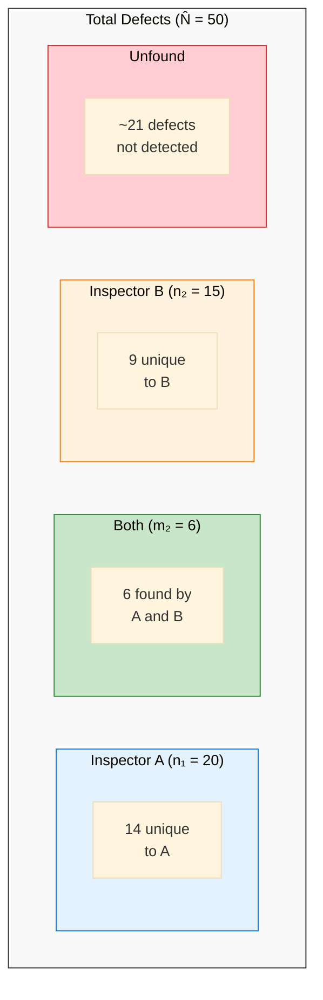

# Estimating Remaining Defects

How many defects remain after an inspection? Two statistical methods can estimate total defect content:

1. **Fault Injection (Error Seeding)** — Seed known defects, measure detection rate
2. **Capture-Recapture** — Use inspector overlap to estimate population

---

## Two Approaches Compared

| Aspect | Fault Injection | Capture-Recapture |
|--------|-----------------|-------------------|
| **Method** | Seed known defects | Compare inspector overlap |
| **Requirement** | Seeded defects must be representative | ≥4 independent inspectors |
| **Challenge** | Creating realistic defects | Zero overlap breaks formula |
| **Best for** | Controlled experiments | Production inspections |

---

## Fault Injection (Error Seeding)

### Mills' Methodology (1970s)

Fault injection estimates total defects by measuring how well inspectors detect **intentionally seeded** defects.

**Process:**
1. Inject **I** known defects into the artifact
2. Run the inspection process normally
3. Count **i** = seeded defects found
4. Count **n** = original defects found
5. Estimate total original defects: **N = n × (I / i)**

### The Formula

$$N = n \times \frac{I}{i}$$

Where:
- $N$ = estimated total original defects
- $n$ = original defects found during inspection
- $I$ = number of seeded (injected) defects
- $i$ = seeded defects found during inspection

### Worked Example

| Metric | Value |
|--------|-------|
| Seeded defects injected (I) | 12 |
| Seeded defects found (i) | 4 |
| Original defects found (n) | 11 |

$$N = 11 \times \frac{12}{4} = 11 \times 3 = 33 \text{ original defects}$$

**Interpretation:** Found 11 original defects, but estimate 33 exist. Approximately **22 defects remain undetected**.

### Assumptions and Limitations

{: .warning }
> Seeded defects must have **similar detectability** to real defects — this is difficult to achieve in practice.

| Limitation | Impact |
|------------|--------|
| **Representative seeding** | Hard to create defects with same visibility as real ones |
| **Injection overhead** | Requires effort to seed and track defects |
| **Removal risk** | Must carefully remove all seeded defects after inspection |
| **Gaming risk** | If inspectors know about seeding, behavior may change |

### When to Use Fault Injection

- Controlled experiments evaluating inspection effectiveness
- Training exercises to calibrate inspector performance
- Research studies comparing techniques
- When capture-recapture not feasible (< 4 inspectors)

---

## Capture-Recapture Method

The **capture-recapture method** provides a statistical approach to estimate total defect content based on the overlap between independent inspectors .

---

## The Problem

After an inspection finds 50 defects, a critical question remains: **Is the artifact ready for release, or should we reinspect?**

Without knowing the total defect population, teams cannot:
- Make objective reinspection decisions
- Calculate remaining risk
- Plan appropriate testing effort

---

## The Intuition: Wildlife Biology Meets Software

The method originates from ecology, where researchers estimate animal populations by:
1. **Capture** a sample, mark them, release
2. **Recapture** another sample
3. **Count the overlap** (marked animals recaptured)

The key insight: **The overlap ratio reveals the population size.**

In software inspection:
- "Animals" = defects
- "Capture sessions" = independent inspectors
- "Marked and recaptured" = defects found by multiple inspectors

### Visual: The Overlap Reveals Total Population

**Key insight:** The smaller the overlap (m₂), the larger the estimated total — because low overlap suggests inspectors are finding different subsets of a larger population.

---

## The Lincoln-Petersen Formula

For two independent inspectors, the estimated total defects is:

$$\hat{N} = \frac{n_1 \times n_2}{m_2}$$

Where:
- $\hat{N}$ = estimated total defects
- $n_1$ = defects found by inspector 1
- $n_2$ = defects found by inspector 2
- $m_2$ = defects found by **both** (the overlap)

### Worked Example

| Inspector | Defects Found |
|-----------|---------------|
| Inspector A | 20 |
| Inspector B | 15 |
| **Both (overlap)** | **6** |

$$\hat{N} = \frac{20 \times 15}{6} = \frac{300}{6} = 50 \text{ defects}$$

**Interpretation:** We found 29 unique defects (20 + 15 - 6), but estimate 50 total exist. Approximately 21 defects remain undetected.

---

## Model Selection

The basic Lincoln-Petersen assumes all defects are equally likely to be found. In practice, some bugs are harder to find than others. Briand et al.  evaluated four models:

| Model | Accounts For | Assumption |
|-------|--------------|------------|
| **M₀** | Nothing | All defects equal, all inspectors equal |
| **Mₜ** | Inspector variation | Inspectors have different abilities |
| **Mₕ** | Defect heterogeneity | Some defects harder to find |
| **Mₜₕ** | Both | Inspector ability AND defect difficulty vary |

### Recommendation: Model Mₕ with Jackknife Estimator

> "The authors recommend using Model Mₕ with the Jackknife Estimator" 

**Why Mₕ?** Defect heterogeneity (easy vs. hard bugs) is the dominant factor in real inspections. The Jackknife estimator has the lowest failure rate and bias.

---

## Practical Requirements

### Minimum Inspectors: 4 or More

{: .warning }
> "No model is sufficiently accurate with fewer than four inspectors" 

| Inspectors | Accuracy |
|------------|----------|
| 2-3 | **Insufficient** — substantial underestimation |
| 4+ | Acceptable with proper model selection |

### Key Assumptions

1. **Closure** — The defect population doesn't change during inspection (no new defects introduced)
2. **Independence** — Inspectors work separately without sharing findings
3. **Detection probability** — Basic models assume equal; Mₕ/Mₜ relax this

---

## Limitations

{: .important }
> "Overall, capture-recapture models and their estimators tend to underestimate the true number of defects" 

| Limitation | Impact |
|------------|--------|
| **Underestimation bias** | Plan for more defects than estimated |
| **Zero overlap** | Formula fails if m₂ = 0 |
| **Small teams** | Unreliable with <4 inspectors |
| **Calibration issues** | Historical adjustment increases variability |

---

## Use Cases

### 1. Reinspection Decisions

Calculate estimated remaining defects:
- **High remaining count** → Schedule reinspection
- **Low remaining count** → Proceed to testing

### 2. Quality Gates

Set exit criteria based on estimated defect density:
- Example: Exit when estimated remaining < 0.25 major defects/page 

### 3. Resource Planning

Determine optimal inspector count:
- Fewer inspectors = cheaper but less accurate estimates
- 4+ inspectors = reliable estimates for critical artifacts

### 4. Process Improvement

Track estimates over time:
- Compare estimated vs. actual (found later in testing)
- Calibrate expectations for future projects

---

## Summary

| Aspect | Recommendation |
|--------|----------------|
| **Formula** | $\hat{N} = (n_1 \times n_2) / m_2$ |
| **Model** | Mₕ (heterogeneity) |
| **Estimator** | Jackknife |
| **Minimum inspectors** | 4 |
| **Expect** | Underestimation — add safety margin |

---

### References



---

{: .highlight }
**Disclaimer:** AI is used for text summarization, polishing and explaining. Authors have verified all facts and claims. In case of an error, feel free to file an issue.
