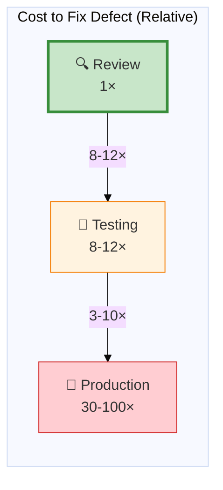
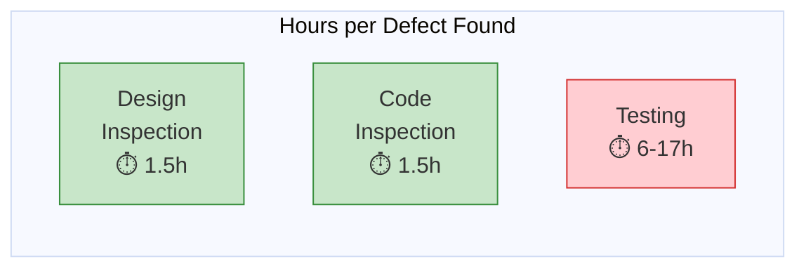

# Inspection Effectiveness Data

Software inspection is consistently shown to be the **most cost-effective defect removal technique**, with detection rates of 60-90% and cost ratios of 1:10 to 1:34 compared to testing  .

---

## Defect Detection Rates

### Summary Across Studies

| Source | Detection Rate | Context |
|--------|----------------|---------|
| Fagan 1976 (IBM) | **90%** of lifecycle defects | Formal inspection |
| Fagan 1986 (IBM RESPOND) | **93%** | Mature process |
| Laitenberger 2000 survey | **60-90%** | Industry average |
| Dodd 2003 | 57% most likely (19-84% range) | Code inspections |
| Aurum 2002 | 60-90% | 25-year synthesis |

{: .highlight }
> "Inspections are reported to find 60% to 90% of all defects" 

### Design vs. Code Inspections

| Type | Minimum | Most Likely | Maximum |
|------|---------|-------------|---------|
| **Design** | 25% | 57% | 84% |
| **Code** | 19% | 57% | 70% |

Source: 

---

## Cost-Effectiveness

### Cost Ratios: Inspection vs. Testing

| Source | Ratio (Inspection : Testing) |
|--------|------------------------------|
| JPL | **1:10 to 1:34** |
| IBM Santa Teresa | **1:20** |
| Laitenberger 2000 | 1:10 to 1:34 |

> "The ratio of the cost of fixing a defect during inspection compared to formal testing ranges from 1:10 to 1:34" 

### Cost Ratios: Development vs. Production

| Timing | Cost Multiplier | Source |
|--------|-----------------|--------|
| During review | 1× | Baseline |
| During testing | **8-12×** |  |
| In production | **30-100×** |  |



**Key insight:** Every defect caught in review saves 10-100× the cost of finding it later.

---

## Effort per Defect

### Inspection vs. Testing

| Method | Hours per Defect | Source |
|--------|------------------|--------|
| Design inspection | 1.4-1.75 |   |
| Code inspection | 1.46-1.58 |  |
| **Testing** | **6.0-17.0** |   |



{: .important }
> Inspection finds defects **4-10× faster** than testing.

### Savings Calculation

| Metric | Design | Code |
|--------|--------|------|
| Defect cost savings vs. testing | **44%** | **39%** |

Source: 

---

## Industry ROI Case Studies

### Hewlett-Packard

| Metric | Value |
|--------|-------|
| ROI | **10:1** |
| Annual savings | **$21.4 million** |
| Source |  |

### IBM

| Metric | Value |
|--------|-------|
| Productivity gain | **23%** net increase |
| Cost reduction | **9%** vs walkthroughs |
| Defects (1976-1984) | **Reduced by 2/3** while doubling LOC |

Source:  

### Standard Bank of South Africa

| Metric | Value |
|--------|-------|
| Maintenance cost reduction | **95%** |
| Final quality | **0.15 defects/KLOC** |

Source: 

### AETNA Insurance

| Metric | Value |
|--------|-------|
| Development resource reduction | **25%** |
| Defects found via inspection | **82%** |

Source: 

### Cisco Systems

| Metric | Value |
|--------|-------|
| Support calls (before) | 50,000/year |
| Support calls (after) | 20,000/year |
| **Savings** | **$2.6 million** |

Source: 

---

## Inspection vs. Walkthrough

| Metric | Inspection | Walkthrough |
|--------|------------|-------------|
| Defects/KLOC (telecom study) | **16-20** | 3 |
| Defects/KLOC (Ford Motor) | **50% more** | Baseline |
| Defects/hour (industry study) | 1.5× | Baseline |
| Productivity (IBM Federal) | 2× | Baseline |

Source: 

{: .highlight }
> "Inspections detected 16 to 20 defects per kLOC, while informal reviews found only 3 per kLOC" 

---

## Cisco Study: Optimal Review Parameters

The largest empirical study of code review effectiveness was conducted at Cisco Systems, involving **50 programmers** and **3.2 million lines of code** .

### Key Finding: Review Size Matters

| LOC Reviewed | Defect Detection |
|--------------|------------------|
| < 200 LOC | **Highest** effectiveness |
| 200-400 LOC | Good effectiveness |
| > 400 LOC | **Near zero** effectiveness |

{: .warning }
> "Defect density plummets when more than 200-400 lines are reviewed at once; effectiveness is almost zero after 400 lines" 

```vega-lite
{
  "$schema": "https://vega.github.io/schema/vega-lite/v5.json",
  "title": "Defect Density vs. Review Size",
  "width": 450,
  "height": 250,
  "layer": [
    {
      "data": {
        "values": [
          {"loc": 10, "defects": 200}, {"loc": 20, "defects": 170},
          {"loc": 30, "defects": 145}, {"loc": 50, "defects": 110},
          {"loc": 75, "defects": 85}, {"loc": 100, "defects": 65},
          {"loc": 150, "defects": 45}, {"loc": 200, "defects": 35},
          {"loc": 300, "defects": 22}, {"loc": 400, "defects": 15},
          {"loc": 600, "defects": 8}, {"loc": 800, "defects": 5},
          {"loc": 1000, "defects": 3}
        ]
      },
      "mark": {"type": "line", "color": "#d32f2f", "strokeWidth": 3},
      "encoding": {
        "x": {"field": "loc", "type": "quantitative", "title": "LOC under Review", "scale": {"domain": [0, 1000]}},
        "y": {"field": "defects", "type": "quantitative", "title": "Defects Found / KSLOC", "scale": {"domain": [0, 220]}}
      }
    },
    {
      "data": {
        "values": [
          {"loc": 15, "defects": 200}, {"loc": 25, "defects": 165},
          {"loc": 40, "defects": 92}, {"loc": 60, "defects": 75},
          {"loc": 80, "defects": 55}, {"loc": 100, "defects": 100},
          {"loc": 120, "defects": 25}, {"loc": 140, "defects": 60},
          {"loc": 180, "defects": 55}, {"loc": 220, "defects": 15},
          {"loc": 280, "defects": 8}, {"loc": 350, "defects": 10},
          {"loc": 450, "defects": 8}, {"loc": 550, "defects": 0},
          {"loc": 700, "defects": 12}, {"loc": 850, "defects": 0},
          {"loc": 950, "defects": 3}
        ]
      },
      "mark": {"type": "point", "color": "#1976d2", "size": 50, "filled": true},
      "encoding": {
        "x": {"field": "loc", "type": "quantitative"},
        "y": {"field": "defects", "type": "quantitative"}
      }
    },
    {
      "data": {"values": [{"x": 200}, {"x": 400}]},
      "mark": {"type": "rule", "color": "#388e3c", "strokeWidth": 2, "strokeDash": [5, 5]},
      "encoding": {"x": {"field": "x", "type": "quantitative"}}
    }
  ]
}
```

{: .note }
> *Chart reconstructed to illustrate trend. See  for original data.*

The hyperbolic curve shows defect detection drops rapidly beyond 200 LOC. Green dashed lines mark the 200-400 LOC optimal range.

### Key Finding: Review Rate Matters

| Review Rate | Defect Detection |
|-------------|------------------|
| < 300 LOC/hour | **Thorough** review |
| 300-500 LOC/hour | Acceptable |
| > 500 LOC/hour | **Hasty** — misses defects |

```vega-lite
{
  "$schema": "https://vega.github.io/schema/vega-lite/v5.json",
  "title": "Defect Density vs. Review Rate",
  "width": 450,
  "height": 250,
  "layer": [
    {
      "data": {
        "values": [
          {"rate": 50, "defects": 142}, {"rate": 100, "defects": 100},
          {"rate": 150, "defects": 48}, {"rate": 200, "defects": 55},
          {"rate": 250, "defects": 100}, {"rate": 300, "defects": 98},
          {"rate": 350, "defects": 30}, {"rate": 400, "defects": 50},
          {"rate": 450, "defects": 30}, {"rate": 550, "defects": 28},
          {"rate": 650, "defects": 10}, {"rate": 750, "defects": 12},
          {"rate": 850, "defects": 80}, {"rate": 950, "defects": 10},
          {"rate": 1100, "defects": 12}, {"rate": 1300, "defects": 8}
        ]
      },
      "mark": {"type": "point", "color": "#1976d2", "size": 50, "filled": true},
      "encoding": {
        "x": {"field": "rate", "type": "quantitative", "title": "Review Rate (LOC/hour)", "scale": {"domain": [0, 1400]}},
        "y": {"field": "defects", "type": "quantitative", "title": "Defects Found / KSLOC", "scale": {"domain": [0, 160]}}
      }
    },
    {
      "data": {"values": [{"x": 500}]},
      "mark": {"type": "rule", "color": "#d32f2f", "strokeWidth": 3},
      "encoding": {"x": {"field": "x", "type": "quantitative"}}
    }
  ]
}
```

{: .note }
> *Chart reconstructed to illustrate trend. See  for original data.*

The red vertical line at 500 LOC/hour marks the threshold above which reviews become hasty and miss defects.

### Optimal Parameters Summary

| Parameter | Recommendation | Source |
|-----------|----------------|--------|
| Review size | **200-400 LOC max** | Cisco study |
| Review rate | **< 500 LOC/hour** | Cisco study |
| Session duration | **60-90 minutes max** | Fatigue degrades performance |
| Bug detection speed | 1 bug per 10-15 minutes | Efficient teams |

### Cisco ROI

| Metric | Before | After | Savings |
|--------|--------|-------|---------|
| Support calls/year | 50,000 | 20,000 | **$2.6 million** |

---

## Modern Code Review Metrics

### Google (Sadowski 2018)

| Metric | Value |
|--------|-------|
| Median review latency | **< 4 hours** |
| Median change size | **24 lines** |
| Median reviewers | **1** |
| Changes needing ≤1 iteration | >80% |
| Developer time on review | 3.2 hours/week |

Source: 

### Microsoft (Bosu 2015)

| Metric | Value |
|--------|-------|
| Comments marked useful | **65.5%** |
| Experienced reviewer usefulness | 65-71% |
| First-time reviewer usefulness | 32-37% |

Source: 

### Code Review Coverage Impact (McIntosh 2015)

| Finding | Impact |
|---------|--------|
| Review coverage | Negatively associated with post-release defects |
| Reviews without discussion | **More defect-prone** |
| Hasty reviews (>200 LOC/hr) | Higher post-release defects |

> "Participation quality matters more than coverage" 

---

## Total Cost of Inspection

| Category | Percentage of Project |
|----------|----------------------|
| Design + code inspections | **~15%** |

Source: 

{: .important }
> 15% investment yields 60-90% defect detection and 10-34× cost savings vs. later discovery.

---

## Summary: The Business Case

| Metric | Typical Value |
|--------|---------------|
| Detection rate | 60-90% |
| Cost ratio vs. testing | 1:10 to 1:34 |
| Cost ratio vs. production | 1:30 to 1:100 |
| Hours per defect | 1.4-1.75 (vs 6-17 for testing) |
| ROI | 10:1 (HP example) |
| Productivity impact | +23% (IBM) |

**Bottom line:** Inspection is the most cost-effective quality technique available. Organizations that skip inspection pay 10-100× more to find the same defects later.

---

### References



---

{: .highlight }
**Disclaimer:** AI is used for text summarization, polishing and explaining. Authors have verified all facts and claims. In case of an error, feel free to file an issue.
