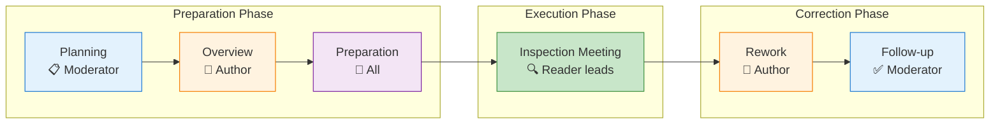

# Fagan Inspection Process

Michael Fagan introduced formal software inspection at IBM in 1976, establishing a rigorous method that became the foundation for all subsequent inspection techniques . The process achieved remarkable results: **90% of lifecycle defects detected** and **23% productivity improvement**.

---

## Historical Context

| Year | Milestone |
|------|-----------|
| 1976 | Fagan publishes original method at IBM  |
| 1986 | 10-year update: detection → prevention  |
| 2008 | IEEE 1028 standardizes inspection practices |

---

## The Six-Step Process

{: .important }
> "All six steps are mandatory; skipping them leads to degraded efficiency" 

### 1. Planning

**Owner:** Moderator

| Activity | Purpose |
|----------|---------|
| Verify entry criteria | Artifact ready for inspection |
| Form the team | Select 4 participants with appropriate skills |
| Schedule meeting | 2-hour maximum session |
| Distribute materials | Allow preparation time |

**Entry Criteria Example:**
- Code compiles without errors
- Design documentation available
- Unit tests pass

### 2. Overview

**Owner:** Author

| Activity | Purpose |
|----------|---------|
| Present the artifact | Educate team on context and intent |
| Explain design decisions | Share rationale |
| Assign roles | Reader, Tester designations |

**Rate:** ~500 NCSS/hour (Non-Commentary Source Statements)

### 3. Preparation

**Owner:** Each participant individually

| Activity | Purpose |
|----------|---------|
| Study the artifact | Understand logic and structure |
| Apply reading technique | Checklist, PBR, or scenario-based |
| Record potential issues | Prepare for meeting |

**Rate:** 100-125 NCSS/hour

{: .highlight }
> **Key Finding:** 90-95% of defects are found during preparation, not in the meeting 

### 4. Inspection Meeting

**Owner:** Moderator leads, Reader presents

| Activity | Purpose |
|----------|---------|
| Reader paraphrases | Walk through artifact (NOT the author) |
| Team identifies defects | Log issues as they arise |
| Recorder documents | Capture all findings |

**Critical Rules:**
- **Detection only** — no problem-solving in the meeting
- **Reader presents** — not the author (prevents bias)
- **Maximum 2 hours** — fatigue degrades effectiveness

**Rate:** 90-125 NCSS/hour maximum

### 5. Rework

**Owner:** Author

| Activity | Purpose |
|----------|---------|
| Correct all defects | Fix every logged issue |
| Document changes | Track what was modified |

### 6. Follow-up

**Owner:** Moderator

| Activity | Purpose |
|----------|---------|
| Verify corrections | Ensure fixes are complete |
| Check for secondary defects | Fixes may introduce new issues |
| Confirm exit criteria | Artifact ready for next phase |

{: .warning }
> "Approximately one in every six fixes is either incorrect or introduces a new defect" 

---

## The Four Roles

| Role | Responsibility | Key Activities |
|------|----------------|----------------|
| **Moderator** | Process owner | Schedule, lead meeting, follow-up, final report |
| **Author** | Artifact creator | Overview, clarifications, rework |
| **Reader** | Presentation lead | Paraphrase artifact in meeting (NOT the author) |
| **Tester** | Testing perspective | Review from functional coverage viewpoint |

**Recommended team size:** 4 people 

### Why the Reader is Not the Author

When authors present their own work:
- Reviewers get "swayed" by the author's logic
- Defects that seem obvious in context get missed
- Author's explanation fills gaps that should be caught

---

## Optimal Parameters

### Inspection Rates

| Activity | Rate | Source |
|----------|------|--------|
| Overview | 500 NCSS/hour |  |
| Preparation | 100-125 NCSS/hour |  |
| Meeting | 90-125 NCSS/hour |  |
| **Maximum effective rate** | **125 NCSS/hour** | Above this, effectiveness drops |

### Session Duration

| Limit | Reason |
|-------|--------|
| **2 hours maximum** | "Participation is extremely taxing" — fatigue degrades detection |

### Team Size

| Size | Guidance |
|------|----------|
| **4 people** | Fagan's recommendation |
| 3-7 | Acceptable range  |
| >7 | Diminishing returns, scheduling challenges |

---

## Effectiveness Statistics

### IBM Results (1976-1986)

| Metric | Value | Source |
|--------|-------|--------|
| Defect detection | **90%** of lifecycle defects |  |
| IBM RESPOND (UK) | **93%** detection rate |  |
| Productivity gain | **23%** net increase in coding |  |
| Cost reduction | **9%** vs walkthroughs |  |
| Defect comparison | **38% fewer** defects/KLOC than walkthroughs |  |

### Industry Results

| Organization | Finding | Source |
|--------------|---------|--------|
| Standard Bank (SA) | 95% reduction in maintenance costs |  |
| AETNA Insurance | 25% reduction in dev resources |  |
| Hewlett-Packard | $21.4M annual savings |  |

---

## 1986 Advances: Detection → Prevention

Ten years after the original paper, Fagan expanded the method :

### Key Additions

| Advancement | Description |
|-------------|-------------|
| **Expanded scope** | Requirements, docs, test plans — not just code |
| **Causal analysis** | Ishikawa (Fishbone) diagrams for root cause |
| **Defect prevention** | Feedback loop so authors learn from errors |
| **Formalized training** | 1 day (mgmt), 3 days (moderators), 0.5 day (others) |

### The "Phantom Inspector" Effect

> "Trained moderators can create a 'peak of synergy' among the team—a feeling of a 'Phantom Inspector' contributing more than the sum of the individual participants" 

---

## Summary

| Aspect | Specification |
|--------|---------------|
| **Steps** | Planning → Overview → Preparation → Inspection → Rework → Follow-up |
| **Roles** | Moderator, Author, Reader, Tester |
| **Team size** | 4 people |
| **Meeting duration** | Max 2 hours |
| **Rate** | 90-125 NCSS/hour |
| **Expected detection** | 60-90% of defects |

---

### References



---

{: .highlight }
**Disclaimer:** AI is used for text summarization, polishing and explaining. Authors have verified all facts and claims. In case of an error, feel free to file an issue.
