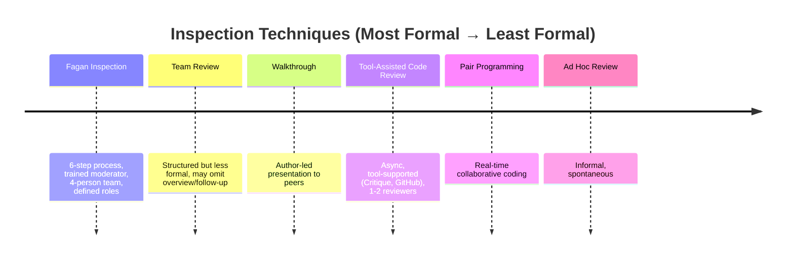

# Software Inspection

**Inspection** is the systematic examination of software artifacts by individuals other than the creator, with the goal of detecting defects. It is consistently shown to be the **most cost-effective verification technique**, finding 60-90% of defects at 1/10 to 1/34 the cost of testing  .

---

## Why Inspection?

| Benefit | Evidence |
|---------|----------|
| **Early defect detection** | 90% of lifecycle defects found  |
| **Cost savings** | 1:10 to 1:34 vs. testing  |
| **Productivity gain** | 23% improvement  |
| **Knowledge transfer** | Team learns codebase and standards |

---

## Definitions

### INCOSE Definition
> **Inspection** is a verification method that determines performance by examining:
> - Engineering documentation produced during development
> - The item itself using visual means or simple measurements

### Practitioner Definition
> **Inspection** is the systematic scrutiny of development artifacts by individuals other than the creator, aiming to detect non-conformities with standards and uncover defects.

---

## Inspection Techniques (Formality Spectrum)

---

## Key Topics

### [Fagan Inspection Process](fagan-process.md)

The foundational method established by Michael Fagan at IBM (1976):
- Six mandatory steps
- Four defined roles
- Optimal parameters (90-125 NCSS/hr, 2hr max)

### [Reading Techniques](reading-techniques.md)

How inspectors analyze artifacts during preparation:
- Checklist-based
- Scenario-based (+35% defects)
- **Perspective-Based Reading (+21-30%)**

### [Capture-Recapture Method](capture-recapture.md)

Statistical estimation of remaining defects:
- Lincoln-Petersen formula
- Minimum 4 inspectors required
- Model selection (Mₕ with Jackknife)

### [Effectiveness Data](effectiveness.md)

Comprehensive cost/benefit evidence:
- Detection rates: 60-90%
- Cost ratios: 1:10 to 1:34 vs. testing
- Industry case studies (HP, IBM, Cisco)

---

## Quick Reference: Optimal Parameters

| Parameter | Recommendation | Source |
|-----------|----------------|--------|
| Team size | 4 people |  |
| Meeting duration | Max 2 hours |  |
| Inspection rate | 90-125 NCSS/hr |  |
| Preparation rate | 100-125 NCSS/hr |  |
| Change size (modern) | <100 lines |  |
| Review latency (modern) | <4 hours |  |

---

## Inspection vs. Testing

| Aspect | Inspection | Testing |
|--------|------------|---------|
| Timing | Earlier (requirements, design, code) | Later (executable code) |
| Finds | Omissions, design issues, style | Runtime failures |
| Cost per defect | 1× | 10-34× |
| Hours per defect | 1.4-1.75 | 6-17 |

{: .highlight }
> Inspection and testing are **complementary** — use both for comprehensive verification.

---

## Evolution: Formal → Lightweight

| Era | Approach | Characteristics |
|-----|----------|-----------------|
| 1976 | Fagan | 4 people, meetings, 6 steps |
| 2000s | Tool-assisted | Async, 1-2 reviewers |
| 2018 | Modern (Google) | 24 lines, <4 hours, 1 reviewer |

The core principles remain: **preparation matters, systematic review finds defects, small chunks work best**.

---

### References



---

{: .highlight }
**Disclaimer:** AI is used for text summarization, polishing and explaining. Authors have verified all facts and claims. In case of an error, feel free to file an issue.
