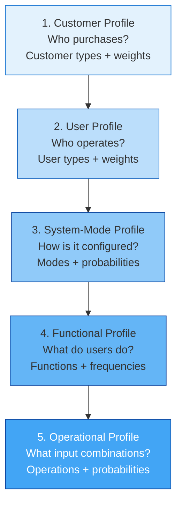
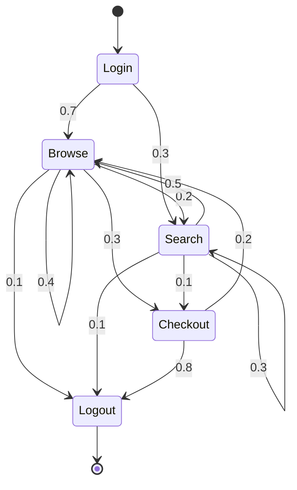

# Developing an Operational Profile

John Musa's five-step procedure transforms vague usage assumptions into a quantitative testing foundation . Each step narrows from broad market characterization to implementation-level operations with specific occurrence probabilities.

---

## The Five-Step Procedure



### Step 1: Customer Profile

Identify all **customer types** (purchasers) and their relative weights:

| Customer Type | Weight |
|---------------|--------|
| Large enterprise | 0.40 |
| Small business | 0.35 |
| Individual | 0.25 |

### Step 2: User Profile

For each customer type, identify **user types** (actual operators):

| User Type | Probability |
|-----------|-------------|
| End user | 0.60 |
| System administrator | 0.25 |
| Maintenance engineer | 0.15 |

### Step 3: System-Mode Profile

Identify operational **modes** (configurations in which the system operates):

| Mode | Probability |
|------|-------------|
| Normal operation | 0.85 |
| Peak load | 0.10 |
| Recovery/maintenance | 0.05 |

### Step 4: Functional Profile

For each mode, identify **functions** with their execution frequencies:

| Function | Probability |
|----------|-------------|
| Process transaction | 0.45 |
| Query account | 0.30 |
| Generate report | 0.15 |
| System configuration | 0.10 |

### Step 5: Operational Profile

Combine functions with specific **input variable values** to define operations:

| Operation | Probability |
|-----------|-------------|
| Process small transaction (< $100) | 0.32 |
| Process large transaction (>= $100) | 0.13 |
| Query active account | 0.24 |
| Query closed account | 0.06 |
| ... | ... |

---

## Representations

### Tabular (Musa's Standard)

The most common format: a table of operations and their occurrence probabilities, sorted by probability in descending order :

| Rank | Operation | Probability | Cumulative |
|------|-----------|-------------|------------|
| 1 | Local call | 0.594 | 0.594 |
| 2 | Toll call | 0.156 | 0.750 |
| 3 | Call forwarding | 0.098 | 0.848 |
| ... | ... | ... | ... |
| n | Conference (6-way) | 0.0001 | 1.000 |

*Example: PBX telephone switch .*

Operational profiles typically follow a **Pareto-like distribution** — a small number of operations account for most of the usage:

```vega-lite
{
  "$schema": "https://vega.github.io/schema/vega-lite/v5.json",
  "title": "Typical OP: Cumulative Probability (Pareto Pattern)",
  "width": 450,
  "height": 250,
  "layer": [
    {
      "data": {
        "values": [
          {"rank": 1, "cumulative": 0.594, "operation": "Op 1"},
          {"rank": 2, "cumulative": 0.750, "operation": "Op 2"},
          {"rank": 3, "cumulative": 0.848, "operation": "Op 3"},
          {"rank": 4, "cumulative": 0.900, "operation": "Op 4"},
          {"rank": 5, "cumulative": 0.940, "operation": "Op 5"},
          {"rank": 6, "cumulative": 0.965, "operation": "Op 6"},
          {"rank": 7, "cumulative": 0.980, "operation": "Op 7"},
          {"rank": 8, "cumulative": 0.990, "operation": "Op 8"},
          {"rank": 9, "cumulative": 0.997, "operation": "Op 9"},
          {"rank": 10, "cumulative": 1.000, "operation": "Op 10"}
        ]
      },
      "mark": {"type": "area", "color": "#1565c0", "opacity": 0.3},
      "encoding": {
        "x": {"field": "rank", "type": "quantitative", "title": "Operation Rank (by frequency)"},
        "y": {"field": "cumulative", "type": "quantitative", "title": "Cumulative Probability", "scale": {"domain": [0, 1]}, "axis": {"format": ".0%"}}
      }
    },
    {
      "data": {
        "values": [
          {"rank": 1, "cumulative": 0.594},
          {"rank": 2, "cumulative": 0.750},
          {"rank": 3, "cumulative": 0.848},
          {"rank": 4, "cumulative": 0.900},
          {"rank": 5, "cumulative": 0.940},
          {"rank": 6, "cumulative": 0.965},
          {"rank": 7, "cumulative": 0.980},
          {"rank": 8, "cumulative": 0.990},
          {"rank": 9, "cumulative": 0.997},
          {"rank": 10, "cumulative": 1.000}
        ]
      },
      "mark": {"type": "line", "color": "#1565c0", "strokeWidth": 2, "point": true},
      "encoding": {
        "x": {"field": "rank", "type": "quantitative"},
        "y": {"field": "cumulative", "type": "quantitative"}
      }
    },
    {
      "data": {"values": [{"y": 0.9}]},
      "mark": {"type": "rule", "strokeDash": [4, 4], "color": "#d32f2f"},
      "encoding": {"y": {"field": "y", "type": "quantitative"}}
    }
  ]
}
```

{: .note }
> *Chart reconstructed to illustrate the Pareto pattern. Dashed line: 90% cumulative probability — just 4 operations cover 90% of usage. See  for original data.*

### Markov Chain Models

For systems where operation sequences matter, Markov chain-based usage models capture dependencies between consecutive calls :



Markov models can reach **2000+ states** for complex applications (IBM DB2) .

---

## Data Sources

| Source | Quality | Availability |
|--------|---------|-------------|
| Field telemetry / logs | Best | Requires deployed system |
| Beta testing data | Good | Available before release |
| Customer surveys | Moderate | Subjective estimates |
| Domain expert judgment | Moderate | Always available |
| Similar system data | Variable | Depends on similarity |

{: .highlight }
> Profile accuracy increases dramatically when based on real usage data rather than expert estimates. Modern telemetry makes this practical for many systems .

---

## Cost and Effort

| Parameter | Value | Source |
|-----------|-------|--------|
| Construction effort | ~1 staff month | For 10-developer, 100 KLOC, 18-month project  |
| Benefit-to-cost ratio | 10:1 or greater | Typical industrial experience  |
| Profile maintenance | Ongoing | Must update as usage patterns evolve |

---

## Common Challenges

| Challenge | Mitigation |
|-----------|-----------|
| **Too many operations** | Use implicit profiles (independent variable sets)  |
| **Unknown usage distribution** | Start with uniform, refine with telemetry |
| **Profile staleness** | Continuous monitoring or periodic revalidation |
| **Multi-user interactions** | Model at system level, not individual user level |
| **Non-user-initiated events** | Supplement OP testing with fault injection  |

---

### References



---

{: .highlight }
**Disclaimer:** AI is used for text summarization, polishing and explaining. Authors have verified all facts and claims. In case of an error, feel free to file an issue.
