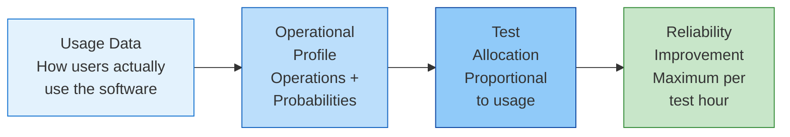

# Operational Profile

An **operational profile** (OP) is a quantitative characterization of how a software system will be used in the field — a set of operations with their occurrence probabilities . By testing proportional to expected usage, testers focus effort where it matters most, maximizing reliability improvement per test hour.

---

## Why Operational Profiles?

| Benefit | Evidence |
|---------|----------|
| **10:1 benefit-to-cost ratio** | Typical industrial experience  |
| **10x problem reduction** | AT&T Definity: customer problems reduced by an order of magnitude  |
| **50% test cost savings** | HP: system-test time and cost reduced by at least half  |
| **Statistical reliability prediction** | Only usage-based testing enables confidence bounds on failure probability |

---

## Definition

{: .important }
> "The operational profile is a quantitative characterization of how a system will be used... it is simply a set of operations with their probabilities of occurrence" 

An **operation** is a major system logical task, represented as a set of input variable values:
- For a telephone switch: *local call, toll call, call forwarding, conference call*
- For a web application: *page load, search, checkout, user registration*

The **probability** of each operation is estimated from usage data, customer surveys, or domain expertise.

---

## Key Concepts

### Profile Types

| Type | Description | When to Use |
|------|-------------|-------------|
| **Explicit** | Cross-product of all key input variables | Small number of variables |
| **Implicit** | Independent sets of variables | Many variables (tractability) |
| **Markov-based** | Dependencies between consecutive operations | Sequence-dependent behavior  |

### Typical Scale

| Metric | Range | Source |
|--------|-------|--------|
| Number of operations | 50 to several hundred |  |
| Construction effort | ~1 staff month (10 devs, 100 KLOC) |  |
| Markov model states | Up to 2000+ (IBM DB2) |  |

---

## Known Limitations

Two fundamental limitations identified by Whittaker and Voas (2000), confirmed by subsequent research :

1. **Usage bias**: Emphasis on most-used functions leaves rarely-used functions undertested — but rare operations may have severe failure consequences
2. **Non-user interactions**: OS signals, hardware events, timers, and background processes are not modeled by user-focused profiles

Additional challenges :
- Unrealistic test inputs (valid combinations hard to generate)
- Poor scalability for complex modern systems
- Profiles become stale as usage patterns evolve
- Difficulty modeling multi-user and concurrent interactions

---

## Key Topics

### [Developing an Operational Profile](development)

Musa's five-step procedure for constructing an operational profile:
- From customer profile through functional profile to operational profile
- Representations and data sources

### [Industrial Evidence](case-studies)

Documented results from OP-based testing:
- AT&T, HP, and Microsoft results
- Modern application: Android profile coverage

### [Modern Approaches](modern)

Advances bridging operational profiles with code coverage:
- Operational coverage (Miranda & Bertolino)
- Adaptive testing with covrel
- Profile coverage from telemetry

---

## OP and Exploratory Testing

Operational profile testing and exploratory testing address **different dimensions** of software quality:

| Dimension | OP Testing | Exploratory Testing |
|-----------|-----------|---------------------|
| Focus | Most-used operations | Unexpected interactions |
| Strength | Reliability maximization | Defect diversity |
| Weakness | Saturates after covering high-probability paths | Lower systematic coverage |
| Input | Usage data, profiles | Tester knowledge, heuristics |

The approaches are complementary: OP identifies *what matters most to users*, while ET explores *what OP-based testing cannot reach* .

---

### References



---

{: .highlight }
**Disclaimer:** AI is used for text summarization, polishing and explaining. Authors have verified all facts and claims. In case of an error, feel free to file an issue.
