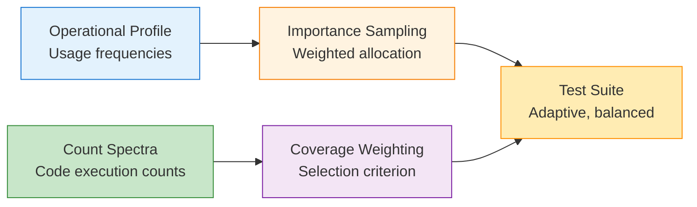
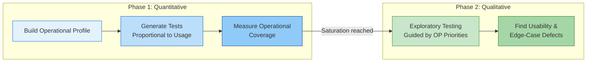

# Modern Approaches to Operational Profile Testing

Musa's five-step OP procedure (1993) focused on test allocation — selecting tests proportional to usage frequency. Modern research extends this by combining operational profiles with code coverage information, overcoming the **saturation effect** where pure OP testing reaches a reliability plateau .

---

## The Saturation Problem

Pure OP testing suffers from a fundamental limitation:

> "As testing proceeds, reliability achieves some stable level that becomes difficult to improve further" 

After covering the high-probability usage paths, continued OP testing yields diminishing returns because it keeps exercising the same code paths. The solution: combine OP information with structural coverage information.

---

## Operational Coverage

Miranda and Bertolino introduced **operational coverage** — a measure that weights code entities by their execution frequency under a given usage profile :

### Definition

Traditional coverage treats all code equally. Operational coverage asks: *"Have we covered the code that users actually exercise?"*

### Worked Example

Consider a small program with 4 methods and their usage frequencies from production telemetry:

| Method | Branch Count | Branches Covered by Tests | Usage Frequency |
|--------|-------------|--------------------------|-----------------|
| `login()` | 4 | 3 | 50% of sessions |
| `search()` | 6 | 2 | 30% of sessions |
| `checkout()` | 4 | 4 | 15% of sessions |
| `adminPanel()` | 6 | 0 | 5% of sessions |

**Traditional branch coverage:** (3 + 2 + 4 + 0) / (4 + 6 + 4 + 6) = 9/20 = **45%**

**Operational branch coverage:** Weight each method's contribution by its usage frequency:
- `login()`: (3/4) × 0.50 = 0.375
- `search()`: (2/6) × 0.30 = 0.100
- `checkout()`: (4/4) × 0.15 = 0.150
- `adminPanel()`: (0/6) × 0.05 = 0.000

Operational coverage = 0.375 + 0.100 + 0.150 + 0.000 = **62.5%**

The 17.5-percentage-point gap occurs because our tests cover the high-usage code (`login`, `checkout`) well, while the uncovered `adminPanel` (0% branch coverage) barely affects the score since only 5% of users ever use it.

| Metric | Traditional Coverage | Operational Coverage |
|--------|---------------------|---------------------|
| **After ~57 test cases** | 31% branch coverage | 87% operational branch coverage |
| **Correlation with reliability** | tau = 0.39 | tau = 0.45 |

*Measured across 9 Java subjects .*

{: .highlight }
> Traditional branch coverage says 31% after 57 tests. Operational coverage says 87%. The difference: the uncovered 69% is code users rarely exercise — it matters less for reliability.

### Importance Groups

Miranda and Bertolino formalize the weighting scheme :

| Importance | Weight | Description |
|------------|--------|-------------|
| **High** | 9 | Operations in top usage tier |
| **Medium** | 3 | Mid-frequency operations |
| **Low** | 1 | Rarely-used operations |

Operational coverage outperforms traditional coverage in **8 of 9 cases** as an adequacy criterion and produces **smaller test suites** (p<2.2e-16) .

```vega-lite
{
  "$schema": "https://vega.github.io/schema/vega-lite/v5.json",
  "title": "Coverage Growth: Traditional vs. Operational (illustrative)",
  "width": 450,
  "height": 250,
  "layer": [
    {
      "data": {
        "sequence": {"start": 1, "stop": 100, "step": 1, "as": "tests"}
      },
      "transform": [
        {"calculate": "1 - pow(0.97, datum.tests)", "as": "opcov"}
      ],
      "mark": {"type": "line", "color": "#1565c0", "strokeWidth": 2},
      "encoding": {
        "x": {"field": "tests", "type": "quantitative", "title": "Number of OP-Selected Test Cases"},
        "y": {"field": "opcov", "type": "quantitative", "title": "Coverage", "scale": {"domain": [0, 1]}, "axis": {"format": ".0%"}},
        "color": {"datum": "Operational Coverage"}
      }
    },
    {
      "data": {
        "sequence": {"start": 1, "stop": 100, "step": 1, "as": "tests"}
      },
      "transform": [
        {"calculate": "1 - pow(0.993, datum.tests)", "as": "tradcov"}
      ],
      "mark": {"type": "line", "color": "#d32f2f", "strokeWidth": 2, "strokeDash": [4, 4]},
      "encoding": {
        "x": {"field": "tests", "type": "quantitative"},
        "y": {"field": "tradcov", "type": "quantitative"},
        "color": {"datum": "Traditional Branch Coverage"}
      }
    },
    {
      "data": {"values": [{"x": 57}]},
      "mark": {"type": "rule", "strokeDash": [2, 2], "color": "#757575"},
      "encoding": {"x": {"field": "x", "type": "quantitative"}}
    }
  ],
  "encoding": {
    "color": {"legend": {"title": "Metric"}}
  }
}
```

{: .note }
> *Illustrative curves showing that OP-selected tests cover user-relevant code faster than random structural coverage. Vertical line at ~57 tests where Miranda (2016) measured 87% operational vs. 31% traditional coverage. See  for actual data.*

---

## Adaptive Testing: The covrel Approach

The **covrel** approach combines OP with count spectra adaptively, overcoming the saturation effect :



### How It Works

1. **Allocate** test cases using importance sampling (OP-weighted)
2. **Select** test cases using coverage-weighted criteria (structural)
3. **Adapt** allocation as coverage information accumulates

### Results

| Comparison | covrel Win Rate | p-value |
|------------|----------------|---------|
| covrel vs. pure OP testing | >80% of scenarios | 3.13e-09 |
| covrel vs. random testing | Significant improvement | — |

In the journal extension, covrel adds **test case generation** capabilities alongside allocation and selection, further improving effectiveness .

---

## Relative Coverage: A Unified Theory

Miranda and Bertolino generalize operational coverage into a broader framework called **relative coverage** :

> Testing should be evaluated **relative to the usage scope** — not in absolute terms.

### Three Instantiations

| Type | Usage Scope | Application |
|------|-------------|-------------|
| **Operational coverage** | Operational profile | Production usage patterns |
| **Relevant coverage** | Reuse context | Reused components in new contexts |
| **Social coverage** | SOA/microservice clients | Shared service testing |

{: .note }
> Relative coverage adds "usage scope" as a fifth fundamental factor to testing theory, alongside adequacy criteria, test selection, test minimization, and test prioritization .

### Social Coverage Prediction

For service-oriented architectures, social coverage entities can be predicted with **97% precision** and **75% recall** using client interaction data .

---

## Stopping Rules

When has OP-based testing done enough? Miranda and Bertolino propose operational coverage as a **stopping criterion** :

| Approach | Stopping Rule | Limitation |
|----------|---------------|-----------|
| Fixed test count | Run N tests | No quality guarantee |
| Traditional coverage | Achieve X% branch coverage | Ignores usage importance |
| **Operational coverage** | Achieve X% operational coverage | Stops when user-relevant code is covered |

Operational coverage provides a more meaningful stopping rule because it directly addresses the question: *"Have we tested what users will actually use?"*

---

## From Profile to Exploration

Operational profile testing and exploratory testing are **complementary** approaches. The bridge works in both directions:

| Direction | Mechanism |
|-----------|-----------|
| **OP to ET** | OP identifies which features matter most; ET explores them for subtle defects |
| **ET to OP** | ET discovers unexpected usage patterns that refine the operational profile |
| **Saturation handoff** | When OP testing saturates (~70% profile coverage ceiling ), switch to ET for remaining coverage gaps |
| **Defect type complementarity** | OP finds reliability failures proportional to usage; ET finds usability, edge-case, and interaction defects |



This complementarity justifies testing strategies that combine quantitative (OP) and qualitative (ET) approaches, allocating the first phase to OP-based testing for maximum reliability improvement, then switching to exploratory testing for the defects that usage-proportional testing cannot find.

---

### References



---

{: .highlight }
**Disclaimer:** AI is used for text summarization, polishing and explaining. Authors have verified all facts and claims. In case of an error, feel free to file an issue.
